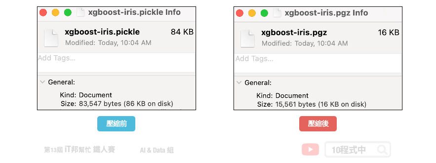

# 儲存訓練好的模型

## 今日學習目標
- 使用 pickle + gzip 儲存模型
    - 將訓練好的模型打包並儲存
- 載入儲存的模型
    - 讀取打包好的模型並預測

## 前言
今天的教學內容要教各位如何將訓練好的模型儲存，並提供下一次載入模型和預測。在本系列的教學中介紹了許多 Sklearn 的模型演算法。當模型訓練好了，可以將訓練結果儲存起來，並建立一個 API 接口提供模型預測。


## 模型儲存方法
常見的儲存模型的套件有 [pickle](https://docs.python.org/3/library/pickle.html) 與 [joblib](https://joblib.readthedocs.io/en/latest/)。其中在 [[Day 20] 機器學習金手指 - Auto-sklearn](https://ithelp.ithome.com.tw/articles/10276333) 最後有使用 joblib 來儲存模型，操作方法也非常簡單。然而在今天的教學中則使用另一種方法 pickle 來儲存模型。由於 pickle 儲存模型後容量可能會有好幾百 MB 因此建議可以透過 gzip 來壓縮模型並儲存。另外在 Python 官方文件中有警告絕對不要利用 pickle 來 unpickle 來路不明的檔案。因為透過 pickle 打包模型會有安全性疑慮，包括 `arbitrary code execution` 的問題，詳細內容可以參考這篇[文章](http://www.benfrederickson.com/dont-pickle-your-data/)。如果要追求執行速度與安全性，建議可以採用 JSON 格式來存取模型的參數與設定。


## 1) 載入資料集
今日的範例還是拿鳶尾花朵資料集進行示範。首先我們先載入資料集並進行資料的切割。

```py
import pandas as pd
import numpy as np
import matplotlib.pyplot as plt
import seaborn as sns
from sklearn.datasets import load_iris

iris = load_iris()
df_data = pd.DataFrame(data= np.c_[iris['data'], iris['target']],
                     columns= ['SepalLengthCm','SepalWidthCm','PetalLengthCm','PetalWidthCm','Species'])
df_data
```

## 2) 切割訓練集與測試集
```py
from sklearn.model_selection import train_test_split
X = df_data.drop(labels=['Species'],axis=1).values # 移除Species並取得剩下欄位資料
y = df_data['Species'].values
X_train, X_test, y_train, y_test = train_test_split(X, y, test_size=0.3, random_state=42, stratify=y)

print('train shape:', X_train.shape)
print('test shape:', X_test.shape)
```

## 訓練模型 - XGBoost
XGBoost 模型是目前最熱門的演算法模型之一，詳細的內容可以參考 [[Day 15] 機器學習常勝軍 - XGBoost](https://ithelp.ithome.com.tw/articles/10273094)。裡面會有介紹詳細的模型說明與手把手實作。當然大家也可以試著用其他 Sklearn 的模型訓練看看，一樣可以透過 `pickle` 來儲存訓練好的模型。

```py
from xgboost import XGBClassifier

# 建立 XGBClassifier 模型
xgboostModel = XGBClassifier(n_estimators=100, learning_rate= 0.3)
# 使用訓練資料訓練模型
xgboostModel.fit(X_train, y_train)
# 使用訓練資料預測分類
predicted = xgboostModel.predict(X_train)
```

## 儲存 XGboost 模型
大家可以觀察 `.pickle` 與 `.gzip` 兩種不同副檔名儲存結果檔案大小有何差別?

### 1. 使用 pickle 儲存模型

```py
import pickle
with open('./model/xgboost-iris.pickle', 'wb') as f:
    pickle.dump(xgboostModel, f)
```

### 2. 使用 pickle 儲存模型並利用 gzip 壓縮

```py
import pickle
import gzip
with gzip.GzipFile('./model/xgboost-iris.pgz', 'w') as f:
    pickle.dump(xgboostModel, f)
```



## 載入 XGboost 模型
試著載入兩種不同格式的模型，並預測一筆資料。注意模型預測輸入必須為 numpy 型態，且須為二維陣列格式。

### 1. 載入 gzip 格式模型

```py
import pickle
import gzip

#讀取Model
with gzip.open('./model/xgboost-iris.pgz', 'r') as f:
    xgboostModel = pickle.load(f)
    pred=xgboostModel.predict(np.array([[5.5, 2.4, 3.7, 1. ]]))
    print(pred)
```

### 2. 載入 pickle 格式模型

```py
#讀取Model
with open('./model/xgboost-iris.pickle', 'rb') as f:
    xgboostModel = pickle.load(f)
    pred=xgboostModel.predict(np.array([[5.5, 2.4, 3.7, 1. ]]))
    print(pred)
```


## Reference
- [How to save and load your Scikit-learn models in a minute](https://medium.com/analytics-vidhya/save-and-load-your-scikit-learn-models-in-a-minute-21c91a961e9b)
- [Don't Pickle Your Data](http://www.benfrederickson.com/dont-pickle-your-data/)

> 本系列教學內容及範例程式都可以從我的 [GitHub](https://github.com/andy6804tw/2021-13th-ironman) 取得！