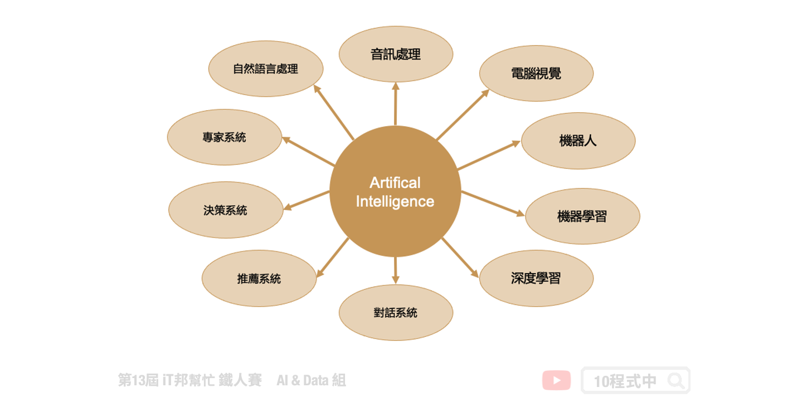
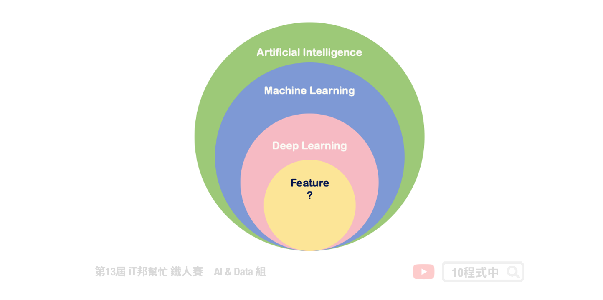
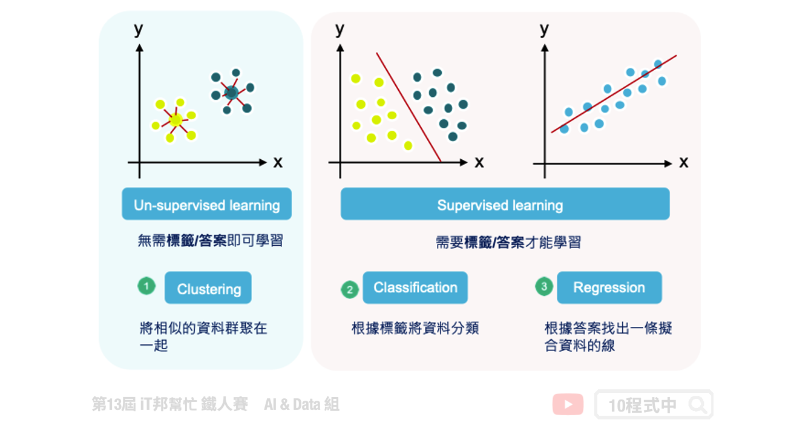
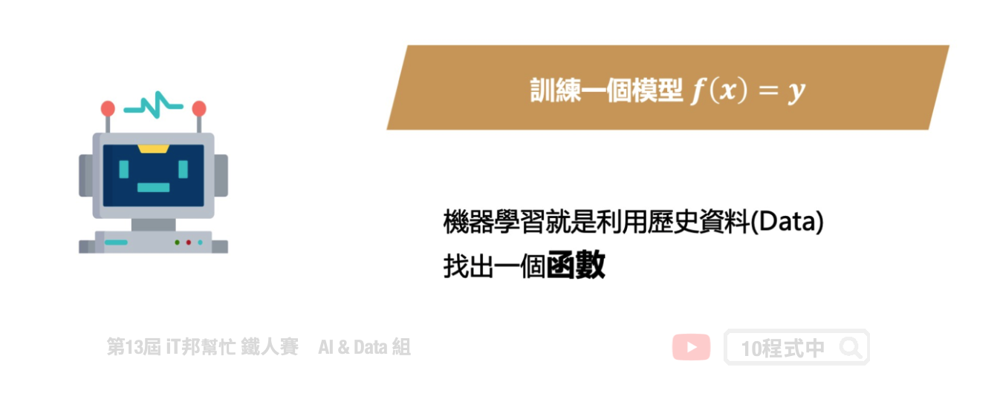
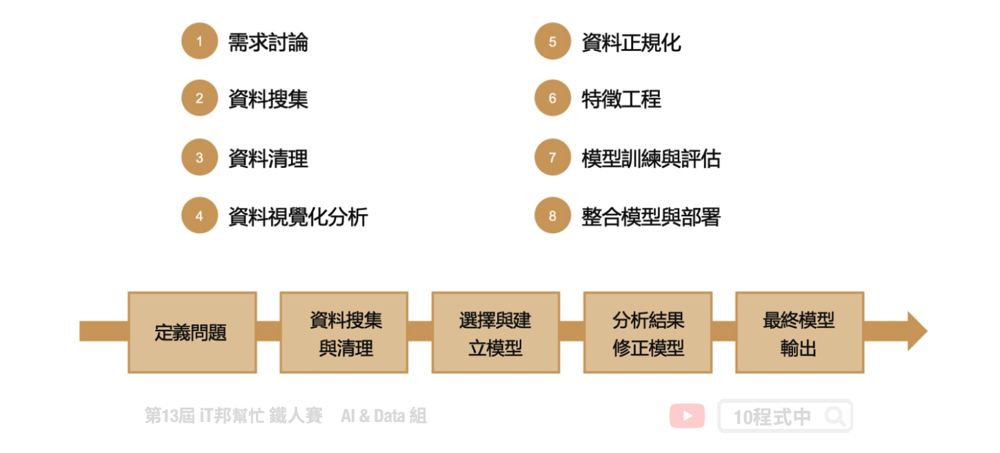

# 機器學習大補帖
## 今日學習目標
- 了解機器學習是什麼
    - 何謂機器學習?
    - 人工智慧的範疇
    - 什麼是人工智慧?
- 資料科學三劍客
- 機器學習的種類有哪些？
    - 從人類學習到機器學習
    - 認識什麼是資料
- 機器學習的流程

## 何謂機器學習?
機器學習是一種學習的演算法，是一種從一大群資料中去學習找出解決問題的方法。簡單來說你只要將大量的資料餵給電腦，機器學習的演算法會為你量身打造學習出一個特定的模型給你，而不是再透過人類手動的給予規則。透過一堆資料有標籤給答案，並從資料集學習與標記間的關聯，最後再從非特定資料去辨認答案。

## 人工智慧的範疇
其實人工智慧的應用在現實生活中隨處可見，從製造、醫療、金融、交通、安防、 零售、物流、農業......等都可以看到與 AI 的相關應用。當然人工智慧的出現並不是曇花一現，Artificial Intelligence 這一詞其實早在 20 世紀中就被提出，起初當然不被看好甚至大家都覺得要一個機器人學會人類的智慧是天方夜譚的事情，中間也經歷好幾次 AI 寒冬，現在回過頭來看 AI 的研究領域起伏伏。不過隨著軟硬體的進步，逐漸使得需要大量計算的人工智慧技術慢慢的被挖掘出來。近年來 AI 新創如與春筍般冒出，智慧機器人、感知識別、自然語言處理、對話客服、自動駕駛、瑕疵檢測、預防性維修、自動流程控制、原料組合最佳化......等。

## 什麼是人工智慧?
其實人工智慧這項領域又分成很多門派，從最早的符號邏輯、專家系統開始說起。早期的 AI 是將人類的專家知識透過知識庫與規則庫放到機器人的大腦中，並賦予機器人智慧使得有能力判斷事物。當然人類專家的知識始終有限，隨著網路與個人電腦普及並進入了大數據時代。各個科學家於是開始思考如何將這些搜集來的大量數據進行應用與分析？機器學習一詞就出現了，目標是透過現實生活中所收集的資料，搭配各種不同機器學習演算法訓練出來一個模型，使得機器人有判斷與預測的能力。當然近幾年熱門的深度學習其實僅是個機器學習裡面的其中一種學習的方法，他是模仿人類的神經系統，透過大量的神經元與多層的神經網路建構出來的複雜數學模型。然而在本系列教學中我們會從最基礎的機器學習演算法開始提起，並一步一步的帶領讀者成為一位真正的資料科學家。

## 資料科學 ✕ 三劍客
資料科學主要透過機器學習的技術，讓機器可以預測或者推論。其中這幾年很夯的資料科學家這一名詞其實是由三種人所組合起來的。第一個是數學與統計背景的人，他們能夠透過對資料的敏感度從一大群原始資料中探索有意義的資訊。並設計一套適合的模型為這一群資料進行數據擬合。第二種人是電腦科學背景的工程師，他們擅長程式語言能夠將複雜的數學模型夠過程式實作並且協助落地整合。當然現今有非常多機器學習的套件例如 Sklearn、TensorFlow......等，降低了大家學習的門檻，不一定是要理工背景的人都可以透過這些機器學習套件一窺人工智慧的奧秘。除此之外 MLOps 是近年來延伸出來的新名詞，其實概念與 DevOps 類似並將這一套機制複製在機器學習專案上，我們平時所執行的 AI 專案必須透過持續性整合與維運的觀念不斷的週期性更新從最新收集到得數據重新學習模型越來越貼近使用者。最後一個關鍵的人物就是各行各業的領域專家，因為 AI 再也不是資訊背景人的專利。我們可以夠過 AI 解決日常生活中的問題，因此我們必須與領域專家進行合作協助資料清與與建立機器學習模型。總之要成為一個好的資科學家上述三種人的特性缺一不可。

## 機器學習種類
機器學習是一種學習的演算法，是一種從資料中去學習並找出解決方法。其依照機器學習的種類大致可以分成以下幾類：

- 非監督式學習
    - 無需標籤/答案即可學習
    - Ex: 集群 (Clustering)
- 監督式學習
    - 需要標籤/答案才能學習
    - Ex: 分類 (Classification) 、 回歸 (Regression)
- 半監督式學習
- 自監督學習
- 強化學習

> 如何擷取好的特徵是在機器學習中很重要的一件事

## 從人類學習到機器學習
簡單來說機器學習就是要從一大群資料當中找出一個數學模型。這個數學模型可以稱作是一個 `f(x)=y` 其中 x 為輸入的資料，y 為該筆資料所相對應的輸出。其中 `f` 即為函數，也就是任一種機器學習模型。至於典型的機器學習模型有哪些呢？例如線性迴歸、邏輯回歸、KNN、SVM、決策樹、隨機森林、XGBoost......等。之後的系列文章都會依序向各位解釋。

## 什麼是資料?
一般來說資料可以分成兩個部分。以一個分類的問題來說，分別有輸入的特徵以及該筆資料相對應的答案稱作標記。AI 這個領域就是讓機器有學習解決問題的能力，而不是我們告訴他應該怎麼解決問題。我們舉一個簡單的例子，假設我們需要預測明天是否會下雨。我們的輸入特徵就可以有各個觀測站的雲量與溫濕度作為模型訓練的資料。而每一筆的天氣資訊都對應著是否會下雨的標準答案。

- 特徵 (Feature): 用來描述每一筆資料，通常會用 X 來表示
- 標記 (Label): 用來表示每一筆資料所對應的輸出，這個輸出樣式可以有不同的狀態(可能是類別或者實數值等)，通常會用 Y 來表示。

## 機器學習流程
完整的機器學習流程大致分成八個步驟。首先定義問題，經過需求討論與評估後有個明確的目標並開始執行專案。接著開始搜集資料，由於各場域所收集到的原始數據可能尚未整理以及格式尚未統一。因此第三步的資料清理極為重要，有個乾淨的資料可以對模型表現有大幅的提升。資料一切就緒後建議在建模之前先對資料進行視覺化分析，並為數據做前處理以及專業知識的特徵工程。對資料有初步的認識後，接著挑選合適的機器學習演算法訓練與評估模型。在模型正式上線之前，先透過測試集或是交叉驗證等機制確認模型泛化能力。模型確認沒有問題後即可將模型打包輸出，並且與實際場域應用進行整合。最終就是部署模型以及維運，持續將場域蒐集到的新資料進行再訓練，形成一個開發循環。

本系列教學內容及範例程式都可以從我的 [GitHub](https://github.com/andy6804tw/2021-13th-ironman) 取得！