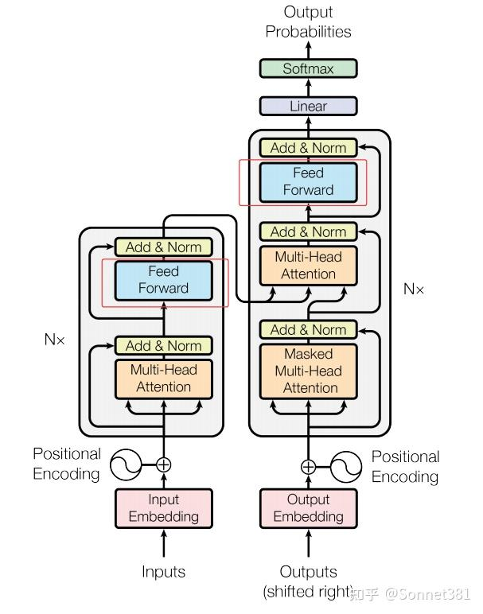
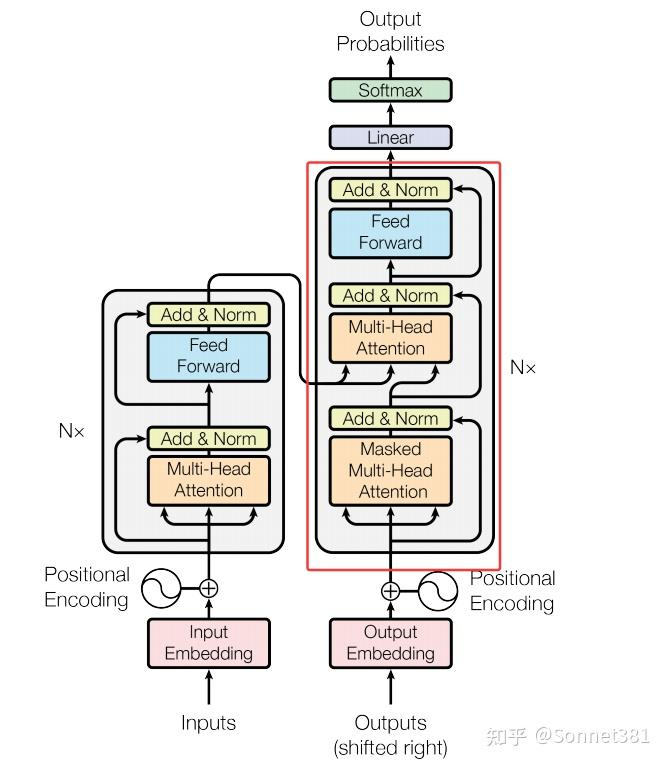

# 從0手搓Transformer（代碼拆解篇）


## **Transformer 模型代碼拆解**

Transformer 模型代碼拆解

1.  Positional Encoding（位置編碼）
2.  Multi‑Head Attention（多頭注意力）
3.  [Feed Forward Network]()（前饋網絡）
4.  Transformer Encoder Layer（Transformer 編碼器層）
5.  Transformer Encoder（Transformer 編碼器）
6.  Transformer [Decoder Layer]()（Transformer 解碼器層）
7.  Transformer Decoder（Transformer 解碼器）
8.  Transformer Model（Transformer 模型）
9.  mask function（掩碼函數）
10.  Example usage（示例用法）

* * *

## **Transformer-from-Scratch**

> 論文[《Attention Is All You Need》]()的純 PyTorch 復現  
> A clean PyTorch re‑implementation of the Transformer architecture described in _Attention Is All You Need_

  

## **簡介**

本項目定位為 **AI論文復現 / 從零實現 Transformer**。 代碼遵循原論文的模塊劃分，包含位置編碼、多頭注意力、前饋網絡、編碼器‑解碼器等全部組件，並附帶詳細的中文拆解文檔與英文註釋，方便學習與二次開發。

## **特性**

-   **純 PyTorch**：無第三方高階框架依賴，便於閱讀與修改
-   **模塊化**：各子模塊拆分清晰，可單獨測試
-   **批量優先 (batch‑first)**：符合 PyTorch 常用數據佈局
-   **可復現**：默認超參數即能在 CPU / 單卡 GPU 上跑通示例
-   **完整註釋**：中英雙語文檔 + 代碼行級英文註釋

  

## **文件結構**

```text
 .
 ├── transformer/                # 核心代碼
 │   ├── PostionalEncoding.py    # 正弦位置編碼
 │   ├── MHA.py                  # 多頭注意力
 │   ├── FFN.py                  # 前饋網絡
 │   ├── Encoder.py              # 編碼器
 │   ├── Decoder.py              # 解碼器
 │   ├── create_mask.py          # 掩碼生成函數
 │   ├── model.py                # Transformer模型
 │   ├── test.py                 # 測試腳本
 │   └── Transformer.ipynb       # 完整實現
 ├── docs/
 │   ├── transformer_arxiv.pdf   # 原論文
 │   ├── Deep-Analysis.md        # 深度解析
 │   └── code‑dasm.md            # 代碼拆解文檔
 ├── examples/
 │   └── exam.py                 # （歡迎來補充）
 ├── LICENCE.md
 └── README.md
```

  

## **環境依賴**

-   Python ≥ 3.9
-   PyTorch ≥ 2.0
-   tqdm（可選，用於進度條顯示）

```bash
 pip install torch tqdm
```

  

## **快速開始**

```python
 import torch
 from transformer.model import Transformer
 from transformer.mask import create_padding_mask
 ​
 # 假設詞表大小各 10 k，序列長度 src=10 / tgt=12
 model = Transformer(src_vocab_size=10000,
                     tgt_vocab_size=10000,
                     d_model=512,
                     n_heads=8,
                     d_ff=2048,
                     num_layers=6)
 ​
 src = torch.randint(0, 10000, (32, 10))   # (batch_size, src_len)
 tgt = torch.randint(0, 10000, (32, 12))   # (batch_size, tgt_len)
 ​
 src_mask, tgt_mask = create_padding_mask(src, tgt)
 ​
 logits = model(src, tgt, src_mask, tgt_mask)  # (32, 12, 10000)
 print(logits.shape)      # should be torch.Size([32, 12, 10000])
```

  

## **訓練示例(待補充)**

在 `examples/exam.py` 中提供了一個最小訓練腳本，演示如何使用交叉熵損失與 Adam 優化器對xx數據集進行訓練。

* * *

## **1\. Positional Encoding（位置編碼）**


位置編碼

Transformer 模型使用 **位置編碼** 為序列中的每個位置添加位置信息。由於 Transformer 完全依賴注意力機制，缺乏對序列順序的內在建模能力，需要在輸入的詞嵌入中加入位置編碼以讓模型識別不同的位置。這裡實現的 `PositionalEncoding` 類採用正弦和餘弦函數生成固定的位置編碼，與原始論文中的方法一致。

在構造函數中，首先創建一個 `position` 張量（包含從 0 到 `max_len-1` 的位置索引），並計算縮放因子 `div_term`（相當於 10000^(-2i/d\_model)）。然後初始化一個 `pe` 張量用於存儲位置編碼，其中偶數維度使用 `torch.sin(position * div_term)`，奇數維度使用 `torch.cos(position * div_term)` 填充。計算得到的 `pe` 通過 `register_buffer` 註冊為模型緩衝區（非可訓練參數），這樣在模型訓練過程中不會被更新。**forward** 方法中，將輸入張量 `x` 與相應長度的 `pe` 片段相加，將位置信息融入輸入表示後返回結果。

```python
 class PositionalEncoding(nn.Module):
     def __init__(self, d_model, max_len=5000):
         super().__init__()
         position = torch.arange(0, max_len, dtype=torch.float).unsqueeze(1) # (max_len, 1)
         div_term = torch.exp(torch.arange(0, d_model, 2).float() * -(math.log(10000.0) / d_model))
 ​
         pe = torch.zeros(1, max_len, d_model)   # (1, max_len, d_model)
         pe[0, :, 0::2] = torch.sin(position * div_term)    # even index
         pe[0, :, 1::2] = torch.cos(position * div_term)    # odd index
         self.register_buffer('pe', pe)
 ​
     def forward(self, x):
         # x: (batch_size, seq_len, d_model)
         x = x + self.pe[:, :x.size(1), :]     # add positional encoding to input tensor
         return x
```

  

## [Multi-Head Attention]()


多頭注意力


縮放點乘注意力

**多頭注意力機制**允許模型在不同的子空間中對序列的不同位置進行關注，從而綜合不同的位置關係信息。`MultiHeadAttention` 類實現了多頭自注意力的計算，包括將輸入投影成多個頭、計算縮放點積注意力，以及頭輸出的拼接和線性變換。

結構上，該類初始化時根據 `d_model` 和 `n_heads` 計算每個注意力頭的維度 `d_k = d_model // n_heads`，並確保可以整除。然後定義了四個線性層：`W_q`, `W_k`, `W_v` 將輸入特徵映射為查詢（Q）、鍵（K）、值（V），`W_o` 用於最後將多頭輸出映射回 `d_model` 維度。此外還包含一個 Dropout 層用於在注意力權重上使用。該類提供了一個方法 `scaled_dot_product_attention` 實現**縮放點積注意力**計算，其步驟如下：

1.  **計算注意力分數**：對每個注意力頭，計算 ​，得到形狀 `(batch_size, n_heads, seq_len, seq_len)` 的分數矩陣；
2.  **應用遮罩**：如果提供了 `mask`（形狀與分數矩陣兼容，元素為 0 或 1），則將 `mask == 0` 的位置（需要屏蔽的位置）對應的分數賦值為一個極小值（-1e9），從而在 softmax 後這些位置幾乎不產生權重；
3.  **計算注意力權重**：對上述分數矩陣在最後一個維度進行 `softmax`，得到注意力權重，然後對權重應用 Dropout；
4.  **加權求和值**：使用注意力權重矩陣與值向量 `V` 相乘，得到每個頭的輸出，形狀為 `(batch_size, n_heads, seq_len, d_k)`；
5.  **多頭輸出整合**：將所有注意力頭的輸出在最後一個維度拼接（通過 `transpose` 和 `view` 恢復形狀），並通過線性層 `W_o` 將維度變換回 `d_model`，輸出最終的注意力結果。

上述過程在 `forward` 方法中具體實現：首先使用 `W_q`, `W_k`, `W_v` 將輸入的 Q, K, V 張量投影為 `d_model` 維度並 reshape 成 `(batch_size, n_heads, seq_len, d_k)` 的格式，然後調用 `scaled_dot_product_attention` 來獲得多頭注意力輸出。最後，將多頭輸出重新排列回 `(batch_size, seq_len, d_model)` 並通過 `W_o` 映射，得到與輸入維度相同的輸出。代碼實現如下：

```python
 class MultiHeadAttention(nn.Module):
     def __init__(self, d_model, n_heads, dropout=0.1):
         super().__init__()
         self.d_model = d_model
         self.n_heads = n_heads
         self.d_k = d_model // n_heads
 ​
         assert (
             self.d_k * n_heads == d_model
         ), f"d_model {d_model} not divisible by n_heads {n_heads}"
 ​
         self.W_q = nn.Linear(d_model, d_model, bias=False)
         self.W_k = nn.Linear(d_model, d_model, bias=False)
         self.W_v = nn.Linear(d_model, d_model, bias=False)
         self.W_o = nn.Linear(d_model, d_model)
 ​
         self.dropout = nn.Dropout(dropout)
 ​
     def scaled_dot_product_attention(self, Q, K, V, mask=None):
         # Q: (batch_size, n_heads, seq_len, d_k)
         # K: (batch_size, n_heads, seq_len, d_k)
         # V: (batch_size, n_heads, seq_len, d_k)
 ​
         scores = torch.matmul(Q, K.transpose(-2, -1)) / math.sqrt(self.d_k)  # (batch_size, n_heads, seq_len, seq_len)
         if mask is not None:
             scores = scores.masked_fill(mask == 0, -1e9)    # apply mask to scores
         
         attn_weights = F.softmax(scores, dim=-1)    # (batch_size, n_heads, seq_len, seq_len)
         attn_weights = self.dropout(attn_weights)    # apply dropout to attention weights
         output = torch.matmul(attn_weights, V)    # (batch_size, n_heads, seq_len, d_k)
         return output
     
     def forward(self, Q, K, V, mask=None):
         # Q: (batch_size, seq_len, d_model)
         # K: (batch_size, seq_len, d_model)
         # V: (batch_size, seq_len, d_model)
 ​
         batch_size = Q.size(0)
 ​
         # (batch_size, seq_len, d_model) -> (batch_size, n_heads, seq_len, d_k)
         Q = self.W_q(Q).view(batch_size, -1, self.n_heads, self.d_k).transpose(1, 2)    # (batch_size, n_heads, seq_len, d_k)
         K = self.W_k(K).view(batch_size, -1, self.n_heads, self.d_k).transpose(1, 2)    # (batch_size, n_heads, seq_len, d_k)
         V = self.W_v(V).view(batch_size, -1, self.n_heads, self.d_k).transpose(1, 2)    # (batch_size, n_heads, seq_len, d_k)
 ​
         # scaled dot-product attention
         attn_output = self.scaled_dot_product_attention(Q, K, V, mask)    # (batch_size, n_heads, seq_len, d_k)
 ​
         # (batch_size, n_heads, seq_len, d_k) -> (batch_size, seq_len, d_model)
         attn_output = attn_output.transpose(1, 2).contiguous().view(batch_size, -1, self.d_model)    # (batch_size, seq_len, d_model)
         output = self.W_o(attn_output)    # (batch_size, seq_len, d_model)
         return output    # (batch_size, seq_len, d_model)
```

  

## **3\. Feed Forward Network（前饋網絡）**



前饋網絡層

**前饋網絡**（Feed Forward Network，簡稱 FFN）模塊對每個位置的表示獨立地進行非線性變換，是 Transformer 中每個編碼器/解碼器層的第二個子層。`FeedForward` 類實現了一個兩層的前饋神經網絡：先擴展維度再投影回原維度。

結構上，它包含兩個線性層 `linear1` 和 `linear2`，中間配合 ReLU 激活函數（`self.activation = nn.ReLU()`）和 Dropout 正則化。構造函數接受參數 `d_model`（輸入和輸出的特徵維度）和較大的隱藏層維度 `d_ff`，以及 Dropout 概率。forward 方法中，將輸入 x 先通過 `linear1` 投影到 `d_ff` 維度，經過 ReLU 非線性激活和 Dropout 後，再通過 `linear2` 投影回 `d_model` 維度。這樣每個位置的向量都經過相同的兩層感知機變換，輸出形狀與輸入相同。代碼如下：

```python
 class FeedForward(nn.Module):
     def __init__(self, d_model, d_ff, dropout=0.1):
         super().__init__()
         self.linear1 = nn.Linear(d_model, d_ff)
         self.dropout = nn.Dropout(dropout)
         self.linear2 = nn.Linear(d_ff, d_model)
         self.activation = nn.ReLU()
 ​
     def forward(self, x):
         # x: (batch_size, seq_len, d_model)
         x = self.linear1(x)    # (batch_size, seq_len, d_ff)
         x = self.activation(x)    # (batch_size, seq_len, d_ff)
         x = self.dropout(x)    # (batch_size, seq_len, d_ff)
         x = self.linear2(x)    # (batch_size, seq_len, d_model)
         return x    # (batch_size, seq_len, d_model)
```

  

## **4\. Transformer Encoder Layer（Transformer 編碼器層）**


編碼器層（一個Block）

**編碼器層**（Encoder Layer）是 Transformer 編碼器的基本單元，包含自注意力和前饋網絡兩個子層，各自帶有殘差連接和層歸一化（LayerNorm）。`EncoderLayer` 類在初始化時構造了這些子模塊：

-   `self.self_attn`：多頭自注意力子層，用於對輸入序列自身進行注意力計算；
-   `self.dropout1` 和 `self.norm1`：對應自注意力子層的 Dropout 和 LayerNorm，用於殘差連接後的正則化和歸一化；
-   `self.ffn`：前饋網絡子層，將經過注意力的表示進行非線性變換；
-   `self.dropout2` 和 `self.norm2`：對應前饋子層的 Dropout 和 LayerNorm。

在 forward 方法中，輸入 `x` 首先通過 `self_attn` 計算自注意力（`Q = K = V = x`），可選的 `mask` 用於在注意力計算中屏蔽無效的位置（如填充位）。得到的注意力輸出與原始輸入 `x` 相加（殘差連接）後，經過 `dropout1` 再送入 `norm1` 進行層歸一化。接著，將歸一化後的結果通過前饋網絡 `ffn` 得到新的特徵表示，再與中間結果相加後經過 `dropout2` 和 `norm2`。最終返回編碼器層的輸出，其形狀與輸入相同。代碼如下：

```python
 class EncoderLayer(nn.Module):
     def __init__(self, d_model, n_heads, d_ff, dropout=0.1):
         super().__init__()
         self.self_attn = MultiHeadAttention(d_model, n_heads, dropout)
         self.dropout1 = nn.Dropout(dropout)
         self.norm1 = nn.LayerNorm(d_model)
         
         self.ffn = FeedForward(d_model, d_ff, dropout)
         self.dropout2 = nn.Dropout(dropout)
         self.norm2 = nn.LayerNorm(d_model)
         
     def forward(self, x, mask=None):
         # x: (batch_size, seq_len, d_model)
         attn_output = self.self_attn(x, x, x, mask)    # (batch_size, seq_len, d_model)
         x = self.norm1(x + self.dropout1(attn_output))    # add & norm
         
         ffn_output = self.ffn(x)    
         x = self.norm2(x + self.dropout2(ffn_output))    # add & norm
         return x    # (batch_size, seq_len, d_model)
```

  

## **5\. Transformer Encoder（Transformer 編碼器）**


編碼器（N個Block堆疊）

**編碼器**（Encoder）由若干個編碼器層堆疊而成。`Encoder` 類的初始化接收編碼層數 `num_layers`，並使用 `nn.ModuleList` 將 `num_layers` 個 `EncoderLayer` 實例存儲在列表 `self.layers` 中。同時還定義了一個最終的 LayerNorm (`self.norm`) 對整個編碼器輸出進行歸一化。

forward 方法對輸入 `x` 依次通過每一層編碼器層進行處理：循環遍歷 `self.layers` 列表，將當前輸出 `x` 傳入每個 `EncoderLayer`。可選的 `mask` 在每層的自注意力計算中都會用到。當所有層都處理完畢後，再對最終的 `x` 進行一次 `LayerNorm` 歸一化，作為編碼器的輸出返回。編碼器將輸入序列編碼成高層表示，為後續解碼提供上下文特徵。代碼實現如下：

```python
 class Encoder(nn.Module):
     def __init__(self, d_model, n_heads, d_ff, num_layers, dropout=0.1):
         super().__init__()
         self.layers = nn.ModuleList([EncoderLayer(d_model, n_heads, d_ff, dropout) for _ in range(num_layers)])
         self.norm = nn.LayerNorm(d_model)
 ​
     def forward(self, x, mask=None):
         # x: (batch_size, seq_len, d_model)
         for layer in self.layers:
             x = layer(x, mask)   # (batch_size, seq_len, d_model)
         x = self.norm(x)    # (batch_size, seq_len, d_model)
         return x    # (batch_size, seq_len, d_model)
```

  

## **6\. Transformer Decoder Layer（Transformer解碼器層）**



解碼器層（一個Block）

**解碼器層**（Decoder Layer）是 Transformer 解碼器的基本單元，包括三部分子層：自注意力、交叉注意力和前饋網絡，各自配備殘差連接和 LayerNorm。`DecoderLayer` 的初始化構造了這些組件：

-   `self.self_attn`：多頭自注意力，用於解碼器當前輸入（目標序列已生成部分）內部的注意力計算；
-   `self.cross_attn`：多頭交叉注意力，用於將解碼器的中間表示作為查詢，與編碼器輸出（memory）作為鍵和值進行注意力計算，從編碼器提取相關信息；
-   對每個注意力子層和前饋子層，分別有對應的 Dropout 和 LayerNorm：`dropout1/norm1`（自注意力）、`dropout2/norm2`（交叉注意力）、`dropout3/norm3`（前饋網絡）。

在 forward 方法中，`tgt` 表示解碼器當前時刻的輸入（目標序列的上下文），`src` 表示編碼器輸出（即 memory）。首先，對 `tgt` 執行自注意力 `self_attn`（`Q = K = V = x = tgt`），使用 `tgt_mask` 來屏蔽無效位置和未來信息，然後將輸出與 `x` 殘差相加並經 `norm1` 標準化。接下來，執行交叉注意力 `cross_attn`，其中查詢 Q 是當前解碼器的狀態 `x`，鍵和值 K=V 使用編碼器輸出 `src`（即 memory），應用 `src_mask` 來屏蔽掉源序列中無效的填充位置。將交叉注意力輸出與 `x` 殘差相加，經過 `norm2`。最後，通過前饋網絡 `ffn` 變換 `x`，再與 `x` 殘差相加，經 `norm3` 得到解碼器層的輸出。代碼如下：

```python
 class DecoderLayer(nn.Module):
     def __init__(self, d_model, n_heads, d_ff, dropout=0.1):
         super().__init__()
         self.self_attn = MultiHeadAttention(d_model, n_heads, dropout)
         self.dropout1 = nn.Dropout(dropout)
         self.norm1 = nn.LayerNorm(d_model)
 ​
         self.cross_attn = MultiHeadAttention(d_model, n_heads, dropout)
         self.dropout2 = nn.Dropout(dropout)
         self.norm2 = nn.LayerNorm(d_model)
 ​
         self.ffn = FeedForward(d_model, d_ff, dropout)
         self.dropout3 = nn.Dropout(dropout)
         self.norm3 = nn.LayerNorm(d_model)
 ​
     def forward(self, tgt, src, tgt_mask=None, src_mask=None):
         # tgt: (batch_size, tgt_seq_len, d_model)
         # memory: (batch_size, src_seq_len, d_model)
         # tgt_mask: (batch_size, 1, 1, tgt_seq_len)
         # src_mask: (batch_size, 1, 1, src_seq_len)
 ​
         x = tgt
         output = self.self_attn(x, x, x, tgt_mask)    # (batch_size, tgt_seq_len, d_model)
         x = self.norm1(x + self.dropout1(output))    # add & norm
 ​
         output = self.cross_attn(x, src, src, src_mask)    # (batch_size, seq_len, d_model)
         x = self.norm2(x + self.dropout2(output))    # add & norm
 ​
         output = self.ffn(x)    # (batch_size, seq_len, d_model)
         x = self.norm3(x + self.dropout3(output))    # add & norm
         return x    # (batch_size, seq_len, d_model)
```

  

## **7\. Transformer Decoder（Transformer 解碼器）**


解碼器（N個Block堆疊）

**解碼器**（Decoder）由若干解碼器層堆疊組成。`Decoder` 類的構造函數接受層數 `num_layers`，並使用 `nn.ModuleList` 包含 `num_layers` 個 `DecoderLayer` 實例。與編碼器不同，解碼器類本身並未定義額外的 LayerNorm（部分實現可能在解碼器最後也加歸一化，這裡未使用）。

forward 方法中，傳入解碼器輸入 `x`（通常是目標序列的嵌入表示）和編碼器輸出 `memory`，以及可選的 `tgt_mask`（目標序列遮罩）和 `memory_mask`（對編碼器輸出的遮罩）。然後循環地將 `x` 與 `memory` 輸入到每一層解碼器層中，更新 `x`。`tgt_mask` 和 `memory_mask` 會在各層的注意力計算中用到，以確保解碼器不能“看到”未來的目標詞，以及不關注編碼器中填充的部分。所有層處理完後，返回解碼器的輸出。代碼如下：

```python
 class Decoder(nn.Module):
     def __init__(self, d_model, n_heads, d_ff, num_layers, dropout=0.1):
         super().__init__()
         self.layers = nn.ModuleList([DecoderLayer(d_model, n_heads, d_ff, dropout) for _ in range(num_layers)])
 ​
     def forward(self, x, memory, tgt_mask=None, memory_mask=None):
         # x: (batch_size, seq_len, d_model)
         for layer in self.layers:
             x = layer(x, memory, tgt_mask, memory_mask)    # (batch_size, seq_len, d_model)
         return x    # (batch_size, seq_len, d_model)
```

  

## **8\. Transformer Model（Transformer 模型）**


Transformer模型

**Transformer 模型** 類將上述組件整合在一起，構建完整的編碼-解碼器結構。構造函數中，`Transformer` 接受源詞表大小 `src_vocab_size`、目標詞表大小 `tgt_vocab_size` 以及模型各項超參數（`d_model`, `n_heads`, `d_ff`, `num_layers`, `dropout`）。主要組件包括：

-   `encoder_embedding` 和 `decoder_embedding`：將源序列和目標序列的詞 ID 映射為 `d_model` 維的詞向量表示；
-   `positional_encoding`：位置編碼模塊實例，用於給輸入的詞向量加入位置信息；
-   `encoder`：編碼器（由若干編碼器層組成）；
-   `decoder`：解碼器（由若干解碼器層組成）；
-   `fc_out`：輸出的全連接層，將解碼器的輸出特徵映射為目標詞表大小的向量。

在 forward 方法中，模型接收源序列 `src` 和目標序列 `tgt` 的詞索引張量，以及對應的 `src_mask` 和 `tgt_mask`（由外部的遮罩函數生成）。首先，對 `src` 和 `tgt` 分別通過嵌入層並乘以 ​ 進行縮放（這一技巧來自論文，幫助穩定模型表示幅度），然後應用 Dropout。接著，將嵌入後的 `src` 和 `tgt` 分別加上位置編碼。處理完嵌入和位置後，將 `src` 送入編碼器 `self.encoder`，結合 `src_mask` 得到編碼器輸出 `enc_output`；然後將 `tgt` 和編碼器輸出一起送入解碼器 `self.decoder`，結合 `tgt_mask`（以及可選的 `memory_mask`，此實現中未顯式傳入編碼器的 mask，因此解碼器交叉注意力默認不屏蔽編碼器輸出）得到 `dec_output`。最後，通過 `fc_out` 將解碼器輸出轉換為目標詞彙表維度的 logits 並返回。此輸出通常需要配合 softmax 和交叉熵損失用於訓練。代碼如下：

```python
 class Transformer(nn.Module):
     def __init__(self, src_vocab_size, tgt_vocab_size, d_model, n_heads, d_ff, num_layers, dropout=0.1):
         super().__init__()
         self.encoder_embedding = nn.Embedding(src_vocab_size, d_model)
         self.decoder_embedding = nn.Embedding(tgt_vocab_size, d_model)
         self.positional_encoding = PositionalEncoding(d_model)
 ​
         self.dropout = nn.Dropout(dropout)
 ​
         self.encoder = Encoder(d_model, n_heads, d_ff, num_layers, dropout)
         self.decoder = Decoder(d_model, n_heads, d_ff, num_layers, dropout)
 ​
         self.fc_out = nn.Linear(d_model, tgt_vocab_size)
 ​
     def forward(self, src, tgt, src_mask=None, tgt_mask=None):
         # src: (batch_size, src_seq_len)
         # tgt: (batch_size, tgt_seq_len)
 ​
         src = self.encoder_embedding(src) * math.sqrt(self.encoder_embedding.embedding_dim)    # (batch_size, src_seq_len, d_model)
         tgt = self.decoder_embedding(tgt) * math.sqrt(self.decoder_embedding.embedding_dim)    # (batch_size, tgt_seq_len, d_model)
 ​
         src = self.dropout(src)    # (batch_size, src_seq_len, d_model)
         tgt = self.dropout(tgt)    # (batch_size, tgt_seq_len, d_model)
 ​
         src = self.positional_encoding(src)    # (batch_size, src_seq_len, d_model)
         tgt = self.positional_encoding(tgt)    # (batch_size, tgt_seq_len, d_model)
 ​
         enc_output = self.encoder(src, src_mask)    # (batch_size, src_seq_len, d_model)
         dec_output = self.decoder(tgt, enc_output, tgt_mask)    # (batch_size, tgt_seq_len, d_model)
 ​
         output = self.fc_out(dec_output)    # (batch_size, tgt_seq_len, tgt_vocab_size)
         return output    # (batch_size, tgt_seq_len, tgt_vocab_size)
```

  

## **9\. mask function（掩碼函數）**

在訓練或推理時，需要生成遮罩（mask）來屏蔽序列中的填充部分，以及在解碼器中屏蔽未來的詞。`create_padding_mask` 函數同時生成用於源序列和目標序列的遮罩張量：

-   **源序列填充遮罩（src\_mask）**：對輸入 `src` 張量生成形狀為 `(batch_size, 1, 1, src_seq_len)` 的布爾張量，位置上為 True 表示對應的 `src` 單詞不為填充符（`pad_idx`，默認為 0），為 False 表示填充符位置。注意在後續注意力計算中會將 False（即 0）的位置賦予 -∞ 分數，從而忽略填充。
-   **目標序列填充遮罩（tgt\_mask）**：對 `tgt` 生成形狀為 `(batch_size, 1, tgt_seq_len, 1)` 的遮罩張量，用法類似 src\_mask。
-   **未來信息遮罩（look-ahead mask）**：生成一個下三角矩陣（大小為 `tgt_len × tgt_len`）的布爾張量，True 表示允許看到自身和之前的位置，False 表示屏蔽未來的位置。通過 `tril()` 得到下三角，在前面加上兩個維度將其擴展成形狀 `(1, 1, tgt_len, tgt_len)`。
-   **合併遮罩**：將目標序列的填充遮罩 `tgt_mask` 與 look-ahead mask 按位與 (`&`) 合併，得到最終的目標遮罩，形狀為 `(batch_size, 1, tgt_len, tgt_len)`。

該函數返回 `src_mask` 和 `tgt_mask` 兩個遮罩張量，供 Transformer 編碼器和解碼器在注意力計算時使用。代碼如下：

```python
 def create_padding_mask(src, tgt, pad_idx=0):
     # src: (batch_size, src_seq_len)
     # tgt: (batch_size, tgt_seq_len)
 ​
     src_mask = (src != pad_idx).unsqueeze(1).unsqueeze(2)    # (batch_size, 1, 1, src_seq_len)
     tgt_mask = (tgt != pad_idx).unsqueeze(1).unsqueeze(3)    # (batch_size, 1, tgt_seq_len, 1)
 ​
     # look-ahead mask
     tgt_len = tgt.size(1)
     look_ahead_mask = torch.ones(tgt_len, tgt_len).tril().bool().unsqueeze(0).unsqueeze(0)    # (1, 1, tgt_len, tgt_len)
     tgt_mask = tgt_mask & look_ahead_mask.to(tgt.device)    # (batch_size, 1, tgt_len, tgt_len)
 ​
     return src_mask, tgt_mask    # (batch_size, 1, 1, src_seq_len), (batch_size, 1, tgt_seq_len, tgt_seq_len)
```

  

## **10\. Example usage（示例用法）**

下面的示例代碼展示瞭如何使用上述 `Transformer` 模型類。它首先定義模型的超參數（詞彙表大小、`d_model` 等）並實例化一個 `Transformer` 模型。然後，生成隨機的源序列 `src` 和目標序列 `tgt` 張量（形狀分別為 `(32, 10)` 和 `(32, 12)`，假設批大小為 32，源序列長度 10，目標序列長度 12），其中每個元素都是在詞彙表範圍內隨機採樣的整數索引。接著，通過 `create_padding_mask(src, tgt)` 函數得到對應的 `src_mask` 和 `tgt_mask`。最後，將這些張量輸入模型的 forward 方法，得到輸出張量 `output`，並打印輸出的形狀以驗證正確性（應為 `(32, 12, 10000)`，對應 _批大小 × 目標序列長度 × 目標詞表大小_）。

```python
 if __name__ == "__main__":
     src_vocab_size = 10000
     tgt_vocab_size = 10000
     d_model = 512
     n_heads = 8
     d_ff = 2048
     num_layers = 6
     dropout = 0.1
 ​
     model = Transformer(src_vocab_size, tgt_vocab_size, d_model, n_heads, d_ff, num_layers, dropout)
 ​
     src = torch.randint(0, src_vocab_size, (32, 10))    # (batch_size, src_seq_len)
     tgt = torch.randint(0, tgt_vocab_size, (32, 12))    # (batch_size, tgt_seq_len)
 ​
     src_mask, tgt_mask = create_padding_mask(src, tgt)    # (batch_size, 1, 1, src_seq_len), (batch_size, 1, tgt_seq_len)
 ​
     output = model(src, tgt, src_mask=src_mask, tgt_mask=tgt_mask)    # (batch_size, tgt_seq_len, tgt_vocab_size)
     print(output.shape)    # should be (32, 12, 10000)
```
