#  本文將手把手教你用YoloV8訓練自己的資料集並實現手勢識別


## 安裝環境

【1】安裝torch, torchvision對應版本，這裡先下載好，直接安裝

```python
pip install torchvision-0.14.1+cu116-cp38-cp38-win_amd64.whl
pip install torch-1.13.1+cu116-cp38-cp38-win_amd64.whl
```

安裝好後可以查看是否安裝成功，上面安裝的gpu版本，查看指令與結果：

```python
import torch
print(torch.__version__)
print(torch.cuda.is_available())
```

【2】安裝ultralytics

```sh
pip install ultralytics
```

**【3】下載YoloV8預訓練模型：**[GitHub - ultralytics/ultralytics: NEW - YOLOv8 🚀 in PyTorch > ONNX > OpenVINO > CoreML > TFLite](https://github.com/ultralytics/ultralytics)

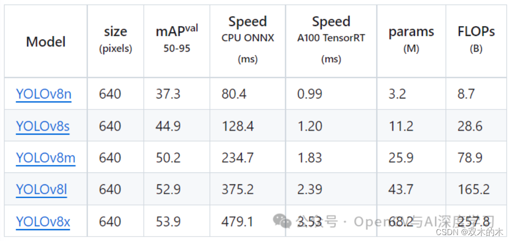

【4】運行demo測試安裝是否成功：

```python
from ultralytics import YOLO
# Load a model
model = YOLO('yolov8n.pt')  # pretrained YOLOv8n model
 
# Run batched inference on a list of images
results = model(['1.jpg', '2.jpg'])  # return a list of Results objects
 
# Process results list
for result in results:
    boxes = result.boxes  # Boxes object for bounding box outputs
    masks = result.masks  # Masks object for segmentation masks outputs
    keypoints = result.keypoints  # Keypoints object for pose outputs
    probs = result.probs  # Probs object for classification outputs
    result.show()  # display to screen
    result.save(filename='result.jpg')  # save to disk
```


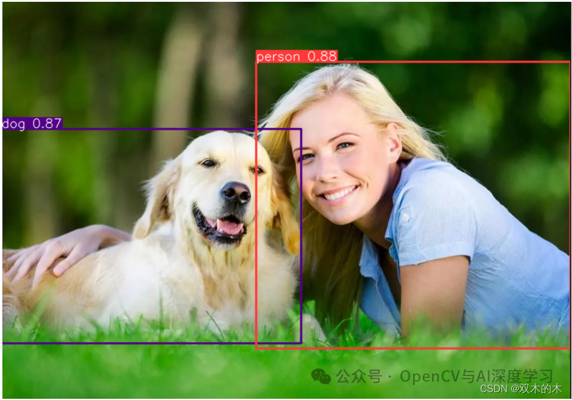


## 標註/製作資料集
【1】準備好待標註圖片

    可以自己寫一個從攝影機存圖的指令碼保存一下不同手勢圖到本地，這裡提供一個供參考：

```python
import cv2
 
cap = cv2.VideoCapture(0)
flag = 0
 
if(cap.isOpened()): #視訊打開成功
  flag = 1
else:
  flag = 0
  print('open cam failed!')
 
if(flag==1):
  while(True):
    cv2.namedWindow("frame")
    ret,frame = cap.read()#讀取一幀
    if ret==False: #讀取幀失敗
      break
    cv2.imshow("frame", frame)
    if cv2.waitKey(50)&0xFF ==27: #按下Esc鍵退出
      cv2.imwrite("1.jpg",frame)
      break
 
cap.release()
cv2.destroyAllWindows()
```

本文使用共3種手勢**1，2，5**，三種手勢各300張，大家可以根據實際情況增減樣本數量。

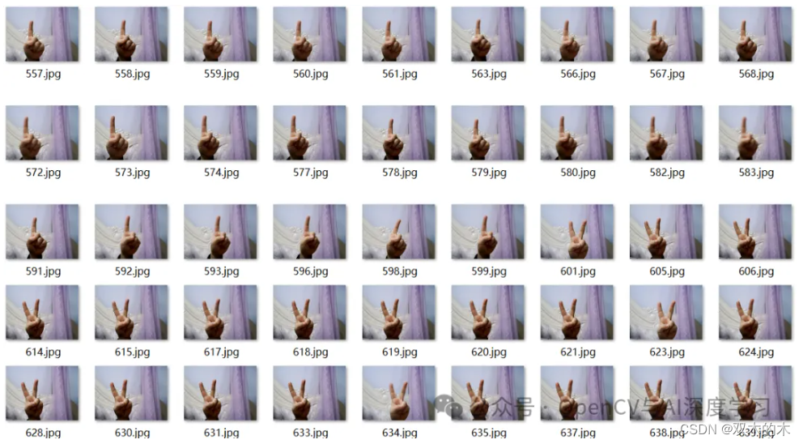

**【2】標註樣本**

  標註工具使用labelimg即可，直接pip安裝：

```sh
pip install labelimg
```

安裝完成後，命令列直接輸入labelimg，Enter即可打開labelimg，資料集類型切換成YOLO，然後依次完成標註即可。

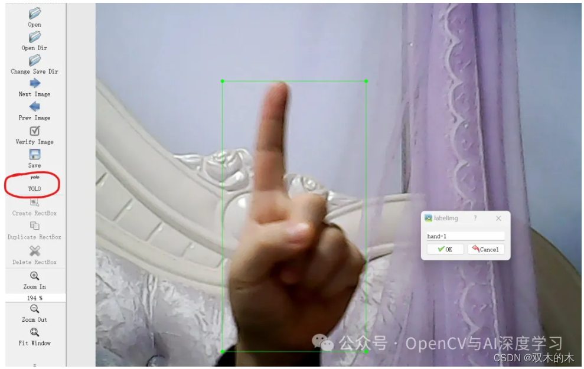

**【3】標註劃分**

  標註好之後，使用下面的指令碼劃分訓練集、驗證集，注意設定正確的圖片和txt路徑：

```python
import os
import random
import shutil
 
# 設定檔案路徑和劃分比例
root_path = "./voc_yolo/"
image_dir = "./JPEGImages/"
label_dir = "./Annotations/"
train_ratio = 0.7
val_ratio = 0.2
test_ratio = 0.1
 
# 建立訓練集、驗證集和測試集目錄
os.makedirs("images/train", exist_ok=True)
os.makedirs("images/val", exist_ok=True)
os.makedirs("images/test", exist_ok=True)
os.makedirs("labels/train", exist_ok=True)
os.makedirs("labels/val", exist_ok=True)
os.makedirs("labels/test", exist_ok=True)
 
# 獲取所有圖像檔案名稱
image_files = os.listdir(image_dir)
total_images = len(image_files)
random.shuffle(image_files)
 
# 計算劃分數量
train_count = int(total_images * train_ratio)
val_count = int(total_images * val_ratio)
test_count = total_images - train_count - val_count
 
# 劃分訓練集
train_images = image_files[:train_count]
for image_file in train_images:
    label_file = image_file[:image_file.rfind(".")] + ".txt"
    shutil.copy(os.path.join(image_dir, image_file), "images/train/")
    shutil.copy(os.path.join(label_dir, label_file), "labels/train/")
 
# 劃分驗證集
val_images = image_files[train_count:train_count+val_count]
for image_file in val_images:
    label_file = image_file[:image_file.rfind(".")] + ".txt"
    shutil.copy(os.path.join(image_dir, image_file), "images/val/")
    shutil.copy(os.path.join(label_dir, label_file), "labels/val/")
 
# 劃分測試集
test_images = image_files[train_count+val_count:]
for image_file in test_images:
    label_file = image_file[:image_file.rfind(".")] + ".txt"
    shutil.copy(os.path.join(image_dir, image_file), "images/test/")
    shutil.copy(os.path.join(label_dir, label_file), "labels/test/")
 
# 生成訓練集圖片路徑txt檔案
with open("train.txt", "w") as file:
    file.write("\n".join([root_path + "images/train/" + image_file for image_file in train_images]))
 
# 生成驗證集圖片路徑txt檔案
with open("val.txt", "w") as file:
    file.write("\n".join([root_path + "images/val/" + image_file for image_file in val_images]))
 
# 生成測試集圖片路徑txt檔案
with open("test.txt", "w") as file:
    file.write("\n".join([root_path + "images/test/" + image_file for image_file in test_images]))
 
print("資料劃分完成！")
```

接著會生成劃分好的資料集如下：

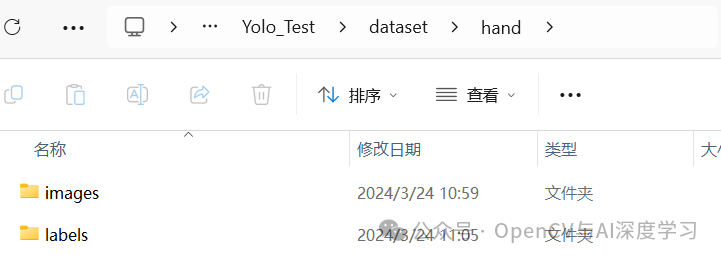

打開images資料夾：


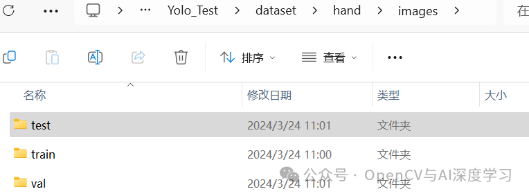


打開images下的train資料夾：

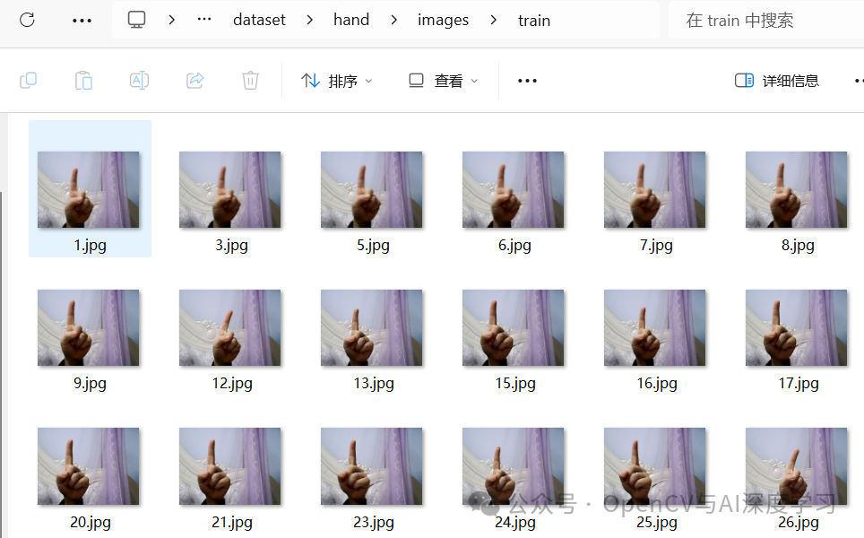

打開labels下的train資料夾：

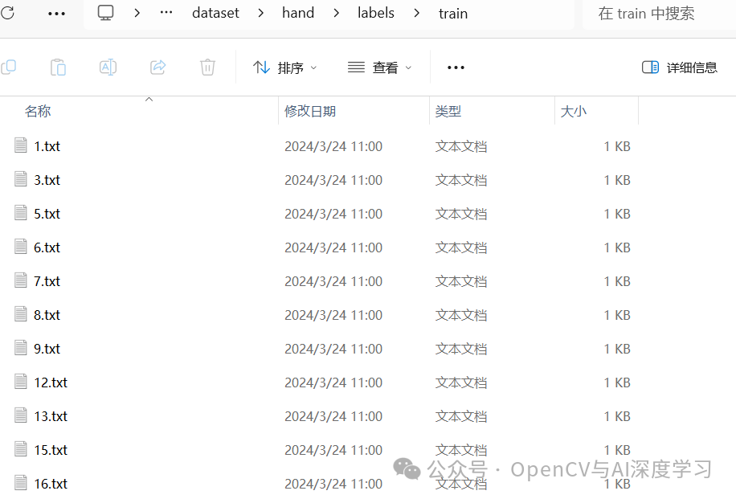

## 訓練與預測

**【1】開始訓練**

  訓練指令碼如下：

```python
from ultralytics import YOLO
# Load a model
model = YOLO('yolov8n.pt')  # load a pretrained model (recommended for training)
 
results = model.train(data='hand.yaml', epochs=30, imgsz=640, device=[0],
                      workers=0,lr0=0.001,batch=8,amp=False)
```

  hand.yaml內容如下，注意修改自己的資料集路徑即可：

```python
# Ultralytics YOLO 🚀, AGPL-3.0 license
# COCO8 dataset (first 8 images from COCO train2017) by Ultralytics
# Documentation: https://docs.ultralytics.com/datasets/detect/coco8/
# Example usage: yolo train data=coco8.yaml
# parent
# ├── ultralytics
# └── datasets
#     └── coco8  ← downloads here (1 MB)
 
# Train/val/test sets as 1) dir: path/to/imgs, 2) file: path/to/imgs.txt, or 3) list: [path/to/imgs1, path/to/imgs2, ..]
path: E:/Practice/DeepLearning/Yolo_Test/dataset/hand # dataset root dir
train: E:/Practice/DeepLearning/Yolo_Test/dataset/hand/images/train # train images (relative to 'path') 4 images
val: E:/Practice/DeepLearning/Yolo_Test/dataset/hand/images/val # val images (relative to 'path') 4 images
test: # test images (optional)
 
# Classes
names:
  0: hand-1
  1: hand-2
  2: hand-5
 
 
# Download script/URL (optional)
# download: https://ultralytics.com/assets/coco8.zip
```


CPU訓練將device=[0]改為device='cpu'即可

訓練完成後再runs/detect/train資料夾下生成如下內容：

在weights資料夾下生成兩個模型檔案，直接使用best.pt即可。

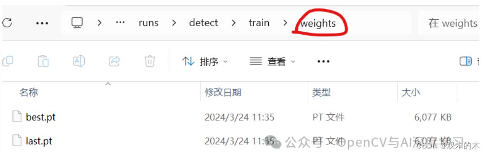

【2】預測推理

預測指令碼如下：

```python
from ultralytics import YOLO
# Load a model
model = YOLO('best.pt')  # pretrained YOLOv8n model
 
# Run batched inference on a list of images
results = model(['1 (1).jpg', '1 (2).jpg', '1 (3).jpg'])  # return a list of Results objects
 
# Process results list
for result in results:
    boxes = result.boxes  # Boxes object for bounding box outputs
    masks = result.masks  # Masks object for segmentation masks outputs
    keypoints = result.keypoints  # Keypoints object for pose outputs
    probs = result.probs  # Probs object for classification outputs
    result.show()  # display to screen
    result.save(filename='result.jpg')  # save to disk
```

預測結果：

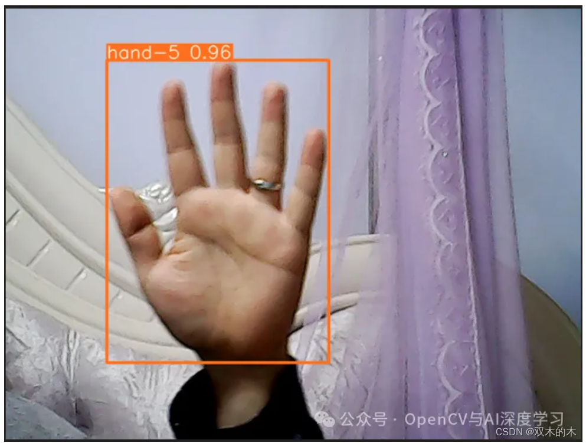

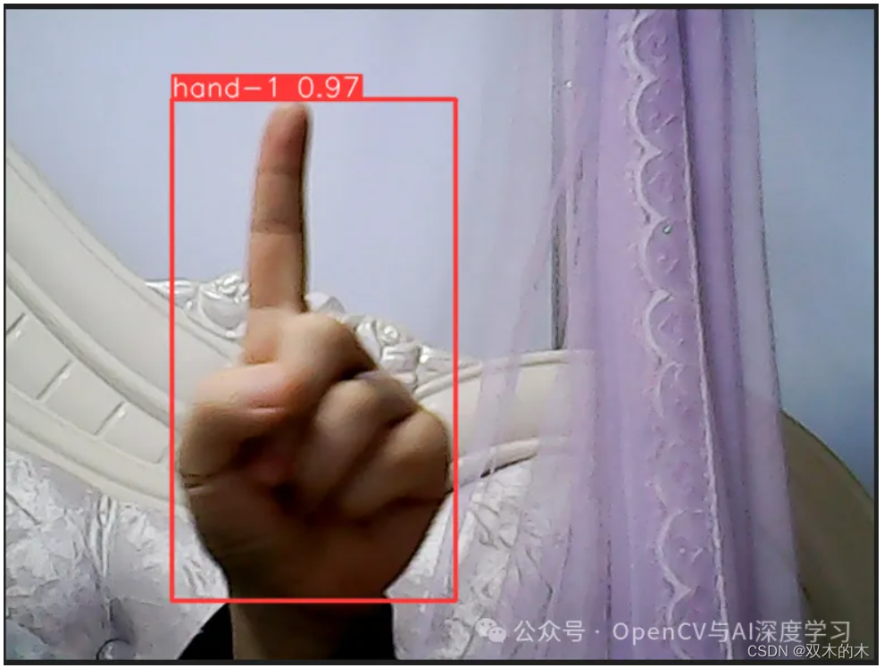

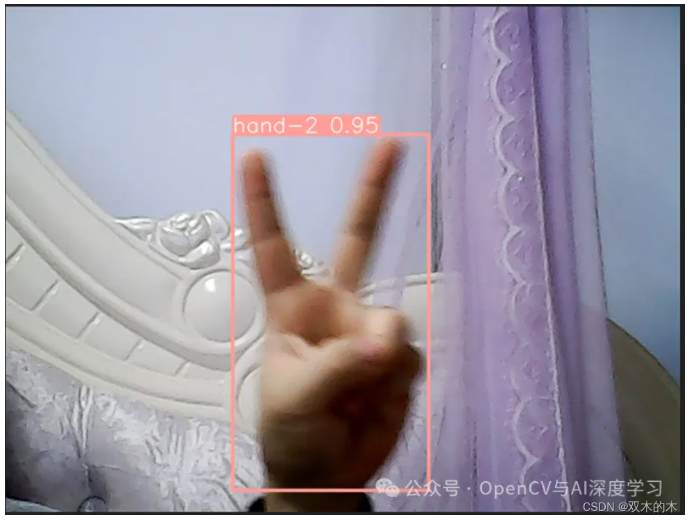

