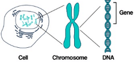
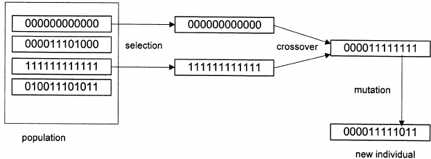
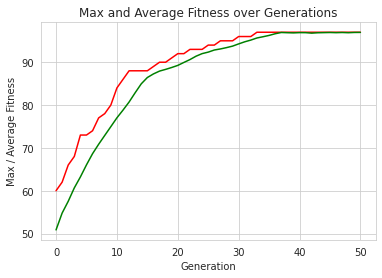

# 初探基因演算法-用 OneMax 問題示範


https://r23456999.medium.com/%E5%88%9D%E6%8E%A2%E5%9F%BA%E5%9B%A0%E6%BC%94%E7%AE%97%E6%B3%95-%E7%94%A8-onemax-%E5%95%8F%E9%A1%8C%E7%A4%BA%E7%AF%84-3c0edc973da8


這次熟悉看看所謂的 Genetic Algorithm; GA 是什麼吧

# **摘要**

本文將介紹基因演算法的重要元素，以及計算過程，最後使用 DEAP 框架實作一次 OneMax 問題，來看看實務上要如何將基因演算法落地。

# **介紹基因演算法**


基因示意圖，Photo by [Sangharsh Lohakare](https://unsplash.com/@sangharsh_l?utm_source=medium&utm_medium=referral) on [Unsplash](https://unsplash.com/?utm_source=medium&utm_medium=referral)

## 什麼是基因演算法？

基因演算法是種受到大自然演化方式啟發的一種用於找最佳解的搜尋演算法。藉由模仿大自然演化過程，不斷的選擇伴侶、繁殖，進而迭代出具備最適應的解決方法。同一時間，能夠克服傳統搜尋演算法上遇到的限制，特別是需要具備大量參數和複雜數學才能表達的問題。

## 物競天擇 — 適者生存

既然基因演算法是仿造大自然演化方式，在這方面最廣為人的理論就是達爾文-物競天擇說，在物競天擇中核心重點為適者生存。

> 生物要如何做到適者生存呢？

淘汰掉不適應者就行。物種在進行交配後，會藉由交換染色體，外加一點點基因突變，進而生下子代，然後看看這個子代跟現今環境匹不匹配，如果適應不良就自然死去。這邊講的是最適合環境的活下來，不代表活下來的物種就很萬能，例如說：我們把無尾熊直接從澳洲搬運到台灣居住好了，然後給吃台灣原生種植物，無尾熊肯定會水土不服，直接陣亡，畢竟這個物種就不是在台灣生長下來的。再換個說法好了，把一個很內向的人拉到派對場合中，還要一直與他人互動，肯定會出狀況。

## 基因演算法重要元素

每個生物都是由最小單位**基因 (Gene)** 構建成的**染色體 (Chromosome)**所組合而成，同一個世代當中的染色體則稱為**族群(Population)**。舉個實際例子說明：假設將英文字母 A-Z 視為基因，一個染色體需要五個基因組成，則可以得到 A-P-P-L-E 作為一個染色體，假設一個族群需要四個染色體組成，則我們可以說 A-P-P-L-E、A-P-P-L-A、A-P-P-L-I、A-P-P-L-O 視為一個族群。



圖片取自：[Genetic Algorithm: Reviews, Implementations, and Applications](https://www.researchgate.net/publication/341903623_Genetic_Algorithm_Reviews_Implementations_and_Applications)

既然都有染色體了，不免俗就要讓染色體之間開始**交配(Crossover)**下，開始產出下一代，過程上，必須要從既有族群中**選擇(Selection)**出要兩兩交配的染色體，拿剛剛的英文字母染色體說明，我們從族群中抓出 A-P-P-L-I、A-P-P-L-O 兩個染色體做交配，交配時，每個染色體各貢獻一半基因，A-P-P-L-I出 A-P-L ，A-P-P-L-O 出 P-O ，組合再一起後得到新染色體 A-P-L-P-O。如果說族群僅有交換基因而已，其變化性是有上限的，所以交配後會隨機的改變染色體當中的基因，這個過程我們稱為**突變(Mutation)**，例如 A-P-L-P-O 變成 B-P-L-P-O 如此一來就得到一個全新的染色體。至於染色體是不是能夠好好的活在世界上，就需要評估染色體的生存能力，這要看**適應度(Fitness)**如何了。



圖片取自：[Power of heterogeneous computing as a vehicle for implementing E3 medical decision support systems](https://www.researchgate.net/figure/Genetic-operators-selection-crossover-and-mutation_fig2_12590917)

重要元素整理
- 基因(Gene)：GA 演算法中最小單位。
- 染色體(Chromosome)：由多個基因組合而成。
- 族群(Population)：由多個染色體組合而成。
- 交配(Crossover)：藉由兩兩染色體部分基因組合成新的染色體過程。
- 突變(Mutation)：交配後，組合新染色體時，對部分基因進行機率性變化。
- 適應度(Fitness)：一組染色體在環境上的合適分數。

## 基因演算法計算過程

> 將上述過程整理到基因演算法上時，可以得到以下流程圖


圖片取自[ Big-Data And Business Intelligence](https://subscription.packtpub.com/book/big_data_and_business_intelligence/9781788472173/8/ch08lvl1sec60/genetic-algorithms-structure)

基因演算法過程，我們將依照以下順序說明
- 初始化族群(Population Initialization)
- 定義適應度計算方式(Fitness Assignment)
- 應用選擇階段(Selection)、交配階段(Crossover)、突變階段(Mutation)

**初始化族群(Population Initialization)**
初始化族群將隨機建立染色體建立族群中第一個世代。建立的染色體需符合我們為要解決問題的染色體格式，例如說固定長度的 Binary String List。實務上，需要定義族群大小(Population size)。

**定義適應度計算方式(Fitness Assignment)**
替每個染色體計算適應度函數(Fitness Function)結果。程式中，由於每個染色體的適應度皆是各自獨立的，因此可以同時進行此計算。由於適應度計算之後的選擇階段通常認為具有較高適應度分數的個體是更好的解決方案，因此基因演算法會自然地傾向於尋找適應度函數的最大值。

**應用選擇階段(Selection)、交配階段(Crossover)、突變階段(Mutation)**
選擇階段負責從當前族群中選擇染色體，以取得最大優勢。
交配階段負責將兩個選定的染色體，交換部分基因，以此來創建新染色體。
突變階段負責將新染色體部分基因進行機率性調整。

每個階段在基因演算法(GA)中各自都有多種進行方式，例如選擇階段中就有常見的**輪盤選擇法(Roulette Wheel Selection)**、**比賽選擇法(Tournament selection)等**，在交配階段就會有**單點交配(Single-point crossover)**、**多點交配( k-point crossover)等，**突變階段則會有**翻轉位元突變(Flip bit mutation)**、**交換突變(Swap Mutation)等**。為了版面乾淨，日後我們再開一篇專門替各個階段中的方法進行說明。

## 基因演算法應用場景

以下是幾種常用基因演算法的場景：

1. 旅行推銷員問題
2. 最佳化神經網路訓練
3. 生產排程規劃
4. 大學排課問題
5. 電路最佳化設計

其實不難發現，都是日常生活中不容易解決的情境需求，而這些問題往往都會有很多種變因存在，例如生產排程規劃來說，這問題講的是一個工廠如何安排多名工人與多台機器在一個禮拜中可以最大化運作時間，安排上就會需要考慮，每一台機器的工作時間是不是會相衝，工人的上班時間是不是會跟機器可以工作時間對不上，計算過程就需要慢慢條列出手上有的資源、限制，以及評價最好的狀況等，而以下場景，都有這種特性。

# 實作基因演算法

這段落中，我們將利用 DEAP (**D**istributed **E**volutionary **A**lgorithms in **P**ython) 框架，示範目前為止基因演算法(GA)當中的觀念是如何落地的。這次我們將使用 OneMax 問題做示範。

## OneMax 問題介紹

Jㄍ問題有點像是最佳化世界中的 Hello World，如果是用 Big Data 舉例的話，類似於 Word Count，這樣類比應該可以體會吧XD。

OneMax 問題是說如何讓一段長度固定的二進位字串所有位置上數字之和最大。讓我們用一個長度為5的二進位字串為例：

- 10010 -> 和為2
- 00111 -> 和為3
- 11111 -> 和為5(最大值)

顯然地，當所有數字皆為1時，該字串和最大，但電腦不知道這件事情，需要靠演算法慢慢把答案推敲出來，讓我們來看看 DEAP 怎麼實現過程。

## 解法思路

首先，該問題是要計算一段長度固定的二進位字串，為此我們可以設定固定長度為 100 先，長度為 100 的二進位字串，其實這就是我們要追求的解，也就是最適應問題的一組染色體。顯而易見的我們的染色體就是長度為 100 的二進位字串，當中的基因只有兩個 0、1。最最最重要的適應度函數顯然就是計算二進位字串中有幾個 1 。選擇階段使用輪盤選擇法、交配階段選擇單點交配、突變階段選擇位元翻轉突變法。

## 程式實作

先行導入需要的工具

```
## 導入需要用到的工具
from deap import base, creator, tools, algorithms
import random
import numpy
import matplotlib.pyplot as plt
import seaborn as sns
```

設定固定參數

```
# problem constants:
ONE_MAX_LENGTH = 100  # length of bit string to be optimized# Genetic Algorithm constants:
POPULATION_SIZE = 100
P_CROSSOVER = 0.9  # probability for crossover
P_MUTATION = 0.1   # probability for mutating an individual
MAX_GENERATIONS = 50##by defining a constant for the number of individuals we want to keep in the hall of fame.
HALL_OF_FAME_SIZE = 10# set the random seed:
RANDOM_SEED = 42
random.seed(RANDOM_SEED)
```

設定 DEAP 中的工具

```
# initialize toolbox
toolbox = base.Toolbox()# create an operator that randomly returns 0 or 1:
toolbox.register("zeroOrOne", random.randint, 0, 1)# define a single objective, maximizing fitness strategy:
creator.create("FitnessMax", base.Fitness, weights=(1.0,))# create the Individual class based on list:
creator.create("Individual", list, fitness=creator.FitnessMax)# create the individual operator to fill up an Individual instance:
toolbox.register("individualCreator", tools.initRepeat, creator.Individual, toolbox.zeroOrOne, ONE_MAX_LENGTH)# create the population operator to generate a list of individuals:
toolbox.register("populationCreator", tools.initRepeat, list, toolbox.individualCreator)
```

定義適應度函數

```
# fitness calculation:
# compute the number of '1's in the individualdef oneMaxFitness(individual):
  return sum(individual),  # return a tupletoolbox.register("evaluate", oneMaxFitness)
```

定義選擇階段、交配階段、突變階段

```
# genetic operators:mutFlipBit
# Tournament selection with tournament size of 3:
toolbox.register("select", tools.selTournament, tournsize=3)# Single-point crossover:
toolbox.register("mate", tools.cxOnePoint)# Flip-bit mutation:
# indpb: Independent probability for each attribute to be flippedtoolbox.register("mutate", tools.mutFlipBit, indpb=1.0/ONE_MAX_LENGTH)
```

定義執行階段邏輯

```
# Genetic Algorithm flow:def main():
  # create initial population (generation 0):
  population = toolbox.populationCreator(n=POPULATION_SIZE)
  
  # prepare the statistics object:
  stats = tools.Statistics(lambda ind: ind.fitness.values)
  stats.register("max", numpy.max)
  stats.register("avg", numpy.mean)
  
  # define the hall-of-fame object:
  hof = tools.HallOfFame(HALL_OF_FAME_SIZE)  # perform the Genetic Algorithm flow:
  population, logbook = algorithms.eaSimple(
    population,toolbox,cxpb=P_CROSSOVER,mutpb=P_MUTATION,
    ngen=MAX_GENERATIONS,stats=stats,halloffame=hof,verbose=False)  # print Hall of Fame info:
  print("Hall of Fame Individuals = ", *hof.items, sep="\n")
  print("Best Ever Individual = ", hof.items[0])  # Genetic Algorithm is done - extract statistics:
  maxFitnessValues, meanFitnessValues = logbook.select("max", "avg")  # plot statistics:
  sns.set_style("whitegrid")
  plt.plot(maxFitnessValues, color='red')
  plt.plot(meanFitnessValues, color='green')
  plt.xlabel('Generation')
  plt.ylabel('Max / Average Fitness')
  plt.title('Max and Average Fitness over Generations')
  plt.show()if __name__ == "__main__":
  main()
```

## 結果圖

沒意外的話，會得到類似下方的結果圖，圖中顯示歷經 50 個世代下，族群當中的染色體們所能達到最好的分數，以及平均分數。就結果上可以看出，要到三十幾次的世代結果才能夠找到長度為 100 的二進位字串最大值，也又是全部都是1的這個結果。若你已經曉得上述當中的參數用意的話，可以試著改變 POPULATION_SIZE、P_MUTATION 等，來看看計算變化。



Max and Average Fitness Over Generations

## 結語

希望至此，對於基因演算法算是有初步認識，因為這些元素會一直一直出現，我覺得難的還是針對問題找到合適的染色體編碼方式，接者在定出適應度函數，下一回我們再來看看比較複雜的問題下，要如何思考與實作。有必要介紹 DEAP 工具使用的話，我會再另行開一篇進行說明。
