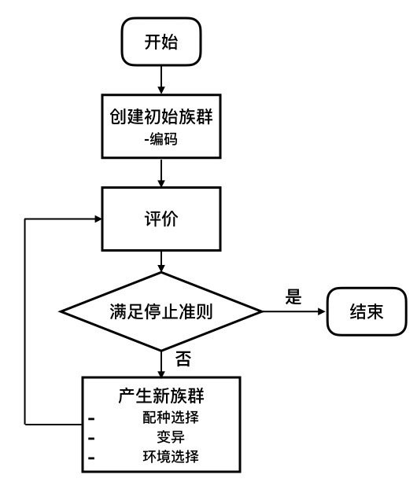
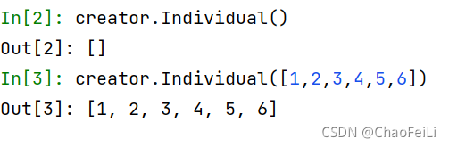
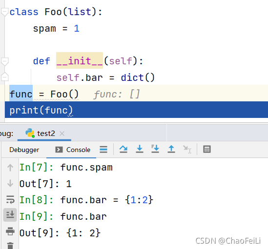
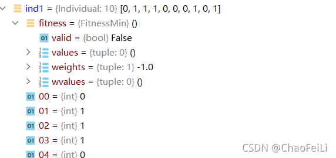
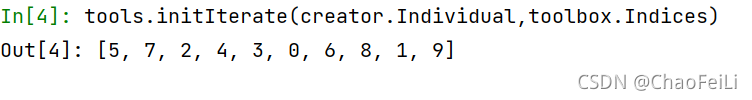
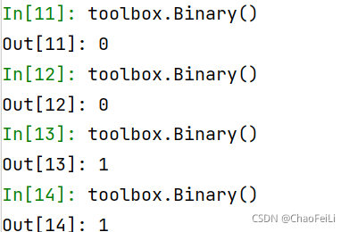

**這次的部落格，雖然參考了上述的連結，但是裡麵包含了函數講解 ，可以快速入門，上手。**

## 前沿

筆者最近開始學習如何用DEAP落實進化演算法，本文既是教學，也是學習筆記，希望在幫助自己記憶理解的同時對同樣正在學習的同學能有所幫助。礙於筆者水平有限，又非運籌最佳化科班出身，錯誤難免，請大家多多指正。 

##  關於DEAP

（[DEAP](https://deap.readthedocs.io/en/master/)）是一個進化計算框架，能夠幫助我們快速實現和測試進化演算法。由於它的靈活與強大，目前在Github上已經有2848個star。

###  DEAP的特性：

各類遺傳演算法
遺傳規劃
進化策略
多目標最佳化
多種群之間的協作與競爭
平行計算
計算過程中設定檢查點
設定基準模組，檢驗演算法能力
支援粒子群演算法、差分進化演算法等
可以簡單的使用 pip install deap 來安裝，本文基於當前的最新版(deap - 1.3.1)

##  進化演算法簡介

###  什麼是進化演算法

進化演算法(Evolutionary Algorithms)是一類元啟髮式演算法的統稱。這類演算法借鑑大自然中生物的進化、選擇與淘汰機制，通常先產生一個族群，然後不斷進化與淘汰，最終產生能夠在嚴酷的自然環境中生存的優異個體（也就是有較大適應度函數的可行解）。它具有自組織、自適應的特性，常被用來處理傳統最佳化演算法難以解決的問題。


### 進化演算法的優缺點

**優點：**

> - 泛用性強，對連續變數和離散變數都能適用；
> - 不需要導數資訊，因此不要求適應度函數的連續和可微性質(或者說不需要問題內在機理的相關資訊)；
> - 可以在解空間內大範圍平行搜尋；
> - 不容易陷入局部最優；
> - 高度平行化，並且容易與其他最佳化方法整合。

**缺點：**

> - 對於凸最佳化問題，相對基於梯度的最佳化方法（例如梯度下降法，牛頓/擬牛頓法）收斂速度更慢；
> - 進化演算法需要在搜尋空間投放大量個體來搜尋最優解。對於高維問題，由於搜尋空間隨維度指數級膨脹，需要投放的個體數也大幅增長，會導致收斂速度變慢；
> - 設計編碼方式、適應度函數以及變異規則需要大量經驗。

## 進化演算法的基本元素利用這些元素，我們就可以依照流程圖組成一個進化演算法：

> 1. 個體編碼(Individual representation): 將問題的解空間編碼對應到搜尋空間的過程。常用的編碼方式有二值編碼(Binary)，格雷編碼(Gray)，浮點編碼(Floating-point)等。
> 2. 評價(Evaluation): 設定一定的準則評價族群內每個個體的優秀程度。這種優秀程度通常稱為適應度(Fitness)。
> 3. 配種選擇(Mating selection): 建立準則從父代中選擇個體參與育種。儘可能選擇精英個體的同時也應當維護種群的多樣性，避免演算法過早陷入局部最優。
> 4. 變異(Variation): 變異過程包括一系列受到生物啟發的操作，例如重組(Recombination)，突變(mutation)等。通過變異操作，父代的個體編碼以一定方式繼承和重新組合後，形成後代族群。
> 5. 環境選擇(Environmental selection): 將父代與子代重組成新的族群。這個過程中育種得到的後代被重新插入到父代種群中，替換父代種群的部分或全體，形成具有與前代相近規模的新族群。
> 6. 停止準則(Stopping crieterion): 確定演算法何時停止，通常有兩種情況：演算法已經找到最優解或者演算法已經選入局部最優，不能繼續在解空間內搜尋。



 用文字表述實現一個簡單進化演算法的過程如下：

> ```cobol
> 
> Generate the initial population P(0) at random, and set t = 0.
> repeat
>     Evaluate the fitness of each individual in P(t).
>     Select parents from P(t) based on their fitness.
>     Mate or Mutate to Selected P(t)
>     Obtain population P(t+1) by making variations to parents.
>     Set t = t + 1
> ```

## 實現：問題定義、個體編碼與建立初始族群 

### 1.最佳化問題的定義

**單目標最佳化：**`creator.create('FitnessMin', base.Fitness, weights=(-1.0, ))`

在建立單目標最佳化問題時，weights用來指示最大化和最小化。此處-1.0即代表問題是一個最小化問題，對於最大化，應將weights改為正數，如1.0。

另外即使是單目標最佳化，weights也需要是一個tuple，以保證單目標和[多目標最佳化](https://so.csdn.net/so/search?q=多目標優化&spm=1001.2101.3001.7020)時資料結構的統一。

對於單目標最佳化問題，weights 的絕對值沒有意義，只要符號選擇正確即可。

**多目標最佳化：**`creator.create('FitnessMulti', base.Fitness, weights=(-1.0, 1.0))`

對於多目標最佳化問題，weights用來指示多個最佳化目標之間的相對重要程度以及最大化最小化。如示例中給出的(-1.0, 1.0)代表對第一個目標函數取最小值，對第二個目標函數取最大值。

#### `creator.create('FitnessMin', base.Fitness, weights=(-1.0, ))`函數講解：

先看下函數的基本定義：該函數主要是為了**創造出一個類**

第一個參數：表示類名字

第二個參數：需要繼承的一個類，因為這裡是計算fitness，所以我們繼承了base.fitness

第三個參數：會把接下來的所有參數，整理為該類的**屬性（attributes）**，下面的例子說明



函數舉例：create("Foo", list, bar=dict, spam=1) 相當於：


```python
class Foo(list):
    spam = 1

    def __init__(self):
```

 Foo作為類名，並繼承了list，如果參數是類（dict)，則在__init__ 函數中初始化該實例，且該實例作為Foo類的一個**屬性（attributes）**。如func.bar。如果參數不是類，則作為該類的一個靜態屬性**（attributes）**。如，func.spam



```python

def create(name, base, **kargs):
    """Creates a new class named *name* inheriting from *base* in the
    :mod:`~deap.creator` module. The new class can have attributes defined by
    the subsequent keyword arguments passed to the function create. If the
    argument is a class (without the parenthesis), the __init__ function is
    called in the initialization of an instance of the new object and the
    returned instance is added as an attribute of the class' instance.
    Otherwise, if the argument is not a class, (for example an :class:`int`),
    it is added as a "static" attribute of the class.
    :param name: The name of the class to create.
    :param base: A base class from which to inherit.
    :param attribute: One or more attributes to add on instantiation of this
                      class, optional.
    The following is used to create a class :class:`Foo` inheriting from the
    standard :class:`list` and having an attribute :attr:`bar` being an empty
    dictionary and a static attribute :attr:`spam` initialized to 1. ::
        create("Foo", list, bar=dict, spam=1)
    This above line is exactly the same as defining in the :mod:`creator`
    module something like the following. ::
        class Foo(list):
            spam = 1
            def __init__(self):
                self.bar = dict()
    The :ref:`creating-types` tutorial gives more examples of the creator
    usage.
```

### 2.個體編碼

**實數編碼(Value encoding)：**直接用實數對變數進行編碼。優點是不用解碼，基因表達非常簡潔，而且能對應連續區間。但是實數編碼後搜尋區間連續，因此容易陷入局部最優。

*實數編碼DEAP實現：*

```python
from deap import base, creator, tools
import random
IND_SIZE = 5
creator.create('FitnessMin', base.Fitness, weights=(-1.0,)) #最佳化目標：單變數，求最小值
creator.create('Individual', list, fitness = creator.FitnessMin) #建立Individual類，繼承list
 
toolbox = base.Toolbox()
toolbox.register('Attr_float', random.random)
toolbox.register('Individual', tools.initRepeat, creator.Individual, toolbox.Attr_float, n=IND_SIZE)
 
ind1 = toolbox.Individual()
print(ind1)
 
# 結果：[0.8579615693371493, 0.05774821674048369, 0.8812411734389638, 0.5854279538236896, 0.12908399219828248]
```

#### creator.create('Individual', list, fitness = creator.FitnessMin)講解

第一個參數：表示名字 Individual

第二個參數：需要繼承的一個類，這裡creator.Individual() 的對象本身有了和list一樣的功能，可以append 和extend。這裡我們資料的保存方式是list，所以list，也可以是tuple

第三個參數：將fitness 這個參數新增到Individual，作為Individual的一個**屬性（attributes）**

經過剛剛操作，我們creator.Individual()，裡面具有了兩種類型的實例，一種是list，一種是fitness

第一個例子代表：繼承 list 進行初始化賦值，比如a = list([1,2,3,4,5,6])


第二個例子代表：繼承 list 進行append 



通過這個實例化過程，我們可以發現，creator.Individual()，給我們提供了兩個位置，第一個位置表示繼承了list這個類，第二個位置fitness 在初始化的時候，已經有了具體的參數。從下面的結果中看到creator.Individual()只能接收一個參數。



第三個例子代表：

根據a = list([1,2,3,4,5])這個特性，list(object)，可以接收一個可迭代實例，包括數值型可迭代對象即序列、字典、集合對應的可迭代對象，同時也不知於此，所以：

**creator.Individual()可以接收一個自身類的對象**，相當於deepcopy，內容一致，但是記憶體地址不一致


#### ***\*toolbox.register('Attr_float', random.random)\**講解**

1、觀察***\*toolbox.register函數\****

```python
def register(self, alias, function, *args, **kargs):
    """Register a *function* in the toolbox under the name *alias*. You
    may provide default arguments that will be passed automatically when
    calling the registered function. Fixed arguments can then be overriden
    at function call time.
    :param alias: The name the operator will take in the toolbox. If the
                  alias already exist it will overwrite the the operator
                  already present.
    :param function: The function to which refer the alias.
    :param argument: One or more argument (and keyword argument) to pass
                     automatically to the registered function when called,
                     optional.
    The following code block is an example of how the toolbox is used. ::
        >>> def func(a, b, c=3):
        ...     print(a, b, c)
        ... 
        >>> tools = Toolbox()
        >>> tools.register("myFunc", func, 2, c=4)
        >>> tools.myFunc(3)
        2 3 4
```

第一個參數：表示別名 （後續函數呼叫用這個別名）

第二個參數：表示一個函數

第三個參數：實參組成元組傳進來

第三個參數：實參組成字典傳進來

2、觀察random.random函數，作為第二個參數，function，由於random.random函數裡面不需要傳參，所以就沒有了後續的內容

#### ***\*toolbox.register('Individual', tools.initRepeat, creator.Individual, toolbox.Attr_float, n=IND_SIZE)\**講解**

1、觀察***\*toolbox.register函數\****

上面已經說過了，這裡不再贅述

2、觀察***\*tools.initRepeat函數\****

```python
def initRepeat(container, func, n):
    """Call the function *container* with a generator function corresponding
    to the calling *n* times the function *func*.
    :param container: The type to put in the data from func.
    :param func: The function that will be called n times to fill the
                 container.
    :param n: The number of times to repeat func.
    :returns: An instance of the container filled with data from func.
    This helper function can be used in conjunction with a Toolbox
    to register a generator of filled containers, as individuals or
```

從函數名可以看出來，他包含了初始化+重複

第一個參數：container 是容器，表示可以把東西放進去的容器，但是我們可以放什麼呢？

第二個參數：func 函數，這個func，是把他的結果填充到 容器中。

第三個參數：表示我們需要實現多少次func這個函數。

這個函數整體表示：我們執行n次func 的結果，填充到container中。

3、觀察***\*toolbox.register與tools.initRepeat整合在一起\****

這個函數裡面一共包含了5個實參，那麼如何劃分呢？裡面是對象，套，對象

首先***\*toolbox.register\****裡面需要三個參數

第一個參數：Individual

第二個參數：tools.initRepeat

第三個參數：（creator.Individual, toolbox.Attr_float）組成元組

第四個參數：{n：IND_SIZE} 組成字典

第三個和第四個參數具體如何分配，請查看連結：[4. More Control Flow Tools — Python 2.7.18 documentation](https://docs.python.org/2/tutorial/controlflow.html#keyword-arguments)

**第三個和第四個參數**主要的意義是表明了register函數可以接收更多的參數，你來多少，我都可以接收。但是最重要的就是，你後續來的參數，其實都是為register裡面的function服務的，具體來講，後續來的參數creator.Individual, toolbox.Attr_float, n=IND_SIZE，都是為了傳遞給tools.initRepeat裡面的，因為tools.initRepeat（container, func, n）包含了三個參數

其次***\*tools.initRepeat\****

第一個參數：container 是容器，creator.Individual

第二個參數：func 函數，toolbox.Attr_float，也就是裡面的 random.random

第三個參數：n=IND_SIZE，表示實現多少次func函數，也就是上面的 toolbox.Attr_float()

這其實相當於一個**函數套娃。**


 從這裡可以觀察到，把toolbox.Attr_float()結果組成了一個列表，然後傳遞到creator.Individual中的預留的位置list中（在**2、個體編碼**中提到）

#### **二進制編碼(Binary encoding)**

在二進制編碼中，用01兩種數字模擬人類染色體中的4中鹼基，用一定長度的01字串來描述變數。其優點在於種群多樣性大，但是需要解碼，而且不連續，容易產生Hamming cliff（例如0111=7, 1000=8，改動了全部的4位數字之後，實際值只變動了1），在接近局部最優位置時，染色體稍有變動，就會使變數產生很大偏移（格雷編碼（Gray coding）能夠克服漢明距離的問題，但是實際問題複雜度較大時，格雷編碼很難精確描述問題）。

*變數的二進制編碼：*

由於通常情況下，搜尋空間都是實數空間，因此在編碼時，需要建立實數空間到二進制編碼空間的對應。使用二進制不能對實數空間進行連續編碼，但是可以在給定精度下對連續空間進行離散化。

以例子來說明如何對變數進行二進制編碼，假設需要對一個在區間[-2, 2]上的變數進行二進制編碼：

*選擇編碼長度：*在需要6位精度的情況下，我們需要將該區間離散為（2-（-2））*10^6個數。我們至少需要22位二進制數字來滿足我們的精度要求。

 設定解碼器：


以隨機生成一個長度為10的二進制編碼為例，本身DEAP庫中沒有內建的Binary encoding，我們可以藉助Scipy模組中的伯努利分佈來生成一個二進制序列。

```python

from deap import base, creator, tools
from scipy.stats import bernoulli
 
creator.create('FitnessMin', base.Fitness, weights=(-1.0,)) #最佳化目標：單變數，求最小值
creator.create('Individual', list, fitness = creator.FitnessMin) #建立Individual類，繼承list
 
GENE_LENGTH = 10
 
toolbox = base.Toolbox()
toolbox.register('Binary', bernoulli.rvs, 0.5) #註冊一個Binary的alias，指向scipy.stats中的bernoulli.rvs，機率為0.5
toolbox.register('Individual', tools.initRepeat, creator.Individual, toolbox.Binary, n = GENE_LENGTH) #用tools.initRepeat生成長度為GENE_LENGTH的Individual
 
ind1 = toolbox.Individual()
print(ind1)
```

這裡咱們重點說明**toolbox.register('Binary', bernoulli.rvs, 0.5)** 和 **toolbox.register('Individual', tools.initRepeat, creator.Individual, toolbox.Binary, n = GENE_LENGTH)**

**toolbox.register('Binary', bernoulli.rvs, 0.5)**

伯努利分佈的取值，只要0和1，但是取0或者1的機率由參數決定：程式碼中（bernoulli.rvs, 0.5）表示進行一次伯努利實驗，取0或者1的機率為0.5.根據以下實驗證明：



 **toolbox.register('Individual', tools.initRepeat, creator.Individual, toolbox.Binary, n = GENE_LENGTH)**

上面已經說明瞭**toolbox.register函數的**具體意思。這裡具體說明上述整理的意思：首先**tools.initRepeat** 裡是一個重複性的過程，具體重複的函數是**toolbox.Binary，**同時承載這個函數的是容器**creator.Individual，**重複了**n次toolbox.Binary，**放入容器**creator.Individual**中。

最後通過 ind1 = toolbox.Individual() 完成了實例化操作


####  **序列編碼(Permutation encoding)**

通常在求解順序問題時用到，例如TSP問題。序列編碼中的每個染色體都是一個序列。

同樣的，這裡的`random.sampole`也可以用`np.random.permutation`代替。

```python
from deap import base, creator, tools
import random
creator.create("FitnessMin", base.Fitness, weights=(-1.0,))
creator.create("Individual", list, fitness=creator.FitnessMin)
 
IND_SIZE=10
 
toolbox = base.Toolbox()
toolbox.register("Indices", random.sample, range(IND_SIZE), IND_SIZE)
toolbox.register("Individual", tools.initIterate, creator.Individual,toolbox.Indices)
ind1 = toolbox.Individual()
print(ind1)
 
#結果：[0, 1, 5, 8, 2, 3, 6, 7, 9, 4]
```

 觀察函數：random.sample(range(IND_SIZE), IND_SIZE)


 ***\*tools.initIterate\**** 裡麵包含了容器和生成器，具體的來講，容器指的是（creator.Individual），生成器指的是（toolbox.Indices  -> 具體指的是random.sample(range(IND_SIZE),IND_SIZE))


```python
def initIterate(container, generator):
    """Call the function *container* with an iterable as
    its only argument. The iterable must be returned by
    the method or the object *generator*.
    :param container: The type to put in the data from func.
    :param generator: A function returning an iterable (list, tuple, ...),
                      the content of this iterable will fill the container.
    :returns: An instance of the container filled with data from the
              generator.
    This helper function can be used in conjunction with a Toolbox
    to register a generator of filled containers, as individuals or
    population.
        >>> import random
        >>> from functools import partial
        >>> random.seed(42)
        >>> gen_idx = partial(random.sample, list(range(10)), 10)
        >>> initIterate(list, gen_idx)      # doctest: +SKIP
        [1, 0, 4, 9, 6, 5, 8, 2, 3, 7]
    See the :ref:`permutation` and :ref:`arithmetic-expr` tutorials for
    more examples.
    """
    return container(generator())
```

#### **粒子(Particles)編碼**

粒子是一種特殊個體，主要用於粒子群演算法。相比普通的個體，它額外具有速度、速度限制並且能記錄最優位置。

```python

import random
from deap import base, creator, tools
 
creator.create("FitnessMax", base.Fitness, weights=(1.0, 1.0))
creator.create("Particle", list, fitness=creator.FitnessMax, speed=None,
               smin=None, smax=None, best=None)
 
# 自訂的粒子初始化函數
def initParticle(pcls, size, pmin, pmax, smin, smax):
    part = pcls(random.uniform(pmin, pmax) for _ in range(size))
    part.speed = [random.uniform(smin, smax) for _ in range(size)]
    part.smin = smin
    part.smax = smax
    return part
 
toolbox = base.Toolbox()
toolbox.register("Particle", initParticle, creator.Particle, size=2, pmin=-6, pmax=6, smin=-3, smax=3) #為自己編寫的initParticle函數註冊一個alias "Particle"，呼叫時生成一個2維粒子，放在容器creator.Particle中，粒子的位置落在（-6,6）中，速度限製為（-3，3）
 
ind1 = toolbox.Particle()
print(ind1)
print(ind1.speed)
print(ind1.smin, ind1.smax)
 
# 結果：[-2.176528549934324, -3.0796558214905]
#[-2.9943676285620104, -0.3222138308543414]
#-3 3
 
print(ind1.fitness.valid)
 
# 結果：False
# 因為當前還沒有計算適應度函數，所以粒子的最優適應度值還是invalid
```

### 3.初始族群的建立：

#### **一般族群**

這是最常用的族群類型，族群中沒有特別的順序或者子族群。

*一般族群的DEAP實現：*`toolbox.register('population', tools.initRepeat, list, toolbox.individual)`

以二進制編碼為例，以下程式碼可以生成由10個長度為5的隨機二進制編碼個體組成的一般族群：

```python
from deap import base, creator, tools
from scipy.stats import bernoulli
 
# 定義問題
creator.create('FitnessMin', base.Fitness, weights=(-1.0,)) # 單目標，最小化
creator.create('Individual', list, fitness = creator.FitnessMin)
 
# 生成個體
GENE_LENGTH = 5
toolbox = base.Toolbox() #實例化一個Toolbox
toolbox.register('Binary', bernoulli.rvs, 0.5)
toolbox.register('Individual', tools.initRepeat, creator.Individual, toolbox.Binary, n=GENE_LENGTH)
 
# 生成初始族群
N_POP = 10
toolbox.register('Population', tools.initRepeat, list, toolbox.Individual)
toolbox.Population(n = N_POP)
```

#### **同類群(Demes)**

同類群即一個族群中包含幾個子族群。在有些演算法中，會使用本地選擇(Local selection)挑選育種個體，這種情況下個體僅與同一鄰域的個體相互作用。

*同類群的DEAP實現：*

```python
from deap import base, creator, tools
from scipy.stats import bernoulli
 
# 定義問題
creator.create('FitnessMin', base.Fitness, weights=(-1.0,)) # 單目標，最小化
creator.create('Individual', list, fitness = creator.FitnessMin)
 
# 生成個體
GENE_LENGTH = 5
toolbox = base.Toolbox() #實例化一個Toolbox
toolbox.register('Binary', bernoulli.rvs, 0.5)
toolbox.register('Individual', tools.initRepeat, creator.Individual, toolbox.Binary, n=GENE_LENGTH)
 
# 生成初始族群
N_POP = 10
toolbox.register('Population', tools.initRepeat, list, toolbox.Individual)
toolbox.Population(n = N_POP)
 
toolbox.register("deme", tools.initRepeat, list, toolbox.Individual)
# 初始化同類群
DEME_SIZES = (10, 50, 100)
population = [toolbox.deme(n=i) for i in DEME_SIZES]
print(population)
```

#### 粒子群

粒子群中的所有粒子共享全域最優。在實現時需要額外傳入全域最優位置與全域最優適應度給族群。

[deap/examples/pso at 09b2562aad70c6f171ebca2bdac0c30387f5e8f5 · DEAP/deap · GitHub](https://github.com/DEAP/deap/tree/09b2562aad70c6f171ebca2bdac0c30387f5e8f5/examples/pso)

```python
import operator
import random
 
import numpy
 
from deap import base
from deap import benchmarks
from deap import creator
from deap import tools
 
creator.create("FitnessMax", base.Fitness, weights=(1.0,))
creator.create("Particle", list, fitness=creator.FitnessMax, speed=list, 
    smin=None, smax=None, best=None)
 
def generate(size, pmin, pmax, smin, smax):
    part = creator.Particle(random.uniform(pmin, pmax) for _ in range(size)) 
    part.speed = [random.uniform(smin, smax) for _ in range(size)]
    part.smin = smin
    part.smax = smax
    return part
 
toolbox = base.Toolbox()
toolbox.register("particle", generate, size=2, pmin=-6, pmax=6, smin=-3, smax=3)
toolbox.register("population", tools.initRepeat, list, toolbox.particle)
 
pop = toolbox.population(n=5)
```

# 簡單遺傳演算法實現


## 前言

在上一篇中，我們已經介紹了[如何在DEAP中實現進化演算法的基本操作](https://www.jianshu.com/p/8fa044ed9267)，在這一篇中我們試圖將各個操作組裝起來，用進化演算法解決一個簡單的一元函數尋優問題。

------

## 進化演算法實例 - 一元函數尋優

### 問題描述與分析

給定一個函數%20%3D%20(x%5E2%20%2B%20x)cos(2x)%2Bx%5E2%2Bx)，求解該函數的最大值。

該函數的最大值應該出現在處，值為。

可以看到該函數有很多局部極值作為幹擾項，如果進化演算法過早收斂，很容易陷入某個局部最優。

### 問題的編碼與解碼

對於該問題，可以選取很多不同的編碼方式。本文計畫採用二進制編碼，精度要求到6位，那麼首先應當確定編碼的長度與解碼方式。由於有：
 
 所以我們需要的二進制編碼長度為26。

## 利用DEAP自帶演算法求解

### DEAP自帶的進化演算法介紹

DEAP自帶的演算法都比較基礎，通常可以用來測試問題描述、編碼方式和交叉突變操作組合的有效性。需要比較複雜的進化演算法時，可以通過在已經有的算子上進行擴充。

| 演算法          | 描述                                                         |
| --------------- | ------------------------------------------------------------ |
| eaSimple        | 簡單進化演算法                                               |
| eaMuPlusLambda  | )進化演算法 |
| eaMuCommaLambda | )進化演算法 |

*簡單進化演算法  ：*`deap.algorithms.eaSimple`

DEAP中預置的簡單進化演算法流程描述如下：

1. 根據工具箱中註冊的`toolbox.evaluate`評價族群
2. 根據工具箱中註冊的`toolbox.select`選擇與父代相同個數的育種個體
3. 在族群中進行第一次循環，用工具箱中註冊的`toolbox.mate`進行配種，並<u>用生成的兩個子代替換對應父代</u>
4. 在族群中進行第二次循環，用工具箱中註冊的`toolbox.mutate`進行變異，用<u>變異後的子代替換對應父代</u>
5. 從1開始重複循環，直到達到設定的迭代次數

需要注意的是在這個過程中，生成子代有四種情況：受到配種影響；受到變異影響；既受到配種也受到變異影響；既不受配種影響也不受變異影響。

對應的偽程式碼可以表述為：


```python
evaluate(population)
for g in range(ngen):
    population = select(population, len(population))
    offspring = varAnd(population, toolbox, cxpb, mutpb)
    evaluate(offspring)
    population = offspring
```

*)進化演算法：*`deap.algorithms.eaMuPlusLambda`

該演算法的流程如下：

1. 根據工具箱中註冊的`toolbox.evaluate`評價族群
2. 在族群中進行循環，在每次循環中，隨機選擇crossover，mutation和reproduction三者之一：如果選擇到crossover，那麼隨機選擇2個個體，用工具箱中註冊的`toolbox.mate`進行配種，<u>將生成的第一個子代加入到後代列表中，第二個子代丟棄</u>；如果選擇到mutation，用工具箱中註冊的`toolbox.mutate`進行變異，<u>將變異後的子代加入到後代列表中</u>；如果選擇到reproduction，隨機選擇一個個體，<u>將其複製加入到後代列表中</u>
3. 根據工具箱中註冊的`toolbox.select`，在<u>父代+子代</u>中選擇給定數量的個體作為子代
4. 從1開始重複循環，直到達到設定的迭代次數

注意在這個子代生成的過程中，子代**不會同時受到變異和配種影響**。

對應的偽程式碼可以表述為：


```python
evaluate(population)
for g in range(ngen):
    offspring = varOr(population, toolbox, lambda_, cxpb, mutpb)
    evaluate(offspring)
    population = select(population + offspring, mu)
```

*)進化演算法：*`deap.algorithms.eaMuCommaLambda`

與)基本相同，唯一的區別在於生成子代族群時，只在產生的子代中選擇，而丟棄所有父代。

對應的偽程式碼可以表述為：


```python
evaluate(population)
for g in range(ngen):
    offspring = varOr(population, toolbox, lambda_, cxpb, mutpb)
    evaluate(offspring)
    population = select(offspring, mu)
```

### 呼叫DEAP自帶的進化演算法

在呼叫DEAP自帶的演算法時需要注意的是，由於內建演算法呼叫的alias已經提前給定，因此我們在register的時候，需要按照給定名稱註冊。

例如`toolbox.register('crossover', tools.cxUniform)`就不能被內建演算法識別，而應當按照要求，命名為mate，並且顯示給出交叉機率： `toolbox.register('mate', tools.cxUniform, indpb = 0.5)`

按照要求，使用預置的演算法需要註冊的工具有：

`toolbox.evaluate`：評價函數

`toolbox.select`：育種選擇

`toolbox.mate`：交叉操作

`toolbox.mutate`：突變操作

### 程式碼與測試


```python
from deap import algorithms, base, creator, tools
from scipy.stats import bernoulli
import numpy as np
import random

random.seed(42)  # 確保可以復現結果

# 描述問題
creator.create("FitnessMax", base.Fitness, weights=(1.0,))  # 單目標，最大值問題
creator.create("Individual", list, fitness=creator.FitnessMax)  # 編碼繼承list類

# 個體編碼
GENE_LENGTH = 26  # 需要26位編碼

toolbox = base.Toolbox()
toolbox.register("binary", bernoulli.rvs, 0.5)  # 註冊一個Binary的alias，指向scipy.stats中的bernoulli.rvs，機率為0.5
toolbox.register("individual", tools.initRepeat, creator.Individual, toolbox.binary, n=GENE_LENGTH)  # 用tools.initRepeat生成長度為GENE_LENGTH的Individual

# 評價函數
def decode(individual):
   num = int("".join([str(_) for _ in individual]), 2)  # 解碼到10進制
   x = -30 + (num / (2**26 - 1)) * 60  # 對應回-30，30區間
   return x

def eval(individual):
   x = decode(individual)
   return (((x**2 + x) * np.cos(2 * x) + x**2 + x),)

# 生成初始族群
N_POP = 100  # 族群中的個體數量
toolbox.register("population", tools.initRepeat, list, toolbox.individual)
pop = toolbox.population(n=N_POP)

# 在工具箱中註冊遺傳演算法需要的工具
toolbox.register("evaluate", eval)
toolbox.register("select", tools.selTournament, tournsize=2)  # 註冊Tournsize為2的錦標賽選擇
toolbox.register("mate", tools.cxUniform, indpb=0.5)  # 注意這裡的indpb需要顯示給出
toolbox.register("mutate", tools.mutFlipBit, indpb=0.5)

# 註冊計算過程中需要記錄的資料
stats = tools.Statistics(key=lambda ind: ind.fitness.values)
stats.register("avg", np.mean)
stats.register("std", np.std)
stats.register("min", np.min)
stats.register("max", np.max)

# 呼叫DEAP內建的演算法
resultPop, logbook = algorithms.eaSimple(pop, toolbox, cxpb=0.5, mutpb=0.2, ngen=50, stats=stats, verbose=False)

# 輸出計算過程
logbook.header = "gen", "nevals", "avg", "std", "min", "max"
print(logbook)
```

計算過程輸出（在保存的結果中，nevals代表該迭代中呼叫evaluate函數的次數；另外也可以令`verbose=True`直接在迭代中輸出計算過程）：


```css
gen nevals  avg     std     min         max    
0   100     279.703 373.129 -0.406848   1655.79
1   53      458.499 416.789 0.154799    1655.79
2   59      482.595 461.698 0.00177335  1655.79
3   52      540.527 472.762 -0.0472813  1655.79
4   59      580.49  514.773 0.0557206   1655.79
5   62      693.469 576.465 -0.393899   1655.79
6   71      875.931 609.527 0.000831826 1656.52
7   62      946.418 608.838 0.221249    1656.52
8   67      881.358 636.562 0.06291     1657.42
9   55      937.741 636.038 0.231018    1657.42
10  59      942.68  662.51  0.00094194  1657.42
11  50      990.668 641.284 1.36174     1657.42
12  49      1056.75 661.558 -0.392898   1657.42
13  60      1254.48 596.379 -0.374487   1657.42
14  56      1196.38 667.938 0.0073118   1657.42
15  61      1255.25 655.171 0.0130561   1657.42
16  57      1258.77 639.582 0.20504     1657.42
17  72      1328.39 587.822 11.0895     1657.42
18  66      1331.57 610.036 0.298211    1657.42
19  67      1297.66 632.126 -0.231748   1657.42
20  64      1246.8  610.818 0.0335697   1657.42
21  58      1099.19 690.046 0.0503046   1657.42
22  60      1068.91 664.985 0.0591922   1657.42
23  49      1243.47 612.2   0.00160086  1657.42
24  47      1231.47 658.94  -0.202828   1657.42
25  57      1233.48 657.109 0.0262275   1657.42
26  53      1410.59 534.754 0.877048    1657.42
27  71      1162.42 704.536 -0.257036   1657.42
28  52      1259.11 639.283 7.61025     1657.42
29  61      1312.6  615.661 1.40555     1657.42
30  56      1251.42 651.842 -0.0276344  1657.42
31  68      1200.02 678.454 0.00783006  1657.42
32  58      1198.2  675.925 -0.0726268  1657.42
33  61      1196.74 679.65  -0.135946   1657.42
34  60      1236.89 635.381 0.0133596   1657.42
35  50      1328.18 600.071 3.61031     1657.42
36  40      1357.62 599.045 -0.367127   1657.42
37  51      1299.96 633.932 -0.0674078  1657.42
38  48      1324.36 610.043 0.95255     1657.42
39  55      1323.23 566.232 0.987755    1657.42
40  58      1282.45 640.85  0.1648      1657.42
41  54      1335.26 593.431 -0.317349   1657.42
42  53      1330.78 593.921 0.0287983   1657.42
43  60      1332.02 597.941 1.32028     1657.42
44  65      1239.09 645.678 0.00144193  1657.42
45  71      1287.96 625.504 -0.372238   1657.42
46  51      1397.84 520.398 0.0150745   1657.42
47  66      1311.83 591.556 0.258935    1657.42
48  66      1160.49 694.509 0.163166    1657.42
49  50      1271.95 642.396 0.000437735 1657.42
50  61      1288.53 619.33  0.149628    1657.42
```

查看結果：


```python
# 輸出最優解
index = np.argmax([ind.fitness for ind in resultPop])
x = decode(resultPop[index]) # 解碼
print('當前最優解：'+ str(x) + '\t對應的函數值為：' + str(resultPop[index].fitness))
```

結果：


```css
當前最優解：28.308083985866368    對應的函數值為：(1657.4220524080563,)
```

可以看到遺傳演算法成功避開了局部最優，給出的結果非常接近全域最優解28.309了。

## 自行編寫演算法求解

### 程式碼與測試

自行編寫通常來說會需要比內建函數更長的篇幅，但是也能獲得更大的自由度。下面是一個用錦標賽交叉、位翻轉突變求解同樣問題的例子：


```python
import random

from deap import creator, base, tools
from scipy.stats import bernoulli

random.seed(42) # 確保結果可以復現
# 描述問題
creator.create('FitnessMax', base.Fitness, weights=(1.0,)) # 單目標，最大值問題
creator.create('Individual', list, fitness = creator.FitnessMax) # 編碼繼承list類

# 二進制個體編碼
GENE_LENGTH = 26 # 需要26位編碼

toolbox = base.Toolbox()
toolbox.register('binary', bernoulli.rvs, 0.5) #註冊一個Binary的alias，指向scipy.stats中的bernoulli.rvs，機率為0.5
toolbox.register('individual', tools.initRepeat, creator.Individual, toolbox.binary, n = GENE_LENGTH) #用tools.initRepeat生成長度為GENE_LENGTH的Individual

# 評價函數
def eval(individual):
    num = int(''.join([str(_) for _ in individual]), 2) # 解碼到10進制
    x = -30 + num * 60 / (2**26 - 1) # 對應回-30，30區間
    return ((np.square(x) + x) * np.cos(2*x) + np.square(x) + x),
toolbox.register('evaluate', eval)

# 生成初始族群
N_POP = 100 # 族群中的個體數量
toolbox.register('population', tools.initRepeat, list, toolbox.individual)
pop = toolbox.population(n = N_POP)

# 評價初始族群
fitnesses = map(toolbox.evaluate, pop)
for ind, fit in zip(pop, fitnesses):
    ind.fitness.values = fit

# 進化迭代
N_GEN = 50 # 迭代代數
CXPB = 0.5 # 交叉機率
MUTPB = 0.2 # 突變機率

# 註冊進化過程需要的工具：配種選擇、交叉、突變
toolbox.register('tourSel', tools.selTournament, tournsize = 2) # 註冊Tournsize為2的錦標賽選擇
toolbox.register('crossover', tools.cxUniform)
toolbox.register('mutate', tools.mutFlipBit)

# 用資料記錄演算法迭代過程
stats = tools.Statistics(key=lambda ind: ind.fitness.values)
stats.register("avg", np.mean)
stats.register("std", np.std)
stats.register("min", np.min)
stats.register("max", np.max)
logbook = tools.Logbook()

for gen in range(N_GEN):
    # 配種選擇
    selectedTour = toolbox.tourSel(pop, N_POP) # 選擇N_POP個體
    selectedInd = list(map(toolbox.clone, selectedTour)) # 複製個體，供交叉變異用
    # 對選出的育種族群兩兩進行交叉，對於被改變個體，刪除其適應度值
    for child1, child2 in zip(selectedInd[::2], selectedInd[1::2]):
        if random.random() < CXPB:
            toolbox.crossover(child1, child2, 0.5)
            del child1.fitness.values
            del child2.fitness.values
      
    # 對選出的育種族群進行變異，對於被改變個體，刪除適應度值
    for mutant in selectedInd:
        if random.random() < MUTPB:
            toolbox.mutate(mutant, 0.5)
            del mutant.fitness.values
      
    # 對於被改變的個體，重新評價其適應度
    invalid_ind = [ind for ind in selectedInd if not ind.fitness.valid]
    fitnesses = map(toolbox.evaluate, invalid_ind)
    for ind, fit in zip(invalid_ind, fitnesses):
        ind.fitness.values = fit
    
    # 完全重插入
    pop[:] = selectedInd
    
    # 記錄資料
    record = stats.compile(pop)
    logbook.record(gen=gen, **record)

# 輸出計算過程
logbook.header = 'gen',"avg", "std", 'min', "max"
print(logbook)
```

計算過程輸出：


```css
gen avg     std     min         max    
0   453.042 403.079 0.0541052   1533.87
1   494.408 419.628 0.860502    1626.41
2   543.773 465.404 -0.11475    1626.41
3   551.903 496.022 -0.0620545  1626.41
4   590.134 538.303 -0.0423912  1626.41
5   552.925 523.084 -0.348284   1544.09
6   580.065 532.083 0.000270764 1544.09
7   610.387 567.527 0.0294394   1574.38
8   667.447 556.671 -0.16236    1525.22
9   722.472 551.263 -0.39705    1524.89
10  698.512 548.705 0.0240564   1542.15
11  748.871 585.757 -0.405741   1542.15
12  717.023 580.996 0.00352434  1542.15
13  701.257 575.739 0.0797344   1542.15
14  720.325 593.033 -0.322945   1542.15
15  705.138 612.55  0.846468    1627.42
16  725.673 616.072 0.0259165   1641.05
17  683.245 609.737 -0.0759172  1630.68
18  613.711 613.64  -0.0448713  1627.25
19  648.058 579.645 -0.319345   1648.62
20  655.742 570.835 -0.247798   1613.19
21  692.022 541.547 -0.160214   1543.01
22  737.027 557.312 0.175429    1543.01
23  825.825 595.845 -0.403073   1542.95
24  831.611 600.052 -0.397646   1645.6 
25  991.433 564.623 0.095375    1641.16
26  842.529 641.466 -0.406455   1641.16
27  906.907 622.024 4.64596     1641.16
28  791.317 633.509 -0.234101   1641.16
29  896.355 598.829 0.339045    1641.16
30  781.726 625.868 0.0195279   1647.45
31  774.75  645.621 0.134108    1647.45
32  789.524 631.395 -0.388413   1647.45
33  985.497 631.871 0.00160795  1654.93
34  990.838 662.935 0.00156172  1657.21
35  1013.72 695.145 -0.266597   1652.41
36  1073.47 697.062 -0.0762617  1652.32
37  1118.98 667.797 0.508095    1652.32
38  1219.86 602.05  -0.256761   1652.39
39  1247.71 628.152 0.00243654  1652.39
40  1290.97 613.243 -0.374519   1652.39
41  1298.95 607.829 0.0630793   1652.41
42  1309.81 599.807 0.0235305   1652.47
43  1214.13 658.237 0.0027164   1653.03
44  1244.05 656.009 -0.329403   1653.13
45  1369.44 543.688 0.000339235 1653.05
46  1283.87 602.252 0.204417    1653.19
47  1157.28 686.628 0.00359533  1653.19
48  1284.39 630.622 0.0769602   1653.19
49  1301.76 608.879 0.0775233   1656.45
```

查看結果：


```python
# 輸出最優解
index = np.argmax([ind.fitness for ind in pop])
x = decode(resultPop[index]) # 解碼
print('當前最優解：'+ str(x) + '\t對應的函數值為：' + str(pop[index].fitness))
```

結果輸出：


```css
當前最優解：28.39357492914162 對應的函數值為：(1656.4466617035953,)
```

### 結果可視化


```python
# 結果可視化
import matplotlib.pyplot as plt

gen = logbook.select('gen') # 用select方法從logbook中提取迭代次數
fit_maxs = logbook.select('max')
fit_average = logbook.select('avg')

fig = plt.figure()
ax = fig.add_subplot(111)
ax.plot(gen, fit_maxs, 'b-', linewidth = 2.0, label='Max Fitness')
ax.plot(gen, fit_average, 'r-', linewidth = 2.0, label='Average Fitness')
ax.legend(loc='best')
ax.set_xlabel('Generation')
ax.set_ylabel('Fitness')

fig.tight_layout()
fig.savefig('Generation_Fitness.png')
```

