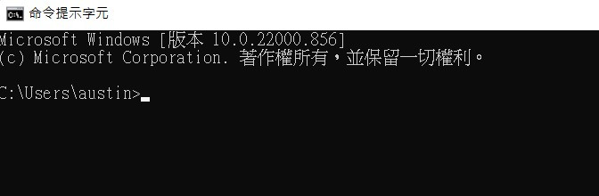

# [python&函式庫 安裝與介紹](https://ithelp.ithome.com.tw/articles/10288056)

> 現在正值開學季，我相信有許多的學生進到研究室之後發現	
> 欸?我不是資工組的我怎麼會用到AI，我又不會寫程式
> 會這樣子很正常，現在萬物皆可AI的時代，不管是甚麼樣的技術都能套用到AI上去做運算
> 所以這篇文章會告訴你如何在30天從安裝python到學會AI

## 工具的選擇

今天是第一天，所以先來做一些簡單的事情，就是**安裝python**，雖然現在AI有許多的語言可以使用，但我推薦使用python，因為python的語法與java、C+/C++、R等相比較更容易上手，且擁有大量的AI的函式庫(library)，例如:tensorflow、pytorch、sklearn、opencv...等，所以之後的教學都會使用python來做為撰寫程式的工具。

## 安裝python

1.前往python官方網站:https://www.python.org/ 點擊上方的Downloads

我們會看到裡面有許多的版本，本篇使用的版本為3.7.8，當然你想下載其他的版本也可以，但請注意python版本千萬不要安裝最新版本或太高的版本。

2.Ctrl+F搜尋3.7.8就能找到本篇教學所使用的python版本了

3.點擊後往下滑會看到Windows x86-64 executable installer(64位元)我們把它下載下來

4.下載完後雙擊安裝(請務必把紅框處打勾)

按下install Now就安裝完畢了!!

安裝完python之後恭喜你!今天的任務你已經完成一半了。前面提到的python有許多函式庫可以做使用，可以幫你輕鬆的完成許多困難的功能，像是矩陣運算、讀取檔案、繪圖等功能都能輕鬆的完成，所以今天的第二步驟就是如何安裝函式庫。

## 安裝函式庫

1.首先我們先打開cmd視窗(windows搜尋cmd就能找到)

2.輸入pip install XXXX(函示庫名稱)

只要有出現Successfully installed XXXX(函示庫名稱)就代表完成了
*圖中示範的函示庫為pandas後續也會用到可以先安裝*

目前到這裡應該都還算簡單吧~明天會開始教學python的語法
今天就先說到這裡了謝謝大家
