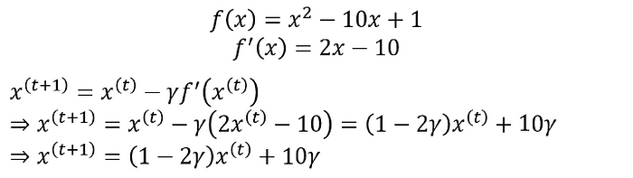
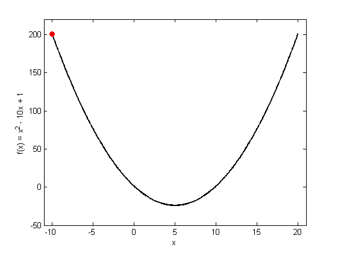
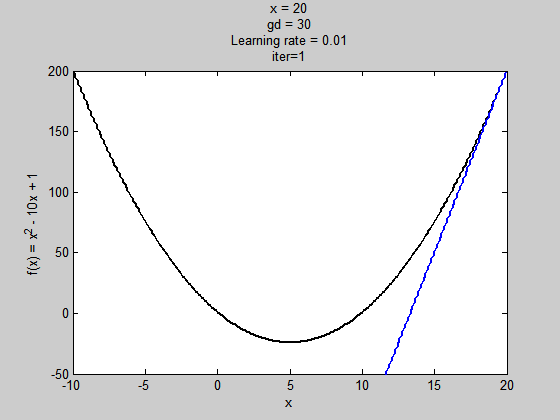
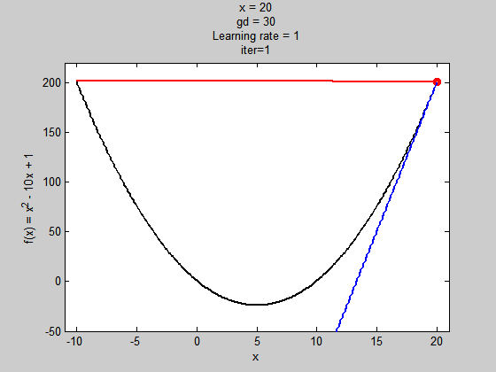
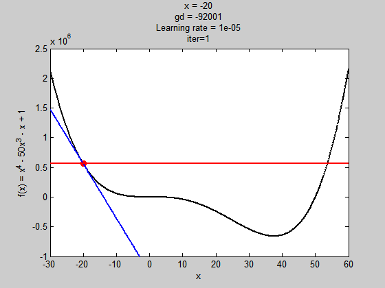
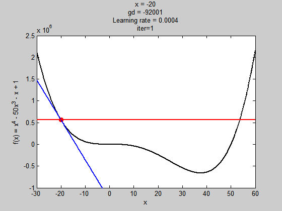
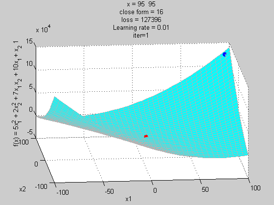

# 梯度下降法(gradient descent)

https://chih-sheng-huang821.medium.com/%E6%A9%9F%E5%99%A8%E5%AD%B8%E7%BF%92-%E5%9F%BA%E7%A4%8E%E6%95%B8%E5%AD%B8-%E4%BA%8C-%E6%A2%AF%E5%BA%A6%E4%B8%8B%E9%99%8D%E6%B3%95-gradient-descent-406e1fd001f

微積分找極值方式:

一般微積分說將要找極大值或極小值的式子做微分等於0找解，找到的不是極大值，就是極小值，是極大還是極小就看二階微分帶入找出來的解，看結果是大於0，還是小於0。

這邊舉個範例

微分很簡單

微分等於0

二階微分

所以剛剛的式子找到的極值是極小值，當*x*=5，有極小值-24。

這個範例是可以找的到唯一解的式子，但在**實際應用根本不可能向微積分考試這麼理想一定找得到唯一解**，這時候就必須要靠找近似解的方式去逼近極值，也就是這篇要說的梯度下降法(gradient descent)。

# 梯度下降法(gradient descent)

梯度下降法(gradient descent)是最佳化理論裡面的一個一階找最佳解的一種方法，主要是希望用梯度下降法找到函數(剛剛舉例的式子)的局部最小值，因為梯度的方向是走向局部最大的方向，所以在梯度下降法中是往梯度的反方向走。

這邊我們先大概說一下梯度， 要算一個函數*f*(*x*)的梯度有一個前提，就是這個函數要是任意可微分函數，這也是深度學習為什麼都要找可微分函數出來當激活函數(activation function)。

一維度的純量*x*的梯度，通常用*f'*(*x*)表示。
多維度的向量***x\***的梯度，通常用∇*f*(***x\***)表示。

> 白話一點，一維度的純量*x*的梯度就是算*f*(*x*)對*x*的微分，多維度的向量***x\***的梯度就是算*f*(***x\***)對***x\***所有元素的偏微分

一維度的容易理解，上面也有範例。多維度的梯度，一般公式寫的是

這邊可能有人看不懂，我舉一個實際的例子

假設我們的***x\***有兩個維度的參數，梯度就分別需要對不同維度的參數做偏微分

**多維度的範例1:**

**多維度的範例2:**

從一開始的純量的微分到多維度的梯度，大家應該知道梯度怎麼算了。

## 那算出來的梯度跟梯度下降法有什麼關係?

在機器學習，通常有一個損失函數(loss function或稱為cost function，在最佳化理論我們會稱為目標函數objection function)，我們通常是希望這個函數越小越好(也就是找極小值)，這邊可以參考[回歸分析](https://medium.com/@chih.sheng.huang821/線性回歸-linear-regression-3a271a7453e)或是[MLP](https://medium.com/@chih.sheng.huang821/機器學習-神經網路-多層感知機-multilayer-perceptron-mlp-含詳細推導-ee4f3d5d1b41)描述的目標函數。
雖然回歸有唯一解，但我在回歸最後面有寫到，因為回歸有算反矩陣等，計算複雜度相對梯度下降法來的複雜，而且也有可以因為矩陣奇異，反矩陣推估錯誤，導致模型估計錯誤，所以用梯度下降法來做應該比較合適。

**梯度下降法是一種不斷去更新參數(這邊參數用*****x\*****表示)找「解」的方法**，所以一定要先隨機產生一組初始參數的「解」，然後根據這組隨機產生的「解」開始算此「解」的梯度方向大小，然後將這個「解」去減去梯度方向，很饒舌，公式如下:

這邊的t是第幾次更新參數，γ是學習率(Learning rate)。
梯度的方向我們知道了，但找「解」的時候公式是往梯度的方向更新，一次要更新多少，就是由學習率來控制的，後面會有範例說這個學習率影響的程度。

## 範例1

我這邊用下面這個函數(雖然它有唯一解)當例子來做梯度下降法，多維度基本上差不多

此例子基本上學習率可以不用太小，就可以很快就找到解，我後面有跑不同學習率看幾次可以跑到近似解。

f(x)=x²-10x+1

Note: 我這邊列出切線和法線公式，主要是我範例用的圖有畫出這兩條線。

剛有提到我們需要先設定一個初始化的「解」，此例我設定x(0)=20(故意跟最佳值有差距)

> 紅色的點是每一次更新找到的解
>
> 紅色線是法線，藍色線是切線，法線和切線這兩條線是垂直的，但因為x軸和y軸scale不一樣，所以看不出來它是垂直的。

學習率是0.01

學習率是0.1

學習率是0.9

學習率是1

由上圖我們可以發現學習率對找解影響很大，學習率太低，需要更新很多次才能到最佳解，學習率太高，有可能會造成梯度走不進去局部極值(但也可以擺脫局部極值的問題，等等有範例)。這邊尤其是當學習率是1的時候，基本上梯度下降法根本走不到局部極小值，一直在左右對跳，所以最佳化理論有很多衍生的方式或更先進的方式去解決這些問題(這邊先不介紹)。

## 範例2

我設計一個有局部極小值和全域極小值的函數，到四次方，但我是亂打的，所以*x*=10，函數的值就超大的。

我們需要先設定一個初始化的「解」，此例我設定x(0)=-20(故意跟最佳值有差距)

學習率是0.00001

所以這個學習率太小，初始值不好，解就會掉到局部極小值。

學習率是0.0004

這個學習率(0.0004)對此例子來說，雖然步伐夠大跳出了局部極值，但到全域極值時，因為步伐太大，所以走不到最好的值。

學習率是0.0003

這個學習率(0.0003)對此例子來說就夠了，可以走到全域極值。

## 補充說明沒有極值的狀況

雖然說微分可以找極值，但很多函數既無最大值，也無最小值，因為函數的長像彎彎曲曲很多次，有局部極值或鞍部，所以一次維分等於0求得的可能是極值，也可以是相對極值。

上面舉的某一個例子，就發生這種情況

這個方程式可以找到極值「解」讓*f*(*x*)最小(*f*(*x*)=16)，但這個值真的是最小嗎?
我找個點隨便帶入

> 這個值比微分的最佳解還要小，所以可以得知微分等於0找到的不一定是最佳解，所以用梯度下降法，可以找到更好的解。

下圖我將上式子畫出來它的坐標跟微分解還有梯度法如何讓解更新。

紅色點是微分解，藍色點是梯度法不斷更新找解(學習率設定在0.01，主要是為了讓解跑慢一點，動畫才好看)。

這邊我只跑100次，因為解在無窮大的地方，但可以看到loss值不斷在減少中。

當然還有很多手法(比如牛頓法， momentum或是Adam)可以避免上述問題，或是讓解找的更快，但此篇文章只在說明，梯度下降法是什麼，跟它怎麼運作的，未來有時間可以在將這些補上。

坦白說這篇內容雖然很好寫，但作圖很花時間和腦力的，喜歡這篇的可以多拍幾下手給個獎勵吧。
