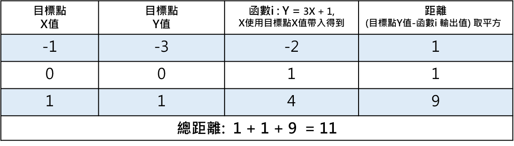
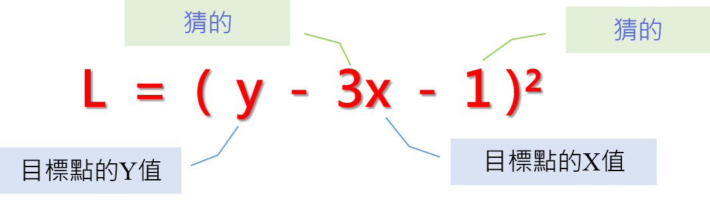
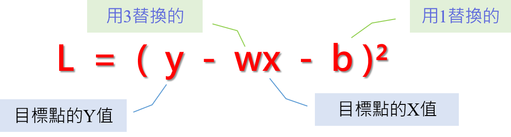
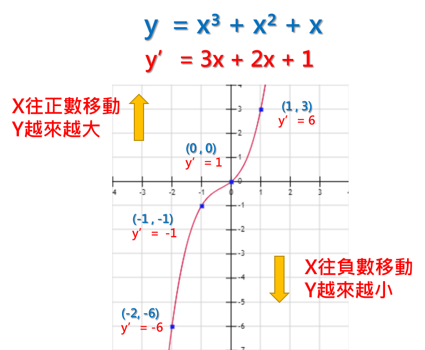
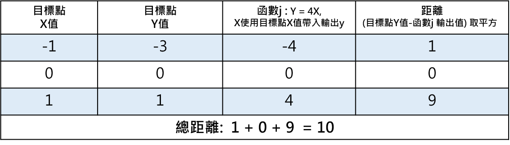

# 簡單解釋梯度下降法 (Gradient Descent)

https://medium.com/@arlen.mg.lu/%E6%B7%B1%E5%BA%A6%E5%AD%B8%E7%BF%92%E8%AC%9B%E4%B8%AD%E6%96%87-gradient-descent-b2a658815c72

首先，以下的圖先對李宏毅大師致敬

李宏毅大師已經有對Gradient Descent有詳盡的解釋:[影片連結](https://www.youtube.com/watch?v=fegAeph9UaA&index=3&list=PLJV_el3uVTsPy9oCRY30oBPNLCo89yu49)

如果上述的圖跟李宏毅大師的連結已經有深度理解的人，那就可以不用繼續往下看了，這篇的目的是理解為什麼微分出來的梯度可以幫助找到更小的損失函數，並透過實例的方式來幫助理解 (其實就是給脫離微積分很久的同學看，花哈哈哈)。

> **正篇開始**

**Gradient Descent** 是深度學習為了找尋接近目標點的一種方法，它是透過一步步慢慢靠近目標的方式，最終找到一個極近似目標的函數。

首先，我們先假設有以下三個點，這三個點是本篇的目標範例，我們想請深度學習程式來找一個函數接近以下三個點。但一開始，程式不是學過數學的人類，並不知道有什麼演算法可以找到一個接近這三個點的函數。

三個目標點

於是，程式會先隨機產一條函數，假設是y = 3x + 1好了，取名為**函數i(**實際上在深度學習中有很多初始化函數的方式**)。**

函數i: y = 3x + 1

好，接下來，我們要怎麼知道**函數i**有沒有接近**三個目標點**呢?

很簡單，把**三個目標點**的**X值**輸入到**函數i**就會產生**函數i**的**Y值**，對吧?

我們試著輸入X值到**函數i**後，就會像是如下藍色的點。

看起來**函數i**沒有一個點跟目標點一樣，所以**函數i**似乎不盡理想，要找一個下一個函數才行。可是，**函數i**是隨機產生的，要繼續瞎子摸象的來產生函數嗎? 我們應該有更聰明的辦法~!

函數i的結果應該能幫助我們猜測下一個函數吧?

我們先來看看**函數i**的產出跟三個目標點到底差多遠?

**函數i** 對每個目標點的距離，差值後取平方是為了保證成為正數

所以**函數i**跟目標點一共差了**11**的距離，嗯… 那麼也就是說…

我們只要試著一步一步把11的距離縮短了就好吧?

根據這個想法，我們來看看**總距離**跟**某目標點距離**怎麼算的。

**總距離 = (每個目標點的Y值 - 函數i對應每個目標點X值的輸出值)²**

**某目標點距離** = **(某目標點的Y值 - 函數i對應某目標點X值的輸出值)²**

**總距離以及某目標點距離**的計算方法是我們假設的一個公式，是為了我們方便理解什麼叫做**距離**的公式，然而，這個假設的公式也是一個函數，這其實就是所謂的**損失函數L。**距離目標點越近(數值越小)，就表示該函數越靠近**三個目標點**，也就是**損失**越少，如果有一個函數可以完全符合三個目標點，那這樣**損失函數得到的結果就應該是 0**。

根據上述，我們將**函數i**的帶入**損失函數L**

**損失函數L= (y - (3x + 1))² = (y - 3x -1)²**

那損失函數L的組成是什麼呢?

損失函數L的組成

我們可以觀察到，損失函數L的組成，是來自兩個部分。

1. 猜的
2. 目標點的資料

**猜的**部分是想更改的目標，我們就是期望改了它，可以讓損失函數更靠近0，盡可能的損失越少越好。為了能將變數進行替換，我們將**猜的**部分換成代數，將**3**替換成**w**，**1**替換成**b**，所以就變成如下 :

損失函數L將3替換成w，1替換成b

L = (y - wx - b)² ， 這就是我們要處理的損失函數。w跟b會一直變，所以損失函數L也會一直變，但是，**目標點是不變的**。我們可以試著只帶入一個點，只讓一個點的損失變少，看看這樣會有什麼效果?

我們用目標點 (x = -1 , y = -3)帶入損失函數L

得到損失函數L(x = -3, y = -1) = (-3 +w - b)²

換句話說，只要讓 w - b 接近3得到 -3 + 3 = 0，

那這不就是我們對x = -3, y = -1的目標嗎。

**結論A: 損失函數L可以幫助我們找到接近目標的新函數。**

不過就算這麼說 ，w 跟 b有無限種組合，而且 w - b 接近3只是滿足 x = -3, y = -1的這點，也不一定能滿足 x = 0, y = 0或是x = 1, y = 1的組合。

那該怎麼做呢? 函數已經有了，我們該怎麼找到建議值呢?

**偉大的數學告訴我們，要找到數值是怎麼移動的，我們可以做微分!**

微分的意義在於

**微分某變數後產生的函數**，可以**指出原函數**在**每點的變化。**

讓我們來看點例子，以函數 **y = x³ + x² + x** 為範例

範例函數:**y = x³ + x² + x**

接著我們把y = x³ + x² + x **對x作微分，**會得到函數**y’**

**y’ = 3x + 2x + 1**

好，那我們帶入幾個點來看看數值是怎麼移動的

**當x = 1， y=3，y’= 6**

**當x = 0， y=0，y’= 1**

**當x = -1， y=-1，y’= -1**

**當x = -2， y=-6，y’= -6**

也就是說當x為正數時，y會越來越大，x為負數時，y會越來越小。

x = 0的時候，y’= 1，是一個正數，代表接下來的y是會往正數移動，的確x從0增長到1的時候，y也從0增長到3，y是有越來越大的傾向。

x = -1的時候，y’= -1，是一個負數，代表接下來的y是會往負數移動，的確x從-1增長到-2的時候，y也從-1增長到-6，y是有越來越小的傾向。

因此，我們就得到了**數值移動的方向**的判定方法: **將x帶入微分後的函數y’，得到的數值如果是正，表示y是往正數移動，得到的數值如果是負，表示y是往負數移動。**

通常，我們會將帶入x後的y’產生的數值，稱之為**梯度。**

**結論B : 數值移動的方向是可以從梯度判定的。**

回到正題，讓我們回來處理損失函數L(x = -3, y = -1) = (-3 + w - b)²

最終的目的是希望 (-3 +w - b)²越來越小，但是L有兩個變數，w跟b。所以需要分別對w跟b做微分，來得知w跟b怎麼移動才會讓(-3 +w - b)²越來越小。

展開(-3 + w - b)² = 9 - 6w + 6b - 2wb + w² + b²

對w取微分後得到函數L'w = -6 - 2b+ 2w

L’w 可以告訴我們變數w是怎麼移動L函數的

將w = 3, b = 1帶入L’w = -6 - 2b+ 2w= -6 - 2 + 6 = -2，這表示**w在(w = 3, b = 1)時，梯度為-2，在此點，w越往負數方向移動**，**損失函數會越小**。

對b取微分後得到函數L’b : 6 - 2w + 2b

L’b 可以告訴我們變數b是怎麼移動L函數的

將w = 3, b = 1帶入L’b = 6 - 2w + 2b = 6 - 6 + 2 = 2，這表示**b在(w = 3, b = 1)時，梯度為2，在此點，b越往正數方向移動**，**損失函數會越大**。

當知道方向後，我們就知道該如何調整數值。

w在3之後，是越減少越會讓損失函數L減少，但我們不能無窮盡的減下去，剛好就好，所以對w應該要增加，與L’w產生的梯度相反。b在1之後，是越增加越會讓損失函數L變大，所以對b要減少數值，與L’b產生的梯度相反。

**結論C** : **損失函數L移動的方向剛好跟梯度的方向相反。**

**可是，該把w變多大，該把b變多小呢?**

其實這是沒有答案的，因為就是不知道要修正到多少才是對的，我們還是需要一個可調整的參數來搭配，這個數值叫**學習率**，它的意義在於動態調整移動的步伐，我們用小寫*l*來代替，先把*l*設定成0.5。

接著，開始嘗試找下一個函數，這邊取名函數j

因為函數j跟函數i會有關係，所以我們會用函數i的w以及b與其在(w=3, b=1)梯度來做計算，更新的方式如下:

函數j的w = 函數i的w **減去** 學習率 * 函數i的w=3在L(x = -3, y = -1)的梯度

函數j的b = 函數i的b **減去** 學習率 * 函數i的b=1在L(x = -3, y = -1)的梯度

注意: 這邊的**減去**，是來自於**結論C (損失函數L移動的方向剛好跟梯度的方向相反)**

函數j的w = 3 - (0.5) *(-2) = 4

函數j的b= 1 - (0.5) *(2) = 0

所以函數j : y = 4x + 0 = 4x

我們實際把函數j代入每一點看看與目標點的距離

函數j 對每個目標點的距離

可以看到**函數j** 比**函數i** 更靠近三個目標點了，這整個架構就是**Gradient Descent。**實際上，程式會不斷的更動損失函數或者學習率，用各種理論企圖找到一個最接近目標點的函數，還有很多技巧跟實作方式，沒有我寫的那麼的簡單，但為了易於理解整個概念，而有了這篇文章的誕生，感謝收看。

**結論A: 損失函數L可以幫助我們找到接近目標的新函數。**

**結論B : 數值移動的方向是可以從梯度判定的。**

**結論C** : **損失函數L移動的方向剛好跟梯度的方向相反。**
