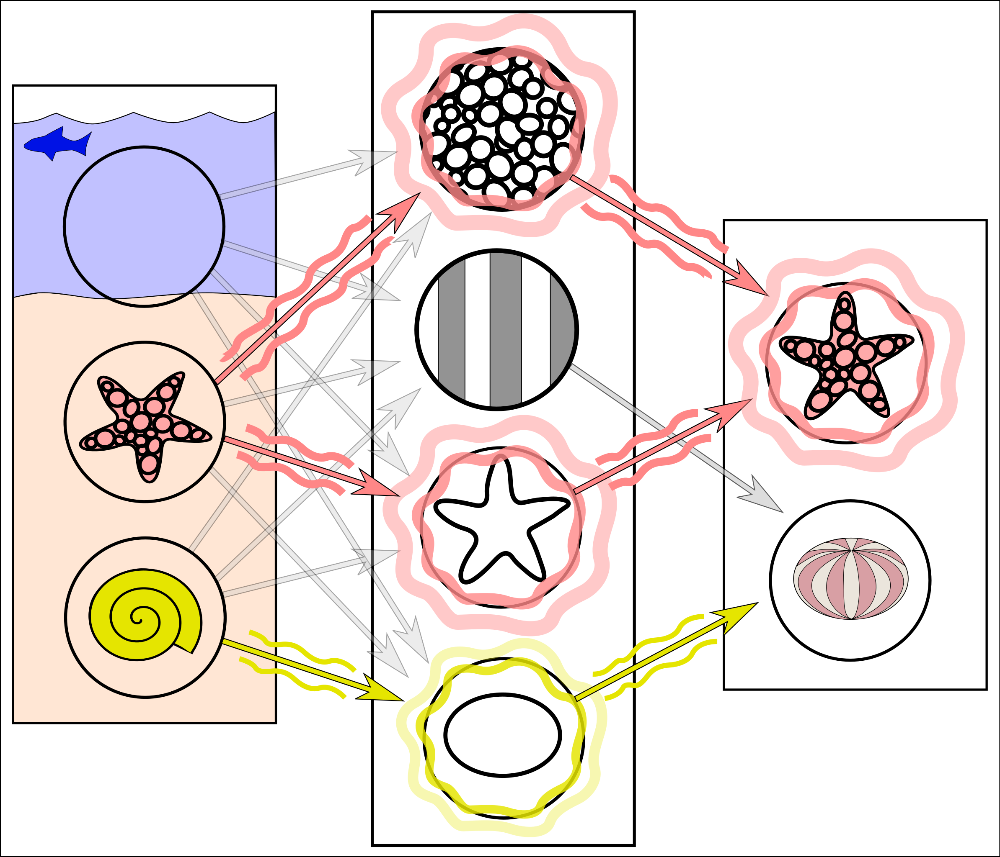
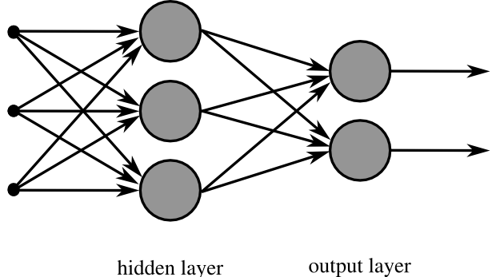

# 類神經網路運作原理

類神經網路（Artificial Neural Network, ANN），又稱人工神經網路，本質上是一種**數學演算法與模型**。它模仿生物神經網路的結構來運作，但與真實的人類大腦並不相同。

它最主要的目的是用來**計算未來事件發生的機率**。作法是根據大量的過去資料，找出隱藏在資料中的規律，進而對新輸入的資料給出預測。常見應用包含圖片分類、語音辨識、文字生成、股價趨勢預測與異常偵測。

## 類神經網路在做什麼

可以先把類神經網路想成一個多層的計算系統：

1. 把輸入資料轉成數字。
2. 讓數字經過一層又一層的加權計算。
3. 逐步抽取特徵。
4. 最後輸出分類結果、機率或預測值。

```
輸入層            隱藏層           輸出層

  x1 ──┐
       ├──→ [神經元] ──┐
  x2 ──┤              ├──→ [神經元] ──→ 預測值
       ├──→ [神經元] ──┘
  x3 ──┘
```



## 基本組成

類神經網路由三個核心元素組成，在示意圖中有直觀的視覺對應：

```
    （圈圈）             （箭頭）             （圈圈）
  訊號強度 A  ───[權重 W]───→  訊號強度 A  ───[權重 W]───→  輸出機率
```

### 1. 訊號強度（A）

在網路圖中以「**圈圈**」表示。所有輸入資料必須先轉換成帶有小數點的**浮點數**，這些數字代表訊號的強度。例如：

- 文字會轉成詞向量或 token ID。
- 圖片會轉成像素矩陣（0.0 ～ 1.0）。
- 聲音會轉成波形或頻譜特徵。
- 財經資料會轉成價格、成交量、技術指標等數字。

### 2. 權重（W）

在網路圖中以「**箭頭**」表示，代表訊號的**放大倍數**。訊號通過箭頭時會乘上對應的權重，例如放大一倍、兩倍，或縮小。

我們常聽到的「**模型參數**」，指的就是這些權重。例如 Llama 3 號稱有 4000 億個參數，代表它的網路裡有 4000 億條箭頭與對應的權重值。

神經元的計算公式：

```text
輸出 = 激活函數(輸入1 × 權重1 + 輸入2 × 權重2 + 偏差)
```

```
  (A1) ──[W1]──┐
                ├──→ Σ(Ai·Wi) + b ──→ f(z) ──→ (輸出 A)
  (A2) ──[W2]──┘

  A = 訊號強度   W = 權重（放大倍數）   b = 偏差   f = 激活函數
```

### 3. 偏差（Bias）

偏差用來調整整體輸出的基準點，讓模型不必永遠從零開始判斷。

### 4. 激活函數

激活函數（Activation Function）負責引入非線性，讓模型可以處理更複雜的模式。常見例子有 ReLU、Sigmoid、Tanh。

```
  ReLU：f(z) = max(0, z)        Sigmoid：f(z) = 1 / (1 + e^-z)

  輸出                           輸出
   │   ╱                          1 │      ╭───────
   │  ╱                            │    ╭─╯
   │ ╱                           0.5│───╯
   │╱                              │  ╭╯
───┼──────── z                     │╭╯
   │ (負值全部變 0)               0 ┼──────────── z
                                    (壓縮到 0~1，常用於輸出層機率)

  Tanh：f(z) = (e^z - e^-z) / (e^z + e^-z)

  輸出
   1 │      ╭───────
     │    ╭─╯
   0 ┼───╯──────── z
     │  ╯
  -1 │╭──────
     (壓縮到 -1~1，中心對稱)
```

## 網路結構怎麼看

一個典型的類神經網路通常包含三種層：

| 層級 | 作用 | 例子 |
| --- | --- | --- |
| 輸入層 | 接收原始資料 | 像素、數值特徵、詞向量 |
| 隱藏層 | 逐層抽取特徵與組合訊息 | 邊緣、形狀、語意、趨勢 |
| 輸出層 | 產生最終結果 | 類別機率、分數、回歸值 |

```
  輸入層        隱藏層 1      隱藏層 2      輸出層
 (3 個節點)    (4 個節點)    (4 個節點)   (2 個節點)

   ( x1 )  ─── ( h11 ) ─── ( h21 )
              ╲ ( h12 ) ─── ( h22 ) ─── ( y1：貓 )
   ( x2 )  ─── ( h13 ) ─── ( h23 )
              ╱ ( h14 ) ─── ( h24 ) ─── ( y2：狗 )
   ( x3 )  ───

  → 每條連線都有對應的權重 w
  → 每個節點都有偏差 b 和激活函數 f
```



## 兩個核心階段

### 訓練階段

訓練的核心目的是**計算出模型中所有未知的權重（W）**。

作法是輸入大量的「舊數據」。因為事情已經發生，這些數據的輸出結果是「已知」的。由於類神經網路沒有可以直接套用的數學公式解，因此必須透過電腦採用**暴力破解法（Try and Error 試誤法）**，反覆猜測權重：先假設一組權重，算錯了就加減一點再重算，直到找出最合理的權重組合。

這也是為什麼訓練 AI 往往需要幾萬顆處理器連續運算數十天的原因。

訓練流程通常如下：

1. 將大量歷史資料輸入模型。
2. 模型先產生預測結果。
3. 用損失函數比較「預測值」與「正確答案」的差距。
4. 透過反向傳播（Backpropagation）計算每個權重要往哪個方向調整。
5. 用最佳化方法（例如 Gradient Descent 或 Adam）更新權重。
6. 重複很多次，直到模型逐漸學到規律。

```
  ┌─────────────────────────────────────────────────────┐
  │                   訓練迴圈（每個 epoch）              │
  │                                                     │
  │  訓練資料                                            │
  │     │                                               │
  │     ▼                                               │
  │  【前向傳播】  輸入 → 隱藏層計算 → 輸出預測值          │
  │     │                                               │
  │     ▼                                               │
  │  【計算損失】  Loss = f(預測值, 正確答案)              │
  │     │                                               │
  │     ▼                                               │
  │  【反向傳播】  計算每個權重的梯度 ∂Loss/∂w            │
  │     │                                               │
  │     ▼                                               │
  │  【更新權重】  w = w - lr × 梯度  (Gradient Descent) │
  │     │                                               │
  │     └──────────────────────────────┐                │
  │                                    ▼                │
  │                             重複直到收斂             │
  └─────────────────────────────────────────────────────┘
```

訓練不是單純的暴力嘗試，而是透過數學方法沿著讓誤差下降的方向調整參數。

**損失曲線**：隨著訓練進行，Loss 應該逐漸下降並趨於平穩：

```
  Loss
   │
  1.0│ ╲
     │  ╲
  0.6│   ╲──
     │      ╲──
  0.3│          ╲────
     │                ╲─────────────
  0.1│                              ─────────
     └──────────────────────────────────────── epoch
        1    10   20   30   50   100
```

### 推論階段

當成千上億個權重（W）都確定下來後，訓練就結束了，模型即可進入推論階段。

此時模型的**權重公式已經固定（已知）**。使用者只需把最新的資料轉換成浮點數輸入進去，模型就能瞬間透過算好的公式，推論並預測出結果（機率）。因為不需要再像訓練時那樣慢慢猜測參數，推論的計算速度會快上許多。

1. 輸入新的資料（轉成浮點數）。
2. 使用已經固定的權重進行前向傳播。
3. 輸出層產生機率，代表各個事件發生的可能性。

```
  最新資料（浮點數）
        │
        ▼
  輸入層  ──→  隱藏層（權重已固定，不再更新）  ──→  輸出層
                                                      │
                                                      ▼
                                               預測機率
                                          例：漲 72%  跌 28%
```

推論通常比訓練快上許多，因為它只需要做一次前向計算，不需要反向傳播或更新參數。

## 一個簡單例子

假設要判斷一封電子郵件是不是垃圾郵件，模型可能會看這些特徵：

- 是否包含大量促銷字詞
- 是否有可疑連結
- 寄件者是否陌生
- 內容格式是否異常

模型會把這些特徵轉成數值，經過隱藏層計算後，在輸出層給出一個結果，例如：

```
  輸入特徵                隱藏層               輸出

  促銷字詞: 1.0 ──┐
  可疑連結: 1.0 ──┼──→ [計算與抽取特徵] ──→  垃圾郵件:   0.92
  陌生寄件: 0.8 ──┤                      ──→  正常郵件:   0.08
  格式異常: 0.6 ──┘
```

```text
是垃圾郵件的機率：0.92
不是垃圾郵件的機率：0.08
```

這代表模型判定它高度可能是垃圾郵件。

## 過擬合與欠擬合

訓練好的模型不一定能在新資料上表現好，常見的兩個問題：

```
  欠擬合（Underfitting）        剛好合適                過擬合（Overfitting）
  模型太簡單，連訓練資料都        訓練與驗證 Loss 都低，     模型記住訓練資料的雜訊，
  學不好                        泛化能力強               在新資料上表現差

  Loss                         Loss                     Loss
   │ ──────────                 │ ╲                      │ ╲
   │                            │  ╲──                   │  ╲──         驗證集 ↗
   │  訓練集 ≈ 驗證集             │      ╲────             │       ─────╱
   │  都很高                     │           ─────        │  訓練集繼續下降
   └─────── epoch               └────────── epoch        └──────────── epoch

  解法：增加模型複雜度            理想狀態                 解法：Dropout、正則化、
       或更多特徵                                              Early Stopping、更多資料
```

| 問題 | 訓練集 Loss | 驗證集 Loss | 解法 |
| --- | --- | --- | --- |
| 欠擬合 | 高 | 高 | 加深/加寬網路、增加特徵 |
| 正常 | 低 | 低 | — |
| 過擬合 | 低 | 高 | Dropout、正則化、Early Stop |

## 為什麼需要很多資料與算力

如果模型很大，參數數量就會很多。參數越多，模型理論上能表達的模式越複雜，但同時也代表：

- 需要更多資料避免學歪
- 需要更長時間訓練
- 需要更多 GPU 或其他運算資源

這也是大型語言模型訓練成本很高的主要原因之一。

## 常見網路類型

類神經網路有很多變體，針對不同資料型態設計：

```
  全連接網路 (MLP / DNN)         卷積神經網路 (CNN)
  ─────────────────────         ────────────────────────
  每個節點連到下一層全部節點       卷積核在圖片上滑動，提取局部特徵

  輸入 ─ 全連接 ─ 全連接 ─ 輸出   圖片輸入
                               ┌──────┐
                               │ 卷積  │─→ 特徵圖 ─→ 池化 ─→ 全連接 ─→ 分類
                               └──────┘
  適合：表格資料、特徵工程後的資料   適合：圖片、空間資料

  ─────────────────────────────────────────────────────────

  遞歸神經網路 (RNN/LSTM)        Transformer
  ─────────────────────         ────────────────────────
  有「記憶」，處理序列資料         用注意力機制處理長距離依賴

  x1 → [RNN] → h1              Token1 ─┐
  x2 → [RNN] → h2              Token2 ─┤─→ 自注意力 ─→ 輸出
  x3 → [RNN] → h3              Token3 ─┘
   ↑     ↑
   前一步的隱藏狀態會傳到下一步    適合：語言、長文本、NLP 任務

  適合：時間序列、語音、文字序列
```

| 類型 | 強項 | 典型應用 |
| --- | --- | --- |
| MLP | 表格資料 | 分類、回歸、推薦 |
| CNN | 空間特徵 | 圖片分類、物件偵測 |
| RNN / LSTM | 序列資料 | 語音辨識、時間序列預測 |
| Transformer | 長距離依賴 | GPT、BERT、翻譯、摘要 |

## 常見誤解

### 類神經網路不是在模擬真正的大腦

它只是借用了「神經元連接」這個概念，並不等同於人類神經系統。

### 類神經網路不一定只輸出機率

有些任務輸出的是機率分布，有些任務輸出的是數值、向量、文字或圖片。

### 模型不是理解世界，而是學到資料中的統計規律

它表現得像「懂了」，但底層仍然是參數化的數學映射。

## 訓練 vs 推論：一眼看清差異

```
  ┌──────────────┬──────────────────────────────┬──────────────────────────────┐
  │              │        訓練（Training）        │        推論（Inference）      │
  ├──────────────┼──────────────────────────────┼──────────────────────────────┤
  │ 輸入         │ 大量歷史資料（答案已知）        │ 最新資料（答案未知）           │
  │ 權重 W       │ 未知 → 透過試誤法求解          │ 已知（固定不動）               │
  │ 計算方向     │ 前向 + 反向傳播                │ 只有前向傳播                   │
  │ 計算量       │ 龐大（需數萬 GPU × 數十天）    │ 輕量（毫秒級回應）             │
  │ 目的         │ 找出最佳權重組合               │ 用固定公式預測機率             │
  └──────────────┴──────────────────────────────┴──────────────────────────────┘
```

## 一句話總結

類神經網路是一種把輸入資料轉成浮點數，透過多層加權計算（圈圈與箭頭）學習規律，最終輸出**事件發生機率**的數學模型。訓練負責找出所有未知的權重，推論則用固定的權重快速預測。

## 圖片來源

- `images/simplified-neural-network-example.png`：Wikimedia Commons
- `images/multilayer-neural-network.png`：Wikimedia Commons
