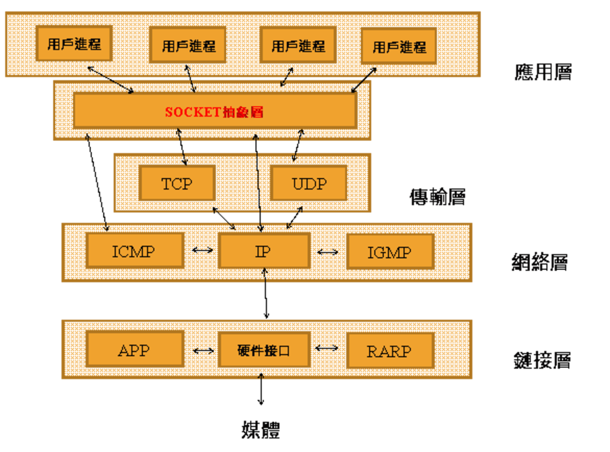

 語言中的 Socket 是在寫網路程式必會碰到的東西，而它牽涉較多參數與函式，不如 python 簡潔，本篇用於紀錄關於網路程式中 socket 相關的細節

------

## 0x01 Berkeley Socket

- Berkeley Socket 又稱 BSD Socket，是介於 Transport Layer 與 Application Layer 間的 API，用於行程間通訊 (UNIX Socket) 和網路通訊 (Network Socket)



- Connection-oriented socket (TCP)

)

- Connectionless socket (UDP)

)

------

## 0x02 通訊端 API 函式

- `**socket()**` 根據指定的 socket type 建立一個新的 socket，為 socket 分配系統資源，並回傳一個 file descriptor
- `**bind()**` 一般用於 server 端，用來將一個 socket file descriptor 和一個 sockaddr structure 相關聯，sockaddr 結構中會指出這個 socket (sockfd) 所要監聽的 address, port number 等資訊
- `**listen()**` 用於 server 端，使一個 socket (sockfd) 進入監聽狀態
- `**connect()**` 用於 client 端，他會透過 sockfd 和 sockaddr structure 向指定的 server 進行直接通訊，如果是連線導向的協定，如 TCP，則 connect function 會先建立起連線
- `**accept()**` 用於 server 端，接受一個從 remote client 來的 TCP 連線請求，和 remote client 建立 TCP 連線並將建立的 socket 關連到 sockfd 與 sockaddr
- `**send()**`、`**recv()**`、`**write()**`、`**read()**`、`**recvfrom()**`、`**sendto()**` 用於傳送與接收資料
- `**close()**` 呼叫系統關閉分配的 sockfd，如果是 TCP 則連線會中斷
- `**gethostbyname()**`、`**gethostbyaddr()**` 用來解析 hostname 和 address，IPv4 only

**socket()**

```c
#include <sys/types.h>
#include <sys/socket.h>
 
int socket(int domain, int type, int protocol);
/* return a file descriptor for the new socket on success, or -1 if error */
```

建立一個 communication endpoint，並回傳一個 file descriptor

- ***domain*** 為通訊端的協定集
  - **AF_INET** 表示 IPv4 網路協定
  - **AF_INET6** 表示 IPv6 網路協定
  - **AF_UNIX** 表示本地端通訊協定
- ***type***
  - **SOCK_STREAM** 提供雙向, 可靠的, 連線導向的串流連線 (TCP)
  - **SOCK_DGRAM** 提供非連線導向的 datagrams 類型 (UDP)
  - **SOCK_SEQPACKET** 提供雙向, 可靠的, 連線導向的 packet 類型
  - **SOCK_RAW** 在 Network Layer 上的原始網路協議
- ***protocol*** 指定實際使用的傳輸協定，在 <netinet/in.h> 有詳細說明。 最常見的就是
  - **IPPROTO_TCP**
  - **IPPROTO_SCTP**
  - **IPPROTO_UDP**
  - **IPPROTO_DCCP**
  - 可以使用 0，即根據選定的domain和type選擇使用預設協定

**bind()**

```c
#include <sys/socket.h>
 
int bind(int sockfd, const struct sockaddr *address, socklen_t address_len);
/* return 0 for successful; otherwise, -1 if error */
include <netinet/in.h>  
 
struct sockaddr {  
    unsigned short    sa_family;       // 2 bytes address family, AF_xxx  
    char              sa_data[14];     // 14 bytes of protocol address  
};  
 
// IPv4 AF_INET sockets:  
 
struct sockaddr_in {  
    short            sin_family;       // 2 bytes e.g. AF_INET, AF_INET6  
    unsigned short   sin_port;         // 2 bytes e.g. htons(3490)  
    struct in_addr   sin_addr;         // 4 bytes see struct in_addr, below  
    char             sin_zero[8];      // 8 bytes zero this if you want to  
};  
 
struct in_addr {  
    unsigned long s_addr;              // 4 bytes load with inet_pton()  
};  
```

用於 server 端，用來將一個 socket file descriptor 和一個 sockaddr structure 相關聯，sockaddr 結構中會指出這個 socket (sockfd) 所要監聽的 address, port number 等資訊

- ***sockfd*** 為上面 socket() 回傳的 file descriptor
- ***address*** 是一個 sockaddr 結構，包含了這個 socket 所要使用的一些資訊
  - sockaddr 和 sockaddr_in 結構類似，sockaddr_in 將 sockaddr 中的 char sa_data[14]; ，長度 14 bytes 轉為三個變數，一般寫成是我們使用 sockaddr_in 對其中的變數賦值，再將其轉型為 sockaddr
  - s_addr 是用 unsigned long int 所表示的 host address number
    - INADDR_LOOPBACK: 指本機的 address，也就是 127.0.0.1 (localhost)
    - INADDR_ANY: 指任何連上來的 address。如果要接受所有來自 internet 的 connection 可使用
    - INADDR_BROADCAST: 傳送 broadcast 訊息可使用
    - INADDR_NONE: 某些 function 錯誤時的回傳值
- ***address_len*** 用來指出 sockaddr 結構長度

**listen()**

```c
#include <sys/socket.h>
 
int listen(int sockfd, int backlog);
/* return 0 if success, otherwise, -1 for error */
```

- ***sockfd*** 依然是上面的 socket file descriptor
- ***backlog*** 指定監聽佇列大小，當有連線請求到來會進入此監聽佇列，連線請求被 accept() 後會離開監聽佇列，當佇列滿時，新的連線請求會返回錯誤

**accept()**

```c
#include <sys/socket.h>
 
int accept(int sockfd, struct sockaddr *restrict address, socklen_t *restrict address_len);
/* return the non-negative file descriptor of the accepted socket if success, Otherwise, -1 if error */
```

接受一個監聽佇列中的連線，回傳指向 client 的 file descriptor

- ***sockfd*** 依然是上面的 socket file descriptor
- ***address*** 與上面 sockaddr 不同一個，自己宣告另一個指向 sockaddr structure 的變數用來記錄 client 的 socket 相關資訊，如不需要可以給 NULL
- ***address_len*** 用來指出 sockaddr 結構長度，如果前面第二參數給 NULL ，則這邊也給 NULL

**connect()**

```c
#include <sys/socket.h>
 
int connect(int sockfd, const struct sockaddr *address, socklen_t address_len);
/* return 0 if success, otherwise, -1 for error */
```

用於 client 端，他會透過 sockfd 和 sockaddr structure 向指定的 server 連線

- ***sockfd*** client 一樣要呼叫 socket() 從回傳值取得
- ***address*** 是一個 sockaddr 結構，包含了這個 socket 所要使用的一些資訊
- ***address_len*** 用來指出 sockaddr 結構長度

------

## 0x03 Example code

```c
/* Server code in C */
 
#include <sys/types.h>
#include <sys/socket.h>
#include <netinet/in.h>
#include <arpa/inet.h>
#include <stdio.h>
#include <stdlib.h>
#include <string.h>
#include <unistd.h>
 
int main(void)
{
    struct sockaddr_in stSockAddr;
    int SocketFD = socket(PF_INET, SOCK_STREAM, IPPROTO_TCP);
 
    if(-1 == SocketFD)
    {
        perror("can not create socket");
        exit(EXIT_FAILURE);
    }
 
    memset(&stSockAddr, 0, sizeof(struct sockaddr_in));
 
    stSockAddr.sin_family = AF_INET;
    stSockAddr.sin_port = htons(1100);
    stSockAddr.sin_addr.s_addr = INADDR_ANY;
 
    if(-1 == bind(SocketFD,(const struct sockaddr *)&stSockAddr, sizeof(struct sockaddr_in)))
    {
        perror("error bind failed");
        close(SocketFD);
        exit(EXIT_FAILURE);
    }
 
    if(-1 == listen(SocketFD, 10))
    {
        perror("error listen failed");
        close(SocketFD);
        exit(EXIT_FAILURE);
    }
 
    for(;;)
    {
        int ConnectFD = accept(SocketFD, NULL, NULL);
 
        if(0 > ConnectFD)
        {
            perror("error accept failed");
            close(SocketFD);
            exit(EXIT_FAILURE);
        }
 
        /* perform read write operations ... */
        shutdown(ConnectFD, SHUT_RDWR);
        close(ConnectFD);
    }
 
    close(SocketFD);
    return 0;
}
/* Client code in C */
 
#include <sys/types.h>
#include <sys/socket.h>
#include <netinet/in.h>
#include <arpa/inet.h>
#include <stdio.h>
#include <stdlib.h>
#include <string.h>
#include <unistd.h>
 
int main(void)
{
    struct sockaddr_in stSockAddr;
    int Res;
    int SocketFD = socket(PF_INET, SOCK_STREAM, IPPROTO_TCP);
 
    if (-1 == SocketFD)
    {
        perror("cannot create socket");
        exit(EXIT_FAILURE);
    }
 
    memset(&stSockAddr, 0, sizeof(struct sockaddr_in));
 
    stSockAddr.sin_family = AF_INET;
    stSockAddr.sin_port = htons(1100);
    Res = inet_pton(AF_INET, "192.168.1.3", &stSockAddr.sin_addr);
 
    if (0 > Res)
    {
        perror("error: first parameter is not a valid address family");
        close(SocketFD);
        exit(EXIT_FAILURE);
    }
    else if (0 == Res)
    {
        perror("char string (second parameter does not contain valid ipaddress");
        close(SocketFD);
        exit(EXIT_FAILURE);
    }
 
    if (-1 == connect(SocketFD, (const struct sockaddr *)&stSockAddr, sizeof(struct sockaddr_in)))
    {
        perror("connect failed");
        close(SocketFD);
        exit(EXIT_FAILURE);
    }
 
    /* perform read write operations ... */
 
    shutdown(SocketFD, SHUT_RDWR);
 
    close(SocketFD);
    return 0;
}
```