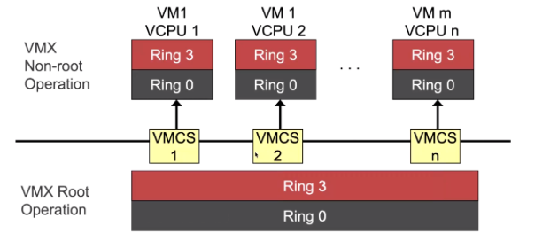

# 系統虛擬化 1

**id: 519021910861** 
**name: xuhuidong**

> 1. 假設在 Virtualizable 硬件上使用 Trap-and-Emulate 方法實現 CPU 虛擬化。1）請描述 VM 內的用戶態線程執行 System Call 被 VM 內核處理並返回的全過程。2）進程內執行 Fork Bomb 是否會大量增加 VMM 的線程並大量消耗 VMM 的資源。

1) 首先系統會捕獲當前調用系統 ISA 併產生 Trap 進入到 VMM，然後在 VMM 裡會有具體的指令用軟件模擬的方式實現系統 ISA 虛擬化的效果，效果包括控制虛擬 CPU（開關中斷）、內存（改 TTBR）、設備（訪問硬件設備寄存器、讓硬件格式化等）的行為，最後就回到虛擬機裡繼續執行。
2) 不會。因為在虛擬機啟動時，會對虛擬機監控器聲明需要 n 個 v-CPU，虛擬機監控器也就對應創建 n 個 v-CPU 並把時間片交給虛擬機。這之後，虛擬機會自己維護調度隊列去運行線程，Fork Bomb 確實會大量增加虛擬機的線程，但是分給虛擬機的 v-CPU 和時間片都是固定的，所以需要虛擬機自己去調度這些線程運行。從 VMM 的角度上來看，始終都只有最多 n 個 v-CPU 線程的時間片被消耗了，所以 Fork Bomb 並不會大量消耗 VMM 的資源。

> 假設有一臺支持 Intel VT-x 和 8 個物理 CPU 的服務器，在其上運行 1 個 VMM 和 10 個 VM，每個虛擬機又 4 個 vCPU。若該 VMM 使用了 VT-x 硬件虛擬化，需要創建多少線程為這些 VM 服務（只考慮 CPU 虛擬化）？總共需要創建多少個 VMCS？請解釋原因。

需要創建 40 個線程為這些 VM 服務，總共需要創建 40 個 VMCS。因為每個 VMCS 都只保存一個 v-CPU 的狀態，所以每個 v-CPU 都需要對應一個 VMCS。如圖所示，共有 $m$ 個虛擬機和 $n$ 個 v-CPU，則會有 $n$ 個 VMCS。我們的 Hypervisor 在保存和恢復時都要通過控制 VMCS。

> ARM v8.0 的硬件虛擬化機制為 Type-1 VMM 所設計，當直接在 EL2 內運行 Type-2 VMM（如 KVM）時會存在一些問題。請具體解釋會造成哪些問題？為此，KVM/ARM 提出了什麼樣的解決方案？該方案是否存在 VM Exit 處理路徑上的性能問題？

在硬件虛擬化還未提出時，只有 EL0 和 EL1 兩個特權級。有了硬件虛擬化之後，多出 EL2 專用於運行虛擬機監控器，此時系統的最高特權級是 EL2。在 x86 中，任何一刻都只能有 1 個 CR3，但是在 ARM 中不一樣。例如 `ttrb0_el1` 就是專門給 `el1` 使用，因此所有寄存器後面都帶上 `_el2` 的後綴，導致 Hypervisor 對 ARM 做硬件虛擬化支持的時候遇到了很多障礙。還有就是，有了 el2 之後頁表格式也發生了變化，和之前 el1 的不一樣。

因為有上述問題存在，當我們要把 Linux 變成 Type-2 的 Hypervisor時，就無法簡單地把 Linux 放在 EL2 運行。為此，KVM/ARM 把 Linux 裡硬件虛擬化分成了 VMM Highvisor（跑在 EL1 上）和 VMM Lowvisor（跑在 EL2 上）兩個部分。Linux 中其他功能仍舊運行在 EL1 上，這樣就可以複用之前的代碼。

對於 Type-2 的 Hypervisor，我們必須要做 split 操作。在虛擬機進入到我們的 Lowvisor 時，將保存和恢復寄存器（EL1）狀態到內存中，然後繼續交給 Highvisor 處理。處理完畢後，我們來到 EL2 中，又需要把 Highvisor 的寄存器存到內存裡，然後恢復虛擬機 EL1 的寄存器和狀態。這個設計原意是為了提高性能，但是 Type-2 無法得到這個好處，所以整個 VM Exit 上確實存在性能問題。

> 假設使用影子頁表機制實現內存虛擬化。現有 10 個虛擬機，每個虛擬機內有 10 個進程，VMM 總共需要創建多少個影子頁表？

影子頁表機制中，每個進程的頁表是相互獨立的，每一個虛擬機的每一個進程都需要一個影子頁表，且每臺虛擬機還需要一個內核態影子頁表，所以一共需要創建 $10 \times (10 + 1) = 110$ 個影子頁表。