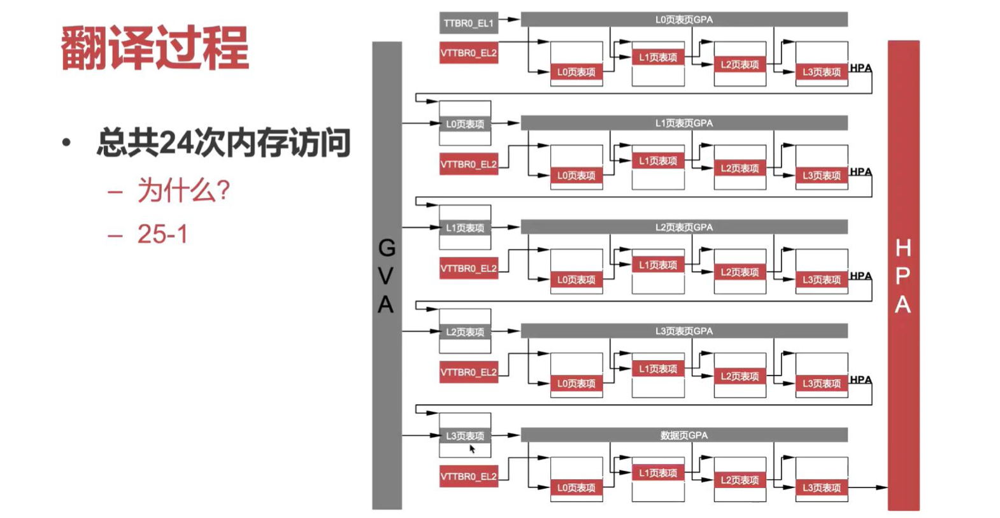

# 系統虛擬化 2

**id: 519021910861** 
**name: xuhuidong**

> 1. 在 x86 和 ARM 平臺引入硬件虛擬化技術之後，指令模擬和半虛擬化的技術是否還有存在的意義？

有。因為修改硬件是個極其麻煩的事情，除了需要向硬件製造廠商證明對現有硬件做修改是利大於弊的，而且還需要對硬件有足夠的研究投入才可以做到。

雖然敏感指令不下陷等問題最終都是需要依靠修改硬件來實現，但是系統軟件開發人員不能坐以待斃，因此在硬件做出相應修改前便創造了指令模擬和半虛擬化技術等方法。

x86 和 ARM 平臺對硬件虛擬化的引入意味著硬件虛擬化已經逐漸被人們接收，但是這不意味著其他平臺能在短期內將硬件虛擬化引入他們的架構，甚至有些 CPU 架構可能本身存在缺陷無法完全兼容這種硬件虛擬化技術，因此我們還是需要同步發展指令模擬和半虛擬化技術。

而且，指令模擬和半虛擬化技術也都有各自不可替代的優點，比如指令模擬解決了敏感函數不下陷的問題且易於實現，而半虛擬化技術則速度更快性能更好。

> 2. 假設有 10 個虛擬機，每個虛擬機有 10 個 vCPU。總共幾個 QEMU 進程？每個進程中有多少個線程（假設 KVM/QEMU 系統，忽略 QEMU 的 iothread）？

10 個 QEMU 進程，一個 QEMU 進程對應一個虛擬機，而 QEMU 會給每個 vCPU 開啟一個 vCPU thread，所以每個 QEMU 進程中都有 10 個線程（忽略 iothread）。

> 3. 在不考慮 TLB 的情況下，若使用硬件虛擬化裡的第二階段地址翻譯機制實現內存虛擬化，將 GVA 翻譯到 HPA 需要經過多少次內存訪問？為什麼？

如 PPT 中所示，需要 24 次內存訪問。首先我們要訪問 GVA，則必須先翻譯成 GPA，所以 MMU 從 ttbr0_el1 得到第一階段 L0 頁表的 GPA，但 GPA 不能直接訪存，需要先翻譯成 HPA，所以我們根據第一階段 L0 頁表的 GPA 一次經過第二階段頁表的 4 次方寸，最終獲取到 ttbr0_el1 存儲的 HPA，然後我們繼續根據 L0 頁表獲得第一階段 L1 頁表的 GPA 基地址，以此類推，從圖中可以看出需要有 20 次第二階段頁表的逐級訪存，而每次拿到第一階段 PTE 和 HPA 後需要訪存才能獲得第一階段的下一級頁表共要 4 次，所以整個翻譯總共是 $20 + 4 = 24$ 次內存訪問。

> 4. （1）在半虛擬化 I/O 中，Virtio Virtqueue 技術相對於模擬 I/O 方法的優勢體現在哪裡？

1. Virtio 實現了儘可能多的設計共享，因此在開發的時候可以複用很多軟硬件資源，開發效率較高，不再需要理解物理設備接口。
2. Virtio 有更高的 I/O 性能，因為實現粒度粗，可以將模擬 IO 方法中的多個 MMIO/PIO 指令的多次數據路徑整合成一個 Hypercall。

> 4. （2）使用 SRIOV 設備直通方法具有最佳的 I/O 性能，請問為什麼目前雲中依然大量使用了半虛擬化 I/O 技術？

1. 由於設備直通需要 IOMMU 和 SRIOV 的支持，且不能完全實現 interpostion 和虛擬化的熱遷移，而在雲端中虛擬機熱遷移又是很重要的。
2. 半虛擬化技術逐漸成熟，已經可以最大程度上避免 trap 的 overhead，所以性能上不會相差太大。

> 4. （3）IOMMU 被廣泛用於連接 I/O 設備和主內存，解釋為什麼 IOMMU 對於設備直通的 I/O 虛擬化技術至關重要嗎？如果將物理設備直接分配給一個虛擬機，該設備的 IOMMU 應該翻譯什麼地址（從什麼地址到什麼地址）？
	
IOMMU 是為了解決 DMA 惡意讀寫內存而在 DMA 的數據通路上外加的一個頁表，其作用就是嘗試將虛擬機內部地址翻譯成 HPA，如果允許的話我們就可以翻譯成對應的訪問內存，如果不允許我們就報錯。如果沒有 IOMMU 的話，DMA 可以完全繞過 CPU 內存檢查訪問到另外一個 VM 的內存，甚至可以讀寫，造成很嚴重的後果。

如果將物理設備直接分配給一個虛擬機，該設備的 IOMMU 應該將虛擬機物理地址空間中的 GPA 翻譯成 HPA。

