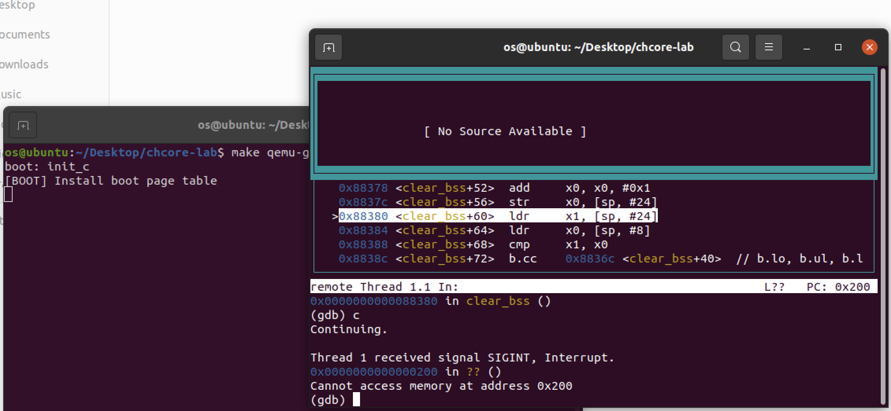
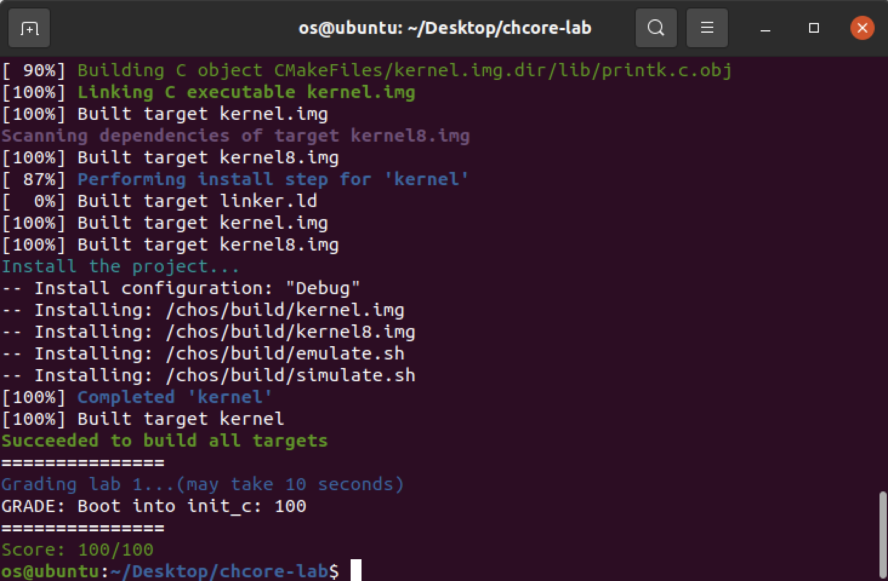

# OS-lab1: 機器啟動

**id: 519021910861** 
**name: xuhuidong**

## 目錄

- [目錄](#目錄)
- [問答題](#問答題)
- [參考](#參考)

## 問答題

> 思考題 1：閱讀 _start 函數的開頭，嘗試說明 ChCore 是如何讓其中⼀個核⾸先進⼊初始化流程，並讓其他核暫停執⾏的。

Chcore 在 `_start` 函數開頭有如下代碼，

```
1. mrs x8, mpidr_el1
2. and x8, x8, #0xFF
3. cbz x8, primary
4. b	.
```

在 `1` 代碼中將 `mpidr_el1` 寄存器的值移入 `x8` 寄存器中，在 `2` 代碼中將 `x8` 寄存器中的低 8 位取出，而 `3` 代碼中則對低 8 位 進行是否為 0 的檢測，如果是 0 才進入 `primary` 函數中進行初始化，否則執行 `4` 代碼不斷跳轉到當前地址，即被掛起。

而 `mpidr_el1` 低 8 位對應的是 Affinity level 0，僅有一個核的這個字段為 0，所以檢測後可以讓其中一個核進入 `primary` 部分進行初始化，而其他核則循環執行 `4` 而被掛起。

> 練習題 2：在 arm64_elX_to_el1 函數的 LAB 1 TODO 1 處填寫⼀⾏彙編代碼，獲取 CPU 當前異常級別。

填寫代碼為

```
mrs x9, CurrentEL
```

即通過 `CurrentEL` 獲取當前異常級別並移至 `x9` 寄存器中，方便後續比較。

> 練習題 3：在 arm64_elX_to_el1 函數的 LAB 1 TODO 2 處填寫⼤約 4 ⾏彙編代碼，設置從 EL3 跳轉到EL1 所需的 elr_el3 和 spsr_el3 寄存器值。具體地，我們需要在跳轉到 EL1 時暫時屏蔽所有中斷、並使⽤內核棧（ sp_el1 寄存器指定的棧指針）。

填寫代碼為

```
adr x9, .Ltarget
msr elr_el3, x9
mov x9, SPSR_ELX_DAIF | SPSR_ELX_EL1H
msr spsr_el3, x9
```

`elr_el3` 寄存器用於控制異常返回後執行的指令地址，在這裡需要設置為 `.Ltarget`。而`spsr_el3` 寄存器用於控制返回後應恢復的程序狀態，其中 `SPSR_ELX_DAIF` 用來設置屏蔽中斷，而 `SPSR_ELX_EL1H` 用來設置內核棧。

> 思考題 4：結合此前 ICS 課的知識，並參考 kernel.img 的反彙編（通過 aarch64-linux-gnu-objdump -S 可獲得），說明為什麼要在進⼊ C 函數之前設置啟動棧。如果不設置，會發⽣什麼？

1. 保護現場/上下文，如將寄存器壓棧等。如果不設置棧，則可能會導致上下文信息缺失。
2. 傳遞參數，如果參數較少可以只用寄存器傳參，而參數過多時（如超過 4 個）則需要用到棧來傳參。如果不設置，則可能調用參數很多的 C 函數時無法將所有參數有效傳遞。
3. 保存臨時變量，包括函數的非靜態局部變量以及編譯器自動生成的其他臨時變量。如果不設置，則可能導致臨時變量在內層函數中被調用甚至修改。

> 思考題 5：在實驗 1 中，其實不調⽤ clear_bss 也不影響內核的執⾏，請思考不清理 .bss 段在之後的何種情況下會導致內核⽆法⼯作。

全局變量與靜態變量沒有初始化或者初始化值為 0 時，就會被放在 `.bss` 段。而由於存儲在 `.bss` 段內的數據在下一次啟動代碼時不會被自動的重新初始化為 0，這就可能導致上一次運行代碼過程中有可能修改了全局變量或靜態變量的值，而修改過的值會被 `.bss` 段保存下來，那麼在下一次啟動代碼時我們定義的全局變量的值可能就不是我們第一次定義的 `0` 值了，因此可能引發如地址越界等 `bug` 而導致內核無法正常工作。

> 練習題 6：在 kernel/arch/aarch64/boot/raspi3/peripherals/uart.c 中 LAB 1 TODO 3 處實現通過 UART 輸出字符串的邏輯。

填寫代碼為：

```
early_uart_init();
for (int i = 0; str[i] != '\0'; i++)
	early_uart_send((char) str[i]);
```

即先初始化然後不斷 `for` 循環輸出字符串中的字符。

> 練習題 7：在 kernel/arch/aarch64/boot/raspi3/init/tools.S 中 LAB 1 TODO 4 處填寫⼀⾏彙編代碼，以啟⽤ MMU。

填寫代碼為：

```
orr x8, x8, #SCTLR_EL1_M
```

即設置最低位（M 字段）來啟動 `MMU`。可以看出其在 `0x200` 處無限循環。



最終得分為：



## 參考

https://www.zhihu.com/column/c_1215698269139152896

https://www.cnblogs.com/kangyupl/p/chcore_lab1.html

https://blog.csdn.net/dcx1205/article/details/47184489