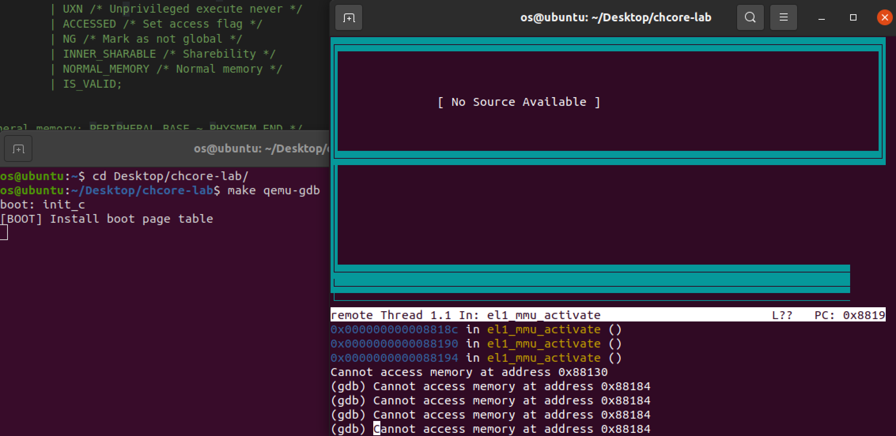
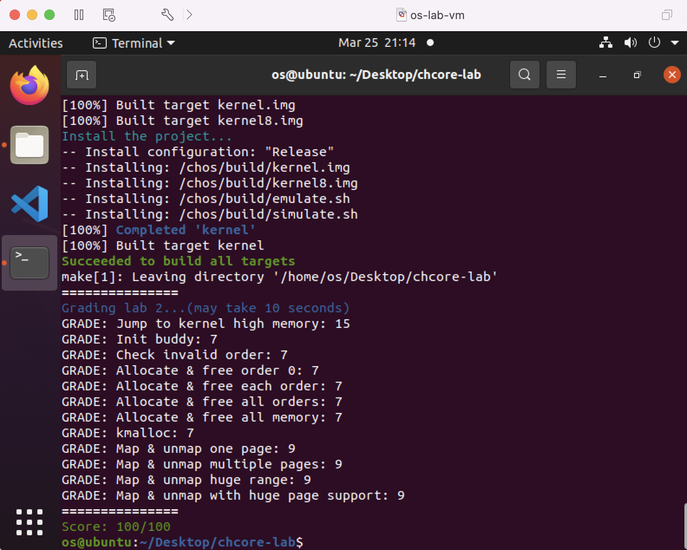

# OS-lab2: 內存管理

**id: 519021910861** 
**name: xuhuidong**

## 目錄

- [目錄](#目錄)
- [問答題](#問答題)

## 問答題

> 思考題 1：請思考多級⻚表相⽐單級⻚錶帶來的優勢和劣勢（如果有的話），並計算在 AArch64⻚表中分別以 4KB 粒度和 2MB 粒度映射 0～4GB 地址範圍所需的物理內存⼤⼩（或⻚表⻚數量）。

多級頁表允許在整個頁表結構中出現空洞，極大減少了頁表佔用的空間大小，但也導致設計較為複雜、內存利用效率降低（有內部碎片）等缺點。

以 $4 \text{KB}$ 粒度映射時，低 12 位表示頁內偏移量，每一級頁表的索引佔用 9 位，所以一個頁表項包含 $2^9$ 個頁表項。

總共需要 $4 \text{GB} / 4 \text{KB} = 2^{20}$ 個頁條目，因此需要 $2^{20} / 2^9 = 2^{11}$ 個 L3 頁表，需要 $2^{11} / 2^9 = 2^2$ 個 L2 頁表，需要 1 個 L1頁表和 1 個 L0頁表，因此共需要 $2^{11} + 2^2 + 1 + 1 = 2054$ 個頁表頁，每一個頁表頁佔用 $4 \text{KB}$，所以需要佔用 $2054  \times 4 \text{KB} = 8 \text{MB}$ 物理內存大小。

以 $2 \text{MB}$ 粒度映射時，2 MB 粒度映射時，低 21 位表示頁內偏移量，最多有兩級頁表（不然 64 位存不下）。每一級頁表的索引佔用 18 位，所以一個頁表項包含 $2^{18}$ 個頁表項。

- 如果僅有一級頁表，則總共需要 $4 \text{GB} / 2\text{MB} = 2^{11}$ 個頁條目，因此僅需要 1 個 L1 頁表，每一個頁表頁佔用 $2 \text{MB}$，所以需要佔用 $1 \times 2 \text{MB} = 2 \text{MB}$ 物理內存大小。
- 如果有兩級頁表，則總共需要 $4 \text{GB} / 2\text{MB} = 2^{11}$ 個頁條目，因此僅需要 1 個 L2 頁表，1 個 L1 頁表，總共需要 $1 + 1 = 2$ 個頁表頁，每一個頁表頁佔用 $2 \text{MB}$，所以需要佔用 $2 \times 2 \text{MB} = 4 \text{MB}$ 物理內存大小。

> 思考題 3：請思考在 `init_boot_pt` 函數中為什麼還要為低地址配置⻚表，並嘗試驗證⾃⼰的解釋。

Chcore 在最初時運行在低地址，如果沒有配置低地址頁表則可能導致啟用 MMU 後原有函數的返回地址（即低地址）無法正確映射，因此在 `init_boot_pt` 中還需要為低地址配置頁表。

我們將為低地址配置頁表的代碼片段註釋，利用 `gdb` 運行程序觀察得到，MMU 無法翻譯低地址。

> 思考題 7：閱讀 Arm Architecture Reference Manual，思考要在操作系統中⽀持寫時拷⻉（Copy-on-Write，CoW）需要配置⻚表描述符的哪個/哪些字段，並在發⽣缺⻚異常（實際上是 permission fault）時如何處理。

主要需要配置 **頁表是否可寫的權限位** 字段。即寫時拷貝允許應用程序 A 和 B 以 **只讀** 的方式共享同一段物理內存，一旦某個應用程序對該內存區域進行修改就會觸發缺頁異常。之後  CPU 會將控制流傳遞給操作系統預先設置的缺頁異常處理函數，在該函數中，操作系統發現當前的缺頁異常是由於應用程序寫了只讀內存，而且相應的內存區域又是被操作系統標記成寫時拷貝的。於是，操作系統會在物理內存中將缺頁異常對應的物理頁重新拷貝一份，並且將新拷貝的物理頁以 **可讀可寫** 的方式重新映射給觸發異常的應用程序，此後再恢復應用程序的執行。

> 思考題 8：為了簡單起見，在 Chcore 實驗中沒有為內核頁表使用細粒度的映射，而是直接沿用了啟動時的粗粒度頁表，請思考這樣做有什麼問題。

因為內核可能會分配一些大小較小但有不同權限的內存片段，粗粒度頁表不容易對權限做細粒度管理。且粗粒度頁表可能會造成物理內存資源浪費，產生較多的碎片。

> coding 實驗結果。

