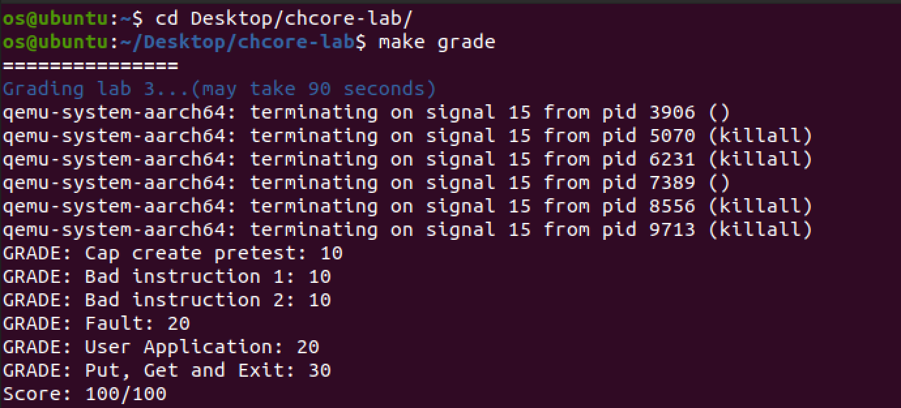

# OS-lab3: 進程與線程創建、異常處理

**id: 519021910861** 
**name: xuhuidong**

> 練習 1：內核從完成必要的初始化到用戶態程序的過程是怎麼樣的？嘗試描述一下調用關係。

以下為從操作系統初始化到調用第一行用戶代碼為止的代碼調用：

```C++
1. start
2. main (kernel/main.c)
	(a) uart_init
  (b) mm_init
  (c) exception_init
  (d) process_create_root
  	i. process_create
  	ii.thread_create_main
  (e) eret_to_thread
  	i. switch_context
```

Chcore 啟動後會依次初始化 `uart` 模塊、內存管理模塊、中斷模塊，然後調用 `process_create_root` 創建一個根進程，當前 lab 中也只有這一個進程。

`process_create_root` 會先從磁盤中載入 ELF 文件，然後創建進程的 `process` 結構體並初始化，包括 `slot_table` 的初始化和分配一塊虛擬地址空間 `vmspace`，最後為進程創建一個主線程。

`eret_to_thread` 則使用 `eret` 指令完成從內核模式到用戶模式的切換，並在用戶模式下開始運行用戶代碼。


> 練習 2 - 練習 8：代碼詳情見 GitLab。

