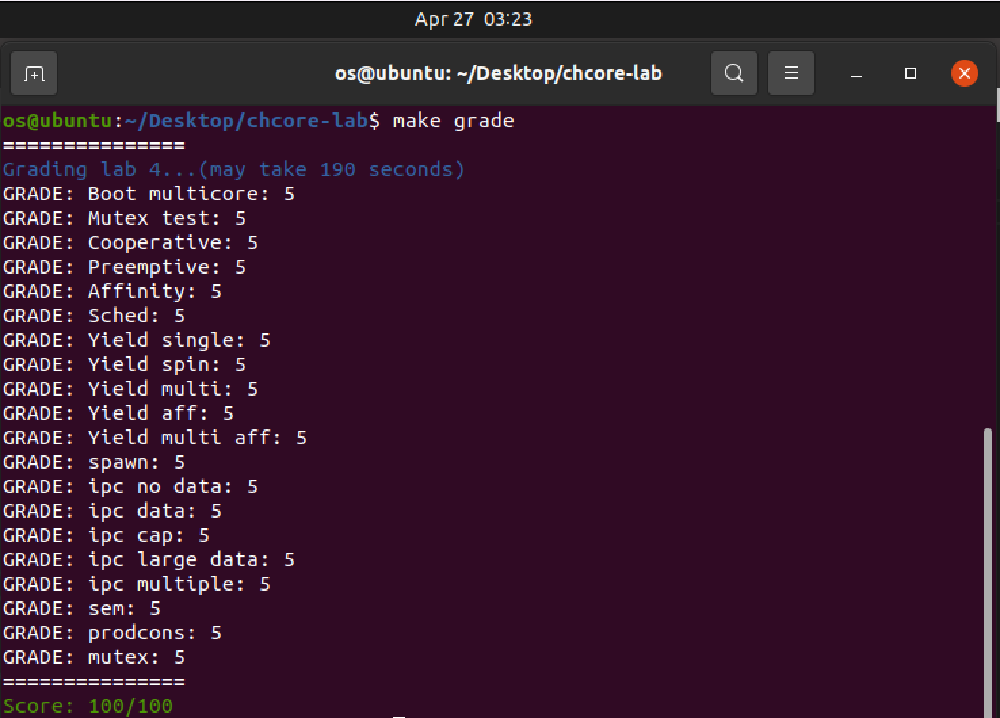

# OS-lab4: 多核、多進程、調度與IPC

**id: 519021910861** 
**name: xuhuidong**

## 目錄

- [目錄](#目錄)
- [第一部分：多核支持](#第一部分：多核支持)
- [第二部分：調度](#第二部分：調度)
- [第三部分：進程管理器](#第三部分：進程管理器)
- [第四部分：進程間通訊](#第四部分：進程間通訊)
- [第五部分：內核信號量](#第五部分：內核信號量)

## 第一部分：多核支持

> 1. 閱讀彙編代碼 `kernel/arch/aarch64/boot/raspi3/init/start.S`。說明 Chcore 是如何選定主 CPU，並阻塞其他 CPU 的執行的。

Chcore 進入 `_start` 函數後 `mrs x8, mpidr_el1` 將當前 cpuid 放在了 `x8` 寄存器中，**並在 `cbz x8, primary` 中通過判斷當前 cpuid 是否為 0 來選擇主 CPU，即 cpuid 為 0 的 CPU 是主 CPU 並執行 `primary` 處的代碼。**

**Chcore 通過控制 `secondary_boot_flag` 數組中其他 CPU 對應元素始終為 0 而讓其他 CPU 不斷循環等待來阻塞其他 CPU 執行。**具體而言，其他 CPU 在設置好棧後循環等待直至 `secondary_boot_flag[cpuid] != 0` 時才跳轉到 `secondary_init_c` 進行初始化。主 CPU 在完成自己的初始化後調用 `enable_smp_cores`，在此設置 `secondary_boot_flag[cpuid] = 1`，讓副 CPU 可以繼續執行完成初始化。而每個副 CPU 初始化完成後會設置 `cpu_status[cpuid] = cpu_run`，因此只有只有在上個設置好後才可以設置下個副 CPU 的 `secondary_boot_flag[cpuid]`，保證了副 CPU 有序逐個的初始化。

> 2. 閱讀彙編代碼 `kernel/arch/aarch64/boot/raspi3/init/start.S`，`init_c.c` 以及 `kernel/arch/aarch64/main.c`，解釋用於阻塞其他 CPU 核心的 `secondary_boot_flag` 是物理地址還是虛擬地址？是如何傳入函數 `enable_smp_cores` 中，又該如何賦值的（考慮虛擬地址/物理地址）？

**`secondary_boot_flag` 是虛擬地址，是通過 `kernel/arch/aarch64/main.c`中 `main` 函數傳參傳入了物理地址 `boot_flag`，並在 `enable_smp_cores` 函數中通過 `secondary_boot_flag = (long *)phys_to_virt(boot_flag)` 轉換成虛擬地址。**

**我們可以將其重新轉換成物理地址並賦值，然後再轉換回虛擬地址即可**。

> 3. 完善主 CPU 激活各個其他CPU的函數：`enable_smp_cores` 和 `kernel/arch/aarch64/main.c` 中的 `secondary_start`。請注意測試代碼會要求各個其他 CPU 按序被依次激活。

首先設置 flag 為 1，並且讓其不停循環等待。

```C++
for (i = 0; i < PLAT_CPU_NUM; i++) {
  secondary_boot_flag[i] = 1;
	while (cpu_status[i] == cpu_hang);
	...
};
```

> 4. 熟悉排號鎖的基本算法，並在 `kernel/arch/aarch64/sync/ticket.c` 中完成 `unlock` 和 `is_lock` 的代碼。在 `kernel/arch/aarch64/sync/ticket.c` 中實現 `kernel_lock_init`、`lock_kernel` 和 `unlock_kernel`。在適當的位置調用 `lock_kernel`。判斷什麼時候需要放鎖，添加 `unlock_kernel`。

根據排號鎖的原理，我們在 `unlock` 時將 `owner` 加加，而在判斷是否上鎖時比較 `owner` 和 `next` 字段的大小即可。

對於內核的上鎖等一系列操作，都是對排號鎖的一個包裝，不再贅述。

我們在創建根進程前、其他進程開始調度前以及處理終端等位置需要上大內核鎖，而解鎖則只需要在處理完異常返回時即可。

```C++
/* kernel/arch/aarch64/main.c */
int main(paddr_t boot_flag) {
	...
#ifdef CHCORE_KERNEL_TEST
	run_test();
#endif
	lock_kernel();
	create_root_thread();
	...
};
/* kernel/arch/aarch64/main.c */
void secondary_start(void) {
	...
#ifdef CHCORE_KERNEL_TEST
	run_test();
#endif
	lock_kernel();
	sched();
	...
};

```

```C++
/* kernel/arch/aarch64/irq/irq_entry.c */
void handle_entry_c(int type, u64 esr, u64 address) {
    if (type >= SYNC_EL0_64)
        lock_kernel();
    ...
};
/* kernel/arch/aarch64/irq/irq_entry.c */
void handle_irq(int type) {
	if (type >= SYNC_EL0_64 || current_thread->thread_ctx->type == TYPE_IDLE) {
    	lock_kernel();
    }
}
```

```C++
/* kernel/arch/aarch64/irq */
sync_el0_64:
	...
	bl unlock_kernel
	exception_exit
/* kernel/arch/aarch64/irq */
el0_syscall:
	...
	bl lock_kernel
	...
	bl unlock_kernel
	exception_exit
/* kernel/arch/aarch64/irq */
BEGIN_FUNC(__eret_to_thread)
	mov	sp, x0
	dmb ish
	bl unlock_kernel
	exception_exit
END_FUNC(__eret_to_thread)
```

> 5. 在 `el0_syscall` 調用 `lock_kernel` 時，在棧上保存了寄存器的值，這是為了避免調用 `lock_kernel` 時修改這些寄存器，在 `unlock_kernel` 時，是否需要將寄存器的值保存到棧上，試分析其原因。


不用。因為從排號鎖的實現中可以看出，`unlock_kernel` 只需要更改全局變量大內核鎖 `big_kernel_lock` 的 `owner` 字段，而這個字段應該是在內存中，因此 `unlock_kernel` 不會改變寄存器中的值，所以也就不需要保護到棧上了。

## 第二部分：調度

> 6. 為何 `idle_threads` 不會加入到等待隊列中？試分析其原因。

`idle_threads` 是每個 CPU 上的空閒線程，僅僅用在沒有線程等待時上去頂替，這樣做可以防止 CPU 發現沒有能調度的線程卡在內核態，而由於我們現在使用的是分配時間片的輪詢策略，因此所有在等待隊列中的進程都擁有相同的優先級，如果讓 `idle_threads` 進入隊列的話，可能會“空轉”浪費很多時間，故正常情況下 `idle_threads` 是不需要加入到等待隊列中的。

> 7. 完善 `kernel/sched/policy_rr.c` 中的調度功能。

在 `rr_sched_enqueue` 中，我們首先需要判斷 `thread` 是否為空、狀態是否是 `TS_READY` 等條件，然後對其親和性進行判斷並賦予相應的 `cpuid`，記住將 `state` 設置為 `TS_READY` 再加入等待隊列中。

在 `rr_sched_dequeue` 中，我們首先對 `thread` 的參數進行檢查，然後使用 `list_del` 函數將其移出等待隊列，記住將 `state` 設置為 `TS_INTER`。

在 `rr_sched_choose_thread` 中，我們選擇等待隊列的對首並嘗試讓其出隊，如果出隊失敗（即隊列為空），則返回對應 `cpu` 的空閒進程，否則返回這個出隊 `thread`。

在 `rr_sched` 中，我們首先對 `thread` 參數進行檢查，並將當前進程線程掛起，然後從等待隊列中選取下一個線程，並將時間片填滿（即填上 `DEFAULT_BUDGET`）再調度。

具體代碼詳見 GitLab。

> 8. 如果異常是從內核態捕獲的，CPU 核心不會在 `kernel/arch/aarch64/irq/irq_entry.c` 的 `handle_irq` 中獲得大內核鎖。但是，有一種特殊情況，即如果空閒線程（以內核態運行）中捕獲了錯誤，則 CPU 核心還應該獲取大內核鎖。否則，內核可能會被永遠阻塞，請思考一下原因。

我覺得原因可能有兩個：1. 因為空閒線程的作用就是為了防止 CPU 發現沒有能調度的線程而卡在內核態，所以當空閒線程出現了錯誤時應該獲取大內核鎖並由內核去解決錯誤，如果忽視這個錯誤很有可能導致空閒線程掛掉，之後 CPU 再次調度時如果發現沒有能調度的線程時就會永遠阻塞。2. 當一個內核態線程返回到用戶態時會釋放大內核鎖，然而 `idle` 線程並沒有拿到過大內核鎖，所以如果它捕獲了錯誤，就可能會在沒有大內核鎖的情況下釋放大內核鎖，導致整個排號鎖以及調度都出錯。

> 練習 9：在 `kernel/sched/sched.c` 中實現系統調用 `sys_yield()`，使用戶態程序可以啟動線程調度。此外，Chcore 還添加了一個新的系統調用 `sys_get_cpu_id`，其將返回當前線程運行的 CPU 的核心 id。請在 `kernel/syscall/syscall.c` 文件中實現該函數。

在 `sys_yield` 中我們將當前線程的 `budget` 直接設置為 0，以便之後立刻切換線程。

```C++
/* kernel/sched/sched.c */
void sched_handle_timer_irq(void) {
    if (current_thread && current_thread->thread_ctx && current_thread->thread_ctx->sc && current_thread->thread_ctx->sc->budget && current_thread->thread_ctx->sc->budget > 0) {
        --current_thread->thread_ctx->sc->budget;
}
```

而系統調用 `sys_get_cpu_id` 則直接通過調用 `smp_get_cpu_id` 函數即可。

```C++
u32 sys_get_cpu_id() {
  u32 cpuid = 0;
  /* LAB 4 TODO BEGIN */
  cpuid = smp_get_cpu_id();
  /* LAB 4 TODO END */
	return cpuid;
}
```

> 10. 定時器中斷初始化的相關代碼已包含在本實驗的初始代碼中 `timer_init`。請在主CPU以及其他CPU的初始化流程中加⼊對該函數的調⽤。

在 `main.c` 中對應留出的 `LAB 4 TODO` 的兩個位置填上 `timer_init` 即可。

> 11. 在 `kernel/sched/sched.c` 處理時鐘中斷的函數 `sched_handle_timer_irq` 中添加相應的代碼，以便它可以⽀持預算機制。

> 12. 在 `kernel/object/thread.c` 中實現 `sys_set_affinity` 和
`sys_get_affinity`。完善 `kernel/sched/policy_rr.c` 中的調度功能，增加線程的親和性⽀持（如⼊隊時檢查親和度等，請⾃⾏考慮）。

在之前的調度部分已經實現，不再贅述。

## 第三部分：進程管理器

> 13. 在 `userland/servers/procm/launch.c` 中填寫 `launch_process` 函數中缺損的代碼。

根據提示一步步調用各種函數填入相應代碼即可，代碼見 GitLab。

## 第四部分：進程間通訊

> 14. `libchcore/src/ipc/ipc.c` 與 `kernel/ipc/connection.c` 中實現了⼤多數 IPC 相關的代碼，請根據註釋完成其餘代碼。

根據提示一步步調用各種函數填入相應代碼即可，代碼見 GitLab。

注意在給 `client` 的地址中應該根據 `client_id` 不同給出不同地址，否則共享一塊地址會導致後續測試出錯，這裡卡了我一會兒。

## 第五部分：內核信號量

> 15. `ChCore` 在 `kernel/semaphore/semaphore.h` 中定義了內核信號量的結構體，並在 `kernel/semaphore/semaphore.c` 中提供了創建信號量 `init_sem` 與信號量對應 `syscall` 的處理函數。請補⻬ `wait_sem` 操作與 `signal_sem` 操作。

首先需要了解信號量的概念以及實現。

在 `wait_sem` 中我們首先判斷資源 `sem_count` 是否為 0，如果不為 0 則將 `sem_count` 減一，否則根據 `is_block` 判斷是否需要將當前線程加入等待隊列。

```C++
/* kernel/semaphore/semaphore.c */
s32 wait_sem(struct semaphore *sem, bool is_block) {
	s32 ret = 0;
  /* LAB 4 TODO BEGIN */
  if (sem->sem_count == 0) {
    if (is_block) {
      current_thread->thread_ctx->state = TS_WAITING;
      list_append(&(current_thread->sem_queue_node), &(sem->waiting_threads));
      ++sem->waiting_threads_count;
      obj_put(sem);
      sched();
      eret_to_thread(switch_context());
    } else ret = -EAGAIN;
} else --sem->sem_count;
}
```

在 `signal_sem` 中我們則需判斷是否有線程在等待資源，如果沒有則將 `sem_count` 加一，否則的話喚醒一個線程並將其入隊調度。

```C++
s32 signal_sem(struct semaphore *sem){
  /* LAB 4 TODO BEGIN */
  if (sem->waiting_threads_count > 0) {
    struct thread *awake = list_entry(sem->waiting_threads.next, struct thread, sem_queue_node);
    list_del(&awake->sem_queue_node);
    --sem->waiting_threads_count;
    sched_enqueue(awake);
  }
  else ++sem->sem_count;
  /* LAB 4 TODO END */
  return 0;
}
```

> 16. 在 `userland/apps/lab4/prodcons_impl.c` 中實現 `producer` 和 `consumer` 。

我們創建兩個信號量 `empty_slot` 和 `filled_slot`，並且初始化分別為 `BUF_SIZE` 和 0，然後生產者和消費者則分別減少一個增加另外一個即可。

```C++
/* userland/apps/lab4/prodcons_impl.c */
void *producer(void *arg) {
	...
  while (i < PROD_ITEM_CNT) {
    /* LAB 4 TODO BEGIN */
    __chcore_sys_wait_sem(empty_slot, true);
    /* LAB 4 TODO END */
    new_msg = produce_new();
    buffer_add_safe(new_msg);
    /* LAB 4 TODO BEGIN */
    __chcore_sys_signal_sem(filled_slot);
    /* LAB 4 TODO END */
    i++;
  };
  ...
};

/* userland/apps/lab4/prodcons_impl.c */
void *consumer(void *arg) {
  while (i < COSM_ITEM_CNT) {
    /* LAB 4 TODO BEGIN */
    __chcore_sys_wait_sem(filled_slot, true);
    /* LAB 4 TODO END */
    cur_msg = buffer_remove_safe();
    /* LAB 4 TODO BEGIN */
    __chcore_sys_signal_sem(empty_slot);
    /* LAB 4 TODO END */
    consume_msg(cur_msg);
    i++;
  }
  __sync_fetch_and_add(&global_exit, 1);
	return 0;
}
```

最終我完成了整個 `lab4`，感謝劉年學長在我遇到 bug 的時候給出的正確指導。



