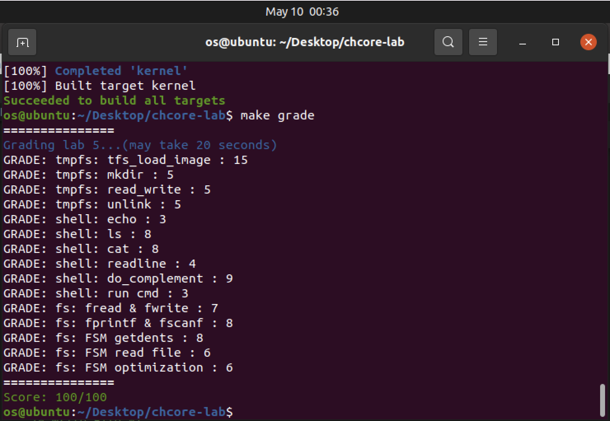

# OS-lab5: 多核、多進程、調度與IPC

**id: 519021910861** 
**name: xuhuidong**

## 目錄

- [目錄](#目錄)
- [臨時文件系統](#臨時文件系統)
- [SHELL](#SHELL)
- [文件系統拓展](#文件系統拓展)


## 臨時文件系統

> 練習題 1：實現位於 `userland/servers/tmpfs/tmpfs.c` 的 `tfs_mknod` 和 `tfs_namex`。

在 `tfs_mknod` 中，首先要判斷是否存在同名文件。

```C++
if (tfs_lookup(dir, name, len) != NULL)
	return -EEXIST;
```

然後根據文件類型創建 `inode`。

```C++
struct inode* inode = mkdir ? new_dir() : new_reg();
```

並且創建新的 `dentry` 並加入到當前目錄中。

```C++
struct dentry* dent = new_dent(inode, name, len);
init_hlist_node(&dent->node);
htable_add(*(dir->dentries), dent->name.hash, *dent->node);
```

在 `tfs_namex` 中，我們需要遍歷文件系統結構來定位某個路徑下的文件，具體實現詳見 GitLab。

> 練習題 2：實現位於 `userland/servers/tmpfs/tmpfs.c` 的 `tfs_file_read` 和 `tfs_file_write` 。提示：由於數據塊的大小為 PAGE_SIZE，因此讀寫可能會牽涉到多個頁面，讀取不能超過文件大小，而寫入可能會增加文件大小（也可能需要創建新的數據塊）。

在 `tfs_file_read` 中我們需要將每個數據塊逐個讀取並 `copy` 到 `buff` 中去，注意邊界情況，核心代碼如下。

```C++
to_read = MIN(inode->size - offset, size);
while (to_read > 0) {
	page_no = ROUND_DOWN(offset, PAGE_SIZE) / PAGE_SIZE;
	page = radix_get(&inode->data, page_no * PAGE_SIZE);
	u64 page_off = cur_off % PAGE_SIZE;
	 cur_to_read = MIN(PAGE_SIZE - page_off, to_read);
	/* copy data to buff */
	memcpy(buff, (char*) page + page_off, cur_to_read);
	/* update variables in one loop */
	to_read -= cur_to_read;
	cur_off += cur_to_read;
	buff += cur_to_read;
}
```

在 `tfs_file_write` 中，和 `tfs_file_read` 差不多，只是這次我們是要將用戶輸入的數據寫入文件，並且還要注意，在文件不夠大時需要分配新的數據塊，詳細代碼見 GitLab。

> 練習題 3：實現位於 `userland/servers/tmpfs/tmpfs.c` 的 `tfs_load_image` 函數。需要通過之前實現的 tmpfs 函數進行目錄和文件的創建，以及數據的讀寫。

我們需要調用之前的創建目錄、創建文件以及讀寫文件的函數，詳細代碼見 GitLab。

> 練習題 4：利用 `userland/servers/tmpfs/tmpfs.c` 中已經實現的函數，完成在 `userland/servers/tmpfs/tmpfs_ops.c` 中的 `fs_creat` 、 `tmpfs_unlink` 和 `tmpfs_mkdir` 函數，從而使 `tmpfs_*` 函數可以被 `fs_server_dispatch` 調用以提供系統服務。

調用相應接口完成即可，詳情代碼見 GitLab。

## SHELL

> 練習題 5：實現在 `userland/servers/shell/main.c` 中定義的 `getch` ，該函數會每次從標準輸入中獲取字符，並實現在 `userland/servers/shell/shell.c` 中的 `readline`，該函數會將按下回車鍵之前的輸入內容存入內存緩衝區。

在 `getch` 中，我們直接使用 `libchcore/include/libc/stdio.h` 中定義的 I/O 函數即可。

```C++
char getch()
{
	int c = getc();
	return (char) c;
}
```

在 `readline` 中，我們需要對用戶在命令行輸入的字符逐個解析，例如當遇到 `\r` 字符時我們需要調用系統函數 `__chcore_sys_putc('\n')` 來輸出換行符。

而對 `\t` 的設計，主要在於需要進行補全根目錄 `/` 下的文件名並輸出，所以需要特殊處理：

```C++
while (true) {
	c = getch();
	if (c != '\t')
		complement_time = 0;
	...
	if (c == '\t') {
		char complement_buf[BUFLEN] = {0};
		char complement[BUFLEN] = {0};
		if (do_complement(complement_buf, complement, complement_time) == 0) {
      complement_time++;
      printf("%s", complement);
		}
    continue;
	}
  ...
}
```

> 練習題 6：根據在 `userland/servers/shell/shell.c` 中實現好的 `builtin_cmd` 函數，完成 shell 中內置命令對應 的 `do_*` 函數，需要支持的命令包括 `ls [dir]`、`echo [string]`、`cat [filename]` 和 `top`。

1. 我們一個個分別完成，首先看 `ls [dir]`，這條命令會在終端輸出 `dir` 目錄下所有的條目，即文件名稱。

主要函數在 `fs_scan(char *path)` 中實現，由於給出的是 `path` 所以我們要自己先分配一個用戶空間的 `fd`給他。

```C++
int fd = alloc_fd();
```

然後我們需要構造 IPC 請求。

```C++
ipc_msg_t* ipc_msg = ipc_create_msg(fs_ipc_struct_for_shell, sizeof(struct fs_request), 1);
struct fs_request* fr_ptr = ipc_get_msg_data(ipc_msg);
fr_ptr->req = FS_REQ_OPEN;
fr_ptr->open.new_fd = fd;
```

注意我們需要對路徑名進行特殊處理，比如如果路徑名為空則默認是根目錄 `/`，還有如果路徑名第一個字符不是 `/` 則需要添加進去。

```C++
if (strlen(path) == 0)
	strcpy((void *) fr_ptr->open.pathname, "/");
else if (*path != '/') {
	fr_ptr->open.pathname[0] = '/';
	strcpy((void *) (fr_ptr->open.pathname + 1), path);
} else {
	strcpy((void *) fr_ptr->open.pathname, path);
};
```

然後便可以發送 IPC 請求。

```C++
int ret = ipc_call(fs_ipc_struct_for_shell, ipc_msg);
ipc_destroy_msg(fs_ipc_struct_for_shell, ipc_msg);
```

最後我們可以參考 `demo_getdents` 函數來打印輸出每條 `entry`。

2. 我們來看 `echo [string]`，這條命令更加直接，只要把 `string` 打印到終端上即可。

```C++
int do_echo(char *cmdline)
{
	cmdline += 4;
	while (*cmdline == ' ')
		cmdline++;
	printf("%s", cmdline);
};
```

3. 然後是 `cat [filename]`，需要我們打印文件內容，我們只需要分別發送 `OPEN`，`READ` 和 `CLOSE` 的 IPC 請求即可。

核心代碼在發送接收 `READ` 請求。

```C++
memcpy(buf, ipc_get_msg_data(ipc_msg), ret);
printf("%s", buf);
```

> 練習題 7：實現在 `userland/servers/shell/shell.c` 中定義的 `run_cmd`，以通過輸入文件名來運行可執行文件，同時補全 `do_complement` 函數並修改 `readline` 函數，以支持按 `tab` 鍵自動補全根目錄 `/` 下的文件名。

我們首先對 `cmdline` 進行處理獲得正確的 `pathbuf` ，然後調用 `chcore_procm_spawn` 來處理。詳情代碼見 GitLab。

## 文件系統拓展

> 練習題 8：補全 `userland/apps/lan5` 目錄下的 `lab5_stdio.h` 與 `lab5_stdio.c` 文件，以實現 `fopen`，`fwrite`，`fread`，`fclose`，`fscanf`，`fprintf` 六個函數，函數用法應與 libc 中一致。

`fopen` 是打開文件，我們先發送 `OPEN` 的 IPC 請求嘗試打開文件，返回值如果小於 0 則代表文件原先不存在，如果 `mode` 是 `w` 代表可寫，就要先調用 `CREAT` 的 IPC 請求創建文件，然後再調用 `OPEN` 的 IPC 請求打開文件。

並且我們要構造用戶的 `FILE*` 抽象，我的設計如下。

```C++
typedef struct FILE {
	int fd;
	unsigned int mode;
	char filename[FS_REQ_PATH_BUF_LEN];
	int offset;
	int refcnt;
} FILE;
```

`fwrite` 是寫入文件，同理我們需要先調用 `LSEEK` 的 IPC 請求去設置寫入的初始位置，然後再發送 `WRITE` 的 IPC 請求。**這裡有點坑，因為其他的 IPC 請求所有的傳遞內容都在 `fs_request` 結構體中定義好了，唯獨 `WRITE` 請求需要將寫入的內容附在 `fs_request` 的後面**。

即我們需要以如下方式將寫入內容放入 IPC 請求包中：

```C++
memcpy((void *) fr_ptr + sizeof(struct fs_request), src, nmemb);
```

因此在創建這個消息的時候我們也要分配大一些的空間。

```C++
ipc_msg = ipc_create_msg(tmpfs_ipc_struct, sizeof(struct fs_request) + nmemb + 1, 1);
```

**我能理解這麼做是因為用戶寫入的內容大小未知，有可能很大，所以不能在 `fs_request` 中提前創建 `char wbuf[BUFLEN]` 來存，但我建議如果能在 `fs_request` 的 `write` 區域中加入 `char* wbuf` 會不會更好呢？ 這樣就可以動態分配空間而且也易於理解，但我不確定 IPC 通信時的請求包會不會因為地址不連續而找不到寫入的內容。以上僅是個人看法。**

`fread` 是讀取文件內容，需要注意的是需要先發送 `LSEEK` 的 IPC 請求去設置讀取的初始位置，然後再發送 `READ` 的 IPC 請求，並且將返回的文件內容 `copy` 到 `buff` 中，別忘了將 `FILE` 抽象中的 `offset` 增加相應的大小。

```C++
memcpy(destv, ipc_get_msg_data(ipc_msg), ret);
f->offset += ret;
```

`fclose` 是關閉文件，別忘了將 `FILE` 抽象中的 `refcnt` 減一。

```C++
if (--f->refcnt == 0)
	free(f);
```

`fscanf` 是格式化讀取文件內容，比如我先定義格式 `"%s %d"` 則代表我要從文件中讀取一個字符串和一個整數。這個地方的實現可以參考我們上學期編譯原理的 `va_arg` 的實驗，原理就是對格式進行解析，遇到 `%s` 就去文件裡讀個字符串出來，遇到了 `%d` 就去文件裡讀個整數出來。

`fprintf` 是格式化寫入文件內容，這個和 `fscanf` 大同小異，只需要先把格式化的字符串中的 `%s` 和 `%d` 替換成對應的參數的值，然後再調用 `fwrite` 函數將該字符串寫入文件中去。

> 練習題 9：FSM 需要兩種不同的文件系統才能體現其特點，本實驗提供了一個 fakefs 用於模擬部分文件系統的接口，測試代碼會默認將 tmpfs 掛載到路徑 `/`，並將 fakefs 掛載在到路徑 `/fakefs`。本練習需要實現 `userland/server/fsm/main.c` 中空缺的部分，使得用戶程序將文件系統請求發送給 FSM 後，FSM 根據訪問路徑

我們需要在 `fsm_server_disptach` 中補全這個轉發 IPC 請求的邏輯，注意這是兩個 IPC 不能複用，因此我們需要重新構造 IPC 請求發送給對應的文件系統，詳情代碼見 GitLab。

> 練習題 10：為減少文件操作過程中 IPC 次數，可以對 FSM 的轉發機制進行簡化。本練習需要完成 `libchcore/src/fs/fsm.c` 中空缺的部分，使得 `fsm_read_file` 和 `fsm_write_file` 函數先利用 `ID` 為 `FS_REQ_GET_FS_CAP` 的請求通過 FSM 處理文件路徑並獲取對應文件系統的 Capability，然後直接對相應文件系統發送文件操作請求。

這裡的關鍵在於我們要先調用 `FS_REQ_GET_FS_CAP` 的 IPC 請求獲取對應文件系統的 Capability ，然後再向對應的文件系統依次發送 `OPEN`，`WRITE/READ` 和 `CLOSE` 請求即可。詳情代碼見 GitLab。

最終，我完成了這個 Lab 並獲得了滿分。




