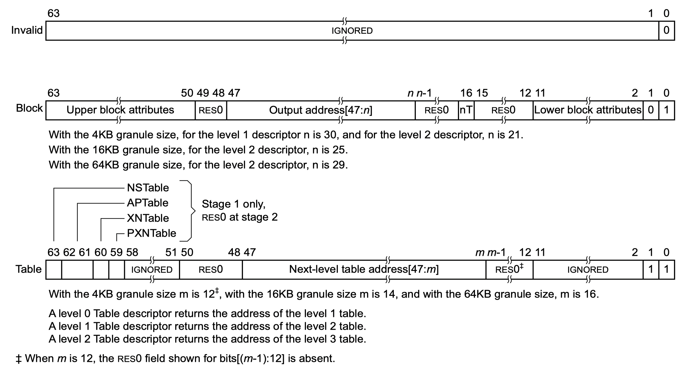
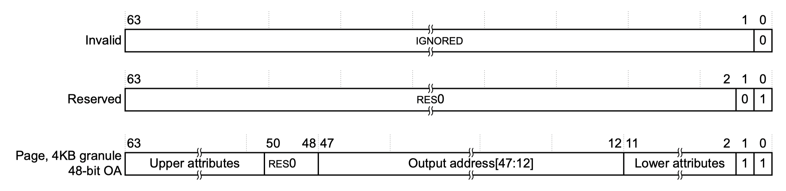

# 實驗 2：內存管理

本實驗主要目的在於讓同學們熟悉內核啟動過程中對內存的初始化和內核啟動後對物理內存和頁表的管理，包括三個部分：內核啟動頁表、物理內存管理、頁表管理。

## 第一部分：內核啟動頁表

### AArch64 地址翻譯

在配置內核啟動頁表前，我們首先回顧實驗涉及到的體系結構知識。這部分內容課堂上已經學習過，如果你已熟練掌握則可以直接跳過這裡的介紹（但不要跳過思考題）。

在 AArch64 架構的 EL1 異常級別存在兩個頁表基址寄存器：`ttbr0_el1`[^ttbr0_el1] 和 `ttbr1_el1`[^ttbr1_el1]，分別用作虛擬地址空間低地址和高地址的翻譯。那麼什麼地址範圍稱為“低地址”，什麼地址範圍稱為“高地址”呢？這由 `tcr_el1` 翻譯控制寄存器[^tcr_el1]控制，該寄存器提供了豐富的可配置性，可決定 64 位虛擬地址的高多少位為 `0` 時，使用 `ttbr0_el1` 指向的頁表進行翻譯，高多少位為 `1` 時，使用 `ttbr1_el1` 指向的頁表進行翻譯[^ttbr-sel]。一般情況下，我們會將 `tcr_el1` 配置為高低地址各有 48 位的地址範圍，即，`0x0000_0000_0000_0000`～`0x0000_ffff_ffff_ffff` 為低地址，`0xffff_0000_0000_0000`～`0xffff_ffff_ffff_ffff` 為高地址。

[^ttbr0_el1]: Arm Architecture Reference Manual, D13.2.144
[^ttbr1_el1]: Arm Architecture Reference Manual, D13.2.147
[^tcr_el1]: Arm Architecture Reference Manual, D13.2.131
[^ttbr-sel]: Arm Architecture Reference Manual, D5.2 Figure D5-13

瞭解瞭如何決定使用 `ttbr0_el1` 還是 `ttbr1_el1` 指向的頁表，再來看地址翻譯過程如何進行。通常我們會將系統配置為使用 4KB 翻譯粒度、4 級頁表（L0 到 L3），同時在 L1 和 L2 頁表中分別允許映射 2MB 和 1GB 大頁（或稱為塊）[^huge-page]，因此地址翻譯的過程如下圖所示：

[^huge-page]: 現代操作系統：原理與實現，4.3.5 大頁

其中，當映射為 1GB 塊或 2MB 塊時，圖中 L2、L3 索引或 L3 索引的位置和低 12 位共同組成塊內偏移。

每一級的每一個頁表佔用一個 4KB 物理頁，稱為頁表頁（Page Table Page），其中有 512 個條目，每個條目佔 64 位。AArch64 中，頁表條目稱為描述符（descriptor）[^descriptor]，最低位（bit[0]）為 `1` 時，描述符有效，否則無效。有效描述符有兩種類型，一種指向下一級頁表（稱為表描述符），另一種指向物理塊（大頁）或物理頁（稱為塊描述符或頁描述符）。在上面所說的地址翻譯配置下，描述符結構如下（“Output address”在這裡即物理地址，一些地方稱為物理頁幀號（Page Frame Number，PFN））：

**L0、L1、L2 頁表描述符**

**L3 頁表描述符**

[^descriptor]: Arm Architecture Reference Manual, D5.3

> 思考題 1：請思考多級頁表相比單級頁錶帶來的優勢和劣勢（如果有的話），並計算在 AArch64 頁表中分別以 4KB 粒度和 2MB 粒度映射 0～4GB 地址範圍所需的物理內存大小（或頁表頁數量）。

頁表描述符中除了包含下一級頁表或物理頁/塊的地址，還包含對內存訪問進行控制的屬性（attribute）。這裡涉及到太多細節，本文檔限於篇幅只介紹最常用的幾個頁/塊描述符中的屬性字段：

字段 | 位 | 描述
--- | --- | ---
UXN | bit[54] | 置為 `1` 表示非特權態無法執行（Unprivileged eXecute-Never）
PXN | bit[53] | 置為 `1` 表示特權態無法執行（Privileged eXecute-Never）
nG | bit[11] | 置為 `1` 表示該描述符在 TLB 中的緩存只對當前 ASID 有效
AF | bit[10] | 置為 `1` 表示該頁/塊在上一次 AF 置 `0` 後被訪問過
SH | bits[9:8] | 表示可共享屬性[^mem-attr]
AP | bits[7:6] | 表示讀寫等數據訪問權限[^mem-access]
AttrIndx | bits[4:2] | 表示內存屬性索引，間接指向 `mair_el1` 寄存器中配置的屬性[^mair_el1]，用於控制將物理頁映射為正常內存（normal memory）或設備內存（device memory），以及控制 cache 策略等

[^mem-attr]: Arm Architecture Reference Manual, D5.5
[^mem-access]: Arm Architecture Reference Manual, D5.4
[^mair_el1]: Arm Architecture Reference Manual, D13.2.97

### 配置內核啟動頁表

有了關於頁表配置的前置知識，我們終於可以開始配置內核的啟動頁表了（回顧：上一個實驗的結尾我們在未配置啟動頁表時直接啟用 MMU，內核崩潰，進入 translation fault 的死循環）。

操作系統內核通常需要“運行在”虛擬內存的高地址（如前所述，`0xffff_0000_0000_0000` 之後的虛擬地址），這裡“運行在”的意思是，通過對內核頁表的配置，將虛擬內存高地址映射到內核所在的物理內存，在執行內核代碼時，PC 寄存器的值是高地址，對全局變量、棧等的訪問都使用高地址。在內核運行時，除了需要訪問內核代碼和數據等，往往還需要能夠對任意物理內存和外設內存（MMIO）進行讀寫，這種讀寫同樣通過高地址進行。

因此，在內核啟動時，首先需要對內核自身、其餘可用物理內存和外設內存進行虛擬地址映射，最簡單的映射方式是一對一的映射，即將虛擬地址 `0xffff_0000_0000_0000 + addr` 映射到 `addr`。需要注意的是，在 ChCore 實驗中我們使用了 `0xffff_ff00_0000_0000` 作為內核虛擬地址的開始（注意開頭 `f` 數量的區別），不過這不影響我們對知識點的理解。

在樹莓派 3B+ 機器上，物理地址空間分佈如下[^bcm2836]：

[^bcm2836]: [bcm2836-peripherals.pdf](https://datasheets.raspberrypi.com/bcm2836/bcm2836-peripherals.pdf) & [Raspberry Pi Hardware - Peripheral Addresses](https://www.raspberrypi.com/documentation/computers/raspberry-pi.html#peripheral-addresses)

物理地址範圍 | 對應設備
--- | ---
`0x00000000`~`0x3f000000` | 物理內存（SDRAM）
`0x3f000000`~`0x40000000` | 共享外設內存
`0x40000000`~`0xffffffff` | 本地（每個 CPU 核獨立）外設內存

現在將目光轉移到 `kernel/arch/aarch64/boot/raspi3/init/mmu.c` 文件，我們需要在 `init_boot_pt` 為內核配置從 `0x00000000` 到 `0x80000000`（`0x40000000` 後的 1G，ChCore 只需使用這部分地址中的本地外設）的映射，其中 `0x00000000` 到 `0x3f000000` 映射為 normal memory，`0x3f000000` 到 `0x80000000`映射為 device memory，其中 `0x00000000` 到 `0x40000000` 以 2MB 塊粒度映射，`0x40000000` 到 `0x80000000` 以 1GB 塊粒度映射。

> 練習題 2：請在 `init_boot_pt` 函數的 `LAB 2 TODO 1` 處配置內核高地址頁表（`boot_ttbr1_l0`、`boot_ttbr1_l1` 和 `boot_ttbr1_l2`），以 2MB 粒度映射。

> 思考題 3：請思考在 `init_boot_pt` 函數中為什麼還要為低地址配置頁表，並嘗試驗證自己的解釋。

完成 `init_boot_pt` 函數後，ChCore 內核便可以在 `el1_mmu_activate` 啟用 MMU 後繼續執行，並通過 `start_kernel` 跳轉到高地址，進而跳轉到內核的 `main` 函數（位於 `kernel/arch/aarch64/main.c`）。

## 第二部分：物理內存管理

內核啟動過程結束後（我們一般認為跳到內核 `main` 函數即完成了啟動（boot）過程），需要對內存管理模塊進行初始化（`mm_init` 函數），首先需要把物理內存管起來，從而使內核代碼可以動態地分配內存。

ChCore 使用夥伴系統（buddy system）[^buddy]對物理頁進行管理，在 `mm_init` 中對夥伴系統進行了初始化。為了使物理內存的管理可擴展，ChCore 在 `mm_init` 的開頭首先調用平臺特定的 `parse_mem_map` 函數（實驗中目前只有樹莓派 3B+ 平臺的實現），該函數解析並返回了可用物理內存區域，然後再對各可用內存區域初始化夥伴系統。

[^buddy]: 現代操作系統：原理與實現，4.4.2 夥伴系統

夥伴系統中的每個內存塊都有一個階（order），階是從 0 到指定上限 `BUDDY_MAX_ORDER` 的整數。一個 $n$ 階的塊的大小為 $2^n \times \operatorname{PAGE\_SIZE}$，因此這些內存塊的大小正好是比它小一個階的內存塊的大小的兩倍。內存塊的大小是 2 次冪對齊，使地址計算變得簡單。當一個較大的內存塊被分割時，它被分成兩個較小的內存塊，這兩個小內存塊相互成為唯一的夥伴。一個分割的內存塊也只能與它唯一的夥伴塊進行合併（合併成他們分割前的塊）。

ChCore 中每個由夥伴系統管理的內存區域稱為一個 `struct phys_mem_pool`，該結構體中包含物理頁元信息的起始地址（`page_metadata`）、夥伴系統各階內存塊的空閒鏈表（`free_lists`）等。

> 練習題 4：完成 `kernel/mm/buddy.c` 中的 `split_page`、`buddy_get_pages`、`merge_page` 和 `buddy_free_pages` 函數中的 `LAB 2 TODO 2` 部分，其中 `buddy_get_pages` 用於分配指定階大小的連續物理頁，`buddy_free_pages` 用於釋放已分配的連續物理頁。
>
> 提示：
>
> - 可以使用 `kernel/include/common/list.h` 中提供的鏈表相關函數如 `init_list_head`、`list_add`、`list_del`、`list_entry` 來對夥伴系統中的空閒鏈表進行操作
> - 可使用 `get_buddy_chunk` 函數獲得某個物理內存塊的夥伴塊
> - 更多提示見代碼註釋

有了基於夥伴系統的物理內存管理，我們便可以在內核中進行動態內存分配，也就是可以實現 `kmalloc` 了。ChCore 的 `kmalloc` 對於較小的分配需求採用 SLAB 分配器[^slab]，對於較大的分配需求則直接從夥伴系統中分配物理頁。動態分配出的物理頁被轉換為內核虛擬地址（Kernel Virtual Address，KVA），也就是在實驗第一部分中我們映射的 `0xffff_ff00_0000_0000` 之後的地址。現在你可以測試內核中是否已經能夠正常使用 `kmalloc` 和 `kfree` 了！

[^slab]: 現代操作系統：原理與實現，4.4.3 SLAB 分配器

## 第三部分：頁表管理

在第一部分我們已經詳細介紹了 AArch64 的地址翻譯過程，並介紹了各級頁表和不同類型的頁表描述符，最後在內核啟動階段配置了一個粗粒度的啟動頁表。現在，在迎接下一個實驗中將要引入的第一個用戶態進程之前，我們需要為其準備一個更細粒度的頁表實現，提供映射、取消映射、查詢等功能。

> 練習題 5：完成 `kernel/arch/aarch64/mm/page_table.c` 中的 `query_in_pgtbl`、`map_range_in_pgtbl`、`unmap_range_in_pgtbl` 函數中的 `LAB 2 TODO 3` 部分，分別實現頁表查詢、映射、取消映射操作，其中映射和取消映射以 4KB 頁為粒度。
>
> 提示：
>
> - 暫時不用考慮 TLB 刷新，目前實現的只是頁表作為內存上的數據結構的管理操作，還沒有真的設置到頁表基址寄存器（TTBR）
> - 實現中可以使用 `get_next_ptp`、`set_pte_flags`、`GET_LX_INDEX` 等已經給定的函數和宏
> - 更多提示見代碼註釋

> 練習題 6：完成 `kernel/arch/aarch64/mm/page_table.c` 中的 `map_range_in_pgtbl_huge` 和 `unmap_range_in_pgtbl_huge` 函數中的 `LAB 2 TODO 4` 部分，實現大頁（2MB、1GB 頁）支持。
>
> 提示：可假設取消映射的地址範圍一定是某次映射的完整地址範圍，即不會先映射一大塊，再取消映射其中一小塊。

> 思考題 7：閱讀 Arm Architecture Reference Manual，思考要在操作系統中支持寫時拷貝（Copy-on-Write，CoW）[^cow]需要配置頁表描述符的哪個/哪些字段，並在發生缺頁異常（實際上是 permission fault）時如何處理。

[^cow]: 現代操作系統：原理與實現，4.3.2 寫時拷貝

> 思考題 8：為了簡單起見，在 ChCore 實驗中沒有為內核頁表使用細粒度的映射，而是直接沿用了啟動時的粗粒度頁表，請思考這樣做有什麼問題。

> 挑戰題 9：使用前面實現的 `page_table.c` 中的函數，在內核啟動後重新配置內核頁表，進行細粒度的映射。
