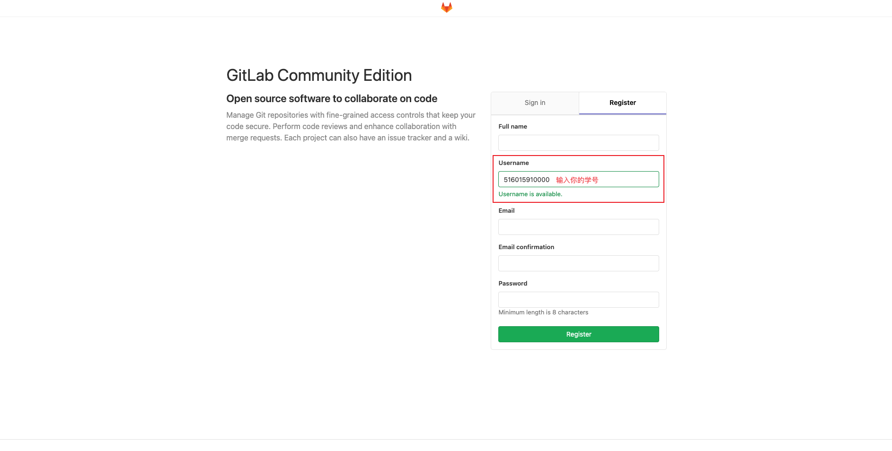
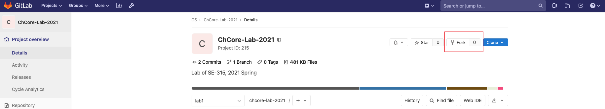
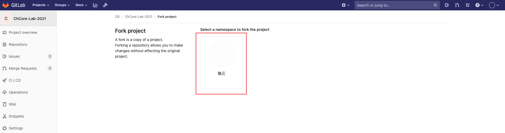
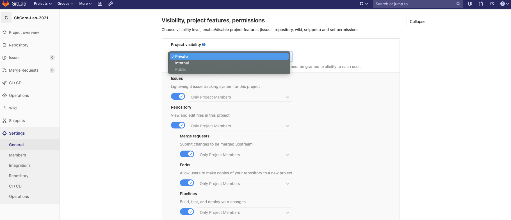
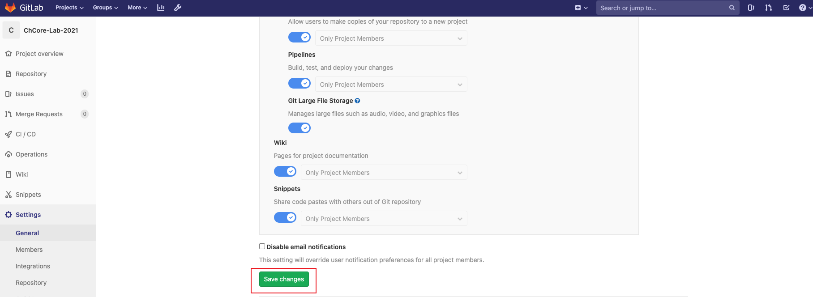
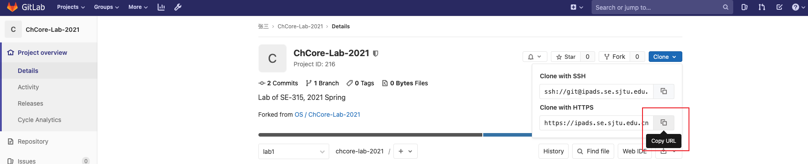

# 實驗 0：環境搭建

在開始做 ChCore 實驗之前，需要準備好一個適當的開發、構建和運行環境，並瞭解如何獲取、更新和提交 ChCore 實驗代碼。

## 準備開發、構建和運行環境

在開始 ChCore 實驗之前，需要準備一個適合自己的開發、構建和運行環境，根據同學自身（和自己的電腦）情況不同，下面提供幾種方案以供選擇。

### 方案一：使用助教提供的虛擬機（推薦）

我們為大家提供了兩種不同平臺的虛擬機，來供大家構建和運行 ChCore 實驗：

- VirtualBox 虛擬機
    - [交大雲盤](https://jbox.sjtu.edu.cn/l/G17Dix)，提取密碼：`os2023`，大小：6.94GB，MD5：c25f9064863e5e6d2be4aa30d41f92a8）
    - 你需要先安裝 VirtualBox，然後導入我們已經配置好的虛擬機
- VMware 虛擬機
    - [交大雲盤](https://jbox.sjtu.edu.cn/l/n1fY0k)，提取密碼：`os2023`，大小：4.55GB，MD5：6c6f30518a6562080e92bbf0db05d8f5
    - 你需要先安裝 VMware Player、VMware Workstation 或 VMware Fusion，然後再導入虛擬機

在兩個虛擬機中，用戶名均為 `os`，密碼均為 `123`。

如果導入虛擬機失敗，通常是因為下載沒完整，請檢查你下載文件的大小以及 MD5，如果不匹配，請嘗試重新下載虛擬機文件。

### 方案二：自己配置環境並使用 Docker

如果不想使用助教提供的虛擬機，可以在自己的 Linux 環境中安裝所需的軟件包，這裡以 Ubuntu 為例：

- 按照 [Install Docker Engine on Ubuntu](https://docs.docker.com/engine/install/ubuntu/) 的指示安裝 Docker
- 安裝 `binutils-aarch64-linux-gnu` 以便在 Docker 外使用 `aarch64-linux-gnu-objdump` 等工具
- 安裝 `qemu-system-arm`，用於模擬 ARM 平臺，運行 ChCore

對於使用 Apple Silicon 或其他 ARM CPU 的同學，我們推薦以下方案：

- 按照 [Install Docker Engine](https://docs.docker.com/engine/install/) 的指示安裝 Docker
- 拉取 Docker 鏡像： `docker pull bessyzhang/chcore_builder_arm:2.0`
- 創建容器：`docker run -v ${your_lab_path}:/chcore-lab --name ${your_container_name} -it bessyzhang/chcore_builder_arm:2.0 bash`
- 此時你的項目代碼位於容器的 `/chcore-lab` 目錄下，可以在容器中進行項目代碼的構建與運行

### 方案三：自己配置所有環境

> 提示：使用 Apple Silicon 或其他 ARM CPU 的同學，採用這種方法可能獲得更快的構建速度。

請自行參考 ChCore 根目錄的 `scripts/build/Dockerfile` 安裝所需構建工具鏈（部分工具在實驗中用不著，可自行判斷），並留意後面構建和運行時使用的命令的不同。

## 獲取 ChCore 代碼

ChChore 實驗代碼的發佈和提交均使用課程提供的 [GitLab 平臺](https://ipads.se.sjtu.edu.cn:2020)。

### 創建 GitLab 賬號

首先，打開 <https://ipads.se.sjtu.edu.cn:2020/users/sign_in> 進行註冊，“Username”一欄請輸入自己的學號，助教會根據用戶名的學號來進行改分。



### Fork 實驗倉庫

登錄你的 Gitlab 後，打開 <https://ipads.se.sjtu.edu.cn:2020/se-os-2023-spring/chcore-lab> 來 fork 一份 ChCore 倉庫代碼副本到你自己的賬戶下。之後，你可以對你賬戶下的 ChCore 倉庫代碼進行任意修改和提交，而不會對原 ChCore 倉庫產生影響。



點擊你的 namespace，來完成 fork。



### 設置倉庫的可見性

將剛才 fork 成功的倉庫設置為 private（私有），防止其他同學瀏覽你的倉庫、抄襲你的代碼。ChCore 的實驗是一個單人作業，每個同學都有防止抄襲和被抄襲的義務和責任，助教也有相關的代碼查重工具，抄襲行為將會被判 0 分。



最後，別忘記保存你的設置！



### 將你的 ChChore 實驗倉庫下載到本地

首先複製你的倉庫鏈接，進入你賬戶下的倉庫網頁，點擊 clone 按鈕，複製第二個鏈接（如果已經設置 SSH key，更建議使用 SSH 方式 clone）。



在之前下載的虛擬機（或自行配置的環境）中，打開命令行，運行（注意修改 `[username]` 並根據提示輸入用戶名和密碼）：

```sh
$ git clone https://ipads.se.sjtu.edu.cn:2020/[username]/chcore-lab.git
Cloning into 'chcore-lab'...
Username for 'https://ipads.se.sjtu.edu.cn:2020': [username]
Password for 'https://username@ipads.se.sjtu.edu.cn:2020': [password]
remote: Enumerating objects: 3, done.
remote: Counting objects: 100% (3/3), done.
remote: Total 3 (delta 0), reused 0 (delta 0), pack-reused 0
Unpacking objects: 100% (3/3), done.
```

### 從原倉庫中獲取最新的實驗代碼

首先，你需要清楚三個概念：

- 原倉庫（upstream）：助教發佈實驗代碼的倉庫，也是被 fork 的倉庫
- 你在 GitLab 上的私人倉庫（origin）：fork 出來的倉庫，屬於你私人賬號的倉庫，之後在本地倉庫中的修改（commit）要推送（push）到這個倉庫
- 本地倉庫（local）：存在於你本地環境的倉庫

助教之後會陸續放出每個 lab 的代碼，因此，在每次開始實驗之前，你需要從原倉庫中獲取最新的 lab 代碼。這個步驟是建立本地倉庫與原倉庫之間的聯繫，使得你的本地倉庫可以從原倉庫中獲取更新。

```sh
$ cd chcore-lab
$ git remote add upstream https://ipads.se.sjtu.edu.cn:2020/se-os-2023-spring/chcore-lab
$ git fetch upstream
From https://ipads.se.sjtu.edu.cn:2020/se-os-2023-spring/chcore-lab
 * [new branch]      lab1     -> upstream/lab1
```

之後，當你需要獲取更新時，只需要執行 `git fetch upstream` 命令即可。`git fetch` 只會將原倉庫中的更新下載到與你當前的工作分支不同的其它分支（例如 `upstream/lab1`），並不會對你當前分支的代碼進行修改。

通過 `git remote -v` 命令可以看到，你的本地倉庫一共有兩個遠端倉庫 `origin` 和 `upstream`。`origin` 是你在 GitLab 的私人倉庫對應的地址，之後你在本地的提交（commit）需要提交到 `orgin`。`upstream` 是助教管理的倉庫的地址，你需要從 `upstream` 獲取下一個實驗的代碼。

```sh
$ git remote -v
origin  https://ipads.se.sjtu.edu.cn:2020/[username]/chcore-lab.git (fetch)
origin  https://ipads.se.sjtu.edu.cn:2020/[username]/chcore-lab.git (push)
upstream  https://ipads.se.sjtu.edu.cn:2020/se-os-2023-spring/chcore-lab (fetch)
upstream  https://ipads.se.sjtu.edu.cn:2020/se-os-2023-spring/chcore-lab (push)
```

### 獲取下一個實驗的代碼，並切換到下一個實驗的代碼分支

由於 `lab1` 分支在 fork 和 clone 到本地的時候已經存在，因此不需要進行如下的操作，之後的 `lab2`、`lab3`、`lab4`、`lab5` 均需要通過以下方式獲取助教發佈的代碼，並切換到新的代碼分支。

在 ChCore 中，每一個實驗都會有一個單獨的代碼分支（branch），例如 `lab1`、`lab2` 以及 `labx`（`x` 指代某個數字）。當助教在原倉庫中放出 `labx` 的代碼時，你需要：

- 執行 `git fetch upstream` 來獲取最新的更新和分支信息
- 執行 `git checkout -b labx upstream/labx` 來創建一個新的分支 `labx`，`-b labx`的意思是創建一個新的名為 `labx` 的分支，而 `upstream/labx` 則指定了本地的分支是基於原倉庫的 `labx` 分支創建的
- `git push -u origin` 將本地倉庫中的 `labx` 和你 GitLab 上私人倉庫的 `labx` 分支進行綁定，並將本地倉庫的 `labx` 分支推送到遠端私人倉庫的 `labx` 分支
- 執行 `git merge labx-1`，將你之前的實驗代碼合併到當前分支上，這裡的 `x-1` 指代上一個 lab 的數字

下面的操作說明，如何切換到下一個實驗代碼分支來進行實驗。假設你已經做完了第 x-1 個實驗，下面要切換到第 x 個實驗：

```sh
$ git fetch upstream
$ git checkout -b labx upstream/labx
Branch 'labx' set up to track remote branch 'labx' from 'upstream'.
Switched to a new branch 'labx'
$ git push -u origin
To https://ipads.se.sjtu.edu.cn:2020/[username]/chcore-lab-2021.git
 * [new branch]      labx -> labx
Branch 'labx' set up to track remote branch 'labx' from 'origin'.
$ git merge lab(x-1)
```

`git merge` 命令有時候並不能自動地進行合併，別忘了手動處理這些衝突！

## 構建和運行 ChCore

在 ChCore 實驗代碼的根目錄（以後稱 ChCore 根目錄）運行下面命令可以構建和使用 QEMU 運行 ChCore：

```sh
$ make # 或 make build
$ make qemu # 在尚未完成 lab 1 時，可能沒有任何輸出
```

如果你在準備環境階段採用了第三種方案，則需要使用形如下面的命令：

```sh
$ make CHBUILD="./chbuild -l" # 更換 chbuild 命令，通過 -l 參數指定使用宿主機而非 Docker 環境
```

## 獲取參考評分

在 ChCore 根目錄運行下面命令可檢查當前得分：

```sh
$ make grade
...
===============
Score: 100/100
```

注意，此得分僅供參考，部分實驗步驟無法通過評分腳本獲得正確性檢查，但可能會影響後續實驗的進行。助教在最終評分時，會綜合評分腳本結果、實際編寫的代碼和實驗報告進行評價。
