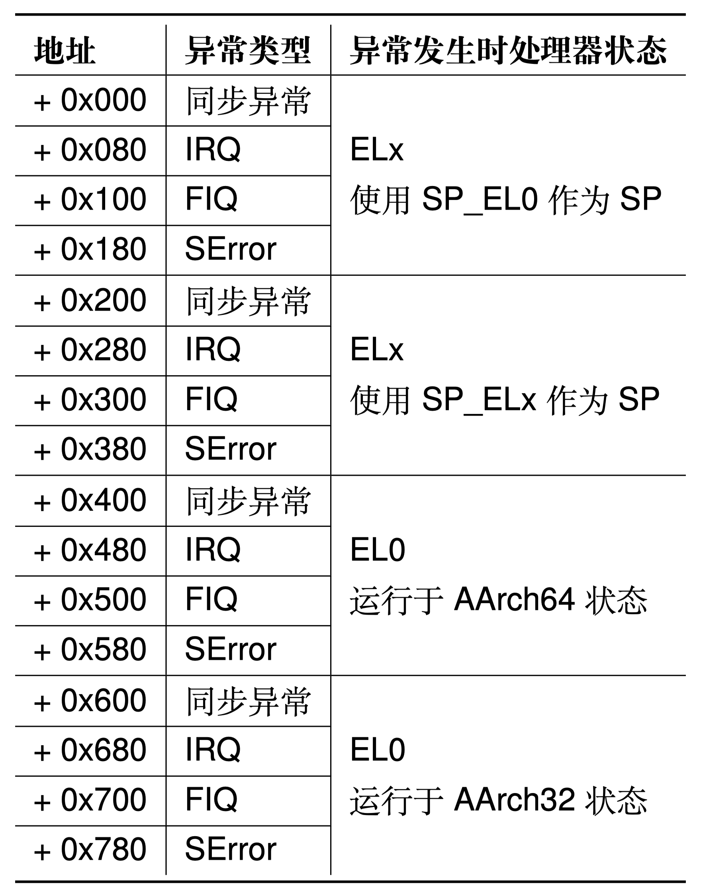

# 實驗 3：進程與線程、異常處理

用戶進程是操作系統對在用戶模式運行中的程序的抽象。在實驗 1 和實驗 2 中，已經完成了內核的啟動和物理內存的管理，以及一個可供用戶進程使用的頁表實現。現在，我們將一步一步支持用戶態程序的運行。

本實驗包括三個部分：

1. 使用對應的數據結構，支持創建、啟動並管理用戶進程和線程。
2. 完善異常處理流程，為系統添加必要的異常處理的支持。
3. 正確處理部分系統調用，保證用戶程序的正常執行與退出。

> 注意：建議 `make grade` 時關掉其它 QEMU 進程，以防止出現問題。

## 第一部分：用戶進程和線程

本實驗的 OS 運行在 AArch64 體系結構，該體系結構採用“異常級別”這一概念定義程序執行時所擁有的特權級別。從低到高分別是 EL0、EL1、EL2 和 EL3。每個異常級別的具體含義和常見用法已在課程中講述。

ChCore 中僅使用了其中的兩個異常級別：EL0 和 EL1。其中，EL1 是內核模式，`kernel` 目錄下的內核代碼運行於此異常級別。EL0 是用戶模式，`userland` 目錄下的用戶庫與用戶程序代碼運行在用戶模式下。

在 ChCore 中，內核提供給用戶的一切資源均採用 **Capability** 機制進行管理，所有的內核資源（如物理內存等）均被抽象為了**內核對象（kernel object）**。Capability 可以類比 Linux 中的文件描述符（File Descriptor）。在 Linux 中，文件描述符即相當於一個整型的 Capability，而文件本身則相當於一個內核對象。ChCore 的一個進程是一些對特定內核對象享有相同的 Capability 的線程的集合。ChCore 中的每個進程至少包含一個主線程，也可能有多個子線程，而每個線程則從屬且僅從屬於一個進程。

```c
// 一個 cap_group，作為一個進程的抽象
struct cap_group {
        // 該進程有權訪問的內核對象的數組（內核對象在數組中的索引即為該對象的 cap）
        struct slot_table slot_table;
        // 從屬於該進程的所有線程的鏈表
        struct list_head thread_list;
        int thread_cnt;
        u64 pid;
        // 便於調試使用的進程名字
        char cap_group_name[MAX_GROUP_NAME_LEN + 1];
};

struct thread {
        // 用於記錄所屬 cap_group 對象的鏈表節點
        struct list_head node;
        // Lab 3 不使用 ready_queue_node、sem_queue_node
        struct list_head ready_queue_node;
        struct list_head sem_queue_node;
        struct thread_ctx *thread_ctx; // TCB
        // Lab 3 不使用
        struct thread *prev_thread;
        // 虛擬地址空間
        struct vmspace *vmspace;
        // 所屬進程
        struct cap_group *cap_group;
        // Lab 3 不使用
        void *general_ipc_config;
	struct ipc_connection *active_conn;
};
```

ChCore 中進程和線程相關的概念已經介紹完畢。在本實驗中，我們僅會創建一個包含單線程的用戶進程，並僅啟用一個 ID 為 0 的 CPU 來運行該進程。與多核和線程調度相關的內容將在實驗 4 中實現。由於目前 ChCore 中尚無文件系統，所有用戶程序鏡像將以 ELF 二進制的形式（通過 `kernel/incbin.tpl.S`）直接嵌入到內核鏡像中，以便內核直接啟動。

> 思考題 1: 內核從完成必要的初始化到用戶態程序的過程是怎麼樣的？嘗試描述一下調用關係。

創建用戶程序至少需要包括創建對應的 cap_group、加載用戶程序鏡像並且切換到程序。在內核完成必要的初始化之後，內核將會跳轉到第一個用戶程序中，該操作通過調用 `create_root_cap_group` 函數完成。此外，用戶程序也可以通過 `sys_create_cap_group` 系統調用創建一個全新的 `cap_group`。由於 `cap_group` 也是一個內核對象，因此在創建 `cap_group` 時，需要通過 `obj_alloc` 分配全新的 `cap_group` 和 `vmspace` 對象。對分配得到的 `cap_group` 對象，需要通過 `cap_group_init` 函數初始化並且設置必要的參數。對分配得到的 `vmspace` 對象則需要調用 `cap_alloc` 分配對應的槽（slot）。

> 練習題 2: 在 `kernel/object/cap_group.c` 中完善 `cap_group_init`、`sys_create_cap_group`、`create_root_cap_group` 函數。在完成填寫之後，你可以通過 Cap create pretest 測試點。**注意通過這裡的測試並不代表完全實現正確，後續在實驗 4 中會再次測試這一部分。**

然而，完成 `cap_group` 的分配之後，用戶程序並沒有辦法直接運行，還需要將用戶程序 ELF 的各程序段加載到內存中。

> 練習題 3: 在 `kernel/object/thread.c` 中完成 `load_binary` 函數，將用戶程序 ELF 加載到剛剛創建的進程地址空間中。

然而，目前任何一個用戶程序並不能正常退出，`hello.bin` 不能正常輸出結果。這是由於程序中包括了 `svc #0` 指令進行系統調用。由於此時 ChCore 尚未配置從用戶模式（EL0）切換到內核模式（EL1）的相關內容，在嘗試執行 `svc` 指令時，ChCore 將根據目前的配置（尚未初始化，異常處理向量指向隨機位置）執行位於隨機位置的異常處理代碼，進而導致觸發錯誤指令異常。同樣的，由於錯誤指令異常仍未指定處理代碼的位置，對該異常進行處理會再次出發錯誤指令異常。ChCore 將不斷重複此循環，並最終表現為 QEMU 不響應。後續的練習中將會通過正確配置異常向量表的方式，對這一問題進行修復。

## 第二部分：異常向量表

由於 ChCore 尚未對用戶模式與內核模式的切換進行配置，一旦 ChCore 進入用戶模式執行就再也無法返回內核模式使用操作系統提供其他功能了。在這一部分中，我們將通過正確配置異常向量表的方式，為 ChCore 添加異常處理的能力。

在 AArch64 架構中，異常是指低特權級軟件（如用戶程序）請求高特權軟件（例如內核中的異常處理程序）採取某些措施以確保程序平穩運行的系統事件，包含**同步異常**和**異步異常**：

- 同步異常：通過直接執行指令產生的異常。同步異常的來源包括同步中止（synchronous abort）和一些特殊指令。當直接執行一條指令時，若取指令或數據訪問過程失敗，則會產生同步中止。此外，部分指令（包括 `svc` 等）通常被用戶程序用於主動製造異常以請求高特權級別軟件提供服務（如系統調用）。
- 異步異常：與正在執行的指令無關的異常。異步異常的來源包括普通中 IRQ、快速中斷 FIQ 和系統錯誤 SError。IRQ 和 FIQ 是由其他與處理器連接的硬件產生的中斷，系統錯誤則包含多種可能的原因。本實驗不涉及此部分。

發生異常後，處理器需要找到與發生的異常相對應的異常處理程序代碼並執行。在 AArch64 中，存儲於內存之中的異常處理程序代碼被叫做異常向量（exception vector），而所有的異常向量被存儲在一張異常向量表（exception vector table）中。



AArch64 中的每個異常級別都有其自己獨立的異常向量表，其虛擬地址由該異常級別下的異常向量基地址寄存器（`VBAR_EL3`，`VBAR_EL2` 和 `VBAR_EL1`）決定。每個異常向量表中包含 16 個條目，每個條目裡存儲著發生對應異常時所需執行的異常處理程序代碼。以上表格給出了每個異常向量條目的偏移量。

在 ChCore 中，僅使用了 EL0 和 EL1 兩個異常級別，因此僅需要對 EL1 異常向量表進行初始化即可。在本實驗中，ChCore 內除系統調用外所有的同步異常均交由 `handle_entry_c` 函數進行處理。遇到異常時，硬件將根據 ChCore 的配置執行對應的彙編代碼，將異常類型和當前異常處理程序條目類型作為參數傳遞，對於 sync_el1h 類型的異常，跳轉 `handle_entry_c` 使用 C 代碼處理異常。對於 irq_el1t、fiq_el1t、fiq_el1h、error_el1t、error_el1h、sync_el1t 則跳轉 `unexpected_handler` 處理異常。

> 練習題 4: 按照前文所述的表格填寫 `kernel/arch/aarch64/irq/irq_entry.S` 中的異常向量表，並且增加對應的函數跳轉操作。


## 第三部分：缺頁異常和系統調用

頁錯誤在操作系統中扮演了重要的作用，是延遲內存分配的重要技術手段。當處理器發生缺頁異常時，它會將發生錯誤的虛擬地址存儲於 `FAR_ELx` 寄存器中，並異常處理流程。本實驗需要完成缺頁異常的處理。

> 練習題 5: 填寫 `kernel/arch/aarch64/irq/pgfault.c` 中的 `do_page_fault`，需要將缺頁異常轉發給 `handle_trans_fault` 函數。

進入 `handle_trans_fault` 函數後，首先需要找到出現 fault 的地址所對應的 vmr，如果 vmr 不存在，那麼將終止處理流程。在尋找到地址所對應的 vmr 之後，尋找其映射的物理內存對象（PMO），我們的缺頁處理主要針對 `PMO_SHM` 和 `PMO_ANONYM` 類型的 PMO，這兩種 PMO 的物理頁是在訪問時按需分配的。缺頁處理邏輯首先嚐試檢查 PMO 中當前 fault 地址對應的物理頁是否存在（通過 `get_page_from_pmo` 函數嘗試獲取 PMO 中 offset 對應的物理頁）。若對應物理頁未分配，則需要分配一個新的物理頁，將將頁記錄到 PMO 中，並增加頁表映射。若對應物理頁已分配，則只需要修改頁表映射即可。

> 練習題 6: 填寫 `kernel/mm/pgfault_handler.c` 中的 `handle_trans_fault`，實現 `PMO_SHM` 和 `PMO_ANONYM` 的按需物理頁分配。

系統調用是系統為用戶程序提供的高特權操作接口。在本實驗中，用戶程序通過 `svc` 指令進入內核模式。在內核模式下，首先操作系統代碼和硬件將保存用戶程序的狀態。操作系統根據系統調用號碼執行相應的系統調用處理代碼，完成系統調用的實際功能，並保存返回值。最後，操作系統和硬件將恢復用戶程序的狀態，將系統調用的返回值返回給用戶程序，繼續用戶程序的執行。

> 練習題 7: 按照前文所述的表格填寫 `kernel/arch/aarch64/irq/irq_entry.S` 中的 `exception_enter` 與 `exception_exit`，實現上下文保存的功能。如果正確完成這一部分，可以通過Bad Instruction 1、Bad Instruction 2、Fault測試點，並可以在運行 `badinst1.bin`、`badinst2.bin` 時正確輸出如下結果：
>
> ```
> [INFO] Exception type: 8
> ```

> 思考題 8： ChCore中的系統調用是通過使用匯編代碼直接跳轉到`syscall_table`中的
> 相應條目來處理的。請閱讀`kernel/arch/aarch64/irq/irq_entry.S`中的代碼，並簡要描述ChCore是如何將系統調用從異常向量分派到系統調用表中對應條目的。

在本實驗中，你需要實現三個基本的系統調用，分別是 `sys_putc`（用於向終端輸出一個字符）、`sys_getc`（用於從終端獲取一個字符）和 `sys_thread_exit`（用於退出當前線程）。針對退出用戶態程序這一操作，用戶態程序在退出之後，需要通過系統調用將控制權交還給內核。內核需要將當前線程移出調度隊列，並繼續從調度隊列中選擇下一個可執行的線程進行執行。然而，由於目前 ChCore 中僅包含一個線程，因此，在唯一的用戶線程退出後，ChCore 將中止內核的運行並直接退出。實驗 4 會對這一問題進行修復。

> 練習題 9: 填寫 `kernel/syscall/syscall.c` 中的 `sys_putc`、`sys_getc`，`kernel/object/thread.c` 中的 `sys_thread_exit`，`libchcore/include/chcore/internal/raw_syscall.h` 中的 `__chcore_sys_putc`、`__chcore_sys_getc`、`__chcore_sys_thread_exit`，以實現 `putc`、`getc`、`thread_exit` 三個系統調用。

到這裡，你的程序應該可以通過所有的測試點並且獲得滿分。

> 挑戰題 10: 截止到現在由於沒有磁盤，因此我們採用一部分內存模擬磁盤。內存頁是可以換入換出的，請設計一套換頁策略（如 LRU 等），並在 `kernel/mm/pgfault_handler.c` 中的 `handle_trans_fault` 實現你的換頁方法。
