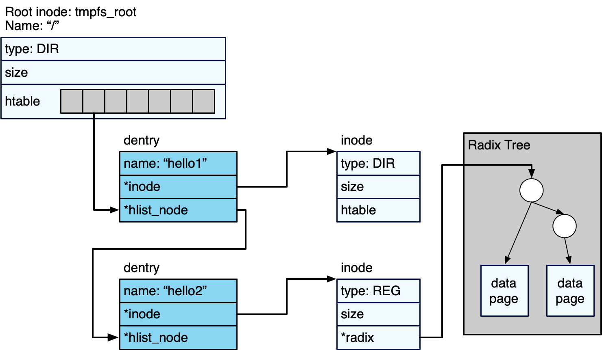
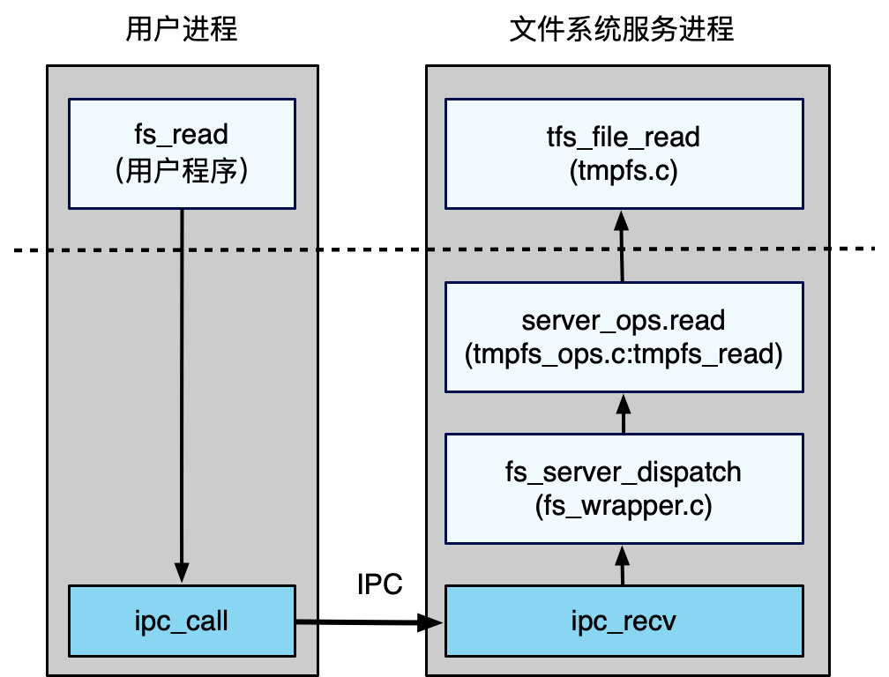
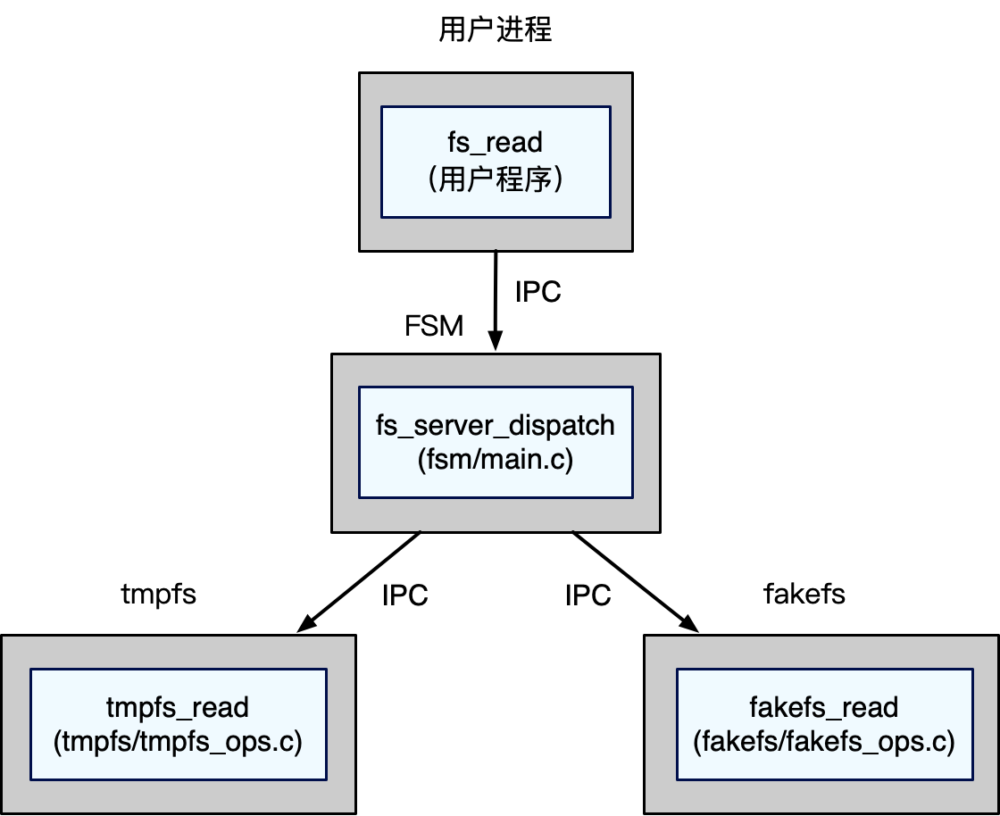

# 實驗 5：文件系統與SHELL

## 簡介

在微內核架構下，文件系統作為系統服務運行在用戶態。本實驗的第一部分將實現一種基於索引節點（index node，inode）的用戶態內存文件系統：臨時文件系統（temporary file system，tmpfs）。第二部分將實現一個shell程序，提供用戶和操作系統交互的方式，包括文件和目錄相關的簡單命令。第三部分將實現一種簡單的微內核架構下的虛擬文件系統（Virtual File Systems, VFS），能夠管理不同文件系統併為應用提供統一的文件操作接口。

## 第一部分：臨時文件系統

### tmpfs簡介

tmpfs是基於inode的內存文件系統，即使用內存空間作為文件系統的存儲空間，並且將存儲空間分為inode區域和數據區域。在inode區域中，存儲著每個文件的inode，該inode中保存有關該文件的元數據，如文件大小，文件數據塊的位置等。數據區域存儲文件數據塊，tmpfs中的文件數據塊由一系列分散的內存頁組成。文件分為常規文件和目錄文件：常規文件存儲數據本身，目錄文件存儲從文件名到目錄項（dicrectory entry，dentry）的哈希表映射。

ChCore的tmpfs位於`userland/servers/tmpfs`，如圖所示，具有以下幾個重要的數據結構（結構的定義位於`libchcore/include/chcore/fs/defs.h`中）：

- inode。每個inode對應一個文件，記錄文件類型（type：常規REG/目錄DIR）和文件大小（size）。接口`new_dir`和`new_reg`用於創建這兩種類型的inode。
- 目錄。目錄inode存儲一個指向哈希表htable的指針，該哈希表從文件名的哈希值映射到dentry。哈希表中的每個哈希桶都存儲dentry的鏈表，並且通過hlist_node指針鏈接。其中，`tmpfs_root`表示根目錄（`/`）的 inode。
- 每個常規文件的數據塊以基數樹的形式組織，樹的根節點指針保存在常規文件inode中。該樹的葉節點是大小為PAGE_SIZE的數據塊（即內存頁），通過內存頁的順序編號搜索。



> 思考題 1: 文件的數據塊使用基數樹的形式組織有什麼好處? 除此之外還有其他的數據塊存儲方式嗎?

### 實驗內容
tmpfs的基本功能在`userland/servers/tmpfs/tmpfs.c` 與 `userland/servers/tmpfs/tmpfs_ops.c`中定義，實現過程中請參考頭文件`userland/servers/tmpfs/tmpfs.h`和`userland/servers/tmpfs/tmpfs_ops.h`，以及已實現函數的相關代碼和註釋。在實現基本的文件操作之前，需要先實現一些修改文件結構的輔助函數：`tfs_mknod`和`tfs_namex`。`tfs_mknod`函數用於創建文件時，在父目錄下創建目錄inode或常規文件inode。`tfs_namex`函數用於遍歷文件系統以查找文件。

> 練習題 2：實現位於`userland/servers/tmpfs/tmpfs.c`的`tfs_mknod`和`tfs_namex`。

文件讀寫是文件系統的基本功能，tmpfs的讀寫操作會將文件數據塊中內容讀入內存緩衝區，或將緩衝區內容寫入對應文件數據塊。`tfs_file_read`和 `tfs_file_write`兩個函數分別用於以一定偏移量讀取和寫入一段長度的數據，並且返回實際的讀寫字節長度
（讀取不能超過文件大小）。

> 練習題 3：實現位於`userland/servers/tmpfs/tmpfs.c`的`tfs_file_read`和`tfs_file_write`。提示：由於數據塊的大小為PAGE_SIZE，因此讀寫可能會牽涉到多個頁面。讀取不能超過文件大小，而寫入可能會增加文件大小（也可能需要創建新的數據塊）。

在實驗5中，用戶態程序會被編譯為ELF文件（`userland/_build/ramdisk/*.bin`），並與測試文件`userland/_build/ramdisk/test.txt`一起，連接為一個後綴名為`cpio`的文件。cpio的每個成員文件都包含一個頭（在`userland/servers/tmpfs/cpio.h`中定義），後面是文件內容。cpio的末尾是一個名為`TRAILER!!!`的空文件表示終止。本實驗中，tmpfs會通過`tfs_load_image`加載`ramdisk.cpio`中的內容。

> 練習題 4：實現位於`userland/servers/tmpfs/tmpfs.c`的`tfs_load_image`函數。需要通過之前實現的tmpfs函數進行目錄和文件的創建，以及數據的讀寫。

正確完以上所有練習後，輸入`make grade LAB=5`總共可以獲得15分。

用戶程序需要通過IPC給文件系統服務發送請求以使用文件系統。以文件讀取為例，在下圖中的虛線上方是用戶程序和文件系統的主要處理邏輯，虛線下方是文件系統服務的IPC處理機制。用戶程序通過調用由用戶實現的`fs_read`，使用`ipc_call`將消息發送到文件系統服務進程。

文件系統服務主函數在`userland/servers/tmpfs/main.c`中定義。其主要邏輯是輪詢IPC請求，通過`fs_server_dispatch`將請求分派到適當的處理函數，完成處理後，再通過IPC將結果返回。tmpfs的處理函數在`userland/servers/tmpfs_ops.{h,c}`中定義。

`fs_server_dispatch`函數在`userland/fs_base/fs_wrapper.c`中實現，在本實驗中，不同文件系統可共用的邏輯（如根據IPC請求分派處理函數等）被包裝在`userland/servers/fs_base`中，不同的文件系統可以共用這部分已經實現的邏輯，本實驗過程中不會修改該目錄下的內容。`fs_server_dispatch`會在解析IPC請求後，根據請求類型的不同，利用註冊在結構體`server_ops`中的函數指針，調用不同的文件系統函數。
在下圖示例中，`fs_server_dispatch`將請求分派到`server_ops.read`，在tmpfs中，該函數指針已經指向`tmpfs_read`，並最終調用`tfs_file_read`來實際進行文件讀取。



> 練習題 5：利用`userland/servers/tmpfs/tmpfs.c`中已經實現的函數，完成在`userland/servers/tmpfs/tmpfs_ops.c`中的`fs_creat`、`tmpfs_unlink`和`tmpfs_mkdir`函數，從而使`tmpfs_*`函數可以被`fs_server_dispatch`調用以提供系統服務。對應關係可以參照`userland/servers/tmpfs/tmpfs_ops.c`中`server_ops`的設置以及`userland/fs_base/fs_wrapper.c`的`fs_server_dispatch`函數。在本實驗中只需考慮如下幾個文件操作函數：

| 請求ID | 函數 | 功能 |
| :---- | :---- | :---- |
| FS_REQ_OPEN | tmpfs_open | 打開文件 |
| FS_REQ_READ | tmpfs_read | 讀文件 |
| FS_REQ_WRITE | tmpfs_write | 寫文件 |
| FS_REQ_CLOSE | tmpfs_close | 關閉文件 |
| FS_REQ_CREAT | tmpfs_creat | 創建文件 |
| FS_REQ_UNLINK | tmpfs_unlink | 移除文件 |
| FS_REQ_RMDIR | tmpfs_mkdir | 創建目錄 |
| FS_REQ_MKDIR | tmpfs_rmdir | 移除目錄 |
| FS_REQ_GETDENTS64 | tmpfs_getdents | 獲取目錄文件信息 |
| FS_REQ_GET_SIZE | tmpfs_get_size | 獲取文件大小 |

> 提示：`userland/server/fs_base/fs_wrapper.c`中會維護用戶態進程的文件描述符`fd`到文件系統`fid`的映射，用戶態程序在進行文件操作時需自行分配`fd`，而一個文件的`fid`在該文件系統中是唯一的，與文件一一對應，該`fd`到`fid`的映射會在調用`FS_REQ_OPEN`時被`fs_server_dispatch`創建。
> 所有`userland/servers/tmpfs`目錄下出現的`fd`，均已經在`fs_server_dispatch`中被轉化為`fid`。
>
> **注意：本部分測試需要打開`CHCORE_TMPFS_TEST`，即在`.config`文件中如下行選擇`ON`。**
> ```
> CHCORE_TMPFS_TEST:BOOL=ON
> ```

正確完成以上所有練習後，輸入`make grade LAB=5`可以獲得30分。

## 第二部分：SHELL
本實驗的第二部分是實現用戶態shell，該用戶態shell在`userland/servers/shell`中實現。

目前，應用程序只能通過IPC直接將請求發送給文件系統進程，為了更方便地對文件系統進行訪問，通常需要先對文件系統接口進行一定的封裝。
> 練習題 6：補全`libchcore/src/libc/fs.c`與`libchcore/include/libc/FILE.h`文件，以實現`fopen`, `fwrite`, `fread`, `fclose`, `fscanf`, `fprintf`五個函數，函數用法應與libc中一致。

> 練習題 7：實現在`userland/servers/shell/main.c`中定義的`getch`，該函數會每次從標準輸入中獲取字符，並實現在`userland/servers/shell/shell.c`中的`readline`，該函數會將按下回車鍵之前的輸入內容存入內存緩衝區。代碼中可以使用在`libchcore/include/libc/stdio.h`中的定義的I/O函數。

> 練習題 8：根據在`userland/servers/shell/shell.c`中實現好的`bultin_cmd`函數，完成shell中內置命令對應的`do_*`函數，需要支持的命令包括：`ls [dir]`、`echo [string]`、`cat [filename]`和`top`。

> 練習題 9：實現在`userland/servers/shell/shell.c`中定義的`run_cmd`，以通過輸入文件名來運行可執行文件，同時補全`do_complement`函數並修改`readline`函數，以支持按tab鍵自動補全根目錄（`/`）下的文件名。
>
> **注意：本部分測試需要打開`CHCORE_SHELL_TEST`，即在`.config`文件中如下行選擇`ON`。**
> ```
> CHCORE_SHELL_TEST:BOOL=ON
> ```

正確完成以上所有練習後，輸入`make grade LAB=5`總共可以獲得80分。

## 第三部分：虛擬文件系統

虛擬文件系統（VFS）是一層抽象，使得應用程序能夠以統一的接口訪問不同類型的文件系統。本實驗中將再實現一個系統服務FSM（File System Manager）協助實現虛擬文件系統抽象。如下圖所示，當存在多個文件系統時，用戶態應用只需要將IPC請求發送給FSM，FSM會分析被請求路徑所在的文件系統，並將請求發送給對應的文件系統進程，因此應用程序僅通過FSM就可以訪問不同的文件系統。

> 練習題 10：FSM需要兩種不同的文件系統才能體現其特點，本實驗提供了一個fakefs用於模擬部分文件系統的接口，測試代碼會默認將tmpfs掛載到路徑`/`，並將fakefs掛載在到路徑`/fakefs`。本練習需要實現`userland/server/fsm/main.c`中空缺的部分，使得用戶程序將文件系統請求發送給FSM後，FSM根據訪問路徑向對應文件系統發起請求，並將結果返回給用戶程序。實現過程中可以使用`userland/server/fsm`目錄下已經實現的函數。
> **注意：本部分測試需要打開`CHCORE_FSM_TEST`，即在`.config`文件中如下行選擇`ON`。**
> ```
> CHCORE_FSM_TEST:BOOL=ON
> ```

> 提示：本練習中只需考慮已經在tmpsfs中實現的請求類型。本練習的測試代碼會用到shell中已經實現的`ls`與`cat`命令。




正確完成以上所有練習後，輸入`make grade LAB=5`可以獲得100分。
