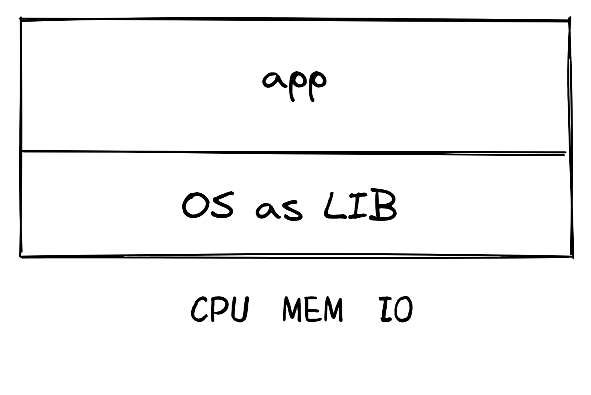
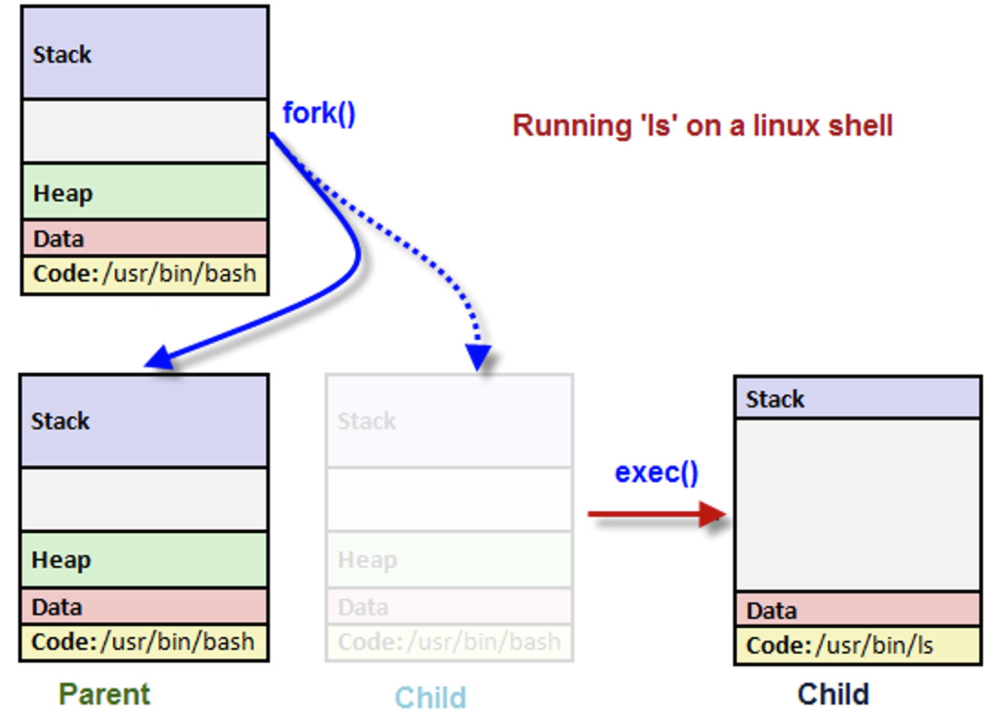
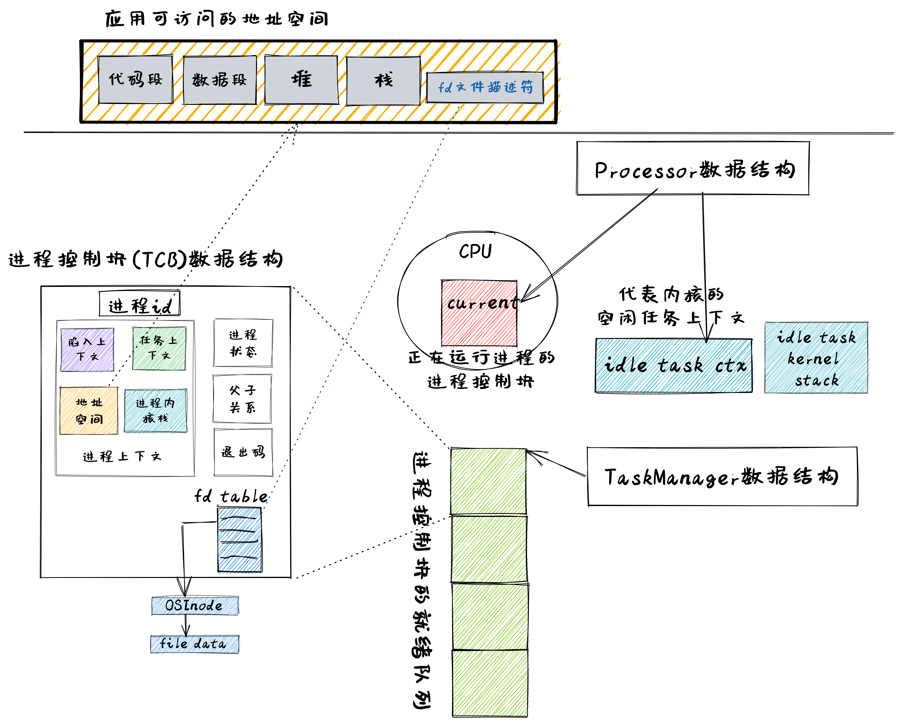
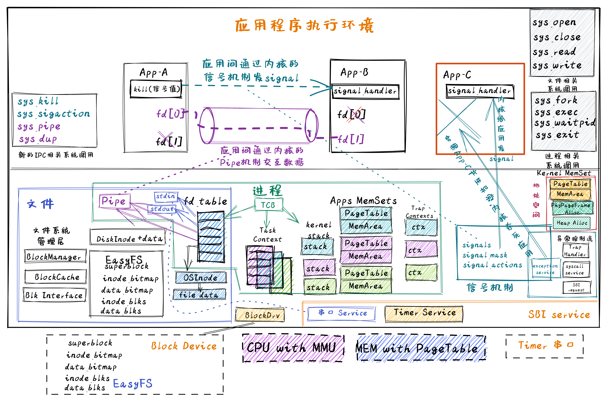
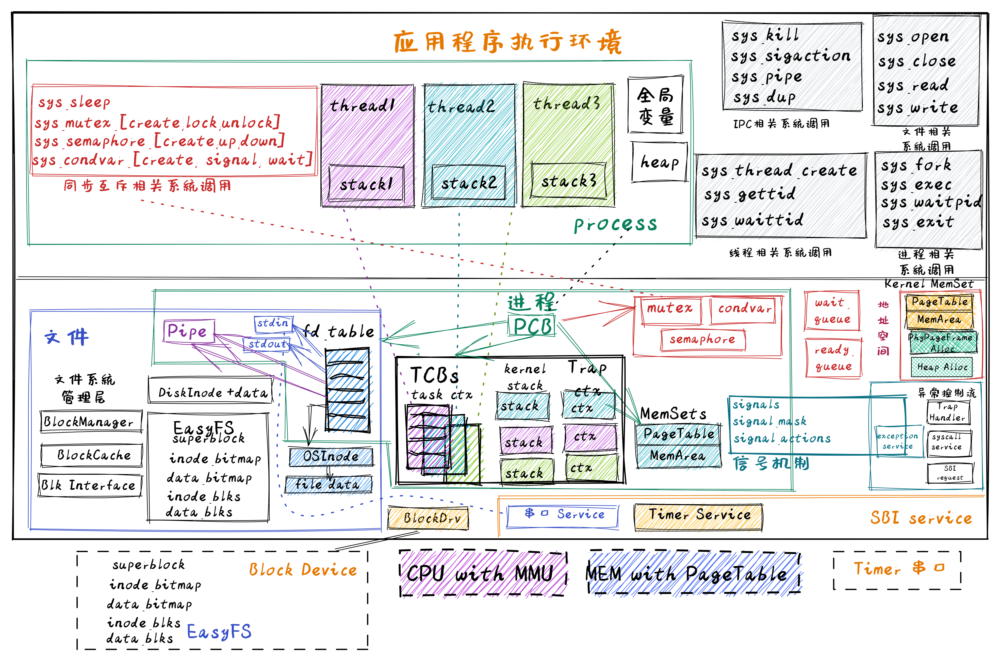

<!-- theme: gaia -->
<!-- _class: lead -->

# 操作系統課程-2002春
## 實踐與實驗介紹

 

向勇 陳渝 李國良 

 

2022年春季

---
### 目標
讓學生通過OS實踐來深入地理解OS原理
- 硬件簡單
- 軟件簡潔
- 循序漸進
- 理技結合
- 應用驅動
- 生物進化

---
### 策略
讓學生通過OS實踐來深入地理解OS原理
- 硬件簡單  --  RISC-V 64 支持OS的最小硬件子集
- 軟件簡潔  --  採用Rust語言的抽象能力和高安全設計
- 循序漸進  --  隨著知識點擴展來擴展OS實踐
- 理技結合  --  原理的知識點與OS實踐內容對應
- 應用驅動  -- OS功能擴展全來自於應用的需求
- 生物進化  -- 實踐逐步形成的多個OS類似生命進化中形成的各種生物
  
---
### 基本思路
    - 理解式學習：編寫應用，並通過分析應用與OS的執行過程，掌握OS原理
    - 構造式學習：深入OS內部實現，參考/基於這些OS，擴展某些相對完整的OS功能
- 強調實踐
    - 提供十幾個由簡單到相對複雜的漸進式OS實例
    - 提供OS的詳細設計實現文檔、多種測試用例、自動測試環境
- 原理與實踐結合
   -  課程上講的OS原理和概念在實踐或實驗中基本上有對應
   -  原理和實踐有共同點和差異點
   -  原理和實踐相互補充和支持
      
---
### 在線信息
#### 課程實踐內容 -- rCore Tutorial Book v3
-  [課程實踐參考書](https://learningos.github.io/rCore-Tutorial-Book-v3/)，[課程實踐代碼](https://github.com/rcore-os/rCore-Tutorial-v3)，[課程實踐代碼的API文檔](https://learningos.github.io/rCore-Tutorial-v3/)

#### 課程實驗內容 -- rCore Tutorial Guide 2022 Spring
- [實驗文檔](https://github.com/LearningOS/rCore-Tutorial-Guide-2022S/)  , [API文檔](https://github.com/LearningOS/rCore-Tutorial-Guide-2022S/) , [實驗代碼](https://github.com/LearningOS/rCore-Tutorial-Code-2022S)，[測試用例](https://github.com/LearningOS/rCore-Tutorial-Test-2022S) 

#### 課程參考文檔 --教材/課件
- [課程在線Slides](http://learningos.github.io/os-lectures/)，[Operating Systems: Three Easy Pieces](https://pages.cs.wisc.edu/~remzi/OSTEP/)
- [深入瞭解計算機系統](https://hansimov.gitbook.io/csapp/)，[RISC-V Reader中文版](http://riscvbook.com/chinese/RISC-V-Reader-Chinese-v2p1.pdf)

---
### 課程設計
- 課程內容
  - 48學時，16次課 
- 實踐內容
  - 32學時，5次實驗

---
### 課程設計
- 課程內容

---
### 實踐 1: UNIX/Linux APP 

  - "系統調用"
  - 例子，用C語言，來自UNIX（例如Linux、macOS、FreeBSD）

            fd = open("out", 1);
            write(fd, "hello\n", 6);
            pid = fork()
- 能理解和編寫包含操作系統進程/文件等相關的簡單命令行Linux程序

---
### 實踐 2: 裸機程序：LibOS             
  - 軟硬件啟動，函數調用，SBI調用

- 能編寫裸機程序

---
### 實踐 3: Batch OS  
  - 特權級: U-Mode, S-Mode
  - **特權級切換**
  - **陷入上下文**
  - 編譯多應用+OS的鏡像
  - 加載並執行應用
  - 能編寫批處理操作系統

---
### 實踐 4-1: MultiProg OS  
   - 任務的概念
   - 任務的設計實現
   - **協作**/搶佔式調度
   -  **任務上下文** 
   -  **陷入上下文**
   - **切換任務**
   - **切換特權級**
 

--- 
### 實踐 4-2: TimeSharing OS  
   - **中斷**
   - **中斷響應**
   - 協作/**搶佔式**調度
   -  **陷入上下文**
   -  **任務上下文** 
   - **切換任務**
   - **切換特權級**
 

---
### 實踐 5： AddrSpace OS   
App/OS內存佈局
- .text: 數據段
- .data：可修改的全局數據。
- 未初始化數據段 .bss
- 堆 （heap）向高地址增長
- 棧 （stack）向低地址增長

---
### 實踐 5： AddrSpace OS  
- 地址空間
- 物理地址
- 頁表
-  **陷入上下文**
-  **任務上下文** 
-  **中斷響應**

 

---
### 實踐 5： AddrSpace OS  
- 應用地址空間
- 內核地址空間
- **切換任務**
- **切換特權級**
- **切換頁表**
  

---
### 實踐 6：Process OS  
  - Process
    - Trap
    - Task
    - Address Space
    - state
    - relations
    - exit code
 

---
### 實踐 6：Process OS  
  - fork
  - exec
  - exit
  - wait

 

---
### 實踐 6：Process OS   
   - PCB 

---
### 實踐 7: Filesystem OS  
- 文件系統層次結構
- 塊設備驅動
- 塊緩衝區
- EasyFS
- Virtual FS
- 進程的文件描述符表
- 文件相關係統調用

---
### 實踐 7: Filesystem OS  
- 文件系統在操作系統中的位置

---
### 實踐 7: Filesystem OS  
- 進程的文件描述符表
- 文件相關係統調用

---
### 實踐 8: IPC OS
支持進程間通信和異步消息機制
- 管道（PIPE）
- 信號（Signal）

---
### 實踐 8: IPC OS
對進程控制塊的擴展
- 管道也是一種文件
- 支持I/O重定向

---
### 實踐 9: Thread OS
- 用戶態管理的用戶態運行的線程
- 內核態管理的用戶態運行的線程

---
### 實踐 9: Thread OS
- 協程結構
- 線程結構
- 進程結構

---
### 實踐 10: SyncMutex OS
對進程控制塊擴展，支持線程同步互斥訪問共享變量
- Mutex
- Semphore
- Condvar

---
### 實踐 10: SyncMutex OS
對進程控制塊擴展，支持線程同步互斥訪問共享變量
- Mutex
- Semphore
- Condvar

---
### 實踐 11: Device OS
支持塊設備/串口等外設
- 內核態中斷響應
- DMA
- 輪詢
- 設備<-->內存間數據傳輸
- 同步互斥保護

---
實驗 1 ：獲取任務信息

- 預先學習完成 實踐 1--4

內容

我們的系統已經能夠支持多個任務分時輪流運行，我們希望引入一個新的系統調用 sys_task_info 以獲取當前任務的信息

---
實驗 2 ：完成mmap和munmap系統調用功能

- 預先學習完成 實踐 1--5

內容

- 引入虛存機制後，原來內核的 sys_get_time 和 sys_task_info 函數實現就無效了。請你重寫這個函數，恢復其正常功能。
- mmap 在 Linux 中主要用於在內存中映射文件， 本次實驗簡化它的功能，僅用於申請內存。請實現 mmap 和 munmap 系統調用

---
實驗 3 ：完成spawn系統調用功能

- 預先學習完成 實踐 1--6
- 
內容

實現一個完全 DIY 的系統調用 spawn，用以創建一個新進程。

---
實驗 4 ：實現文件的硬鏈接功能

- 預先學習完成 實踐 1--7

內容

硬鏈接要求兩個不同的目錄項指向同一個文件，在我們的文件系統中也就是兩個不同名稱目錄項指向同一個磁盤塊。要求實現三個系統調用 sys_linkat、sys_unlinkat、sys_stat 。

---
實驗 5 ：實現文件的硬鏈接功能

- 預先學習完成 實踐 1--10

內容

完成對基於信號量/條件變量的同步互斥多線程程序的死鎖檢測

---
<!-- theme: gaia -->
<!-- _class: lead -->

# 謝謝！