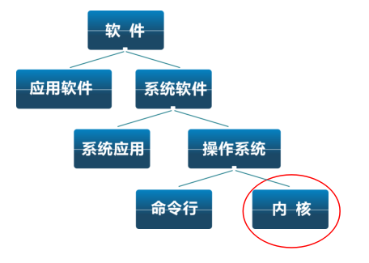
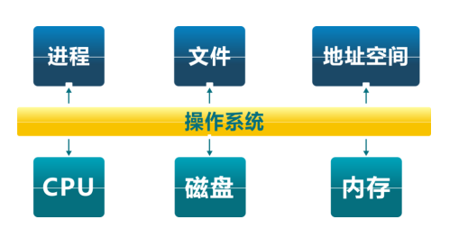

<!-- theme: gaia -->
<!-- _class: lead -->

## 第一講 操作系統概述
### 第二節 什麼是操作系統

 
 

向勇 陳渝 李國良 

 
 

2022年秋季

---

## 操作系統定義

沒有公認的精確定義

  操作系統是**管理硬件資源**、控制程序運行、改善人機界面和**為應用軟件提供支持**的一種系統**軟件**。[計算機百科全書]
 

承上啟下的操作系統

---

## 操作系統是一個控制程序
- 一個系統軟件
- 執行程序, 給程序**提供服務**
- 控制程序執行過程, **防止錯誤**
- **方便用戶使用**計算機系統

---

## 操作系統是一個資源管理程序
- 應用與硬件之間的**中間層**
- **管理**各種軟硬件資源
- 訪問軟硬件資源的**服務**
- **解決訪問衝突**, 確保公平使用

---

## 操作系統中的軟件分類

- Shell – 命令行接口
- GUI – 圖形用戶接口
- Kernel – 操作系統的內部

---
## uCore/rCore 教學操作系統內核

---
## 操作系統內核的抽象

---
## 操作系統內核的抽象

---
## 操作系統內核的特徵

- **併發**：計算機系統中同時存在多個運行程序
- **共享**：程序間“同時”訪問互斥共享各種資源
- **虛擬**：每個程序” 獨佔” 一臺完整的計算機
- **異步**：服務的完成時間不確定，也可能失敗 

---
## 你對操作系統內核的理解

###  用戶/應用對操作系統的需求？

---
## 你對操作系統內核的理解

###  用戶/應用對操作系統的需求？
- 高效 -- 易用 ?
- 強大的操作系統服務 -- 簡單的接口 ?
- 靈活性 -- 安全性 ?

---
## 為什麼要學習這門課程

- 可以瞭解計算機機殼後面的軟硬件運行原理
- 可以學習軟硬件基礎架構
- 可以發現和修復難對付的bug

<!-- 如果你花費大量時間來開發，維護並調試應用程序，你最終還是要知道大量操作系統的知識 -->