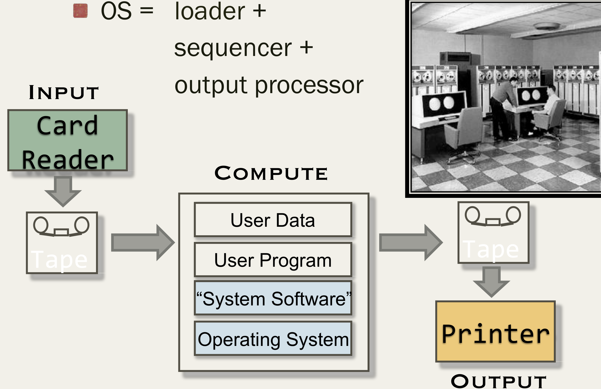
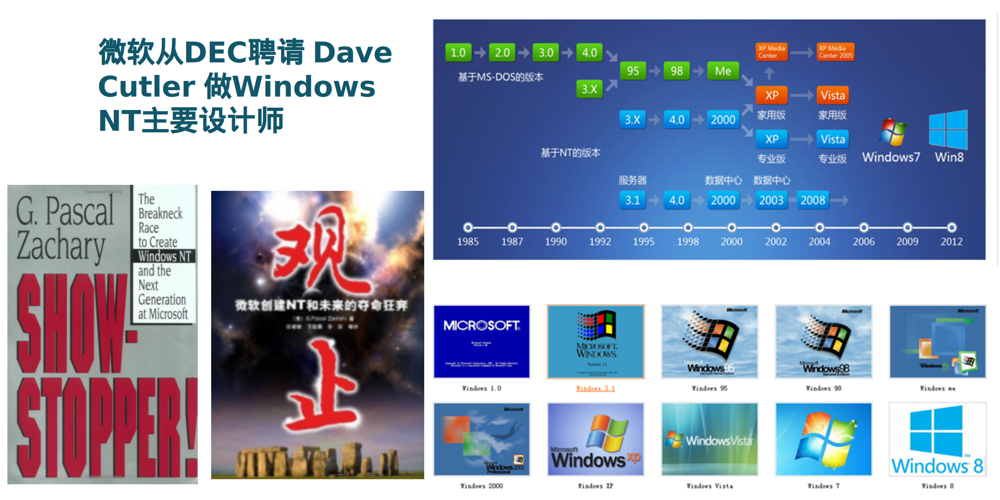
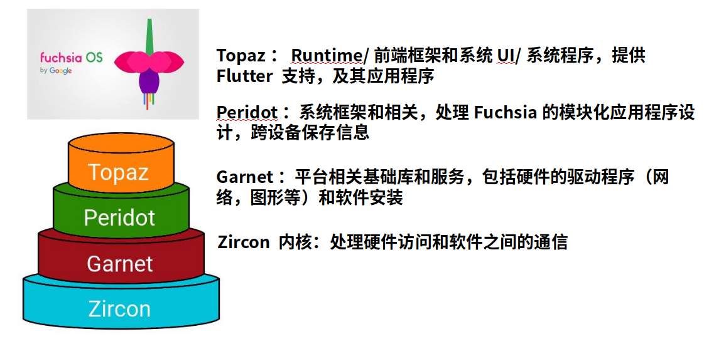

<!-- theme: gaia -->
<!-- page_number: true -->
<!-- _class: lead -->

## 第一講 操作系統概述

### 第三節 操作系統歷史演化

 
 

向勇 陳渝 李國良 

 
 

2022年秋季

---

## 單用戶系統

單用戶系統 (1945-1955)

- **手動**連線/紙帶傳輸進行程序輸入
- 機器成本遠大於人力**成本**
- **操作系統 = 裝載器 + 程序庫**
- 問題：昂貴組件的**低利用率**

---

## 批處理系統

批處理系統 (1955-1965)

- **磁帶/磁盤傳輸**進行程序輸入
- 機器成本大於人力成本
- 操作系統 = 裝載器 + **程序控制器 + 輸出處理器**
- 問題：相比以前利用率提高

---

## 批處理系統

**批處理**系統 (1955-1965)

- 磁帶/磁盤傳輸進行程序輸入
- 機器成本大於人力成本
- 操作系統 = 裝載器 + 程序控制器 + 輸出處理器
- 問題：相比以前利用率提高

---

## 多道程序系統

**多道**程序系統 (1955-1980)

- 多個程序駐留**內存**中
- 多個程序輪流使用 **CPU**
- 操作系統 = 裝載器 + **程序調度 + 內存管理** + 輸出管理
- 演變：相比以前利用率提高

---

## 分時系統

分時系統 (1970- 至今)  
- 多個程序駐留內存中  
- 多個程序分時使用 CPU  
- 操作系統 = 裝載器 + 程序調度 + 內存管理 + **中斷處理** +...  
- 演變：相比以前利用率提高、與外界**交互延時**縮短

---
## Multics OS

---
## Multics OS

---
## 開放的UNIX

---
## Linux家族

---
## 個人電腦

個人電腦 (1981- )
- 單用戶
- **計算機成本下降**使CPU利用率不再是最重要的關注點
- 重點是**用戶界面和多媒體功能**
- 操作系統 = 裝載器 + 程序調度 + 內存管理 + 中斷處理 +...
- 演變：**走向大眾**，老的服務和功能不存在，越來越多的安全問題

---
## MacOS家族

---
## MacOS家族

---
## Windows家族

---
## 分佈式系統

**分佈式**系統 (1990- )
- 分佈式多用戶
- 分佈式系統利用率是關注點
- 重點是網絡/存儲/計算的效率
- 操作系統 = 分佈式（裝載器 + 程序/OS 調度 + 內存管理）
- 演變：走向大眾，走向**網絡**，新的挑戰 (不可靠/不確定)

---
## Android操作系統
- 跨平臺：支持Java應用程序
- 運行時(runtime)：Android虛擬機
- 應用框架：簡化應用程序開發

---
## AIoT操作系統

AIoT 系統 (2000- )
- 分佈式**多設備**
- 分佈式系統利用率/可用性是關注點
- 重點是網絡/存儲/計算的效率
- 操作系統 = 分佈式（程序/OS 調度 + 內存管理 + 安全/更新）
- 演變：走向設備，走向網絡，新的挑戰 (不可靠/大數據)

---
## Fuchsia操作系統

