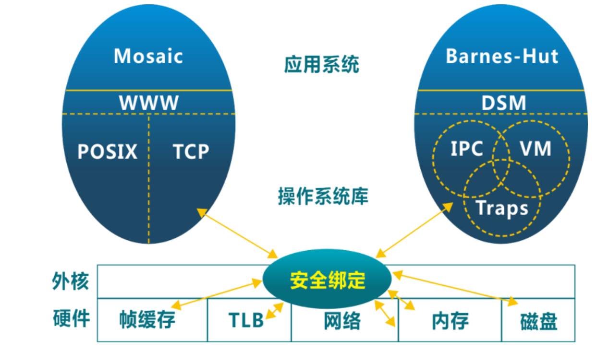
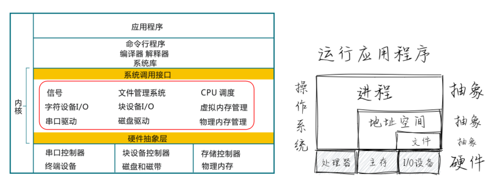

<!-- theme: gaia -->
<!-- page_number: true -->
<!-- _class: lead -->

## 第一講 操作系統概述

### 第四節 操作系統結構

 
 

向勇 陳渝 李國良 

 
 

2022年秋季

---
## 簡單結構
MS-DOS：應用和OS混在一起 (1981–1994)
- **沒有拆分為模塊**
- 主要用匯編編寫
- 沒有安全保護

---
## 單體分層結構
將單體操作系統 (Monolithic OS) 劃分為**多層** (levels)
- 每層建立在低層之上
- 最底層 (layer 0), 是硬件驅動
- 最高層 (layer N) 是用戶界面
- 每一層僅使用更低一層的功能和服務

---
## 微內核結構(Micro Kernel)
- **儘可能把內核功能移到用戶空間**
- 用戶模塊間的通信使用消息傳遞
- 好處: 靈活/安全...
- 缺點: 性能
- LPC: 本地過程調用(Local Procedure Call)
- HAL: 硬件抽象層（Hardware Abstraction Layer）

---
## 外核結構(Exokernel)
- 讓內核分配物理資源給多個應用程序, 並讓每個程序決定如何處理這些資源
- 程序能鏈接到操作系統庫 (libOS) 實現了操作系統抽象
- **保護與控制分離**
- Distributed Shared Memory(DSM)

---
## 虛擬機結構
虛擬機管理器將單獨的機器接口轉換成很多的虛擬機, 每個虛擬機都是一個原始計算機系統的有效副本, 並能完成所有的處理器指令

---
## 虛擬機結構

---
## 應用程序運行與 OS 抽象 + 架構的關係

