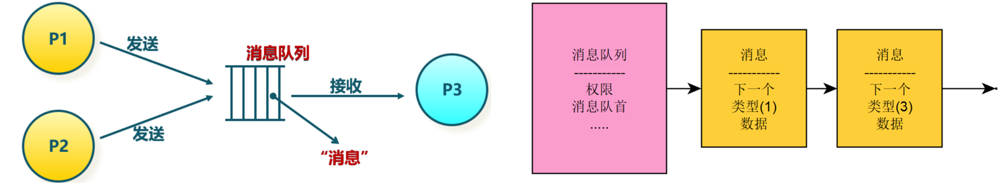

<!-- theme: gaia -->
<!-- _class: lead -->

# 第十講 進程間通信
Inter Process Communication, IPC
## 第一節 進程間通信(IPC)概述


<br>
<br>

向勇 陳渝 李國良 

2022年秋季

---

**提綱**

### 1. 進程間通信概述
2. 管道(pipe)
3. 消息隊列(Message Queue)
4. 共享內存(shared memory)
5. 信號(Signal)

---

#### 進程間通信的需求

- 挑戰：單個程序的功能有限
- IPC的目標：多進程協作完成複雜應用需求
  - 功能模塊化
  - 程序之間可以相對隔離
  - 多個程序的合作可完成複雜的事情

**進程間通信的定義**：各進程之間通過數據交換（共享或傳遞）進行**交互**的行為


---
#### 進程間的交互關係

- 獨立進程：與其它進程無交互
- 協作進程：兩個或多個進程之間有交互
   - 發送者 接收者 / 客戶端 服務端 

```
❯ cat README.md | grep rcore
$ git clone https://github.com/rcore-os/rCore-Tutorial-v3.git
...
* [x] expand the fs image size generated by `rcore-fs-fuse` to 128MiB
```
- `grep`依賴`cat`
  - `grep`等`cat`產生的輸出作為其輸入，來匹配字符串

---

#### 進程通信方式

- **直接通信**：兩個進程間不需要通過內核的中轉，就可以相互傳遞信息
- **間接通信**：兩個進程間通過系統調用和內核的中轉，來相互傳遞消息


---
#### IPC機制
進程間能共享或傳遞數據就算是進程間通信。

| IPC機制  |  含義  | 通信方式 |
| ------------------------ | ---- |---- |
|   管道 (Pipe)   | 單方向傳輸字節流  |間接通信 |
|   消息隊列 (Message Queue)   | 通過隊列中收/發消息 |間接通信 |
|  信號 (Signal)    | 異步發送信號給進程處理  |間接通信 |
|  套接字 (Socket)    | 多/單機進程間網絡通信  |間接通信 |
|  共享內存 (Shared Memory)    |  多個進程共享一塊物理內存  | 直接通信 |
| 文件 (File)     |  多個進程可訪問同一文件 | 間接通信 |

---
#### UNIX的典型IPC機制

進程間能共享或傳遞數據就是進程間通信。


---

#### 消息傳遞的基本接口
-  發送(send)消息
-  接收(recv)消息
-  遠程過程調用(RPC)
-  回覆(reply)消息

Remote Procedure Call, RPC = send + recv


---
#### 阻塞或非阻塞通信

- 阻塞通信: 
  - 阻塞發送、阻塞接收
- 非阻塞通信
  - 非阻塞發送、非阻塞接收


---
#### IPC的緩衝方式

- **無限容量**：發送方不需要等待
- **有限容量**：通信鏈路緩衝隊列滿時，發送方必須等待
- **0容量**: 發送方必須等待接收方


---

**提綱**

1. 進程間通信概述
### 2. 管道(pipe)
3. 消息隊列(Message Queue)
4. 共享內存(shared memory)
5. 信號(Signal)

---

#### 管道(pipe)

管道是一種進程間通信機制， 也稱為匿名管道(anonymous pipe)

- 有讀寫端的一定大小的**字節隊列**
- **讀端**只能用來從管道中讀取
- **寫端**只能用來將數據寫入管道
- 讀/寫端通過**不同文件描述符**表示


---
#### 創建管道

`int pipe(int pipefd[2])`
- 管道可表示為兩個文件描述符加一段內核空間中的內存
- 創建管道時，返回兩個文件描述符
  - 讀管道
  - 寫管道


---
#### 管道(pipe)的應用場景

- 支持有關係的進程間通信
  - 父子進程、兄弟進程等
- 父進程創建管道(兩個文件描述符)
  - 子進程會繼承文件描述符，執行讀寫管道


---
#### 管道(pipe)的應用場景

- 通常管道兩端的進程會各自關閉管道的一個文件描述符，如
  - 父進程關閉讀描述符，只能向管道**寫數據**
  - 子進程關閉寫描述符，只能從管道**讀數據**。


---
#### 管道實現機制


 
---
#### 管道[示例](https://gitee.com/chyyuu/os-usrapp-lab/blob/main/c/ipc/pipe/ex1.c)

```
$ gcc -o ex1 ex1.c
$ ./ex1
parent
write: the 0 message. 
write: the 1 message. 
...
children
read: the 0 message. 
read: the 1 message. 
...
```
建議：同學們可在課後在自己的開發環境中實踐一下


---
#### Shell中的管道

只需使用一根豎線 "**|**" 連接兩個命令即

```
rCore-Tutorial-v3 on ch7
❯ cat README.md | grep rcore
$ git clone https://github.com/rcore-os/rCore-Tutorial-v3.git
...
* [x] expand the fs image size generated by `rcore-fs-fuse` to 128MiB
```
- 對於編寫靈活的命令行腳本非常方便
- 不支持任意兩個進程間的通信

---
#### 命名管道（named pipe）
在shell中可用mkfifo命令創建命名管道，也稱為FIFO。

匿名管道與命名管道都屬於單向通信機制。兩者的不同是：
- 命名管道可以支持任意兩個進程間的通信
- 匿名管道只支持父子進程和兄弟進程間的通信

命名管道是阻塞式的單向通信管道
- 任意一方都可以讀、寫
- 只有讀、寫端同時打開了命名管道時，數據才會寫入並被讀取

---

#### 命名管道

shell A
```
$ mkfifo name.fifo
$ echo README > name.fifo  #文件類型為p，寫命名管道阻塞
```
shell B
```
$ cat name.fifo
```

但：字節流形態，不支持任意兩個進程間的雙向通信
命名管道[示例](https://www.cnblogs.com/52php/p/5840229.html)

---

**提綱**

1. 進程間通信概述
2. 管道(pipe)
### 3. 消息隊列(Message Queue)
4. 共享內存(shared memory)
5. 信號(Signal)

---

#### 消息隊列(Message Queue)
消息隊列是由操作系統維護的以結構數據為基本單位的間接通信機制
- 每個消息(Message)是一個字節序列，有自己的**類型標識**
- 相同類型標識的消息組成按**先進先出**順序組成一個消息隊列



---
#### 消息隊列實現機制


---
#### 消息隊列實現機制


---
#### 消息隊列的系統調用
<!-- https://zhuanlan.zhihu.com/p/268389190  Linux進程間通信——消息隊列 -->
- 消息隊列的系統調用
  - msgget ( key, flags） //獲取消息隊列標識
  - msgsnd ( QID, buf, size, flags ） //發送消息
  - msgrcv ( QID, buf, size, type, flags ） //接收消息
  - msgctl( … ） // 消息隊列控制

消息的結構
```
struct msgbuf {
	long mtype;         /* 消息的類型 */
	char mtext[1];      /* 消息正文 */
};
```

---
#### 創建消息隊列
```
#include <sys/types.h>
#include <sys/ipc.h>
#include <sys/msg.h>

int msgget(key_t key, int msgflg);
```
參數：
- key: 某個消息隊列的名字
- msgflg:由九個權限標誌構成，用法和創建文件時使用的mode模式標誌是一樣的，IPC_CREAT or IPC_EXCL等


---
#### 創建消息隊列
```
#include <sys/types.h>
#include <sys/ipc.h>
#include <sys/msg.h>

int msgget(key_t key, int msgflg);
```
返回值：

- 成功：msgget將返回一個非負整數，即該消息隊列的標識碼；
- 失敗：則返回“-1”


---
#### 創建消息隊列
```
#include <sys/types.h>
#include <sys/ipc.h>
#include <sys/msg.h>

int msgget(key_t key, int msgflg);
```
那麼如何獲取key值？

- 通過宏定義key值
- 通過ftok函數生成key值


---
#### 發送消息
```
int  msgsnd(int msgid, const void *msg_ptr, size_t msg_sz, int msgflg);
```
參數：
- msgid: 由msgget函數返回的消息隊列標識碼
- msg_ptr:是指向待發送數據的指針
- msg_sz:是msg_ptr指向的數據長度
- msgflg:控制著當前消息隊列滿或到達系統上限時的行為
如：IPC_NOWAIT 表示隊列滿不等待，返回EAGAIN錯誤


---
#### 發送消息

```
int  msgsnd(int msgid, const void *msg_ptr, size_t msg_sz, int msgflg);
```
- 成功返回0
- 失敗則返回-1


---
#### 接收消息
```
int  msgrcv(int msgid, void *msg_ptr, size_t msgsz,long int msgtype, int msgflg);
```

- msgid: 由msgget函數返回的消息隊列標識碼
- msg_ptr:是指向準備接收的消息的指針
- msgsz:是msg_ptr指向的消息長度
- msgtype:它可以實現接收優先級的簡單形式
    - msgtype=0返回隊列第一條信息
    - msgtype>0返回隊列第一條類型等於msgtype的消息　
    - msgtype<0返回隊列第一條類型小於等於msgtype絕對值的消息


---
#### 接收消息
```
int  msgrcv(int msgid, void *msg_ptr, size_t msgsz,long int msgtype, int msgflg);
```
- msgflg:控制著隊列中沒有相應類型的消息可供接收時的行為
  - IPC_NOWAIT，隊列沒有可讀消息不等待，返回ENOMSG錯誤
  - MSG_NOERROR，消息大小超過msgsz時被截斷

返回值：
- 成功：返回實際放到接收緩衝區裡去的字符個數
- 失敗：則返回-1


---
#### 消息隊列[示例程序](https://gitee.com/chyyuu/os-usrapp-lab/blob/main/c/ipc/message-queues/ex1.c)
```
$ gcc ex1.c 
$ ./a.out
Parent: input message type:
1
Parent: input message to be sent:
test
Parent: input message type:
Child: read msg:test
0
```
建議：同學們可在課後在自己的開發環境中實踐一下

---

**提綱**

1. 進程間通信概述
2. 管道(pipe)
3. 消息隊列(Message Queue)
### 4. 共享內存(shared memory)
5. 信號(Signal)

---

#### 共享內存(shared memory, shmem)

共享內存是把同一個物理內存區域同時映射到多個進程的內存地址空間的通信機制
- 每個進程的內存地址空間需明確設置共享內存段
- 優點：快速、方便地共享數據
- 不足：需要同步機制協調數據訪問


 

---
#### 共享內存的系統調用
<!-- https://zhuanlan.zhihu.com/p/147826545  Linux系統編程之進程間通信：共享內存 -->
- shmget( key, size, flags） //創建共享段
- shmat( shmid, *shmaddr, flags） //把共享段映射到進程地址空間
- shmdt( *shmaddr）//取消共享段到進程地址空間的映射
- shmctl( …） //共享段控制

注：需要信號量等同步機制協調共享內存的訪問衝突

---
#### 共享內存實現機制


---
#### 創建共享內存
```
#include <sys/ipc.h>
#include <sys/shm.h>
int shmget(key_t key, size_t size,int shmflg);
```
- key：進程間通信鍵值，ftok() 的返回值。
- size：該共享存儲段的長度(字節)。
- shmflg：標識函數的行為及共享內存的權限，其取值如下：
  - IPC_CREAT：如果不存在就創建
  - IPC_EXCL： 如果已經存在則返回失敗
- 返回值：成功：共享內存標識符； 失敗：-1。


---
#### 共享內存映射
```
#include <sys/types.h>
#include <sys/shm.h>
void *shmat(int shmid, const void *shmaddr, int shmflg);
```
將一個共享內存段映射到調用進程的數據段中。即：讓進程和共享內存建立一種聯繫，讓進程某個指針指向此共享內存。

返回值：
- 成功：共享內存段映射地址( 相當於這個指針就指向此共享內存 )
- 失敗：-1

---
#### 共享內存映射
```
void *shmat(int shmid, const void *shmaddr, int shmflg);
```
- shmid：共享內存標識符，shmget() 的返回值。
- shmaddr：共享內存映射地址，若為 NULL 則由系統自動指定
- shmflg：共享內存段的訪問權限和映射條件，取值如下：
  - 0：共享內存具有可讀可寫權限。
  - SHM_RDONLY：只讀。
  - SHM_RND：（shmaddr 非空時才有效）


---
#### 共享內存[示例程序](https://gitee.com/chyyuu/os-usrapp-lab/blob/main/c/ipc/shared-memory/)

```
$ gcc writer.c -o w
$ gcc reader.c -o r
$ ./w
 Writer: copy data to shared-memory
```

---
#### 共享內存示例

```
$ ./r
------------ 共享內存段 --------------
鍵        shmid      擁有者  權限     字節     連接數  狀態
0xdf20482b 1          chyyuu     666        512        0

data = [ How are you, mike: from Writer ]
deleted shared-memory

------------ 共享內存段 --------------
鍵        shmid      擁有者  權限     字節     連接數  狀態
```
建議：同學們可在課後在自己的開發環境中實踐一下

---

**提綱**

1. 進程間通信概述
2. 管道(pipe)
3. 消息隊列(Message Queue)
4. 共享內存(shared memory)
### 5. 信號(Signal)

---

#### 信號(Signal)
- **信號**是中斷正在運行的進程的異步消息或事件
- **信號機制**是一種進程間異步通知機制

問題：
- `Ctrl+C`為什麼可以結束進程？
- kill命令是怎麼結束進程的？


---
#### 信號發送和響應過程


---
#### 信號命名
- 信號是一個**整數編號**，這些整數編號都定義了對應的宏名，宏名都是以SIG開頭，比如SIGABRT, SIGKILL, SIGSTOP, SIGCONT


---
#### 信號發送
- 進程通過內核發出信號
  - shell通過kill命令向某個進程發送一個信號將其終止
- 內核直接發出信號
  - 某進程從管道讀取數據，但是管道的讀權限被關閉了，內核會給進程發送一個SIGPIPE信號，提示讀管道出錯 


---
#### 信號發送
- 外設通過內核發出
  - 比如按下Ctrl+C按鍵時，內核收到包含Ctrl+C按鍵的外設中斷，會向正在運行的進程發送SIGINT信號，將其異常終止


---
#### 信號接收進程的處理方式
- 忽略：信號沒有發生過
- 捕獲：進程會調用相應的處理函數進行處理
- 默認：如果不忽略也不捕獲，此時進程會使用內核默認的處理方式來處理信號
  -  內核默認的信號處理：在大多情況下就是殺死進程或者直接忽略信號


---
#### Linux信號
Linux有哪些信號？ -- 62個


---
#### Linux信號

為什麼這麼多信號？
  -  每個信號代表著某種事件，一般情況下，當進程收到某個信號時，就表示該信號所代表的事件發生了。  
  - 對1~34中的常用信號，要求是理解，而不是記憶。當忘記了信號名字時，kill -l查看即可。

---
#### Linux常用信號
- SIGKILL
- SIGINT
- SIGSEGV


---
#### 信號實現機制


<!-- Ref: Understanding the Linux Kernel
Signals and Inter-Process Communication  https://compas.cs.stonybrook.edu/~nhonarmand/courses/fa14/cse506.2/slides/ipc.pdf -->


---
#### 信號實現機制


---
#### 信號實現機制
- 註冊用戶態信號處理函數sig_handler；
- 內核在返回用戶態前，發現有信號要處理；
- 內核在用戶棧壓入sig_handler函數棧信息；
  - 模擬用戶代碼調用sig_handler函數
-  內核在陷入上下文中修改用戶態返回地址；
- 內核返回用戶態，直接跳到sig_handler;
- sig_handler函數返回到舊代碼位置繼續執行


---

#### 信號應用編程


---
### 小結
- 管道的機制和實現原理
- 消息隊列的機制和實現原理
- 共享內存的機制和實現原理
- 信號的機制和實現原理
- 上述機制與進程控制與管理的關係