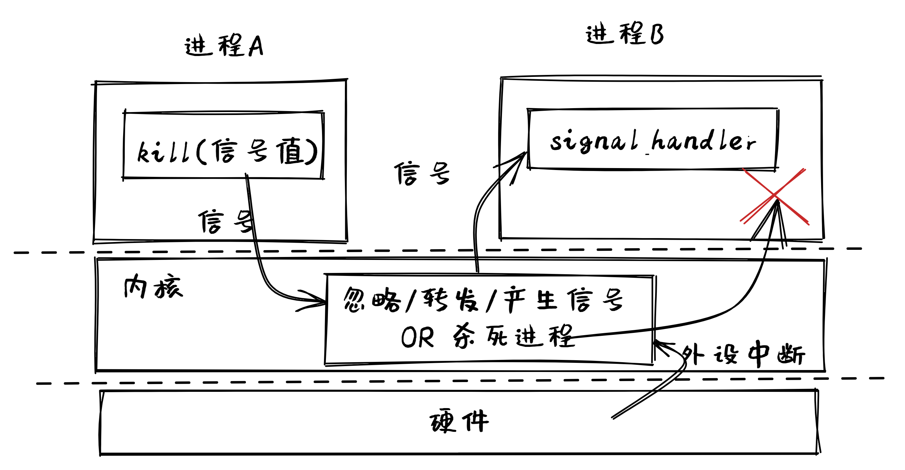
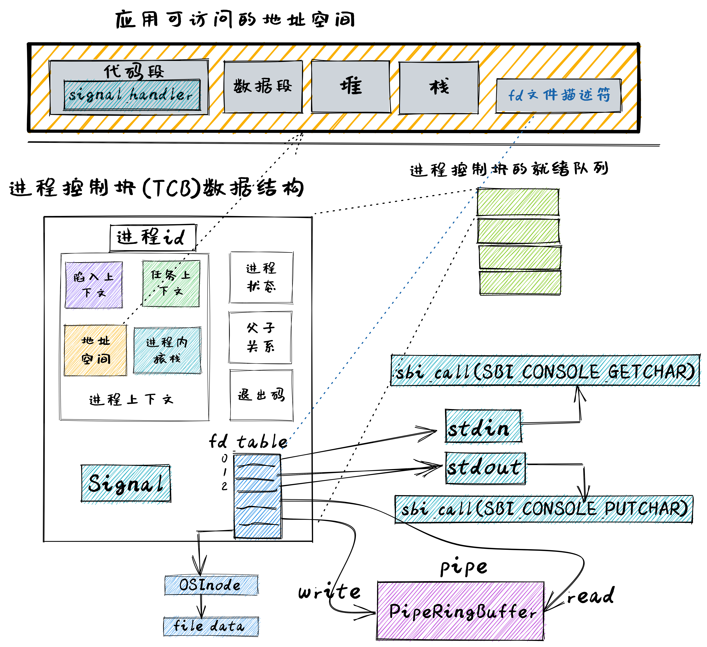
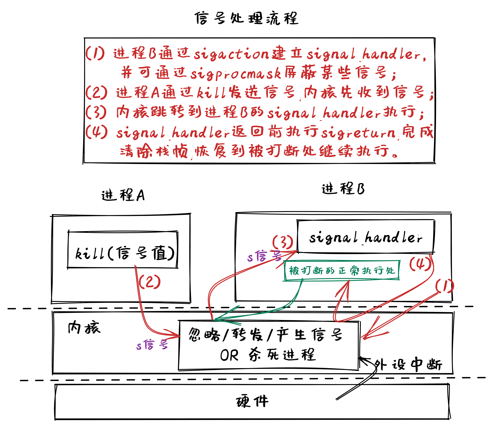

<!-- theme: gaia -->
<!-- _class: lead -->

# 第十講 進程間通信

## 第二節 支持IPC的OS
IPC OS (IOS)

<br>
<br>

向勇 陳渝 李國良 

2022年秋季

---

**提綱**

### 1. 實驗安排
- 實驗目標
- 總體思路
- 歷史背景
- 實踐步驟
2. 代碼結構
3. 管道的設計實現
4. 信號的設計實現


---

#### 以往實驗目標

提高性能、簡化開發、加強安全、支持數據持久保存
- Filesystem OS：支持數據持久保存
- Process OS: 增強進程管理和資源管理
- Address Space OS: 隔離APP訪問的內存地址空間
- multiprog & time-sharing OS: 讓APP共享CPU資源
- BatchOS: 讓APP與OS隔離，加強系統安全，提高執行效率
- LibOS: 讓APP與HW隔離，簡化應用訪問硬件的難度和複雜性

---
#### 實驗目標
支持應用的靈活性，支持進程間交互
- 擴展文件抽象：Pipe，Stdout, Stdin
- 以文件形式進行進程間數據交換
- 以文件形式進行串口輸入輸出  
- 信號實現進程間異步通知機制
- 系統調用數量：11個 --> 17個
  - 管道：2 個、用於傳數據
  - 信號：4 個、用於發通知


---

#### 實驗要求

- 理解文件抽象
- 理解IPC機制的設計與實現
  - pipe
  - signal
- 會寫支持IPC的OS

<!-- 迅猛龍Velociraptor具有匿蹤能力和狡詐本領。迅猛龍比較聰明具有團隊協作能力、擅長團隊合作 操作系統  -->


---

**提綱**

1. 實驗安排
- 實驗目標
### 總體思路
- 歷史背景
- 實踐步驟
2. 代碼結構
3. 管道的設計實現
4. 信號的設計實現


---

#### 管道實現需要考慮的問題

- 管道是啥？
- 如何訪問管道？
- 如何管理管道？


---

#### 理解管道

**管道是內核中的一塊內存**
-  順序寫入/讀出字節流

**管道可抽象為文件**
- 進程中包含管道文件描述符
  - 管道的`File`Trait的接口
  - read/write
- 應用創建管道的系統調用
  - `sys_pipe`


---

#### 管道示例程序 (用戶態)
```rust
...// usr/src/bin/pipetest.rs
static STR: &str = "Hello, world!"  //字符串全局變量
pub fn main() -> i32 {
    let mut pipe_fd = [0usize; 2]; //包含兩個元素的fd數組
    pipe(&mut pipe_fd); // create pipe
    if fork() == 0 { // child process, read from parent
        close(pipe_fd[1]); // close write_end
        let mut buffer = [0u8; 32]; //包含32個字節的字節數組
        let len_read = read(pipe_fd[0], &mut buffer) as usize; //讀pipe
    } else { // parent process, write to child
        close(pipe_fd[0]); // close read end
        write(pipe_fd[1], STR.as_bytes()); //寫pipe
        let mut child_exit_code: i32 = 0;
        wait(&mut child_exit_code); //父進程等子進程結束
    }
...
```
---

#### 管道與進程的關係
- `pipe`是進程控制塊的資源之一


---

#### 信號實現需要考慮的問題
- 信號是啥？
- 如何使用信號？
- 如何管理信號？



<!-- linux signal那些事兒 http://blog.chinaunix.net/uid-24774106-id-4061386.html -->

---

#### 理解信號
`signal`是內核通知應用的軟件中斷

**準備階段**
- 設定`signal`的整數編號值
- 建立應對某`signal`編號值的例程`signal_handler`

**執行階段**
- 向某進程發出signal，打斷進程的當前執行，轉到`signal_handler`執行


---

#### 信號示例程序（用戶態）
```rust
...// usr/src/bin/sig_simple.rs
fn func() { //signal_handler
    println!("user_sig_test succsess");
    sigreturn(); //回到信號處理前的位置繼續執行
}
pub fn main() -> i32 {
    let mut new = SignalAction::default();  //新信號配置
    let old = SignalAction::default();      //老信號配置
    new.handler = func as usize;            //設置新的信號處理例程
    if sigaction(SIGUSR1, &new, &old) < 0 { //setup signal_handler
        panic!("Sigaction failed!");
    }
    if kill(getpid() as usize, SIGUSR1) <0{ //send SIGUSR1 to itself
      ...
    }
...
```

---

#### 信號與進程的關係
- `signal`是進程控制塊的資源之一


---

**提綱**

1. 實驗安排
- 實驗目標
- 總體思路
### 歷史背景
- 實踐步驟
2. 代碼結構
3. 管道的設計實現
4. 信號的設計實現


---

#### 管道：Unix 中最引人注目的發明

- 管道的概念來自貝爾實驗室的Douglas McIlroy，他在1964年寫的一份內部文件中，提出了把多個程序“像花園水管一樣”串連並擰在一起的想法，這樣數據就可以在不同程序中流動。
- 大約在1972年下半年，Ken Thompson在聽了Douglas McIlroy關於管道的嘮叨後，靈機一動，迅速把管道機制實現在UNIX中。
 


<!-- 道格拉斯McIlroy (生於 1932年)是數學家,工程師和程序員. 自2007年他是附屬教授電腦科學在麻省理工學院獲得博士。
McIlroy為原始被開發是最響譽 Unix管道實施, 軟件元件部分 並且數 Unix 用工具加工，例如電腦病毒， diff, 排序, 加入圖表，講話，和 tr. -->


---
#### 信號：Unix 中容易出錯的軟件中斷

信號從Unix的第一個版本就已存在，只是與我們今天所知道的有點不同，需要通過不同的系統調用來捕獲不同類型的信號。在版本4之後，改進為通過一個系統調用來捕獲所有信號。


<!-- https://venam.nixers.net/blog/unix/2016/10/21/unix-signals.html
https://unix.org/what_is_unix/history_timeline.html
https://en.wikipedia.org/wiki/Signal_(IPC) -->

---

**提綱**

1. 實驗安排
- 實驗目標
- 總體思路
- 歷史背景
### 實踐步驟
2. 代碼結構
3. 管道的設計實現
4. 信號的設計實現


---

#### 實踐步驟 
```
git clone https://github.com/rcore-os/rCore-Tutorial-v3.git
cd rCore-Tutorial-v3
git checkout ch7
cd os
make run
```


---
#### 參考輸出
```
[RustSBI output]
...
filetest_simple
fantastic_text
**************/
Rust user shell
>>
```
操作系統啟動``shell``後，用戶可以在``shell``中通過敲入應用名字來執行應用。

---
#### 測例 pipetest 
在這裡我們運行一下本章的測例 pipetest ：
```
>> pipetest
Read OK, child process exited!
pipetest passed!
>>
```
此應用的父子進程通過pipe完成字符串`"Hello, world!"`的傳遞。

---
#### 測例 sig_simple

在這裡我們運行一下本章的測例 sig_simple ：

```
>> sig_simple 
signal_simple: sigaction
signal_simple: kill
user_sig_test succsess
signal_simple: Done
>>
```
此應用建立了針對`SIGUSR1`信號的信號處理例程`func`，然後再通過`kill`給自己發信號`SIGUSR1`，最終`func`會被調用。


---

**提綱**

1. 實驗安排
### 2. 代碼結構
3. 管道的設計實現
4. 信號的設計實現


---

#### 用戶代碼結構
```
└── user
    └── src
        ├── bin
        │   ├── pipe_large_test.rs(新增：大數據量管道傳輸)
        │   ├── pipetest.rs(新增：父子進程管道傳輸)
        │   ├── run_pipe_test.rs(新增：管道測試)
        │   ├── sig_tests.rs(新增：多方位測試信號機制)
        │   ├── sig_simple.rs(新增：給自己發信號)
        │   ├── sig_simple2.rs(新增：父進程給子進程發信號)
        ├── lib.rs(新增兩個系統調用：sys_close/sys_pipe/sys_sigaction/sys_kill...)
        └── syscall.rs(新增兩個系統調用：sys_close/sys_pipe/sys_sigaction/sys_kill...)
```

---
#### 內核代碼結構
```
├── fs(新增：文件系統子模塊 fs)
│   ├── mod.rs(包含已經打開且可以被進程讀寫的文件的抽象 File Trait)
│   ├── pipe.rs(實現了 File Trait 的第一個分支——可用來進程間通信的管道)
│   └── stdio.rs(實現了 File Trait 的第二個分支——標準輸入/輸出)
├── mm
│   └── page_table.rs(新增：應用地址空間的緩衝區抽象 UserBuffer 及其迭代器實現)
├── syscall
│   ├── fs.rs(修改：調整 sys_read/write 的實現，新增 sys_close/pipe)
│   ├── mod.rs(修改：調整 syscall 分發)
├── task
│   ├── action.rs(信號處理SignalAction的定義與缺省行為)
│   ├── mod.rs（信號處理相關函數）
│   ├── signal.rs（信號處理的信號值定義等）
│   └── task.rs(修改：在任務控制塊中加入信號相關內容)
└── trap
├── mod.rs（進入/退出內核時的信號處理）
```        


---

**提綱**

1. 實驗安排
2. 代碼結構
### 3. 管道的設計實現
4. 信號的設計實現


---
#### 管道的設計實現
基於文件抽象，支持I/O重定向
1. [K] 實現基於文件的標準輸入/輸出
2. [K] 實現基於文件的實現管道
3. [U]  支持命令行參數
4. [U]  支持 “|"  符號



---
#### 標準文件

1.  實現基於文件的標準輸入/輸出
 - FD：0 --  Stdin  ; 1/2 -- Stdout
 - 實現File 接口
   - read -> call(SBI_CONSOLE_GETCHAR)
   - write -> call(SBI_CONSOLE_PUTCHAR)


---
#### 標準文件初始化

2. 創建TCB時初始化`fd_table`

```rust
TaskControlBlock::fork(...)->... {
  ...
  let task_control_block = Self {
      ...
          fd_table: vec![
              // 0 -> stdin
              Some(Arc::new(Stdin)),
              // 1 -> stdout
              Some(Arc::new(Stdout)),
              // 2 -> stderr
              Some(Arc::new(Stdout)),
          ],
...
```


---
#### fork實現中的標準文件創建

3. `fork`時複製`fd_table`

```rust
TaskControlBlock::new(elf_data: &[u8]) -> Self{
  ...
    // copy fd table
    let mut new_fd_table = Vec::new();
    for fd in parent_inner.fd_table.iter() {
        if let Some(file) = fd {
            new_fd_table.push(Some(file.clone()));
        } else {
            new_fd_table.push(None);
        }
    }
```


---
#### 管道文件

1. 管道的系統調用

```rust
/// 功能：為當前進程打開一個管道。
/// 參數：pipe 表示應用地址空間中
/// 的一個長度為 2 的 usize 數組的
/// 起始地址，內核需要按順序將管道讀端
/// 和寫端的文件描述符寫入到數組中。
/// 返回值：如果出現了錯誤則返回 -1，
/// 否則返回 0 。
/// 可能的錯誤原因是：傳入的地址不合法。
/// syscall ID：59
pub fn sys_pipe(pipe: *mut usize) -> isize;
```


---
#### 管道文件

2. 創建管道中的Buffer

```rust
pub struct PipeRingBuffer {
    arr: [u8; RING_BUFFER_SIZE],
    head: usize,
    tail: usize,
    status: RingBufferStatus,
    write_end: Option<Weak<Pipe>>,
}

make_pipe() -> (Arc<Pipe>, Arc<Pipe>) {
    let buffer = PipeRingBuffer::new();
    let read_end = Pipe::read_end_with_buffer();
    let write_end = Pipe::write_end_with_buffer();
    ...
    (read_end, write_end)  
```


---
#### 管道文件

3.  實現基於文件的輸入/輸出
 - 實現File 接口
```rust
    fn read(&self, buf: UserBuffer) -> usize {
       *byte_ref = ring_buffer.read_byte();
    }
    fn write(&self, buf: UserBuffer) -> usize {  
      ring_buffer.write_byte( *byte_ref );
    }
```


---
#### exec系統調用的命令行參數
- sys_exec 的系統調用接口需要發生變化
```rust
// 增加了args參數
pub fn sys_exec(path: &str, args: &[*const u8]) -> isize;
```
- shell程序的命令行參數分割
```rust
// 從一行字符串中獲取參數
let args: Vec<_> = line.as_str().split(' ').collect();
// 用應用名和參數地址來執行sys_exec系統調用
exec(args_copy[0].as_str(), args_addr.as_slice())
```


---

#### exec系統調用的命令行參數

- 將獲取到的參數字符串壓入到用戶棧上
```rust
impl TaskControlBlock {
 pub fn exec(&self, elf_data: &[u8], args: Vec<String>) {
   ...
   // push arguments on user stack
 }
```
- Trap 上下文中的 a0/a1 寄存器，讓 a0 表示命令行參數的個數，而 a1 則表示圖中 argv_base 即藍色區域的起始地址。


---

#### exec系統調用的命令行參數

```rust
pub extern "C" fn _start(argc: usize, argv: usize) -> ! {
   //獲取應用的命令行個數 argc, 獲取應用的命令行參數到v中
   //執行應用的main函數
   exit(main(argc, v.as_slice()));
} 
```


---
#### 重定向
- 複製文件描述符系統調用
```rust
/// 功能：將進程中一個已經打開的文件複製
/// 一份並分配到一個新的文件描述符中。
/// 參數：fd 表示進程中一個已經打開的文件的文件描述符。
/// 返回值：如果出現了錯誤則返回 -1，否則能夠訪問已打
/// 開文件的新文件描述符。
/// 可能的錯誤原因是：傳入的 fd 並不對應一個合法的已打
/// 開文件。
/// syscall ID：24
pub fn sys_dup(fd: usize) -> isize;
```
<!--  -->


---
#### 重定向
- 複製文件描述符系統調用
```rust
pub fn sys_dup(fd: usize) -> isize {
  ...
  let new_fd = inner.alloc_fd();
  inner.fd_table[new_fd] = inner.fd_table[fd];
  newfd
} 
```
<!--  -->


---
#### shell重定向 "$ A | B"
```rust
// user/src/bin/user_shell.rs
{
  let pid = fork();
    if pid == 0 {  
        let input_fd = open(input, ...); //輸入重定向 -- B 子進程
        close(0);                        //關閉文件描述符0
        dup(input_fd); //文件描述符0與文件描述符input_fd指向同一文件
        close(input_fd); //關閉文件描述符input_fd
        //或者
        let output_fd = open(output, ...);//輸出重定向 -- A子進程
        close(1);                         //關閉文件描述符1
        dup(output_fd);//文件描述符1與文件描述符output_fd指向同一文件
        close(output_fd);//關閉文件描述符output_fd
    //I/O重定向後執行新程序
     exec(args_copy[0].as_str(), args_addr.as_slice()); 
    }...
```

<!--  -->


---

**提綱**

1. 實驗安排
2. 代碼結構
3. 管道的設計實現
### 4. 信號的設計實現
- signal的系統調用
- signal核心數據結構
- 建立signal_handler
- 支持kill系統調用


---

#### 與信號處理相關的系統調用

<!-- https://www.onitroad.com/jc/linux/man-pages/linux/man2/sigreturn.2.html -->
- sigaction: 設置信號處理例程
- sigprocmask: 設置要阻止的信號
- kill: 將某信號發送給某進程
- sigreturn: 清除堆棧幀，從信號處理例程返回



---
#### 與信號處理相關的系統調用
<!-- https://www.onitroad.com/jc/linux/man-pages/linux/man2/sigreturn.2.html -->
```rust
// 設置信號處理例程
// signum：指定信號
// action：新的信號處理配置
// old_action：老的的信號處理配置
sys_sigaction(signum: i32, 
   action: *const SignalAction,
   old_action: *const SignalAction) 
   -> isize

pub struct SignalAction {
    // 信號處理例程的地址
    pub handler: usize, 
    // 信號掩碼
    pub mask: SignalFlags
}   
```


---
#### 與信號處理相關的系統調用
<!-- https://www.onitroad.com/jc/linux/man-pages/linux/man2/sigreturn.2.html -->
```rust
// 設置要阻止的信號
// mask：信號掩碼
sys_sigprocmask(mask: u32) -> isize 
```
```rust
// 清除堆棧幀，從信號處理例程返回
 sys_sigreturn() -> isize
```
```rust
// 將某信號發送給某進程
// pid：進程pid
// signal：信號的整數碼
sys_kill(pid: usize, signal: i32) -> isize
```


---
#### 信號的核心數據結構
進程控制塊中的信號核心數據結構
```rust
pub struct TaskControlBlockInner {
    ...
    pub signals: SignalFlags,     // 要響應的信號
    pub signal_mask: SignalFlags, // 要屏蔽的信號
    pub handling_sig: isize,      // 正在處理的信號
    pub signal_actions: SignalActions,       // 信號處理例程表
    pub killed: bool,             // 任務是否已經被殺死了
    pub frozen: bool,             // 任務是否已經被暫停了
    pub trap_ctx_backup: Option<TrapContext> //被打斷的trap上下文
}
```
<!-- 
killed的作用是標誌當前進程是否已經被殺死。因為進程收到殺死信號的時候並不會立刻結束，而是會在適當的時候退出。這個時候需要killed作為標記，退出不必要的信號處理循環。

frozen的標誌與SIGSTOP和SIGCONT兩個信號有關。SIGSTOP會暫停進程的執行，即將frozen置為true。此時當前進程會阻塞等待SIGCONT（即解凍的信號）。當信號收到SIGCONT的時候，frozen置為false，退出等待信號的循環，返回用戶態繼續執行。 -->

---
#### 建立signal_handler

```rust
fn sys_sigaction(signum: i32, action: *const SignalAction, 
                          old_action: *mut SignalAction) -> isize {
  //保存老的signal_handler地址到old_action中
  let old_kernel_action = inner.signal_actions.table[signum as usize];
  *translated_refmut(token, old_action) = old_kernel_action;
 //設置新的signal_handler地址到TCB的signal_actions中
  let ref_action = translated_ref(token, action);
  inner.signal_actions.table[signum as usize] = *ref_action;
```
對於需要修改的信號編號signum：
1. 保存老的signal_handler地址到`old_action`
2. 設置`action`為新的signal_handler地址


---
#### 通過kill發出信號

```rust
fn sys_kill(pid: usize, signum: i32) -> isize {
      let Some(task) = pid2task(pid);
      // insert the signal if legal
      let mut task_ref = task.inner_exclusive_access();
      task_ref.signals.insert(flag);
     ...
```
對進程號為`pid`的進程發送值為`signum`的信號：
1. 根據`pid`找到TCB
2. 在TCB中的signals插入`signum`信號值


---
#### 通過kill發出和處理信號的過程
當`pid`進程進入內核後，直到從內核返回用戶態前的執行過程：
```
執行APP --> __alltraps 
         --> trap_handler 
            --> handle_signals 
                --> check_pending_signals 
                    --> call_kernel_signal_handler
                    --> call_user_signal_handler
                       -->  // backup trap Context
                            // modify trap Context
                            trap_ctx.sepc = handler; //設置回到中斷處理例程的入口
                            trap_ctx.x[10] = sig;   //把信號值放到Reg[10]
            --> trap_return //找到並跳轉到位於跳板頁的`__restore`彙編函數
       -->  __restore //恢復被修改過的trap Context，執行sret
執行APP的signal_handler函數
 ```                               

 
---
#### APP恢復正常執行
當進程號為pid的進程執行完signal_handler函數主體後，會發出`sys_sigreturn`系統調用:
```rust
fn sys_sigreturn() -> isize {
  ...
  // 恢復之前備份的trap上下文
  let trap_ctx = inner.get_trap_cx();
  *trap_ctx = inner.trap_ctx_backup.unwrap();
  ...
執行APP --> __alltraps 
       --> trap_handler 
            --> 處理 sys_sigreturn系統調用
            --> trap_return //找到並跳轉到位於跳板頁的`__restore`彙編函數
    -->  __restore //恢復被修改過的trap Context，執行sret
執行APP被打斷的地方
```       


---
#### 屏蔽信號
```rust
fn sys_sigprocmask(mask: u32) -> isize {
    ...
    inner.signal_mask = flag;
    old_mask.bits() as isize
    ...
```
把要屏蔽的信號直接記錄到TCB的signal_mask數據中

---
### 小結
- 管道的概念與實現
- 信號的概念與實現
- 能寫迅猛龍操作系統


---

### 課程實驗四 文件系統與進程間通信

* 第六章：文件系統與I/O重定向 -> chapter6練習 -> 
    * [rCore](https://learningos.github.io/rCore-Tutorial-Guide-2022A/chapter6/4exercise.html#id1)
    * [uCore](https://learningos.github.io/uCore-Tutorial-Guide-2022A/chapter6/5exercise.html#id3)
* 實驗任務
    * 硬鏈接
* 實驗提交要求
    * 任務佈置後的第11天（2022年12月04日）；