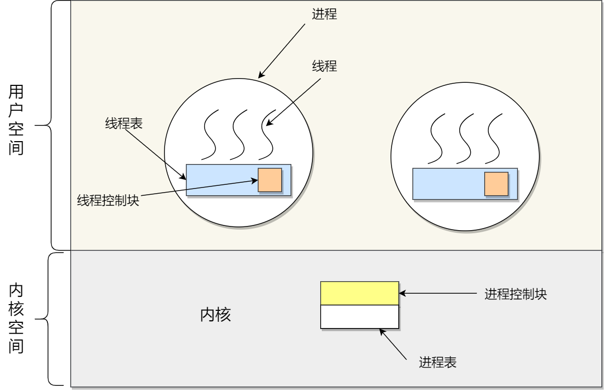
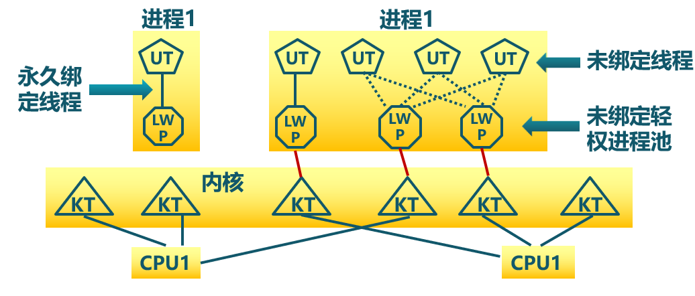

<!-- theme: gaia -->
<!-- _class: lead -->

# 第十一講 線程與協程

## 第一節 線程


<br>
<br>

向勇 陳渝 李國良 

2022年秋季

---

**提綱**

### 1. 為何需要線程？
2. 線程的概念
3. 使用線程
4. 線程的設計實現

---
#### 進程存在的不足

  -  並行/併發處理困難
  -  進程之間地址空間隔離
  -  通過IPC共享/交換數據不方便
  -  管理進程開銷大
     - 創建/刪除/切換


---

#### 進程存在的不足

  -  並行/併發處理困難
  -  進程之間地址空間隔離
  -  通過IPC共享/交換數據不方便
  -  管理進程開銷大
     - 創建/刪除/切換


---
#### 為何需要線程？

在應用中可能同時發生多種活動，且某些活動會被阻塞。將**程序分解成可並行運行的多個順序控制流**，可提高執行**效率**，且程序設計模型也會變得更**簡單**。


<!--

-->

---
#### 為何需要線程？
永遠存在的用戶需求 -- **性能**！
-  並行實體（多個順序控制流）共享同一個地址空間和所有可用數據
  - 訪問數據和共享資源方便
  - 切換控制流輕量
  - 管理不同控制流便捷 


---

#### 線程 vs 進程
- 進程是資源（包括內存、打開的文件等）分配的單位，線程是 CPU 調度的單位；
- 進程擁有一個完整的資源平臺，而線程只獨享必不可少的資源，如寄存器和棧；
- 線程同樣具有就緒、阻塞、執行三種基本狀態，同樣具有狀態之間的轉換關係；
- 線程能減少併發執行的時間和空間開銷；

---
#### 線程 vs 進程
- 一個進程中可以同時存在多個線程；
- 各個線程之間可以併發執行；
- 各個線程之間可以共享地址空間和文件等資源；
- 當進程中的一個線程崩潰時，會導致其所屬進程的所有線程崩潰（這裡是針對 C/C++ 語言，Java語言中的線程崩潰不會造成進程崩潰）。

---

**提綱**

1. 為何需要線程？
### 2. 線程的概念
3. 使用線程
4. 線程的設計實現

---
#### 線程的定義

線程是進程的一**部分**，描述指令流**執行狀態**。它是進程中的指令執行流的基本單元，是CPU調度的**基本單位**。


---
#### 進程和線程的角色

- 進程的**資源分配**角色
  - 進程由一組相關資源構成，包括地址空間（代碼段、數據段）、打開的文件等各種資源

- 線程的**處理機調度**角色
  - 線程描述在進程資源環境中的指令流執行狀態


---
#### 不同操作系統對線程的支持


---
#### 進程和線程的關係

**線程 = 進程 - 共享資源**
- 一個進程中可存在多個線程
- 線程共享進程的地址空間
- 線程共享進程的資源
- 線程崩潰會導致進程崩潰

線程是一個調度實體 Scheduling Entry
User-SE  v.s.  Kernel-SE 


---
#### 線程與進程的比較
- 進程是資源分配單位，線程是CPU調度單位
- 進程擁有一個完整的資源平臺，而線程只獨享指令流執行的必要資源，如寄存器和棧
- 線程具有就緒、等待和運行三種基本狀態和狀態間的轉換關係
- 線程能減少併發執行的時間和空間開銷
  - 線程的創建/終止/切換時間比進程短
  - 同一進程的各線程間共享內存和文件資源，可不通過內核進行直接通信


---

#### 用戶態管理的線程與內核態管理的線程




---

#### 線程控制塊(TCB, Thread Control Block)
```c
typedef struct
{
       int                       detachstate;   // 線程的分離狀態
       int                       schedpolicy;   // 線程調度策略
       structsched_param         schedparam;    // 線程的調度參數
       int                       inheritsched;  // 線程的繼承性
       int                       scope;         // 線程的作用域
       size_t                    guardsize;     // 線程棧末尾的警戒緩衝區大小
       int                       stackaddr_set; // 線程的棧設置
       void*                     stackaddr;     // 線程棧的位置
       size_t                    stacksize;     // 線程棧的大小
} pthread_attr_t;
```
---

#### 創建線程API
創建線程：成功返回零，否則返回非零值
```c
#include <pthread.h>
int pthread_create(      pthread_t *        thread,
               const pthread_attr_t *       attr,
                     void *                 (*start_routine)(void*),
                     void *                 arg);
```       
- thread指向pthread_t結構類型的指針
- attr用於指定該線程可能具有的任何屬性
- start_routine是線程開始運行的函數指針
- arg是要傳遞給線程開始執行的函數的參數


---

#### 等待線程API

等待線程：一直阻塞調用它的線程，直至目標線程執行結束
```c
#include <pthread.h>
int pthread_join(pthread_t thread, void **retval);
```       
- thread指向pthread_t結構類型的指針
- retval是指向返回值的指針

---

**提綱**

1. 為何需要線程？
2. 線程的概念
### 3. 使用線程
4. 線程的設計實現

---

#### 線程示例

```c
1    void *mythread(void *arg) {
2        printf("%s\n", (char *) arg);
3        return NULL;
4    }
5    int main(int argc, char *argv[]) {
6       pthread_t p1, p2;
7       int rc;
8       printf("main: begin\n");
9       rc = pthread_create(&p1, NULL, mythread, "A"); assert(rc == 0);
10       rc = pthread_create(&p2, NULL, mythread, "B"); assert(rc == 0);
11       // join waits for the threads to finish
12       rc = pthread_join(p1, NULL); assert(rc == 0);
13       rc = pthread_join(p2, NULL); assert(rc == 0);
14       printf("main: end\n");
15       return 0;
16   }
```

---
#### 線程示例輸出

一個程序，它創建兩個線程，每個線程都做了一些獨立的工作，在這例子中，打印“A”或“B”。

```
❯ ./t0
main: begin
A
B
main: end
```

---

**提綱**

1. 為何需要線程？
2. 線程的概念
3. 使用線程
### 4. 線程的設計實現
- 用戶線程(用戶態管理的線程)
- 內核線程(內核態管理的線程)
- 輕權進程


---
### 線程的設計實現
- 線程的幾種實現方式 
  - 用戶態管理且用戶態運行的線程（內核不可見的用戶線程）
    - Thread managed&running in User-Mode
  - 內核態管理且用戶態運行的線程（內核可見的用戶線程）
    - Thread managed in Kernel-Mode&running in User-Mode
  - 內核態管理且內核態運行的線程（內核線程）
    - Thread managed&running in Kernel-Mode
  - 混合管理且運行的線程（輕量級進程，混合線程）
    - Thread managed&running in Mixed-Mode
---
### 線程的設計實現
- 用戶態管理且用戶態運行的線程
  - 在用戶態實現線程的管理與運行，操作系統感知不到這類線程的存在
     -  POSIX Pthreads，Mach C-threads，Solaris threads
     - 別名：用戶態線程(User-level Thread)、綠色線程(Green Thread)、有棧協程(Stackful Coroutine)、纖程(Fiber)


---
### 線程的設計實現

- 用戶態管理且用戶態運行的線程
   - 由一組用戶級的線程庫函數來完成線程的管理，包括線程的創建、終止、同步和調度等


---
### 線程的設計實現
- 用戶態管理且用戶態運行的線程的不足之處
     -  一個線程發起系統調用而阻塞時，則整個進程進入等待
     -  不支持基於線程的處理機搶佔
     -  只能按進程分配CPU時間


---
### 線程的設計實現
- 內核態管理且用戶態運行的線程 
  - 由內核通過系統調用實現的線程機制，由內核完成線程的創建、終止和管理
  - 由內核維護線程控制塊TCB, 在內核實現
  - 線程執行系統調用而被阻塞不影響其他線程


---
### 線程的設計實現
- 內核態管理且用戶態運行的線程 
  - 一個進程中可以包括多個線程
     - Windows內核的設計 
     - rCore/uCore內核的設計
  - 一個進程中只包括一個線程
    - Linux內核的設計


---
### 線程的設計實現
- 內核態管理且用戶態運行的線程的不足之處 
  - 在一般情況下，線程切換開銷與進程切換開銷相差不大，大於用戶態管理且用戶態允許的線程切換開銷
  - 與傳統的進程管理機制會產生一些矛盾，一些系統調用的實現功能/語義上會不協調
    - fork()、signal() ...


---
### 線程的設計實現
- 內核態管理且內核態運行的線程 （簡稱：內核線程）
  - 由內核實現線程機制，由內核完成線程的創建、終止和管理
  - 由內核維護TCB, 在內核實現
  - 線程在內核中執行
     - 如：Linux的內核線程 


---
### 線程的設計實現
- 內核態管理且內核態運行的線程 （簡稱：內核線程）
  - 內核線程就是內核的分身，一個分身可以分時/並行處理一件特定事情
  - 內核線程的調度由內核負責，一個內核線程處於阻塞狀態時不影響其他的內核線程，因為其是調度的基本單位。


---
### 線程的設計實現
- 內核態管理且內核態運行的線程 （簡稱：內核線程）的作用
  - 執行週期性的任務
    -  把Buffer-Cache定期寫回到存儲設備上
    -  在可用物理內存頁很少情況下執行虛存交換操作 
    -  實現文件系統的事務日誌
   


---
### 線程的設計實現
- 雙態管理的線程

輕量級進程（Light-Weight Process，LWP）是內核支持的用戶線程，一個進程可有一個或多個 LWP，每個 LWP 是跟內核線程一對一映射的，也就是 LWP 都是由一個內核線程支持。 在 LWP 之上也可使用用戶線程。

---
### 線程的設計實現
- 雙態管理的線程

LWP 與用戶線程的對應關係就有三種：

- 1 : 1，即一個 LWP 對應 一個用戶線程：Linux, JVM 
  - 用戶態管理取消，內核管理線程
- N : 1，即一個 LWP 對應多個用戶線程：與OS無關的Green Thread 
  - 內核態僅管理包含多個線程的進程，用戶態的線程運行時管理線程
- M : N，即多個 LWP 對應多個用戶線程：Solaris OS, Go runtime
  - 用戶態線程運行時和內核協同進行管理

---
### 線程的設計實現
- 雙態管理的線程
  - M : N線程模型
  - Solaris 操作系統+C線程運行時庫
  - Go語言+Go運行時庫+OS


---
### 線程的設計實現
- 雙態管理的線程
  - 編程人員決定內核線程與用戶級線程的複用關係
  - 用戶級線程由用戶線程管理庫管理
  - 內核只識別內核級線程/進程，並對其進行調度
  - 內核與用戶態線程管理庫交互
  - 具有最大靈活度和實現複雜性




---
### 線程的上下文切換

線程是調度的基本單位，而進程則是資源擁有的基本單位。

- 不同進程中的線程切換：進程上下文切換
- 相同進程中的線程切換：虛擬內存是共享的，切換時**虛擬內存這些資源就保持不動，只需要切換線程的私有數據、寄存器等不共享的數據**

---

### 小結

1. 為何需要線程？
2. 線程的概念
3. 使用線程
4. 線程的設計實現
