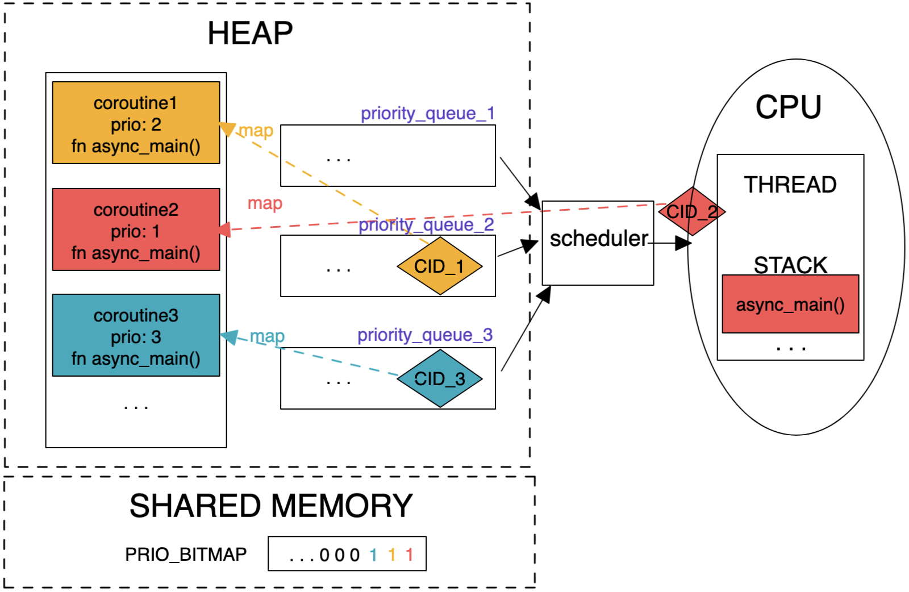

<!-- theme: gaia -->
<!-- _class: lead -->

# 第十一講 線程與協程

## 第二節 協程


<br>
<br>

向勇 陳渝 李國良 

2022年秋季

---

**提綱**

### 1. 協程的概念
2. 協程的實現
3. 協程示例
4. 協程與操作系統內核


---

#### 線程存在的不足

<!-- 什麼是協程？ https://zhuanlan.zhihu.com/p/172471249 -->
- 線程有啥不足？
  -  大規模併發I/O操作場景
     -  大量線程**佔內存**總量大
     -  管理線程程開銷大
        - 創建/刪除/切換
     -  訪問共享數據易錯


---
#### 協程(coroutine)的提出

<!-- 併發編程漫談之 協程詳解--以python協程入手（三） https://blog.csdn.net/u013597671/article/details/89762233 -->
協程由Melvin Conway在1963年提出並實現
- 作者對協程的描述是“行為與主程序相似的子例程(subroutine)”
- 協程採用同步編程方式支持大規模併發I/O異步操作

Donald  Knuth ：子例程是協程的特例


<!-- 協程的概念最早由Melvin Conway在1963年提出並實現，用於簡化COBOL編譯器的詞法和句法分析器間的協作，當時他對協程的描述是“行為與主程序相似的子例程”。 -->

---

#### 協程的定義

<!-- 併發編程漫談之 協程詳解--以python協程入手（三） https://blog.csdn.net/u013597671/article/details/89762233 -->
- Wiki的定義：協程是一種程序組件，是由子例程（過程、函數、例程、方法、子程序）的概念泛化而來的，子例程只有一個入口點且只返回一次，協程允許多個入口點，可在指定位置掛起和恢復執行。

協程的核心思想：控制流的主動讓出與恢復

<!-- 協程(Coroutine)-ES中關於Generator/async/await的學習思考 https://blog.csdn.net/shenlei19911210/article/details/61194617 -->


---
#### 協程（異步函數）與函數（同步函數）

<!-- C++20協程原理和應用 https://zhuanlan.zhihu.com/p/498253158 -->
- 相比普通函數，協程的函數體可以掛起並在任意時刻恢復執行
  - **無棧協程是普通函數的泛化**
  - **本課程**中的協程限指無棧協程(Stackless Coroutine)


---

#### 協程(無棧協程)與用戶線程的比較

- 協程的內存佔用比線程小
  - 線程數量越多，協程的性能優勢越明顯
- 不需要多線程的鎖機制，不存在同時寫變量衝突，在協程中控制共享資源不加鎖，只需要判斷狀態，所以執行效率比多線程高很多。


---

#### 協程示例

```
def func()://普通函數
   print("a")
   print("b")
   print("c")
```
```
def func()://協程函數
  print("a")
  yield
  print("b")
  yield
  print("c")
```


---

**提綱**

1. 協程的概念
### 2. 協程的實現
3. 協程示例
4. 協程與操作系統內核


---

#### 協程的實現方式

<!-- 併發編程漫談之 協程詳解--以python協程入手（三） https://blog.csdn.net/u013597671/article/details/89762233 -->
2004年Lua的作者Ana Lucia de Moura和Roberto Ierusalimschy發表論文“[Revisiting Coroutines](https://www.researchgate.net/publication/2934331_Revisiting_Coroutines)”，提出依照三個因素來對協程進行分類：
- 控制傳遞（Control-transfer）機制
- 棧式（Stackful）構造
- 編程語言中第一類（First-class）對象

---

#### 基於控制傳遞的協程

控制傳遞機制：對稱（Symmetric） v.s. 非對稱（Asymmetric）協程
- 對稱協程：
   - 只提供一種傳遞操作，用於在協程間直接傳遞控制
   - 對稱協程都是等價的，控制權直接在對稱協程之間進行傳遞
   - 對稱協程在掛起時主動指明另外一個對稱協程來接收控制權
- 非對稱協程（半對稱（Semi-symmetric）協程）：
  - 提供調用和掛起兩種操作，非對稱協程掛起時將控制返回給調用者
  - 調用者或上層管理者根據某調度策略調用其他非對稱協程進行工作

<!-- 出於支持併發而提供的協程通常是對稱協程，用於表示獨立的執行單元，如golang中的協程。用於產生值序列的協程則為非對稱協程，如迭代器和生成器。
這兩種控制傳遞機制可以相互表達，因此要提供通用協程時只須實現其中一種即可。但是，兩者表達力相同並不意味著在易用性上也相同。對稱協程會把程序的控制流變得相對複雜而難以理解和管理，而非對稱協程的行為在某種意義上與函數類似，因為控制總是返回給調用者。使用非對稱協程寫出的程序更加結構化。 -->

---

#### 基於控制傳遞的協程


---

#### 基於控制傳遞的協程


---

#### 有棧協程和無棧協程

<!-- 有棧協程和無棧協程 https://cloud.tencent.com/developer/article/1888257 -->
棧式（Stackful）構造：有棧(stackful)協程 v.s. 無棧(stackless)協程
- 無棧協程：指可掛起/恢復的函數
   - 無獨立的上下文空間（棧），數據保存在堆上 
   - 開銷： 函數調用的開銷
- 有棧協程：用戶態管理並運行的線程
  - 有獨立的上下文空間（棧）
  - 開銷：用戶態切換線程的開銷
- 是否可以在任意嵌套函數中被掛起？
  - 有棧協程：可以；無棧協程：不行
<!--  -->

<!-- 
https://zhuanlan.zhihu.com/p/25513336
Coroutine從入門到勸退

除此之外，wiki上還對coroutine做了分類：
非對稱式協程，asymmetric coroutine。
對稱式協程，symmetric coroutine。
半協程，semi-coroutine。 

-->

---
#### 基於第一類語言對象的協程
<!-- 有棧協程和無棧協程 https://cloud.tencent.com/developer/article/1888257 -->
第一類（First-class）語言對象：First-class對象 v.s. 受限協程 (**是否可以作為參數傳遞**)
- First-class對象 : 協程被在語言中作為first-class對象
   - 可以作為參數被傳遞，由函數創建並返回，並存儲在一個數據結構中供後續操作
   - 提供了良好的編程表達力，方便開發者對協程進行操作
-  受限協程
   -  特定用途而實現的協程，協程對象限制在指定的代碼結構中
 
---
#### 第一類（First-class）語言對象
- 可以被賦值給一個變量
- 可以嵌入到數據結構中
- 可以作為參數傳遞給函數
- 可以作為值被函數返回

---

#### Rust語言中的協程Future

<!--
Ref: https://os.phil-opp.com/async-await/#example
-->

A future is a representation of some operation which will **complete in the future**.


---

#### 基於有限狀態機的Rust協程實現

```rust
async fn example(min_len: usize) -> String {
    let content = async_read_file("foo.txt").await;
    if content.len() < min_len {
        content + &async_read_file("bar.txt").await
    } else {
        content
    }
}
```


---
<!--
#### Concept of Future

* Three phases in asynchronous task:

  1. **Executor**: A Future is **polled** which result in the task progressing
     - Until a point where it can no longer make progress
  2. **Reactor**: Register an **event source** that a Future is waiting for
     - Makes sure that it will wake the Future when event is ready
  3. **Waker**: The event happens and the Future is **woken up**
     - Wake up to the executor which polled the Future
     - Schedule the future to be polled again and make further progress

---
-->

#### 基於輪詢的 Future的異步執行過程

<!--
基於輪詢的 Future的異步執行過程

- 執行器會輪詢 `Future`，直到最終 `Future` 需要執行某種 I/O 
- 該 `Future` 將被移交給處理 I/O 的反應器，即 `Future` 會等待該特定 I/O 
- I/O 事件發生時，反應器將使用傳遞的`Waker` 參數喚醒 `Future` ，傳回執行器
- 循環上述三步，直到最終`future`任務完成（resolved）
- 任務完成並得出結果時，執行器釋放句柄和整個`Future`，整個調用過程就完成了
  -->


---

#### 協程的優點
- 協程創建成本小，降低了內存消耗
- 協程自己的調度器，減少了 CPU 上下文切換的開銷，提高了 CPU 緩存命中率
- 減少同步加鎖，整體上提高了性能
- 可按照同步思維寫異步代碼
  - 用同步的邏輯，寫由協程調度的回調

---
#### 協程 vs 線程 vs 進程 
- 切換
  - 進程：頁表，堆，棧，寄存器
  - 線程：棧，寄存器
  - 協程：寄存器，不換棧


---

#### 協程 vs 線程 vs 進程 

協程適合IO密集型場景


---

**提綱**

1. 協程的概念
2. 協程的實現
### 3. 協程示例
4. 協程與操作系統內核


---

#### 支持協程的編程語言
- 無棧協程：Rust、C++20、C Python、Java、Javascript等
- 有棧協程（即線程）：Go、Java2022、Python、Lua
   

<!-- 
https://wiki.brewlin.com/wiki/compiler/rust%E5%8D%8F%E7%A8%8B_%E8%B0%83%E5%BA%A6%E5%99%A8%E5%AE%9E%E7%8E%B0/

理解協程的核心就是暫停和恢復，rust的協程通過狀態機做到這一點，golang通過獨立的棧做到這一點。理解這一點很重要 -->

<!-- Java 協程要來了 https://cloud.tencent.com/developer/article/1949981 -->
<!-- 深入Lua：協程的實現 https://zhuanlan.zhihu.com/p/99608423 -->

<!-- Rust中的協程: Future與async/await https://zijiaw.github.io/posts/a7-rsfuture/ -->

---
### 使用協程 -- go
<!-- Go by Example 中文版: 協程
https://gobyexample-cn.github.io/goroutines -->

```go
... //https://gobyexample-cn.github.io/goroutines
func f(from string) {
    for i := 0; i < 3; i++ {
        fmt.Println(from, ":", i)
    }
}
func main() {
    f("direct")
    go f("goroutine")
    go func(msg string) {
        fmt.Println(msg)
    }("going")
    time.Sleep(time.Second)
    fmt.Println("done")
}
```


---
<!-- 
Making multiple HTTP requests using Python (synchronous, multiprocessing, multithreading, asyncio)
https://www.youtube.com/watch?v=R4Oz8JUuM4s
https://github.com/nikhilkumarsingh/async-http-requests-tut -->
### 使用協程 -- python
<!-- asyncio 是 Python 3.4 引入的標準庫，直接內置了對異步 IO 的支持。只要在一個函數前面加上 async 關鍵字就可以將一個函數變為一個協程。 -->

```python
URL = 'https://httpbin.org/uuid'
async def fetch(session, url):
    async with session.get(url) as response:
        json_response = await response.json()
        print(json_response['uuid'])
async def main():
    async with aiohttp.ClientSession() as session:
        tasks = [fetch(session, URL) for _ in range(100)]
        await asyncio.gather(*tasks)
def func():
    asyncio.run(main())
```    
```
// https://github.com/nikhilkumarsingh/async-http-requests-tut/blob/master/test_asyncio.py
b6e20fef-5ad7-49d9-b8ae-84b08e0f2d35
69d42300-386e-4c49-ad77-747cae9b2316
1.5898115579998375
```

<!-- 進程，線程和協程 (Process, Thread and Coroutine) 理論篇，實踐篇，代碼 python
https://leovan.me/cn/2021/04/process-thread-and-coroutine-theory/
https://leovan.me/cn/2021/04/process-thread-and-coroutine-python-implementation/
https://github.com/leovan/leovan.me/tree/master/scripts/cn/2021-04-03-process-thread-and-coroutine-python-implementation -->


---
### 使用協程 -- rust

<!-- https://rust-lang.github.io/async-book/01_getting_started/01_chapter.html -->

```rust
use futures::executor::block_on;

async fn hello_world() {
    println!("hello, world!");
}

fn main() {
    let future = hello_world(); // Nothing is printed
    block_on(future); // `future` is run and "hello, world!" is printed
}
```
```
https://rust-lang.github.io/async-book/01_getting_started/01_chapter.html 
```

<!-- 
用python 寫一個os
http://www.dabeaz.com/coroutines/
http://www.dabeaz.com/coroutines/Coroutines.pdf -->
---
### 進程/線程/協程性能比較
<!-- 
https://www.youtube.com/watch?v=R4Oz8JUuM4s
https://github.com/nikhilkumarsingh/async-http-requests-tut
git@github.com:nikhilkumarsingh/async-http-requests-tut.git -->
單進程：28秒
```python
import requests
from timer import timer
URL = 'https://httpbin.org/uuid'
def fetch(session, url):
    with session.get(url) as response:
        print(response.json()['uuid'])
@timer(1, 1)
def main():
    with requests.Session() as session:
        for _ in range(100):
            fetch(session, URL)

```
---
### 進程/線程/協程性能比較
<!-- 
https://www.youtube.com/watch?v=R4Oz8JUuM4s
https://github.com/nikhilkumarsingh/async-http-requests-tut
git@github.com:nikhilkumarsingh/async-http-requests-tut.git -->
多進程：7秒
```python
from multiprocessing.pool import Pool
import requests
from timer import timer
URL = 'https://httpbin.org/uuid'
def fetch(session, url):
    with session.get(url) as response:
        print(response.json()['uuid'])
@timer(1, 1)
def main():
    with Pool() as pool:
        with requests.Session() as session:
            pool.starmap(fetch, [(session, URL) for _ in range(100)])
```

---
### 進程/線程/協程性能比較
<!-- 
https://www.youtube.com/watch?v=R4Oz8JUuM4s
https://github.com/nikhilkumarsingh/async-http-requests-tut
git@github.com:nikhilkumarsingh/async-http-requests-tut.git -->
線程：4秒
```python
from concurrent.futures import ThreadPoolExecutor
import requests
from timer import timer
URL = 'https://httpbin.org/uuid'
def fetch(session, url):
    with session.get(url) as response:
        print(response.json()['uuid'])
@timer(1, 1)
def main():
    with ThreadPoolExecutor(max_workers=100) as executor:
        with requests.Session() as session:
            executor.map(fetch, [session] * 100, [URL] * 100)
            executor.shutdown(wait=True)
```

---
### 進程/線程/協程性能比較
<!-- 
https://www.youtube.com/watch?v=R4Oz8JUuM4s
https://github.com/nikhilkumarsingh/async-http-requests-tut
git@github.com:nikhilkumarsingh/async-http-requests-tut.git -->
協程：2秒
```python
...
URL = 'https://httpbin.org/uuid'
async def fetch(session, url):
    async with session.get(url) as response:
        json_response = await response.json()
        print(json_response['uuid'])
async def main():
    async with aiohttp.ClientSession() as session:
        tasks = [fetch(session, URL) for _ in range(100)]
        await asyncio.gather(*tasks)
@timer(1, 1)
def func():
    asyncio.run(main())
```
<!-- import asyncio
import aiohttp
from timer import timer 

requirements.txt
requests
aiohttp

-->

---
#### Rust線程與協程的[示例](https://deepu.tech/concurrency-in-modern-languages/)

Multi-threaded concurrent webserver

```rust
fn main() {
    let listener = TcpListener::bind("127.0.0.1:8080").unwrap(); // bind listener
    let pool = ThreadPool::new(100); // same number as max concurrent requests

    let mut count = 0; // count used to introduce delays

    // listen to all incoming request streams
    for stream in listener.incoming() {
        let stream = stream.unwrap();
        count = count + 1;
        pool.execute(move || {
            handle_connection(stream, count); // spawning each connection in a new thread
        });
    }
}
```

---

#### Rust線程與協程的[示例](https://deepu.tech/concurrency-in-modern-languages/)

Asynchronous concurrent webserver

```rust
#[async_std::main]
async fn main() {
    let listener = TcpListener::bind("127.0.0.1:8080").await.unwrap(); // bind listener
    let mut count = 0; // count used to introduce delays

    loop {
        count = count + 1;
        // Listen for an incoming connection.
        let (stream, _) = listener.accept().await.unwrap();
        // spawn a new task to handle the connection
        task::spawn(handle_connection(stream, count));
    }
}
```
---

#### Rust線程與協程的[示例](https://deepu.tech/concurrency-in-modern-languages/)


```rust
fn main() { //Asynchronous multi-threaded concurrent webserver
    let listener = TcpListener::bind("127.0.0.1:8080").unwrap(); // bind listener

    let mut pool_builder = ThreadPoolBuilder::new();
    pool_builder.pool_size(100);
    let pool = pool_builder.create().expect("couldn't create threadpool");
    let mut count = 0; // count used to introduce delays

    // Listen for an incoming connection.
    for stream in listener.incoming() {
        let stream = stream.unwrap();
        count = count + 1;
        let count_n = Box::new(count);

        // spawning each connection in a new thread asynchronously
        pool.spawn_ok(async {
            handle_connection(stream, count_n).await;
        });
    }
}
```

---

#### 線程/協程性能比較


---

**提綱**

1. 協程的概念
2. 協程的實現
3. 協程示例
### 4. 協程與操作系統內核


---

#### [線程與協程的統一調度](https://lexiangla.com/teams/k100041/classes/14e3d0ba33e211ecb668e28d1509205c/courses/8b52ee1233e111ecbcb4be09afb7b0ee)

1. 協程與線程靈活綁定；
2. 實現協程（future）在單CPU上併發執行；可在多CPU上並行執行；
3. 線程和協程可採取不同的調度策略；
4. 沿用線程中斷的處理過程，**協程可被強制中斷**；


---

#### 用戶態的協程控制塊(CCB, Coroutine Control Block)



Ref: [A Design and Implementation of Rust Coroutine with priority in Operating System](https://github.com/AmoyCherry/papper_Async_rCore)

---

#### 內核態的進程調度


---

#### 線程和協程的性能比較


---
#### 參考信息
- https://www.youtube.com/watch?v=R4Oz8JUuM4s
- https://github.com/nikhilkumarsingh/async-http-requests-tut
- http://www.dabeaz.com/coroutines/
- https://rust-lang.github.io/async-book/01_getting_started/01_chapter.html 
- https://github.com/nikhilkumarsingh/async-http-requests-tut/blob/master/test_asyncio.py
- https://gobyexample-cn.github.io/goroutines 
- https://zijiaw.github.io/posts/a7-rsfuture/

---

### 小結

1. 協程的概念
2. 協程的實現
3. 協程示例
4. 協程與操作系統內核


