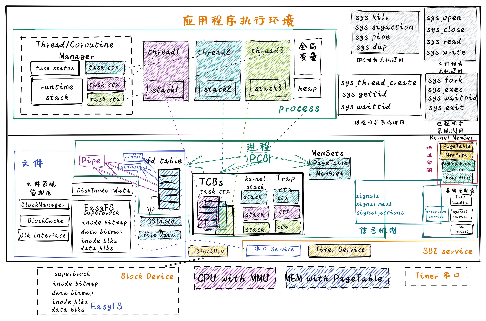

<!-- theme: gaia -->
<!-- _class: lead -->

# 第十一講 線程與協程
## 第三節 支持線程/協程的OS(TCOS)

<br>
<br>

向勇 陳渝 李國良 

2022年秋季
<!-- https://blog.aloni.org/posts/a-stack-less-rust-coroutine-100-loc/

https://stanford-cs242.github.io/f17/assets/projects/2017/kedero.pdf


https://cfsamson.gitbook.io/green-threads-explained-in-200-lines-of-rust/


https://tian-deng.github.io/posts/translation/rust/green_threads_explained_in_200_lines_of_rust/ -->
---
### 實踐：TCOS
- **進化目標**
- 總體思路
- 歷史背景
- 實踐步驟
- 軟件架構
- 相關硬件
- 程序設計




---
### 實踐：TCOS -- 以往目標
提高性能、簡化開發、加強安全、支持數據持久保存、支持應用的靈活性，支持進程間交互
- IPC OS：進程間交互
- Filesystem OS：支持數據持久保存
- Process OS: 增強進程管理和資源管理
- Address Space OS: 隔離APP訪問的內存地址空間
- multiprog & time-sharing OS: 讓APP共享CPU資源
- BatchOS: 讓APP與OS隔離，加強系統安全，提高執行效率
- LibOS: 讓APP與HW隔離，簡化應用訪問硬件的難度和複雜性

---
### 實踐：TCOS -- 進化目標
提高執行效率，支持線程和協程
- 在進程內實現多個控制流（線程/協程）的執行
- 在用戶態或內核態管理多個控制流（線程/協程）


---
### 實踐：TCOS 
### 同學的進化目標
- 理解基於任務（Task）的進程/線程/協程抽象
- 理解進程/線程/協程的實現與運行機制
- 會寫支持線程/協程的OS


<!-- 達科塔盜龍Dakotaraptor是一種生存於距今6700萬-6500萬年前白堊紀晚期的獸腳類馳龍科恐龍，它主打的並不是霸王龍的力量路線，而是利用自己修 長的後肢來提高敏捷度和奔跑速度。它全身幾乎都長滿了羽毛，可能會滑翔或者其他接近飛行行為的行動模式。 -->


---
### 實踐：TCOS
- 進化目標
- **總體思路**
    - **用戶態管理的用戶線程**
- 歷史背景
- 實踐步驟
- 軟件架構
- 程序設計


---

### 總體思路 
- 如何管理協程/線程/進程？
   - 任務上下文
   - **用戶態管理**
   - 內核態管理 


---
### 總體思路 
- 如何管理協程/線程/進程？
   - 任務上下文
   - **用戶態管理**
   - 內核態管理 


---
### 總體思路 
**用戶態管理的用戶線程**
   - 用戶態管理線程的任務控制塊
      - 與 Lec4中的任務控制塊類似
      - 由用戶態的Runtime管理
  - 任務控制塊
```
struct Task {
    id: usize,
    stack: Vec<u8>,
    ctx: TaskContext,
    state: State,
}
```  


---
### 實踐步驟
```
git clone https://github.com/rcore-os/rCore-Tutorial-v3.git
cd rCore-Tutorial-v3
git checkout ch8
```
包含一個應用程序
```
user/src/bin/
├──  stackful_coroutine.rs
```
---
### 實踐步驟
執行這個應用程序
```
Rust user shell
>> stackful_coroutine
stackful_coroutine begin...
TASK  0(Runtime) STARTING
TASK  1 STARTING
task: 1 counter: 0
TASK 2 STARTING
task: 2 counter: 0
TASK 3 STARTING
task: 3 counter: 0
TASK 4 STARTING
task: 4 counter: 0
...
```

---
### 程序設計
簡單的用戶態管理多線程應用 `stackful_coroutine.rs`
```rust
pub fn main()  {
    let mut runtime = Runtime::new(); //創建線程管理子系統
    runtime.init();  // 初始化線程管理子系統
    runtime.spawn(|| {  //創建一個用戶態線程
        println!("TASK  1 STARTING");
        let id = 1;
        for i in 0..4 {
            println!("task: {} counter: {}", id, i);
            yield_task();  //主動讓出處理器
        }
        println!("TASK 1 FINISHED");
    }); //... 繼續創建第2~4個用戶態線程
    runtime.run(); //調度執行各個線程
}
```


---
### 程序設計
用戶態管理的線程結構與執行狀態
```rust
struct Task { //線程控制塊
    id: usize,
    stack: Vec<u8>,
    ctx: TaskContext,
    state: State,
}
```
```rust
pub struct TaskContext { //線程上下文
    x1: u64,  //ra: return addres 
    x2: u64,  //sp
    ...,  //s[0..11] 寄存器
    nx1: u64, //new return addres
}
```


---
### 程序設計
用戶態管理的線程結構與執行狀態
```rust
struct Task { //線程控制塊
    id: usize,
    stack: Vec<u8>,
    ctx: TaskContext,
    state: State,
}
```
```rust
enum State { //線程狀態
    Available,
    Running,
    Ready,
}
```


---
### 程序設計
**用戶態線程管理運行時初始化**
Runtime::new() 主要有三個步驟：
- 1. 設置主線程：初始化應用主線程控制塊（TID為 0 ），並設置其狀態為 Running；
- 2. 設置調度隊列：初始化線程控制塊向量(線程調度隊列)，加入應用主線程控制塊和空閒線程控制塊，為後續的線程運行做好準備；
- 3. 設置當前運行線程id：設置Runtime 結構變量中的 current 值為0， 表示當前正在運行的線程是應用主線程。

---
### 程序設計
**用戶態線程管理運行時初始化**
Runtime::init() 的主要工作是把Rutime結構變量的地址賦值給全局可變變量`RUNTIME`。這樣在多線程應用在後續執行中會根據`RUNTIME`找到Runtime結構變量。

在應用的 main() 函數中，首先會依次調用上述兩個函數（new和init），完成線程管理運行時的初始化過程。這樣正在運行的TID為 0 的主線程就可代表線程運行時進行後續創建線程等一系列工作。


---
### 程序設計
**用戶態管理的線程創建** 
```rust
    pub fn spawn(&mut self, f: fn()) { // f函數是線程入口
        let available = self  
            .tasks.iter_mut()  //遍歷隊列中的任務
            .find(|t| t.state == State::Available) //查找可用的任務
            .expect("no available task.");
        let size = available.stack.len();
        unsafe {
            let s_ptr = available.stack.as_mut_ptr().offset(size as isize);
            let s_ptr = (s_ptr as usize & !7) as *mut u8; // 棧按8字節對齊
            available.ctx.x1 = guard as u64;  //ctx.x1  is old return address
            available.ctx.nx1 = f as u64;     //ctx.nx2 is new return address
            available.ctx.x2 = s_ptr.offset(-32) as u64; //cxt.x2 is sp
        }
        available.state = State::Ready; //設置任務為就緒態
    }
}
```

---
### 程序設計
**用戶態管理的線程創建** 

- 在線程向量中查找一個狀態為 Available 的空閒線程控制塊
- 初始化該空閒線程的線程控制塊的線程上下文
    -  `x1`寄存器：老的返回地址 -- `guard`函數地址
    -  `nx1`寄存器：新的返回地址 -- 輸入參數 `f` 函數地址
    -  `x2` 寄存器：新的棧地址 --  available.stack+size
---
```rust
fn guard() {
    unsafe {
        let rt_ptr = RUNTIME as *mut Runtime;
        (*rt_ptr).t_return();
    };
}
fn t_return(&mut self) {
    if self.current != 0 {
        self.tasks[self.current].state = State::Available;
        self.t_yield();
    }
}
```
`guard`函數意味著我們傳入的`f`函數（線程的主體）已經返回，這意味著我們的線程已完成運行其任務，因此我們取消引用我們的運行時並調用t_return()。

---
### 程序設計
**用戶態管理的線程切換** 
當應用要切換線程時，會調用 yield_task 函數，通過 runtime.t_yield 函數來完成具體的切換過程。runtime.t_yield 這個函數主要完成的功能：
- 在線程向量中查找一個狀態為 Ready 的線程控制塊
- 把當前運行的線程的狀態改為`Ready`，把新就緒線程的狀態改為`Running`，把 runtime 的 current 設置為新就緒線程控制塊的id
- 調用函數 switch ，完成兩個線程的棧和上下文的切換；


---
### 程序設計
**用戶態管理的線程切換** 
```rust
fn t_yield(&mut self) -> bool {
        ...
    self.tasks[pos].state = State::Running;
    let old_pos = self.current;
    self.current = pos;

    unsafe {
        switch(&mut self.tasks[old_pos].ctx, &self.tasks[pos].ctx);
    }
    ...
```


---
### 程序設計
**用戶態管理的線程切換** 
 switch 主要完成的工作：
- 完成當前指令指針(PC)的切換；
- 完成棧指針的切換；
- 完成通用寄存器集合的切換；
---
### 程序設計
**用戶態管理的線程切換** 
 switch 主要完成的工作：
```
unsafe fn switch(old: *mut TaskContext, new: *const TaskContext)  {
    // a0: _old, a1: _new
    asm!("
        sd x1, 0x00(a0)
        ...
        sd x1, 0x70(a0)
        ld x1, 0x00(a1)
        ...
        ld t0, 0x70(a1)
        jr t0
    ...
```


---
### 程序設計
**用戶態管理的線程執行&調度** 
```rust
    pub fn run(&mut self){
        while self.t_yield() {} 
       println!("All tasks finished!");
    }
```


---
### 實踐：TCOS
- 進化目標
- **總體思路**
    - **內核態管理的用戶線程**
- 歷史背景
- 實踐步驟
- 軟件架構
- 程序設計


---

### 總體思路 
- 如何管理協程/線程/進程？
   - 任務上下文
   - 用戶態管理
   - **內核態管理**


---
### 總體思路 
- 如何管理協程/線程/進程？
   - 任務上下文
   - 用戶態管理
   - **內核態管理** 


---
### 總體思路 
**內核態管理的用戶線程**
   - 內核態管理的用戶線程的任務控制塊
      - 與 Lec7中的任務控制塊類似
      - 重構：進程中有多個代表線程的任務控制塊
```
pub struct ProcessControlBlockInner {
    pub tasks: Vec<Option<Arc<TaskControlBlock>>>,
    ...
}  
```  


---
### 實踐步驟
```
git clone https://github.com/rcore-os/rCore-Tutorial-v3.git
cd rCore-Tutorial-v3
git checkout ch8
```
包含幾個與內核態管理的用戶線程相關的應用程序
```
user/src/bin/
├──  threads.rs
├──  threads_arg.rs
```
---
### 實踐步驟
執行threads_arg這個應用程序
```
Rust user shell
>> threads_arg
aaa...bbb...ccc...aaa...bbb...ccc...
thread#1 exited with code 1
thread#2 exited with code 2
ccc...thread#3 exited with code 3
main thread exited.
...
```

---
### 程序設計
簡單的內核態管理多線程應用 `threads_arg.rs`
```rust
fn thread_print(arg: *const Argument) -> ! { //線程的函數主體
    ...
    exit(arg.rc)
}
pub fn main() -> i32 {
    let mut v = Vec::new();
    for arg in args.iter() {
        v.push(thread_create( thread_print, arg ));  //創建線程
    ...
    for tid in v.iter() {
        let exit_code = waittid(*tid as usize); //等待線程結束
    ...
}
```


---
### 程序設計 -- 系統調用
在一個進程的運行過程中，進程可以創建多個屬於這個進程的線程，每個線程有自己的線程標識符（TID，Thread Identifier）。系統調用 thread_create 的原型如下：
```rust
/// 功能：當前進程創建一個新的線程
/// 參數：entry 表示線程的入口函數地址
/// 參數：arg：表示線程的一個參數
pub fn sys_thread_create(entry: usize, arg: usize) -> isize
```
- 創建線程不需要建立新的地址空間
- 屬於同一進程中的線程之間沒有父子關係


---
### 程序設計 -- 系統調用
當一個線程執行完代表它的功能後，會通過 exit 系統調用退出。需要通過該線程需要進程/主線程調用 waittid 來回收其資源，這樣整個線程才能被徹底銷燬。系統調用 waittid 的原型如下：
```rust
/// 參數：tid表示線程id
/// 返回值：如果線程不存在，返回-1；如果線程還沒退出，返回-2；其他情況下，返回結束線程的退出碼
pub fn sys_waittid(tid: usize) -> i32
```
- 進程/主線程要負責通過 waittid 來等待它創建出來的線程（不是主線程）結束並回收它們在內核中的資源
- 如果進程/主線程先調用了 exit 系統調用來退出，那麼整個進程（包括所屬的所有線程）都會退出


---
### 程序設計 -- 系統調用
在引入了線程機制後，進程相關的重要系統調用：fork 、 exec 、 waitpid 雖然在接口上沒有變化，但在它要完成的功能上需要有一定的擴展。
- 把以前進程中與處理器執行相關的部分拆分到線程中
- 通過 fork 創建進程其實也意味著要單獨建立一個主線程來使用處理器，併為以後創建新的線程建立相應的線程控制塊向量
- 相對而言， exec 和 waitpid 這兩個系統調用要做的改動比較小，還是按照與之前進程的處理方式來進行
- 總體上看，進程相關的這三個系統調用還是保持了已有的進程操作的語義，並沒有由於引入了線程，而帶來大的變化


---
### 程序設計 -- 系統調用

問題：“被fork的子進程是否要複製父進程的多個線程？”

選擇A：要複製多個線程；選擇B：不復制，只複製當前執行fork的這個線程；選擇C：不支持多線程進程執行fork這種情況

目前的rcore tutorial ，選擇了C，簡化了應用的使用場景，即在使用fork和create_thread（以及基於線程的信號量，條件變量等）是不會同時出現的。所以如果有fork，假定是這個應用是單線程的進程，所以只拷貝了這個單線程的結構。這種簡化設計雖然是一種鴕鳥做法，但也避免了一些允許fork和create_thread共存而導致的比較複雜的情況：...

---
### 程序設計 -- 系統調用

問題：“被fork的子進程是否要複製父進程的多個線程？”

比如：

在fork前，有三個線程Main thread， thread A, thread B, 且Thread A拿到一個lock，在臨界區中執行；Thread B正在寫一個文件。如果Main thread執行fork，如採用A選擇，會出現子進程的Thread B和 父進程的Thread B都在寫一個文件的情況。如採用B選擇，則子進程中只有Main Thread，當它想得到ThreadA的那個lock時，這個lock是得不到的（因為ThreadA 在子進程中不存在，沒法釋放鎖），會陷入到持續忙等中。

---
### 程序設計 -- 核心數據結構
為了在現有進程管理的基礎上實現線程管理，需要改進一些數據結構包含的內容及接口。基本思路就是把進程中與處理器相關的部分分拆出來，形成線程相關的部分：
- 任務控制塊 TaskControlBlock ：表示線程的核心數據結構
- 任務管理器 TaskManager ：管理線程集合的核心數據結構
- 處理器管理結構 Processor ：用於線程調度，維護線程的處理器狀態


---
### 程序設計 -- 核心數據結構
線程控制塊
```rust
pub struct TaskControlBlock {
    pub process: Weak<ProcessControlBlock>, //線程所屬的進程控制塊
    pub kstack: KernelStack,//任務（線程）的內核棧
    inner: UPSafeCell<TaskControlBlockInner>,
}
pub struct TaskControlBlockInner {
    pub res: Option<TaskUserRes>,  //任務（線程）用戶態資源
    pub trap_cx_ppn: PhysPageNum,//trap上下文地址
    pub task_cx: TaskContext,//任務（線程）上下文
    pub task_status: TaskStatus,//任務（線程）狀態
    pub exit_code: Option<i32>,//任務（線程）退出碼
}
```


---
### 程序設計 -- 核心數據結構
進程控制塊
```rust
pub struct ProcessControlBlock {
    pub pid: PidHandle,
    inner: UPSafeCell<ProcessControlBlockInner>,
}
pub struct ProcessControlBlockInner {
    pub tasks: Vec<Option<Arc<TaskControlBlock>>>,
    pub task_res_allocator: RecycleAllocator,
    ...
}
```
 RecycleAllocator是PidAllocator的升級版，即一個相對通用的資源分配器，可用於分配進程標識符（PID）和線程的內核棧（KernelStack）。

 
---
### 程序設計 -- 管理機制
線程創建
當一個進程執行中發出系統調用 sys_thread_create 後，操作系統就需要在當前進程的基礎上創建一個線程，即在線程控制塊中初始化各個成員變量，建立好進程和線程的關係等，關鍵要素包括：
- 線程的用戶態棧：確保在用戶態的線程能正常執行函數調用
- 線程的內核態棧：確保線程陷入內核後能正常執行函數調用
- 線程的跳板頁：確保線程能正確的進行用戶態<–>內核態切換
- 線程上下文：即線程用到的寄存器信息，用於線程切換


---
### 程序設計 -- 管理機制
線程創建
```rust
pub fn sys_thread_create(entry: usize, arg: usize) -> isize {
    // create a new thread
    let new_task = Arc::new(TaskControlBlock::new(...
    // add new task to scheduler
    add_task(Arc::clone(&new_task));
    // add new thread to current process
    let tasks = &mut process_inner.tasks;
    tasks[new_task_tid] = Some(Arc::clone(&new_task));
    *new_task_trap_cx = TrapContext::app_init_context( //建立trap/task上下文
        entry,
        new_task_res.ustack_top(),
        kernel_token(),
    ... 
```

---
### 程序設計 -- 管理機制
線程退出
- 當一個非主線程的其他線程發出 sys_exit 系統調用時，內核會調用 exit_current_and_run_next 函數退出當前線程並切換到下一個線程，但不會導致其所屬進程的退出。
- 當主線程 即進程發出這個系統調用，當內核收到這個系統調用後，會回收整個進程（這包括了其管理的所有線程）資源，並退出。


---
### 程序設計 -- 管理機制
線程退出
```rust
pub fn sys_exit(exit_code: i32) -> ! {
    exit_current_and_run_next(exit_code); ...
pub fn exit_current_and_run_next(exit_code: i32) { 
    let task = take_current_task().unwrap();
    let mut task_inner = task.inner_exclusive_access();   
    drop(task_inner); //釋放線程資源
    drop(task);  //釋放線程控制塊
     if tid == 0 {
        // 釋放當前進程的所有線程資源
        // 釋放當前進程的資源
...
```


---
### 程序設計 -- 管理機制
等待線程結束
- 如果找到 tid 對應的線程，則嘗試收集該線程的退出碼 exit_tid ，否則返回錯誤（退出線程不存在）。
- 如果退出碼存在(意味該線程確實退出了)，則清空進程中對應此線程的線程控制塊（至此，線程所佔資源算是全部清空了），否則返回錯誤（線程還沒退出）。

---
### 程序設計 -- 管理機制
```rust
pub fn sys_waittid(tid: usize) -> i32 {
    ...
    if let Some(waited_task) = waited_task {
        if let Some(waited_exit_code) = waited_task.....exit_code {
            exit_code = Some(waited_exit_code);
        }
    } else {
        return -1; // waited thread does not exist
    }
    if let Some(exit_code) = exit_code {
        process_inner.tasks[tid] = None; //dealloc the exited thread
        exit_code
    } else {
        -2 // waited thread has not exited
    }
```

---
### 程序設計 -- 管理機制
線程執行中的特權級切換和調度切換

- 線程執行中的特權級切換與第四講中介紹的任務切換的設計與實現是一致的
- 線程執行中的調度切換過程與第七講中介紹的進程調度機制是一致的


---
### 小結
- 用戶態管理的用戶線程
- 內核態管理的用戶線程
- 能寫達科塔盜龍OS

