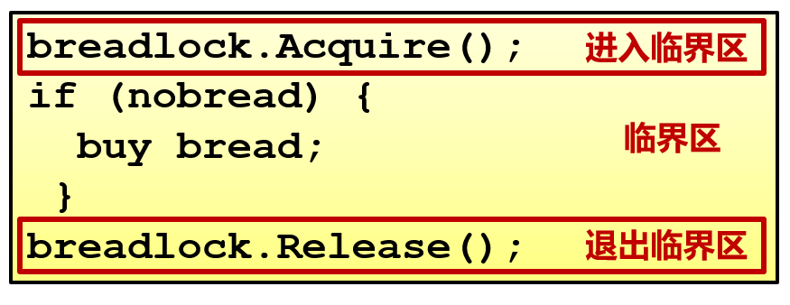
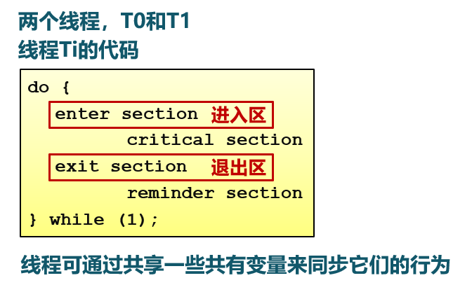
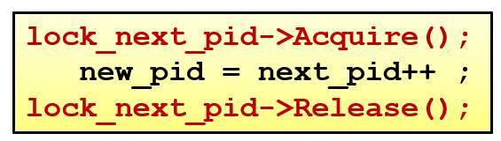

<!-- theme: gaia -->
<!-- _class: lead -->

# 第十二講 同步與互斥
## 第一節 概述

<br>
<br>

向勇 陳渝 李國良 

<br>
<br>

2022年秋季

---
### 背景
- 獨立進/線程
  - 不和其他進/線程共享資源或狀態
  - 確定性 => 輸入狀態決定結果
  - 可重現 =>  能夠重現起始條件
  - 調度順序不重要

- 進/線程如果有資源共享
  - 存在不確定性
  - 存在不可重現
  - 可能出現難以重現的錯誤


---
### 背景
- 有資源共享的進/線程執行fork時的可能錯誤


---
### 背景  -- 原子操作（Atomic Operation）

- 原子操作是指一次不存在任何中斷或失敗的操作
  - 要麼操作成功完成
  - 或者操作沒有執行
  - 不會出現部分執行的狀態

操作系統需要利用同步機制在併發執行的同時，保證一些操作是原子操作


---
### 現實生活中的同步互斥
例如: 家庭採購協調  (利用現實生活問題幫助理解操作系統同步問題)
  - 注意，計算機與人的差異


---
### 現實生活中的同步互斥
- 如何保證家庭採購協調的成功和高效
  - 需要採購時，有人去買麵包
  - 最多隻有一個人去買麵包
- 可能的解決方法
  - 在冰箱上設置一個鎖和鑰匙（ lock&key）
  - 去買麵包之前鎖住冰箱並且拿走鑰匙
- 加鎖導致的新問題
  - 冰箱中還有其他食品時，別人無法取到


---
### 現實生活中的同步互斥 -- 方案一
- 使用便籤來避免購買太多面包
  - 購買之前留下一張便籤
  - 買完後移除該便籤
  - 別人看到便籤時，就不去購買麵包
```
 if (nobread) {
    if (noNote) {
        leave Note;
        buy bread;
        remove Note;
    }
}
```


---
### 現實生活中的同步互斥 -- 方案一 -- 分析
- 偶爾會購買太多面包 - 重複
  - 檢查麵包和便籤後帖便籤前，有其他人檢查麵包和便籤

- 解決方案只是間歇性地失敗
  - 問題難以調試
  - 必須考慮調度器所做事情


---
### 現實生活中的同步互斥 -- 方案二
- 先留便籤，後查麵包和便籤
```
leave Note;
if (nobread) {  
  if (noNote) { 
       buy bread;
    }
}
remove note;
```
- 會發生什麼？
   - 不會有人買麵包


---
### 現實生活中的同步互斥 -- 方案三
- 為便籤增加標記，以區別不同人的便籤
   - 現在可在檢查之前留便籤
```
leave note_2;
if (no note_1) {
   if (no bread) { 
     buy bread; 
   } 
} 
remove note_2;	
```


---
### 現實生活中的同步互斥 -- 方案三
- 為便籤增加標記，以區別不同人的便籤
  - 現在可在檢查之前留便籤
```
leave note_1;
if (no note_2) {
   if (no bread) { 
     buy bread; 
   } 
} 
remove note_1;
```


---

### 現實生活中的同步互斥 -- 方案三
- 為便籤增加標記，以區別不同人的便籤
  - 現在可在檢查之前留便籤

 - 會發生什麼？
   - 可能導致沒有人去買麵包
   - 每個人都認為另外一個去買麵包
 


---

### 現實生活中的同步互斥 -- 方案四
兩個人採用不同的處理流程


---
### 現實生活中的同步互斥 -- 方案四
兩個人採用不同的處理流程
- 現在有效嗎？
  - 它有效，但太複雜
- A和B的代碼不同
  - 如果線程更多，怎麼辦？
- 當A等待時，不能做其他事
  - 忙等待（busy-waiting）


---
### 現實生活中的同步互斥 -- 方案五
- 利用兩個原子操作實現一個鎖(lock)
  -  Lock.Acquire()
     - 在鎖被釋放前一直等待，然後獲得鎖
     - 如果兩個線程都在等待同一個鎖，並且同時發現鎖被釋放了，那麼只有一個能夠獲得鎖
  -  Lock.Release()
     - 解鎖並喚醒任何等待中的線程



<!-- 
--- 
### 進/線程的交互關係：相互感知程度


--- 
### 進/線程的交互關係：相互感知程度


--- 
### 進/線程的交互關係：相互感知程度

 -->


---  
### 臨界區(Critical Section)
```
entry section
   critical section
exit section
   remainder section
```
- 進入區(entry section)
  - 檢查可否進入臨界區的一段代碼
  - 如可進入，設置相應"正在訪問臨界區"標誌
- 臨界區(critical section)
  - 線程中訪問臨界資源的一段需要互斥執行的代碼


---  
### 臨界區(Critical Section)
```
entry section
   critical section
exit section
   remainder section
```
- 退出區(exit section)
   - 清除“正在訪問臨界區”標誌
- 剩餘區(remainder section)
   - 代碼中的其餘部分

---  
### 臨界區(Critical Section) -- 訪問規則
```
entry section
   critical section
exit section
   remainder section
```
- 1 空閒則入：沒有線程在臨界區時，任何線程可進入
- 2 忙則等待：有線程在臨界區時，其他線程均**不能**進入臨界區
- 3 有限等待：等待進入臨界區的線程**不能**無限期等待
- 4 讓權等待（可選）：不能進入臨界區的線程，應釋放CPU（如轉換到阻塞狀態）


---  
### 同步互斥的方法
- 方法1：禁用硬件中斷
- 方法2：基於軟件的解決方法
- 方法3：更高級的抽象方法


---  
### 方法1：禁用硬件中斷
- 沒有中斷，沒有上下文切換，因此沒有併發
   - 硬件將中斷處理延遲到中斷被啟用之後
   - 現代計算機體系結構都提供指令來實現禁用中斷

          local_irq_save(unsigned long flags); 
              critical section
          local_irq_restore(unsigned long flags); 
- 進入臨界區：禁止所有中斷，並保存標誌 
- 離開臨界區：使能所有中斷，並恢復標誌 
 

---  
### 方法1：禁用硬件中斷
- 缺點
  - 禁用中斷後，線程無法被停止
     - 整個系統都會為此停下來
     - 可能導致其他線程處於飢餓狀態
  - 臨界區可能很長
     - 無法確定響應中斷所需的時間（可能存在硬件影響）
  - 不適合多核
- **要小心使用**


---  
### 方法2：基於軟件的解決方法




---  
### 方法2：基於軟件的解決方法 -- 嘗試一

- 滿足“忙則等待”，但是有時不滿足“空閒則入”
   - Ti不在臨界區，Tj想要繼續運行，但是必須等待Ti進入過臨界區後
   - turn = 0;
     - T0 不需要訪問
     - T1 需要訪問->一直等待


---  
### 方法2：基於軟件的解決方法 -- 嘗試二

- 互相依賴（線程盲等）
- 不滿足“忙則等待”
  - flag[i]=flag[j]=0
```c
// 線程 Tj
do {
   while (flag[i] == 1) ;
   flag[j] = 1;
   critical section
   flag[j] = 0;
   remainder section
} while(1)
```


---  
### 方法2：基於軟件的解決方法 -- 嘗試三

- 滿足“忙則等待”，但是不滿足“空閒則入”
  - flag[i]=flag[j]=1
```c
// 線程 Tj
do {
   flag[j] = 1;
   while (flag[i] == 1) ;
   critical section
   flag[j] = 0;
   remainder section
} while(1)
```

---  
### 方法2：基於軟件的解決方法 -- Peterson算法


- 滿足線程Ti和Tj之間互斥的經典的基於軟件的解決方法（1981年）
- 孔融讓梨


---  
### 方法2：基於軟件的解決方法 -- Peterson算法


```
flag[i] = True;
turn = j;
while(flag[j] && turn == j);
critical section;
flag[i] = False;
remainder section;
```
```
flag[j] = True;
turn = i;
while(flag[i] && turn == i);
critical section;
flag[j] = False;
remainder section;
```


---  
### 方法2：基於軟件的解決方法 -- Dekkers算法


```
do{
  flag[0] = true;// 首先P0舉手示意我要訪問
  while(flag[1]) {// 看看P1是否也舉手了
     if(turn==1){// 如果P1也舉手了，那麼就看看到底輪到誰
         flag[0]=false;// 如果確實輪到P1，那麼P0先把手放下（讓P1先）
         while(turn==1);// 只要還是P1的時間，P0就不舉手，一直等
         flag[0]=true;// 等到P1用完了（輪到P0了），P0再舉手
     }
     flag[1] = false; // 只要可以跳出循環，說明P1用完了，應該跳出最外圈的while
  }
  critical section;// 訪問臨界區
  turn = 1;// P0訪問完了，把輪次交給P1，讓P1可以訪問
  flag[0]=false;// P0放下手
  remainder section;
} while(true);
```


---  
### 方法2：基於軟件的解決方法 -- Dekkers算法

       vs                           

---  
### 方法2：基於軟件的解決方法 -- N線程
Eisenberg和McGuire
- 一個共享的turn變量，若干線程排成一個環
- 每個環有個flag標誌，想要進入臨界區填寫flag標誌
- 有多個想進入臨界區，從前往後走，執行完一個線程，turn改為下一個線程的值。


---  
### 方法2：基於軟件的解決方法 -- N線程
```c 
INITIALIZATION:

enum states flags[n -1]; //{IDLE, WAITING, ACTIVE}
int turn;
for (index=0; index<n; index++) {
   flags[index] = IDLE;
}
```

---  
### 方法2：基於軟件的解決方法 -- N線程
```c 
ENTRY PROTOCOL (for Process i ):
repeat {//從turn到i是否存在請求進程:若存在，則不斷循環，直至不存在這樣的進程，將當前進程標記為ACTIVE
   flags[i] = WAITING;//表明自己需要資源
   index = turn;//輪到誰了
   while (index != i) {//從turn到i輪流找不idle的線程
      if (flag[index] != IDLE) index = turn;//turn到i有非idle的阻塞
      else index = (index+1) mod n; //否則輪到i，並跳出
   }
   flags[i] = ACTIVE;//Pi active; 其他線程有可能active
   //對所有ACTIVE的進程做進一步的判斷，判斷除了當前進程以外，是否還存在其他ACTIVE的進程
   index = 0;//看看是否還有其他active的
   while ((index < n) && ((index == i) || (flags[index] != ACTIVE))) {
      index = index+1;
   }//如果後面沒有active了，並且輪到Pi或者turn idle, 就輪到i;否則繼續循環
} until ((index >= n) && ((turn == i) || (flags[turn] == IDLE)));
turn = i;//獲得turn並處理
```

---  
### 方法2：基於軟件的解決方法 -- N線程
```c 
EXIT PROTOCOL (for Process i ):

index = turn+1 mod n;//找到一個不idle的
while (flags[index] == IDLE) {
   index = index+1 mod n;
}
turn = index;//找到不idle的設置為turn；或者設置為自己
flag[i] = IDLE;//結束，自己變idle
```

---  
### 方法3：更高級的抽象方法
- 基於軟件的解決方法
   - 複雜，需要忙等待

- 更高級的抽象方法
   - 硬件提供了一些同步原語
       - 中斷禁用，原子操作指令等
   - **操作系統提供更高級的編程抽象來簡化線程同步**
       - 例如：鎖、信號量
       - 用硬件原語來構建

---  
### 方法3：更高級的抽象方法 -- 鎖(lock)
- 鎖是一個抽象的數據結構
   - 一個二進制變量（鎖定/解鎖）
   - 使用鎖來控制臨界區訪問
   - Lock::Acquire()
      - 鎖被釋放前一直等待，後得到鎖
   - Lock::Release()
      -  釋放鎖，喚醒任何等待的線程



---  
### 方法3：更高級的抽象方法 -- 鎖(lock)
現代CPU提供一些特殊的原子操作指令
- 原子操作指令 
  - 測試和置位（Test-and-Set ）指令
     - 從內存單元中讀取值
     - 測試該值是否為1(然後返回真或假)
     - 內存單元值設置為1
       - 輸入0，改成1，返回0；
       - 輸入1，保持1，返回1；


 

---  
### 方法3：更高級的抽象方法 -- 鎖(lock)
現代CPU都提供一些特殊的原子操作指令
```
do {
  while(TestAndSet(&lock)） ;
  critical section; 
  lock = false;
  remainder section;
} while (true)
```


 
---  
### 方法3：更高級的抽象方法 -- 鎖(lock)
現代CPU都提供一些特殊的原子操作指令
```
do {
  while(TestAndSet(&lock)） ;
  critical section; 
  lock = false;
  remainder section;
} while (true)
```
```
lock(): while(TestAndSet(&lock));
critical section; 
unlock(): lock=false;
```


---  
### 方法3：更高級的抽象方法 -- 鎖(lock)
- 原子操作：交換指令CaS（Compare and Swap）
```
bool compare_and_swap(int *value, int old, int new) {
   if(*value==old) {
      *value = new; 
      return true; }
   return false;
}
```
```
int lock = 0;                           // 初始時鎖空閒 
while(!compare_and_swap(&lock,0,1));    // lock 加鎖
critical section; 
lock=0;                                 // unlock 解鎖
remainder section;
```

<!-- ---  
### 方法3：更高級的抽象方法 -- 鎖(lock)
- 原子操作：交換指令CaS（Compare and Swap）
```
bool compare_and_swap(int *value, int old, int new) {
   if(*value==old) {
      *value = new; 
      return true;
   }
   return false;
}
```
```
lock(): while(!compare_and_swap(&lock,0,1)); 
critical section; 
unlock(): lock=0; 
``` -->

---  
### 方法3：更高級的抽象方法 -- 鎖(lock)
<!-- CAS是什麼？ABA問題又應該如何理解？https://zhuanlan.zhihu.com/p/139635112 
https://www.zhihu.com/question/23281499/answer/24112589
關於ABA問題我想了一個例子：在你非常渴的情況下你發現一個盛滿水的杯子，你一飲而盡。之後再給杯子裡重新倒滿水。然後你離開，當杯子的真正主人回來時看到杯子還是盛滿水，他當然不知道是否被人喝完重新倒滿。解決這個問題的方案的一個策略是每一次倒水假設有一個自動記錄儀記錄下，這樣主人回來就可以分辨在她離開後是否發生過重新倒滿的情況。這也是解決ABA問題目前採用的策略。
-->
- 原子操作：交換指令CaS（Compare and Swap）
- ABA 問題：
  - value= 100；
  - Thread1: value - 50; //成功 value=50
  - Thread2: value - 50; //阻塞
  - Thread3: value + 50; //成功 value=50
  - Thread2: 重試成功
- 解決思路：加上版本號（時間戳）
  - (100,1); (50,2); (100,3) 
<!---  
### 方法3：更高級的抽象方法 -- 鎖(lock)
現代CPU體系結構都提供一些特殊的原子操作指令
- 原子操作指令 
  - 交換指令（exchange）
     - 交換內存中的兩個值


-->

---  
### 方法3：更高級的抽象方法 -- 鎖(lock) 
使用TaS指令實現自旋鎖(spinlock)
- 線程在等待的時候消耗CPU時間


---  
### 方法3：更高級的抽象方法 -- 鎖(lock) 
**忙等鎖 v.s. 等待鎖**


---  
### 方法3：更高級的抽象方法 -- 鎖(lock) 
- 優點
  - 適用於單處理器或者共享主存的多處理器中任意數量的線程同步
  - 簡單並且容易證明
  - 支持多臨界區
- 缺點
  - 忙等待消耗處理器時間
  - 可能導致飢餓
    -  線程離開臨界區時有多個等待線程的情況
  - 可能死鎖：線程間相互等待，無法繼續執行 

---
### 小結
- 常用的三種同步實現方法
  - 禁用中斷（僅限於單處理器）
  - 軟件方法（複雜）
  - 鎖是一種高級的同步抽象方法
     - 硬件原子操作指令（單處理器或多處理器均可）
     - 互斥可以使用鎖來實現


