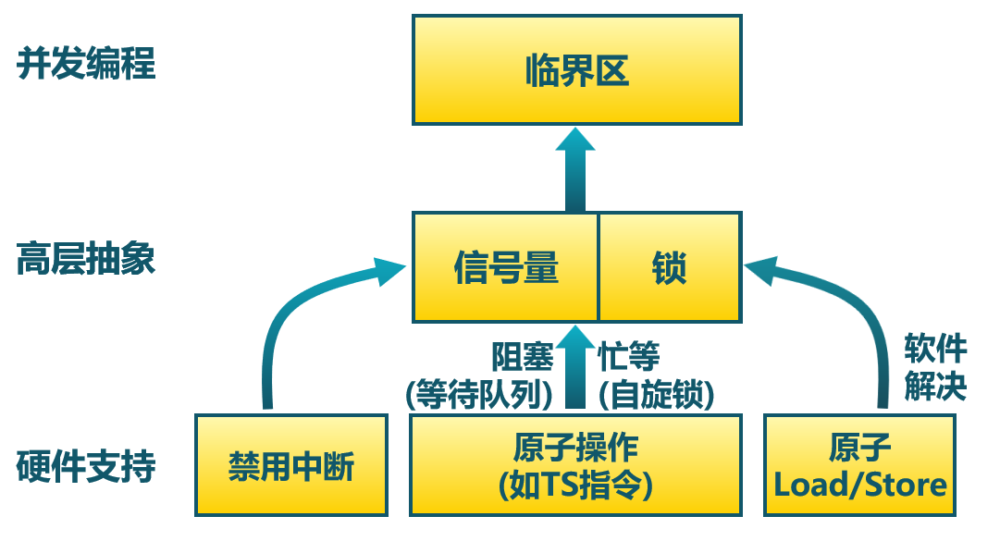
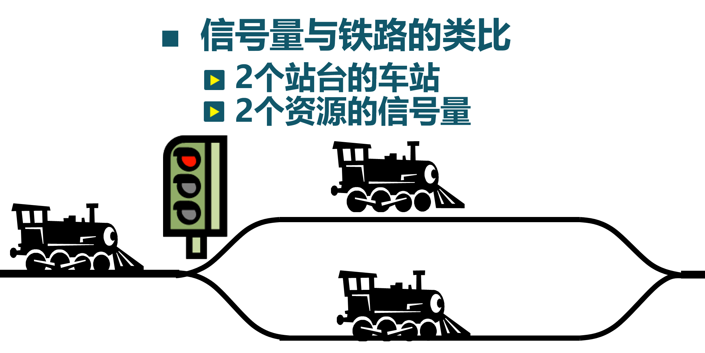
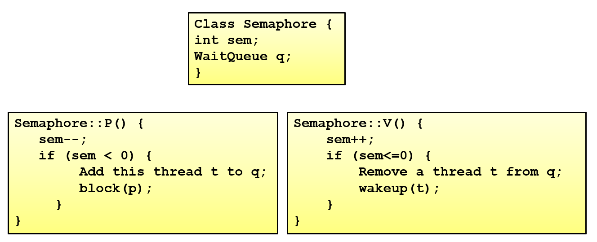
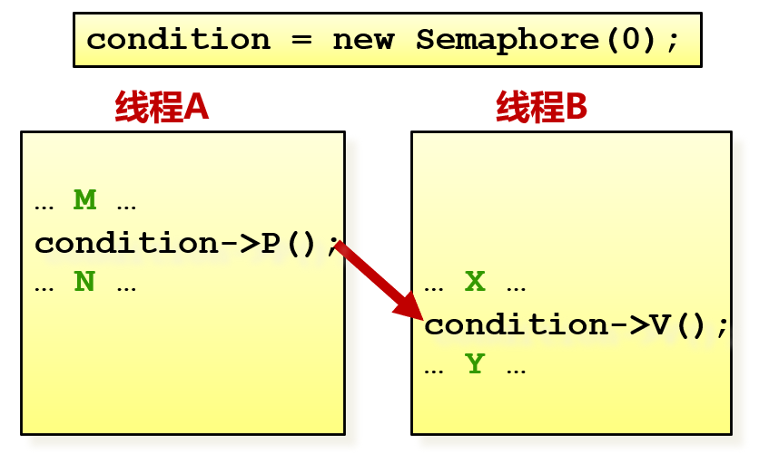
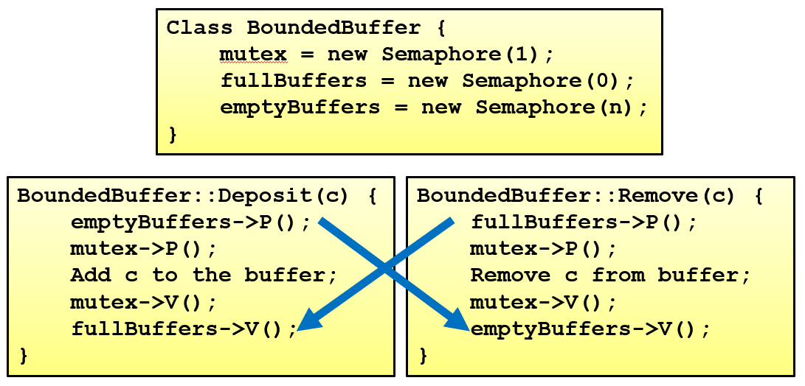

<!-- theme: gaia -->
<!-- _class: lead -->

# 第十二講 同步與互斥

## 第二節 信號量

---
### 信號量(semaphore)
- 信號量是操作系統提供的一種協調共享資源訪問的方法
- Dijkstra在20世紀60年代提出
- 早期的操作系統的主要同步機制

---
### 信號量(semaphore)
- 信號量是一種抽象數據類型，由一個整型 (sem)變量和兩個原子操作組成
   - P()：Prolaag 荷蘭語：嘗試減少
      - $sem = sem - 1$
      - 如sem<0, 進入等待, 否則繼續
   - V()：Verhoog 荷蘭語：增加
      - $sem = sem + 1$
      - 如$sem \le 0$, 喚醒一個等待的

---
### 信號量(semaphore)
- 信號量是被保護的整數變量
   - 初始化完成後，只能通過P()和V()操作修改
   - 由**操作系統保證**，PV操作是原子操作
- P() 可能阻塞，V()不會阻塞
- 通常假定信號量是“公平的”
   - 線程不會被無限期阻塞在P()操作
   - 假定信號量等待按先進先出排隊

自旋鎖能否實現先進先出?

---
### 信號量(semaphore)
信號量在概念上的實現

---
### 信號量(semaphore)
可分為兩類信號量
- 二進制信號量：資源數目為0或1
- 計數信號量:資源數目為任何非負值
- 兩者等價：基於一個可以實現另一個

信號量的使用
- **互斥訪問**  和 **條件同步**

---
### 信號量(semaphore)
互斥訪問舉例
- 每個臨界區設置一個信號量，其初值為1
- 需成對使用P()操作和V()操作
   -  P()操作保證互斥訪問資源
   -  V()操作在使用後釋放資源
   -  PV操作次序不能錯誤、重複或遺漏

 

---
### 信號量(semaphore)
條件同步舉例
- 每個條件同步設置一個信號量，其初值為0

---
### 信號量(semaphore)
生產者-消費者問題舉例
- 有界緩衝區的生產者-消費者問題描述
   - 一個或多個生產者在生成數據後放在一個緩衝區裡
   - 單個消費者從緩衝區取出數據處理
   - 任何時刻只能有一個生產者或消費者可訪問緩衝區

---
### 信號量(semaphore)
生產者-消費者問題舉例  
- 問題分析
   - 任何時刻只能有一個線程操作緩衝區（互斥訪問）
   - 緩衝區空時，消費者必須等待生產者（條件同步）
   - 緩衝區滿時，生產者必須等待消費者（條件同步）
- 用信號量描述每個約束
   - 二進制信號量mutex
   - 計數信號量fullBuffers
   - 計數信號量emptyBuffers

---
### 信號量(semaphore)
生產者-消費者問題舉例： P、V操作的順序有影響嗎？

---
### 信號量(semaphore)
- 讀/開發代碼比較困難
- 容易出錯
   - 使用已被佔用的信號量
   - 忘記釋放信號量
   - 不能夠避免死鎖問題
   - 對程序員要求較高
