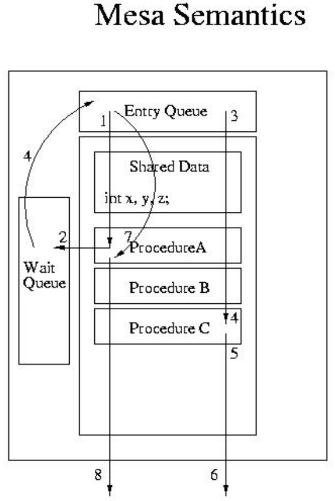
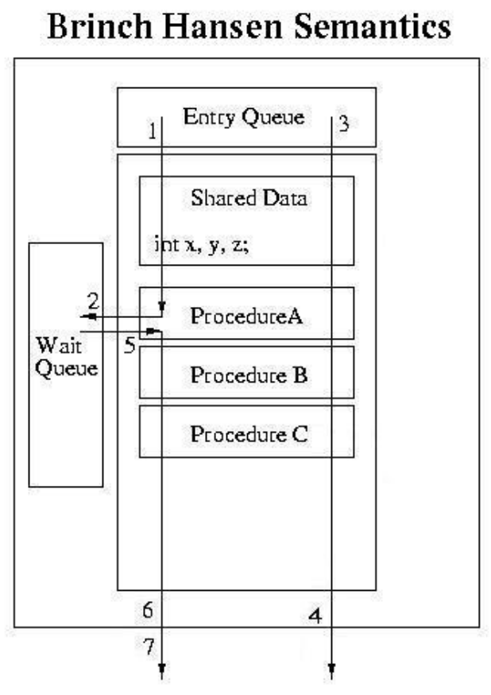

<!-- theme: gaia -->
<!-- _class: lead -->

# 第十二講 同步與互斥

## 第三節 管程與條件變量

 管程（Monitor）  條件變量（Condition Variable）
 
<!-- 
Gregory Kesden, Monitors and Condition Variables https://cseweb.ucsd.edu/classes/sp16/cse120-a/applications/ln/lecture9.html
Mark Spruiell, The C++ Monitor Class. Apr.2011 https://doc.zeroc.com/pages/viewpage.action?pageId=5048235
wikipedia, Monitor (synchronization) https://en.wikipedia.org/wiki/Monitor_(synchronization)
Mike Vine, Making a C++ class a Monitor (in the concurrent sense) https://stackoverflow.com/a/48408987
David Rodríguez - dribeas, How arrow-> operator overloading works internally in c++? https://stackoverflow.com/a/10678920
Fruit_初, Monitors, March, 2017. https://www.jianshu.com/p/8b3ed769bc9f
C++併發型模式#6: 管程 - monitor http://dengzuoheng.github.io/cpp-concurency-pattern-6-monitor 
-->
---
### 管程 
- 動機：為什麼有管程？ 傳統PV和鎖機制有如下問題：
  - 程序易讀性差：要了解對於一組共享變量及信號量的操作是否正確，則必須通讀整個系統或者併發程序。
  - 程序不利於修改和維護：程序局部性很差，所以任一組變量或一段代碼的修改都可能影響全局。
  - 正確性難以保證：操作系統或併發程序通常很大，很難保證一個複雜的系統沒有邏輯錯誤。
  - 容易發生死鎖：如果不使用好P、V操作時，邏輯上發生錯誤，很有可能會導致死鎖。

---
### 管程
- 管程是一種用於多線程互斥訪問共享資源的**程序結構**
- 採用**面向對象方法**，簡化了線程間的同步控制
- 任一時刻最多隻有一個線程執行管程代碼
- 正在管程中的線程可臨時放棄管程的互斥訪問，等待事件出現時恢復


---
### 管程 
- 模塊化，一個管程是一個基本程序單位，可以單獨編譯。

- 抽象數據類型，管程是一種特殊的數據類型，其中不僅有數據，而且有對數據進行操作的代碼。

- 信息隱蔽，管程是半透明的，管程中的過程（函數）實現了某些功能，在其外部則是不可見的。


---
### 管程 -- 條件變量
- 管程中的共享變量在管程外部是不可見的，外部只能通過調用管程中所說明的外部過程 (函數）來間接地訪問管程中的共享變量
  - 互斥：任一時刻管程中只能有一個活躍進程，通過鎖競爭進入管程
  - 等待：進入管程的線程**因資源被佔用**而進入等待狀態
    - 每個條件變量表示一種等待原因，對應一個等待隊列
    - 入口隊列管理未進入管程的線程/進程
  - 喚醒：管程中等待的線程可以（其他線程釋放資源）被喚醒
  - 同步：等待和喚醒操作
  - 管程操作：進入enter, 離開leave, 等待wait, 喚醒signal

<!--


---
### 管程 -- 條件變量

-->


<!-- https://blog.csdn.net/Carson_Chu/article/details/104223122  【操作系統】同步互斥機制（二）：管程與進程間通信機制（IPC）

https://zhuanlan.zhihu.com/p/465751547 學習進程互斥和進程同步有這一篇文就夠了！
https://www.cnblogs.com/uestcliming666/p/13224545.html  《現代操作系統》——第6章 同步互斥機制（二）、進程間通信機制

https://yangzhaoyunfei.github.io/monitors/ 管程(Monitors) -->


---
### 管程 -- 條件變量
- 管程的組成：一個由過程（函數）、變量及數據結構等組成的一個集合
   - 一個鎖：控制管程代碼的互斥訪問
   - 0或者多個條件變量: 管理共享數據的併發訪問，每個條件變量有個等待（緊急）隊列
   - 入口等待隊列
   - 緊急等待隊列
   - 條件變量隊列


---
### 管程 -- 條件變量
- 入口等待隊列：管程入口處等待隊列
- 條件等待隊列：某個條件變量的等待隊列（為資源佔用而等待）
- 緊急等待隊列：喚醒使用的緊急隊列
   - 當T1線程執行喚醒操作而喚醒T2，如果T1把訪問權限交給T2，T1被掛起；T1放入緊急等待隊列
   - 緊急等待隊列優先級高於條件變量等待隊列
   - 為互斥而等待的隊列


---
### 管程 -- 流程 （T可以是線程或者進程）
- T.enter過程：線程T在進入管程之前要獲得互斥訪問權(lock)
- T.leave過程：當線程T離開管程時，如果緊急隊列**不為空**，喚醒緊急隊列中的線程，並將T所持鎖賦予喚醒的線程；如果**緊急隊列為空**，釋放lock，喚醒入口等待隊列某個線程
- T.wait(c)：1)阻塞線程T自己，將t自己掛到條件變量c的等待隊列；
  - 2)釋放所持鎖； 3)喚醒入口等待隊列的一個或者多個線程；
<!--釋放管程權力，進入c的條件等待隊列；喚醒緊急等待隊列的第一個線程// 為進入管程的進程分配某種類型的資源，如果此時這種資源可用，那麼進程使用，否則進程被阻塞，進入條件等待隊列-->
- T.signal(c)：1)把條件變量c的等待隊列某個線程喚醒；
  - 2)把線程T所持lock給被喚醒的線程； 
  - 3)把線程T自己掛在緊急等待隊列
<!--喚醒由於等待這種資源而進入條件等待隊列的(c的條件等待隊列)第一個線程進入管程的進程某種資源釋放，此時進程會喚醒由於等待這種資源而進入條件等待隊列的第一個進程-->

<!--
---
### 管程 -- 條件變量
- 同步：條件變量（Condition Variables)以及相關的兩個操作：wait和signal，處理等待機制。
- Wait()操作
   - 將自己阻塞在等待隊列中
   - 釋放管程的互斥訪問
   - 將一個等在管程之外的進程調入
- Signal()操作
   - 將等待隊列中的一個線程喚醒
   - 如果等待隊列為空，則等同空操作


-->


---
### 管程 -- 實現方式
<!-- https://blog.csdn.net/qq_34666857/article/details/103189107 Java併發編程模擬管程（霍爾Hoare管程、漢森Hansan管程、MESA管程) -->
管程中條件變量的釋放處理方式

- 如果線程T1因條件A未滿足處於阻塞狀態，那麼當線程T2讓條件A滿足並執行signal操作喚醒T1後，不允許線程T1和T2同時處於管程中，那麼如何確定哪個執行/哪個等待？
- 可採用下面方式之一進行處理：

  - 1：(Hoare)：T1執行/T2等待，直至T1離開管程，然後T2繼續執行
  - 2：(MESA/Hansen)：T2執行/T1等待，直至T2離開管程，然後T1可能繼續執行


---
### 管程 -- 實現方式
<!-- https://blog.csdn.net/qq_34666857/article/details/103189107 Java併發編程模擬管程（霍爾Hoare管程、漢森Hansan管程、MESA管程) -->
管程中條件變量的釋放處理方式
- 線程 T2 的signal，使線程 T1 等待的條件滿足時
  - Hoare：T2 通知完 T1後，T2 阻塞，T1 馬上執行；等 T1 執行完，再喚醒 T2 執行
  - Hansen： T2 通知完 T1 後，T2 還會接著執行，T2 執行結束後（規定：最後操作是signal），然後 T1 再執行（將鎖直接給T1）
  - MESA：T2 通知完 T1 後，T2 還會接著執行，T1 並不會立即執行，而是重新競爭訪問權限

---
### 管程 
管程中條件變量的釋放處理方式
<!-- https://cseweb.ucsd.edu/classes/sp17/cse120-a/applications/ln/lecture8.html --> 
<!-- https://juejin.cn/post/6925331537365843981 synchronized原理剖析 -->


---
### 管程 
<!-- 管程中條件變量的釋放處理方式 -->


---
### 管程 
<!-- 管程中條件變量的釋放處理方式 -->
喚醒一個線程的兩種選擇：**直接賦予鎖** vs **重新公平競爭鎖**


---
### 管程 - Hoare 
<!-- https://www.cnblogs.com/upnote/p/13030741.html   Java synchronized的理論基礎-管程(Monitor) -->
```
- 1. T1 進入管程monitor
- 2. T1 等待資源 (進入等待隊列wait queue)
- 3. T2 進入管程monitor
- 4. T2 資源可用 ，通知T1恢復執行，
     並把自己轉移到緊急等待隊列
- 5. T1 重新進入管程monitor並執行
- 6. T1 離開monitor
- 7. T2 重新進入管程monitor並執行
- 8. T2 離開管程monitor
- 9. 其他在entry queue中的線程通過競爭
     進入管程monitor
```


---
### 管程 - Mesa 
<!-- https://www.cnblogs.com/upnote/p/13030741.html   Java synchronized的理論基礎-管程(Monitor) -->
```
- 1. T1 進入管程monitor
- 2. T1 等待資源 
    (進入wait queue，並釋放monitor)
- 3. T2 進入monitor
- 4. T2 資源可用，通知T1
    (T1被轉移到entey queue，重新平等競爭)
- 5. T2 繼續執行
- 6. T2 離開monitor
- 7. T1 獲得執行機會，從entry queue
     出隊列，恢復執行
- 8. T1 離開monitor
- 9. 其他在entry queue中的線程通過競爭
     進入monitor
```


---
### 管程 - Hansen： 
<!-- https://www.cnblogs.com/upnote/p/13030741.html   Java synchronized的理論基礎-管程(Monitor) -->
```
- 1. T1 進入管程monitor
- 2. T1 等待資源c
- 3. T2 進入monitor
- 4. T2 離開Monitor,並給通知等待
     資源c的線程，資源可用
- 5. T1 重新進入 monitor
- 6. T1 離開monitor
- 7. 其他線程從entry queue中通過競爭
     進入monitor
```


---
### 管程 -- 實現條件變量


---
### 管程 -- 實現條件變量


---
### 管程 -- 實現條件變量


---
### 管程 -- 實現條件變量


---
### 管程 -- 實現條件變量


---
### 管程 -- 實現條件變量


---
### 管程 -- 實現條件變量


---
### 管程 -- 實現條件變量


---
### 管程 -- 實現條件變量


---
### 管程 -- 生產者-消費者問題


---
### 管程 -- 生產者-消費者問題


---
### 管程 -- 生產者-消費者問題


---
### 管程 -- 生產者-消費者問題


