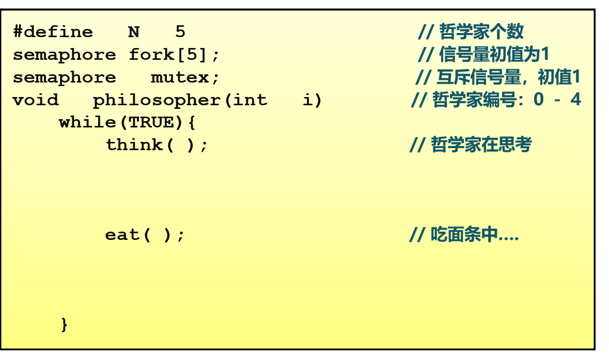
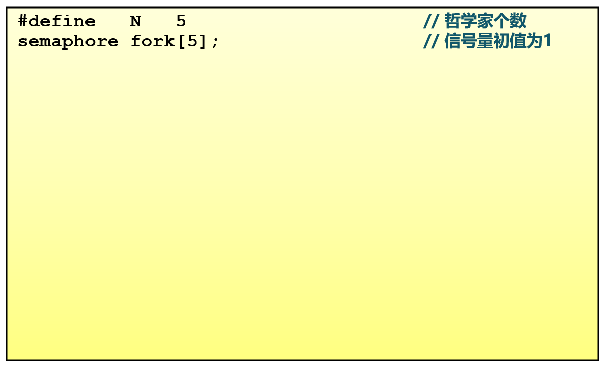
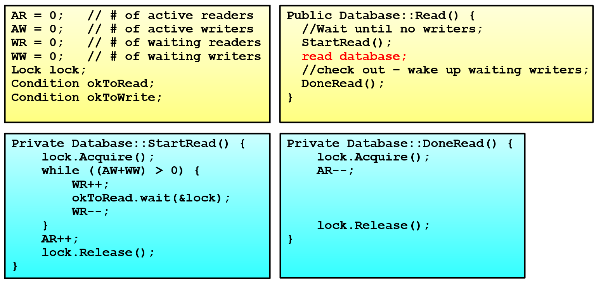
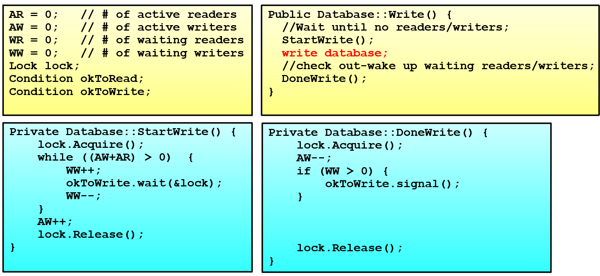

<!-- theme: gaia -->
<!-- _class: lead -->

# 第十二講 同步與互斥

## 第四節 同步互斥實例問題

---
### 哲學家就餐問題
- 5個哲學家圍繞一張圓桌而坐
- 桌子上放著5支叉子
- 每兩個哲學家之間放一支叉子
- 哲學家的動作包括思考和進餐
- 進餐時需同時用左右兩邊的叉子
- 思考時將兩支叉子放回原處

如何保證哲學家們的動作有序進行？
如：不出現有人永遠拿不到叉子


---
### 哲學家就餐問題 -- 方案1


不正確，可能導致死鎖

---
### 哲學家就餐問題 -- 方案2


---
### 哲學家就餐問題 -- 方案2


---
### 哲學家就餐問題 -- 方案2


---
### 哲學家就餐問題 -- 方案2


---
### 哲學家就餐問題 -- 方案2

互斥訪問正確，但每次只允許一人進餐


---
### 哲學家就餐問題 -- 方案3



---
### 哲學家就餐問題 -- 方案3


---
### 哲學家就餐問題 -- 方案3


---
### 哲學家就餐問題 -- 方案3


---
### 哲學家就餐問題 -- 方案3


---
### 哲學家就餐問題 -- 方案3

沒有死鎖，可有多人同時就餐

---
### 哲學家就餐問題 -- 方案4


---
### 哲學家就餐問題 -- 方案4
<!-- https://blog.csdn.net/weixin_43237362/article/details/104712647 AND型信號量 -->

AND型信號量集是指同時需要多個資源且每種佔用一個資源時的信號量操作。

當一段代碼需要同時獲取兩個或多個臨界資源時，就可能出現由於各線程分別獲得部分臨界資源並等待其餘的臨界資源的局面。各線程都會“各不相讓”，從而出現死鎖。

解決這個問題的一個基本思路是：在一個原語中申請整段代碼需要的多個臨界資源，要麼全部分配給它，要麼一個都不分配給它。這就是AND型信號量集的基本思想。

---
### 哲學家就餐問題 -- 方案4
<!-- https://blog.csdn.net/weixin_43237362/article/details/104712647 AND型信號量 -->
AND型信號量集
```
P(S1, S2, …, Sn)
{
    While(TRUE)
    {
        if (S1 >=1 and … and Sn>=1 ){
            for( i=1 ;i<=n; i++) Si--;
        break;
        }
        else{
             Place the thread in the waiting queue associated  with the first Si 
             found with Si < 1   
        }
    }
}
```

---
### 哲學家就餐問題 -- 方案4
<!-- https://blog.csdn.net/weixin_43237362/article/details/104712647 AND型信號量 -->
AND型信號量集
```
V(S1, S2, …, Sn){ 
    for (i=1; i<=n; i++) {
            Si++ ;
            Remove all the thread waiting in the queue associated with Si into 
            the ready queue                
     }
}
```
---
### 哲學家就餐問題 -- 方案5


---
### 哲學家就餐問題 -- 方案5


---
### 哲學家就餐問題 -- 方案5


---
### 哲學家就餐問題 -- 方案5
方案5不僅沒有死鎖，而且對於任意位哲學家的情況都能獲得最大的並行度。算法中使用一個數組`state`跟蹤每一個哲學家是在進餐、思考還是飢餓狀態（正在試圖拿叉子）。一個哲學家只有在兩個鄰居都沒有進餐時才允許進入到進餐狀態。

每個線程將函數`philosopher`作為主代碼運行，而其他函數`take_forks`、`put_forks`和`test`只是普通的函數，而非單獨的線程。


---
### 讀者-寫者問題
- 共享數據的兩類使用者
  - 讀者：只讀不修改數據
  - 寫者：讀取和修改數據
- 對共享數據的讀寫
  - 多個：“讀－讀”-- 允許
  - 單個：“讀－寫”-- 互斥
  - 單個：“寫－寫”-- 互斥


---
### 讀者-寫者問題
- 讀者優先策略
   - 只要有讀者正在讀狀態，後來的讀者都能直接進入
   - 如讀者持續不斷進入，則寫者就處於飢餓
 - 寫者優先策略
   - 只要有寫者就緒，寫者應儘快執行寫操作
   - 如寫者持續不斷就緒，則讀者就處於飢餓


---
### 讀者-寫者問題 -- 方案1
用信號量描述每個約束
- 信號量WriteMutex：控制讀寫操作的互斥，初始化為1
- 讀者計數Rcount ：正在進行讀操作的讀者數目，初始化為0
- 信號量CountMutex：控制對讀者計數的互斥修改，初始化為1


---
### 讀者-寫者問題 -- 方案1(信號量)


---
### 讀者-寫者問題 -- 方案1(信號量)


---
### 讀者-寫者問題 -- 方案1(信號量)


---
### 讀者-寫者問題 -- 方案1(信號量)


---
### 讀者-寫者問題 -- 方案1(信號量)


---
### 讀者-寫者問題 -- 方案1(信號量)

此實現中，讀者優先


---
### 讀者-寫者問題 -- 方案2(管程)


---
### 讀者-寫者問題 -- 方案2(管程)


---
### 讀者-寫者問題 -- 方案2(管程) --讀者


---
### 讀者-寫者問題 -- 方案2(管程) --讀者


---
### 讀者-寫者問題 -- 方案2(管程) --讀者


---
### 讀者-寫者問題 -- 方案2(管程) --讀者


---
### 讀者-寫者問題 -- 方案2(管程) --讀者


---
### 讀者-寫者問題 -- 方案2(管程) --讀者



---
### 讀者-寫者問題 -- 方案2(管程) --讀者


---
### 讀者-寫者問題 -- 方案2(管程) --讀者


---
### 讀者-寫者問題 -- 方案2(管程) --寫者


---
### 讀者-寫者問題 -- 方案2(管程) --寫者


---
### 讀者-寫者問題 -- 方案2(管程) --寫者


---
### 讀者-寫者問題 -- 方案2(管程) --寫者


---
### 讀者-寫者問題 -- 方案2(管程) --寫者



---
### 讀者-寫者問題 -- 方案2(管程) --寫者
