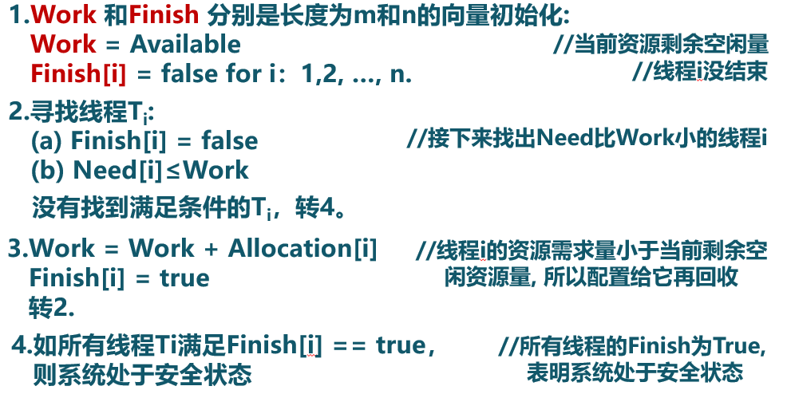
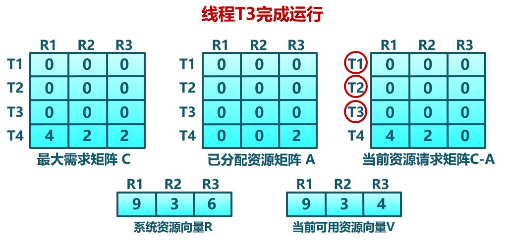
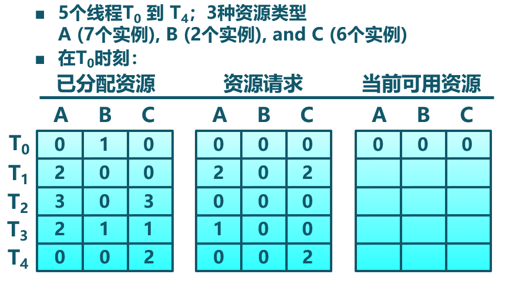
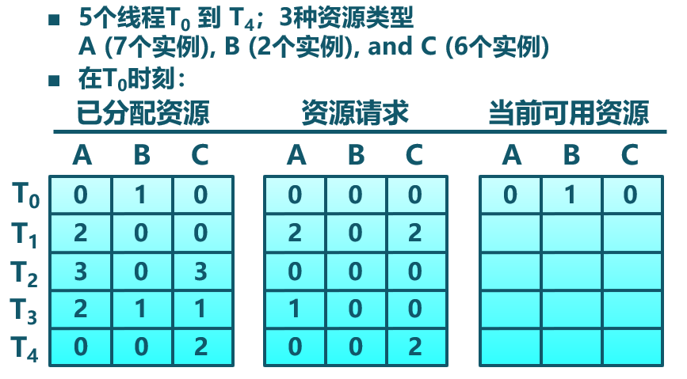
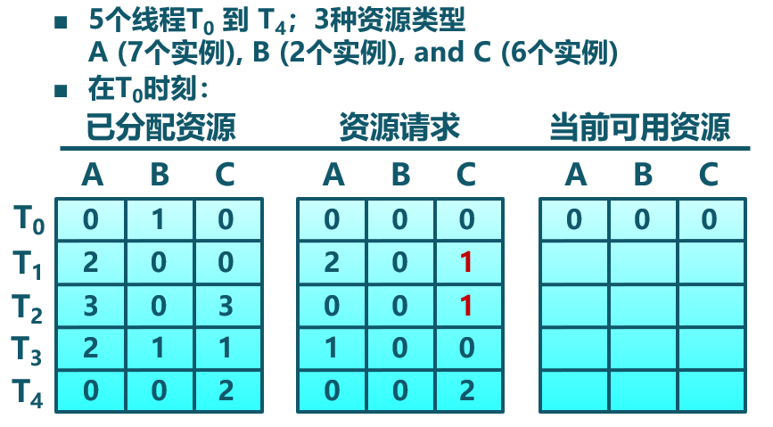

<!-- theme: gaia -->
<!-- _class: lead -->

# 第十二講 同步與互斥

## 第五節 死鎖


---
### 死鎖問題

- 橋樑只能單向通行
- 橋的每個部分可視為一個資源
- 可能出現死鎖
  - 對向行駛車輛在橋上相遇
  - 解決方法：一個方向的車輛倒退(資源搶佔和回退)


---
### 死鎖問題

- 橋樑只能單向通行
- 橋的每個部分可視為一個資源
- 可能發生飢餓
  - 由於一個方向的持續車流，另一個方向的車輛無法通過橋樑


---
### 死鎖問題
由於競爭資源或者通信關係，兩個或更多線程在執行中出現，永遠相互等待只能由其他進程引發的事件
```
Thread 1:    Thread 2:
lock(L1);    lock(L2);
lock(L2);    lock(L1);
```


---
###  死鎖問題 -- 資源
- 資源類型$R_1, R_2, . . .,R_m$
   - CPU執行時間、內存空間、I/O設備等
- 每類資源$R_i$有$W_i$個實例
- 線/進程訪問資源的流程
   - 請求：申請空閒資源
   - 使用：佔用資源
   - 釋放：資源狀態由佔用變成空閒


---
###  死鎖問題 -- 資源
**資源分類**
- 可重用資源（Reusable Resource）
   - 任何時刻只能有一個線/進程使用資源
   - 資源被釋放後，其他線/進程可重用
   - 可重用資源示例
      - 硬件：處理器、內存、設備等
      - 軟件：文件、數據庫和信號量等
   - 可能出現死鎖：每個進程佔用一部分資源並請求其它資源


---
###  死鎖問題 -- 資源
**資源分類**
- 可消耗資源(Consumable resource)
   - 資源可被銷燬
   - 可消耗資源示例
      - 在I/O緩衝區的中斷、信號、消息等
   - 可能出現死鎖：進程間相互等待接收對方的消息


---
###  死鎖問題 -- 資源分配圖
描述資源和進程間的分配和佔用關係的有向圖
- 頂點：系統中的進程
   - $P = \{ P_1, P_2, …, P_n \}$
- 頂點：系統中的資源
   - $R = \{R_1, R_2, …, P_m\}$
- 邊：資源請求
   - 進程$P_i$請求資源$R_j: P_i \rightarrow R_j$
- 邊：資源分配
   - 資源$R_j$已分配給進程$P_i：R_j \rightarrow  P_i$


---
###  死鎖問題 -- 資源分配圖

是否有死鎖？


---
###  死鎖問題 -- 必要條件
- 互斥
  - 任何時刻只能有一個進/線程使用一個資源實例
- 持有並等待
  - 進/線程保持至少一個資源，並正在等待獲取其他進程持有的資源
- 非搶佔
  - 資源只能在進程使用後自願釋放
- 循環等待
   - 存在等待進程集合$\{P_0，P_1，...，P_N\}$ 
   - 進程間形成相互等待資源的環


---
###  死鎖問題 -- 處理辦法 
- 死鎖預防(Deadlock Prevention)
   - 確保系統永遠不會進入死鎖狀態
- 死鎖避免(Deadlock Avoidance)
   - 在使用前進行判斷，只允許不會出現死鎖的進程請求資源
- 死鎖檢測和恢復(Deadlock Detection & Recovery)
   - 在檢測到運行系統進入死鎖狀態後，進行恢復
- 由應用進程處理死鎖
   - 通常操作系統忽略死鎖
      - 大多數操作系統（包括UNIX）的做法

---
###  死鎖問題 - 處理辦法 -- 預防
預防採用某種策略限制併發進程對資源的請求，或破壞死鎖必要條件。
- 破壞“互斥”
   - 把互斥的共享資源封裝成可同時訪問，例如用SPOOLing技術將打印機改造為共享設備；
   - 缺點：但是很多時候都無法破壞互斥條件。
- 破壞“持有並等待“
   - 只在能夠同時獲得所有需要資源時，才執行分配操作
   <!-- 僅允許進程在開始執行時，一次請求所有需要的資源
      - 進程請求資源時，要求它不持有任何其他資源-->
   - 缺點：資源利用率低


---
###  死鎖問題 - 處理辦法 -- 預防
<!--預防是採用某種策略，限制併發進程對資源的請求，或使系統在任何時刻都不滿足死鎖的必要條件。-->
預防採用某種策略限制併發進程對資源的請求，或破壞死鎖必要條件。
- 破壞“非搶佔”
   - 如進程請求不能立即分配的資源，則釋放已佔有資源
   - 申請的資源被其他進程佔用時，由OS協助剝奪
   - 缺點：反覆地申請和釋放資源會增加系統開銷，降低系統吞吐量。
- 破壞“循環等待“
   - 對資源排序，要求進程按順序請求資源
   - 缺點：必須按規定次序申請資源，用戶編程麻煩
   - 缺點：難以支持資源變化（例如新資源）
 
 
<!---
###  死鎖問題 - 處理辦法 -- 預防

-->


---
###  死鎖問題 - 處理辦法 -- 避免
利用額外的先驗信息，在分配資源時判斷是否會出現死鎖，只在不會死鎖時分配資源
- 要求進程聲明需要資源的最大數目
- 限定提供與分配的資源數量，確保滿足進程的最大需求
- 動態檢查的資源分配狀態，確保不會出現環形等待

 
---
###  死鎖問題 - 處理辦法 -- 避免
資源分配中，系統處於安全狀態
- 針對所有已佔用進程，存在安全執行序列$<P_1，P_2，...，P_N>$
- $P_i$要求的資源 $\le$ 當前可用資源 $+$ 所有$P_j$ 持有資源，其中$j<i$
- 如$P_i$的資源請求不能立即分配，則$P_i$等待所有$P_j (j<i)$完成
- $P_i$完成後，$P_{i+1}$可得到所需資源，執行完並釋放所分配的資源
- 最終整個序列的所有Pi都能獲得所需資源


---
###  死鎖問題 - 處理辦法 -- 避免
安全狀態與死鎖的關係
- 系統處於安全狀態，一定沒有死鎖
- 系統處於不安全狀態，可能出現死鎖
   - 避免死鎖就是確保系統不會進入不安全狀態


---
###  死鎖問題 - 處理辦法 -- 避免
銀行家算法（Banker's Algorithm）-- 概述
- 銀行家算法是一個避免死鎖產生的算法。以銀行借貸分配策略為基礎，判斷並保證系統處於安全狀態
   - 客戶在第一次申請貸款時，聲明所需最大資金量，在滿足所有貸款要求並完成項目時，及時歸還
   - 在客戶貸款數量不超過銀行擁有的最大值時，銀行家儘量滿足客戶需要

銀行家 $\leftrightarrow$操作系統；資金 $\leftrightarrow$資源；客戶 $\leftrightarrow$線/進程

---
###  死鎖問題 - 處理辦法 -- 避免
銀行家算法（Banker's Algorithm）-- 數據結構


---
###  死鎖問題 - 處理辦法 -- 避免
銀行家算法（Banker's Algorithm）-- 判斷安全狀態的例程



---
###  死鎖問題 - 處理辦法 -- 避免
銀行家算法（Banker's Algorithm）-- 完整算法


---
###  死鎖問題 - 處理辦法 -- 避免
銀行家算法（Banker's Algorithm）-- 示例1


---
###  死鎖問題 - 處理辦法 -- 避免
銀行家算法（Banker's Algorithm）-- 示例1


---
###  死鎖問題 - 處理辦法 -- 避免
銀行家算法（Banker's Algorithm）-- 示例1


---
###  死鎖問題 - 處理辦法 -- 避免
銀行家算法（Banker's Algorithm）-- 示例1


---
###  死鎖問題 - 處理辦法 -- 避免
銀行家算法（Banker's Algorithm）-- 示例2


---
###  死鎖問題 - 處理辦法 -- 避免
銀行家算法（Banker's Algorithm）-- 示例2


---
###  死鎖問題 - 處理辦法 -- 檢測
- 允許系統進入死鎖狀態
- 維護系統的資源分配圖
- 定期調用死鎖檢測算法來搜索圖中是否存在死鎖
- 出現死鎖時，用死鎖恢復機制進行恢復


---
###  死鎖問題 - 處理辦法 -- 檢測
死鎖檢測算法：數據結構
- Available:長度為m的向量：每種類型可用資源的數量
- Allocation:一個n×m矩陣：當前分配給各個進程每種類型資源的數量
   - 進程$P_i$ 擁有資源$R_j$的$Allocation[i, j]$個實例


---
###  死鎖問題 - 處理辦法 -- 檢測
死鎖檢測算法：完整算法


---
###  死鎖問題 - 處理辦法 -- 檢測
死鎖檢測算法：-- 示例1



---
###  死鎖問題 - 處理辦法 -- 檢測
死鎖檢測算法：-- 示例1



---
###  死鎖問題 - 處理辦法 -- 檢測
死鎖檢測算法：-- 示例1


---
###  死鎖問題 - 處理辦法 -- 檢測
死鎖檢測算法：-- 示例1


---
###  死鎖問題 - 處理辦法 -- 檢測
死鎖檢測算法：-- 示例1


---
###  死鎖問題 - 處理辦法 -- 檢測
死鎖檢測算法：-- 示例1

序列$<T_0, T_2, T_1, T_3, T_4>$ 對於所有的i，都可滿足Finish[i] = true


---
###  死鎖問題 - 處理辦法 -- 檢測
死鎖檢測算法：-- 示例2

可通過回收線程$T_0$佔用的資源，但資源不足以完成其他線程請求
線程$T_1, T_2, T_3, T_4$形成死鎖


---
###  死鎖問題 - 處理辦法 -- 檢測
使用死鎖檢測算法

- 死鎖檢測的時間和週期選擇依據
   - 死鎖多久可能會發生
   - 多少進/線程需要被回滾
- 資源圖可能有多個循環
   - 難於分辨“造成”死鎖的關鍵進/線程

檢測到死鎖後，應該如何處理？

---
###  死鎖問題 - 處理辦法 -- 恢復 -- 進程終止

- 終止所有的死鎖進程
- 一次只終止一個進程直到死鎖消除
- 終止進程的順序的參考因素：
   - 進程的優先級
   - 進程已運行時間以及還需運行時間
   - 進程已佔用資源
   - 進程完成需要的資源
   - 終止進程數目
   - 進程是交互還是批處理

---
###  死鎖問題 - 處理辦法 -- 恢復 -- 資源搶佔
- 選擇被搶佔進程
   - 參考因素：最小成本目標
- 進程回退
   - 返回到一些安全狀態, 重啟進程到安全狀態
-  可能出現飢餓
   - 同一進程可能一直被選作被搶佔者


 

