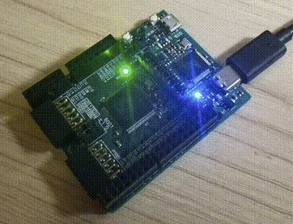
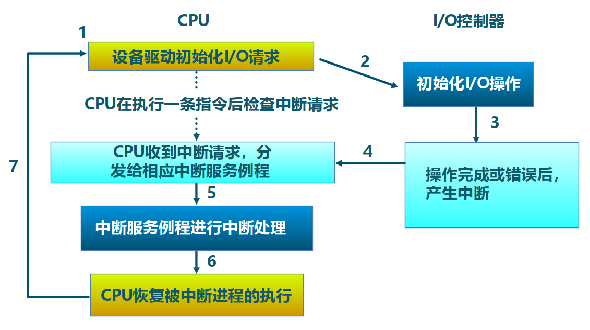
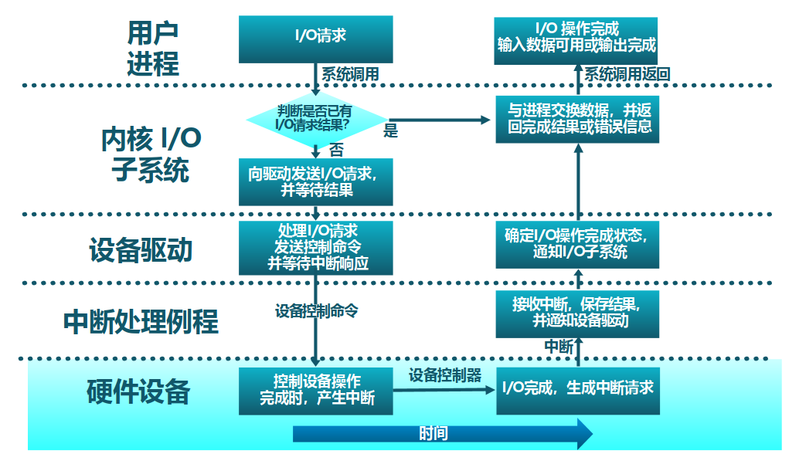
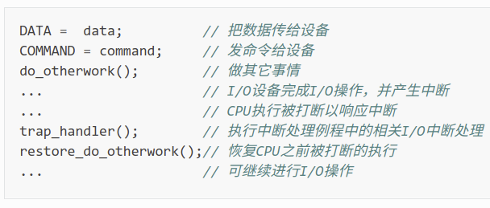
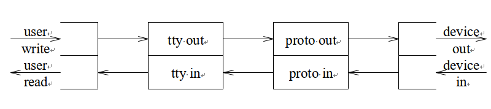
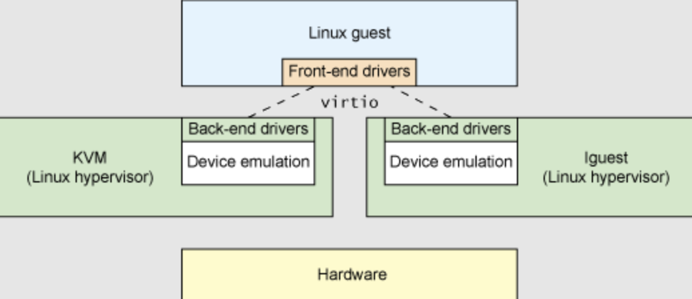

<!-- theme: gaia -->
<!-- _class: lead -->

# 第十三講 設備管理
## 第一節 設備接口

 
 

向勇 陳渝 李國良 任炬

 
 

2023年春季

---
### 內容
- 要解決的問題
- 內核 I/O 結構
- 常見設備接口類型
- 設備訪問特徵
- 設備傳輸方式
- I/O執行模型

---
### I/O子系統 -- 要解決的問題
- 為何設備的差異性那麼大？
- 為何要管理設備？
- 如何統一對設備的訪問接口？
- 為何要對設備建立抽象？
- 如何感知設備的狀態並管理設備？
- 如何提高 CPU 與設備的訪問性能？
- 如果保證 I/O 操作的可靠性？

---
### I/O子系統 -- 內核 I/O 結構

---
### I/O子系統 -- 常見設備接口類型
- 設備的發展歷史
   - 簡單設備：CPU 可通過 I/O 接口直接控制 I/O 設備  
   - 多設備：CPU 與 I/O 設備之間增加了一層 I/O 控制器和總線 BUS
   - 支持中斷的設備：提高 CPU 利用率
   - 高吞吐量設備：支持 DMA
   - 各種其他設備：GPU、聲卡、智能網卡、RDMA
   - 連接方式：直連、（設備/中斷）控制器、總線、分佈式

---
### I/O子系統 -- 常見設備接口類型
- 常見設備：字符設備   塊設備   網絡設備

包含上述外設的嵌入式開發板

---
### I/O子系統 -- 常見設備接口類型
字符設備：如GPIO, 鍵盤/鼠標, 串口等

GPIO LED light

---
### I/O子系統 -- 常見設備接口類型
字符設備：如GPIO, 鍵盤/鼠標, 串口等

鍵盤

---
### I/O子系統 -- 常見設備接口類型
字符設備：如GPIO, 鍵盤/鼠標, 串口等

UART 串口通信

---
### I/O子系統 -- 常見設備接口類型
塊設備：如: 磁盤驅動器、磁帶驅動器、光驅等

 磁盤

 
---
### I/O子系統 -- 常見設備接口類型
網絡設備：如ethernet、wifi、bluetooth 等

網卡

 
---
### I/O子系統 -- 設備訪問特徵
字符設備
- 以字節為單位順序訪問
- I/O 命令：get()、put() 等
- 通常使用文件訪問接口和語義

 
---
### I/O子系統 -- 設備訪問特徵
塊設備
- 均勻的數據塊訪問
- I/O 命令：原始 I/O 或文件系統接口、內存映射文件訪問
- 通常使用文件訪問接口和語義

 
---
### I/O子系統 -- 設備訪問特徵
網絡設備
- 格式化報文交換
- I/O 命令：send/receive 網絡報文，通過網絡接口支持多種網絡協議
- 通常使用 socket 訪問接口和語義

 
---
### I/O子系統 -- 設備傳輸方式
- 程序控制 I/O(PIO, Programmed I/O)
- Interrupt based I/O
- 直接內存訪問 (DMA)

 
 
---
### I/O子系統 -- 設備傳輸方式
**程序控制 I/O(PIO, Programmed I/O)**
- Port-mapped 的 PIO(PMIO)：通過 CPU 的 in/out 指令
- Memory-mapped 的 PIO(MMIO)：通過 load/store 傳輸所有數據
- 硬件簡單，編程容易
- 消耗的 CPU 時間和數據量成正比
- 適用於簡單的、小型的設備 I/O
- I/O 設備通知 CPU：PIO 方式的輪詢

 
---
### I/O子系統 -- 設備傳輸方式
**中斷傳輸方式**
- I/O 設備想通知 CPU ，便會發出中斷請求信號
- 可中斷的設備和中斷類型逐步增加
- 除了需要設置 CPU，還需設置中斷控制器
- 編程比較麻煩
- CPU 利用率高
- 適用於比較複雜的 I/O 設備
- I/O 設備通知 CPU：中斷方式的提醒

 
---
### I/O子系統 -- 設備傳輸方式
**中斷傳輸方式**

 
---
### I/O子系統 -- 設備傳輸方式
DMA 傳輸方式
- 設備控制器可直接訪問系統總線
- 控制器直接與內存互相傳輸數據
- 除了需要設置 CPU，還需設置中斷控制器
- 編程比較麻煩，需要 CPU 參與設置
- 設備傳輸數據不影響 CPU
- 適用於高吞吐量 I/O 設備
 
---
### I/O子系統 -- CPU 與設備的連接

---
### I/O子系統 -- 讀取磁盤數據的例子

---
### I/O子系統 -- I/O 請求生存週期

---
### I/O子系統 -- I/O執行模型 -- I/O 接口的交互協議
基於輪詢的抽象設備接口：狀態 命令 數據

---
### I/O子系統 -- I/O執行模型 -- I/O 接口的交互協議
基於中斷的抽象設備接口：狀態 命令 數據 中斷

---
### I/O子系統 -- I/O執行模型 --  設備抽象
**基於文件的 I/O 設備抽象**
- 訪問接口：open/close/read/write
- 特別的系統調用：ioctl ：input/output control
- ioctl 系統調用很靈活，但太靈活了，請求碼的定義無規律可循
- 文件的接口太面向用戶應用，不足覆蓋到OS對設備進行管理的過程

---
### I/O子系統 -- I/O執行模型 --  設備抽象
**基於流的 I/O 設備抽象**
- 流是用戶進程和設備或偽設備之間的全雙工連接
- 特別的系統調用：ioctl ：input/output control
- ioctl 系統調用很靈活，但太靈活了，請求碼的定義無規律可循
- Dennis M. Ritchie 寫出了“A Stream Input-Output System”，1984

---
### I/O子系統 -- I/O執行模型 --  設備抽象
**基於virtio的 I/O 設備抽象**
- Rusty Russell 在 2008 年提出通用 I/O 設備抽象–virtio 規範
- 虛擬機提供 virtio 設備的實現，virtio 設備有著統一的 virtio 接口
- OS 只要能夠實現這些通用的接口，就可管理和控制各種 virtio 設備

---
### I/O子系統 -- I/O執行模型 -- 分類
當一個用戶進程發出一個 read I/O 系統調用時，主要經歷兩個階段：
1. 等待數據準備好；    
2. 把數據從內核拷貝到用戶進程中

- 進程執行狀態：阻塞/非阻塞：進程執行系統調用後會被阻塞/非阻塞
- 消息通信機制：
  -  同步：用戶進程與操作系統之間的操作是經過雙方協調的，步調一致的
  - 異步：用戶進程與操作系統之間並不需要協調，都可以隨意進行各自的操作

---
### I/O子系統 -- I/O執行模型 -- 分類
- blocking I/O
- nonblocking I/O
- I/O multiplexing
- signal driven I/O
- asynchronous I/O

---
### I/O子系統 -- I/O執行模型 --  阻塞 I/O

---
### I/O子系統 -- I/O執行模型 --  阻塞 I/O
基於阻塞 I/O（blocking I/O）模型的文件讀系統調用–read 的執行過程是：
1. 用戶進程發出 read 系統調用；
2. 內核發現所需數據沒在 I/O 緩衝區中，需要向磁盤驅動程序發出 I/O 操作，並讓用戶進程處於阻塞狀態；
3. 磁盤驅動程序把數據從磁盤傳到 I/O 緩衝區後，通知內核（一般通過中斷機制），內核會把數據從 I/O 緩衝區拷貝到用戶進程的 buffer 中，並喚醒用戶進程（即用戶進程處於就緒態）；
4. 內核從內核態返回到用戶態進程，此時 read 系統調用完成。

---
### I/O子系統 -- I/O執行模型 -- 非阻塞 I/O

---
### I/O子系統 -- I/O執行模型 -- 非阻塞 I/O
基於非阻塞 IO（non-blocking I/O）模型的文件讀系統調用–read 的執行過程：
1. 用戶進程發出 read 系統調用；
2. 內核發現所需數據沒在 I/O 緩衝區中，需要向磁盤驅動程序發出 I/O 操作，並不會讓用戶進程處於阻塞狀態，而是立刻返回一個 error；
3. 用戶進程判斷結果是一個 error 時，它就知道數據還沒有準備好，於是它可以再次發送 read 操作（這一步操作可以重複多次）；

---
### I/O子系統 -- I/O執行模型 -- 非阻塞 I/O

4. 磁盤驅動程序把數據從磁盤傳到 I/O 緩衝區後，通知內核（一般通過中斷機制），內核在收到通知且再次收到了用戶進程的 system call 後，會馬上把數據
從 I/O 緩衝區拷貝到用戶進程的 buffer 中；
5. 內核從內核態返回到用戶態的用戶態進程，此時 read 系統調用完成。

所以，在非阻塞式 I/O 的特點是用戶進程不會被內核阻塞，而是需要不斷的主動詢問內核所需數據準備好了沒有。

---
### I/O子系統 -- I/O執行模型 -- 多路複用 I/O

---
### I/O子系統 -- I/O執行模型 -- 多路複用 I/O
多路複用 I/O（I/O multiplexing）的文件讀系統調用–read 的執行過程：
1. 對應的 I/O 系統調用是 select 和 epoll 等
2. 通過 select 或 epoll 系統調用來不斷的輪詢用戶進程關注的所有文件句柄或socket，當某個文件句柄或 socket 有數據到達了，select 或 epoll 系統調用就會返回到用戶進程，用戶進程再調用 read 系統調用，讓內核將數據從內核的I/O 緩衝區拷貝到用戶進程的 buffer 中。

---
### I/O子系統 -- I/O執行模型 -- 信號驅動 I/O

---
### I/O子系統 -- I/O執行模型 -- 信號驅動 I/O

1. 當進程發出一個 read 系統調用時，會向內核註冊一個信號處理函數，然後系統調用返回，進程不會被阻塞，而是繼續執行。
2. 當內核中的 IO 數據就緒時，會發送一個信號給進程，進程便在信號處理函數中調用 IO 讀取數據。

此模型的特點是，採用了回調機制，這樣開發和調試應用的難度加大。

---
### I/O子系統 -- I/O執行模型 -- 異步 I/O

---
### I/O子系統 -- I/O執行模型 -- 異步 I/O
1. 用戶進程發起 read 異步系統調用之後，立刻就可以開始去做其它的事。
2. 從內核的角度看，當它收到一個 read 異步系統調用之後，首先它會立刻返回，所以不會對用戶進程產生任何阻塞情況。
3. kernel 會等待數據準備完成，然後將數據拷貝到用戶內存。
4. 當這一切都完成之後，kernel 會通知用戶進程，告訴它 read 操作完成了。

---
### I/O子系統 -- I/O執行模型 -- 比較

---
### I/O子系統 -- I/O執行模型 -- 比較

1. 阻塞 I/O：在用戶進程發出 I/O 系統調用後，進程會等待該 IO 操作完成，而使得進程的其他操作無法執行。
2. 非阻塞 I/O：在用戶進程發出 I/O 系統調用後，如果數據沒準備好，該 I/O 操作會立即返回，之後進程可以進行其他操作；如果數據準備好了，用戶進程會通過系統調用完成數據拷貝並接著進行數據處理。
3. 多路複用 I/O：將多個非阻塞 I/O 請求的輪詢操作合併到一個 select 或 epoll系統調用中進行。
4. 信號驅動 I/O：利用信號機制完成從內核到應用進程的事件通知。
5. 異步 I/O：不會導致請求進程阻塞。