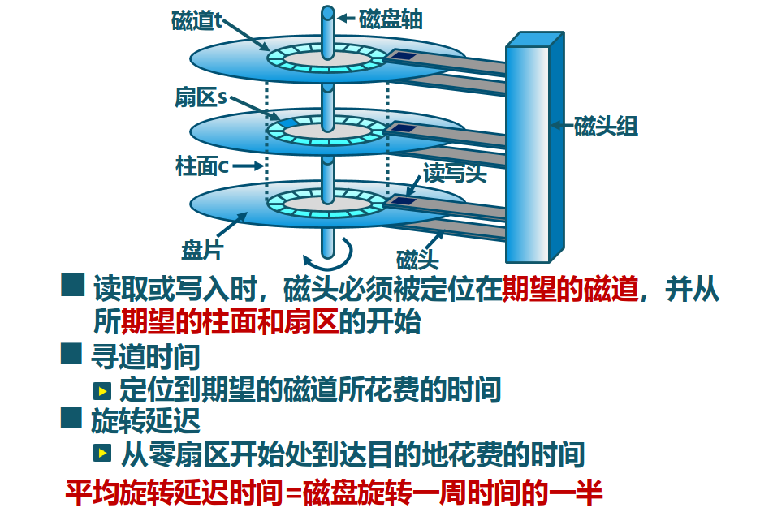
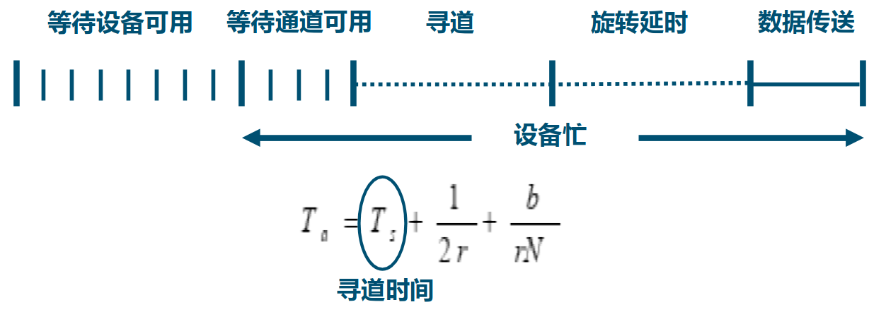
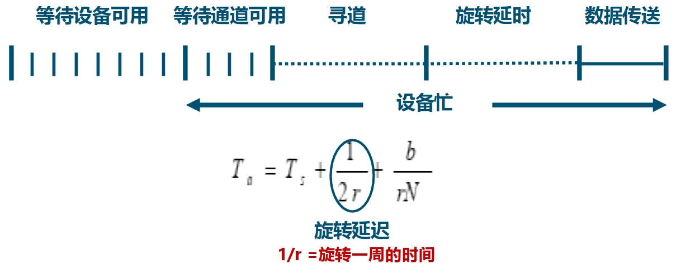
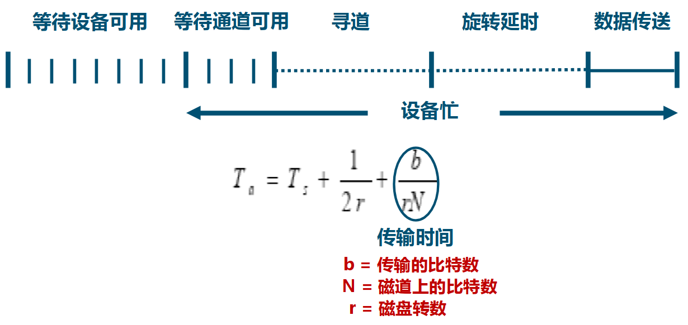
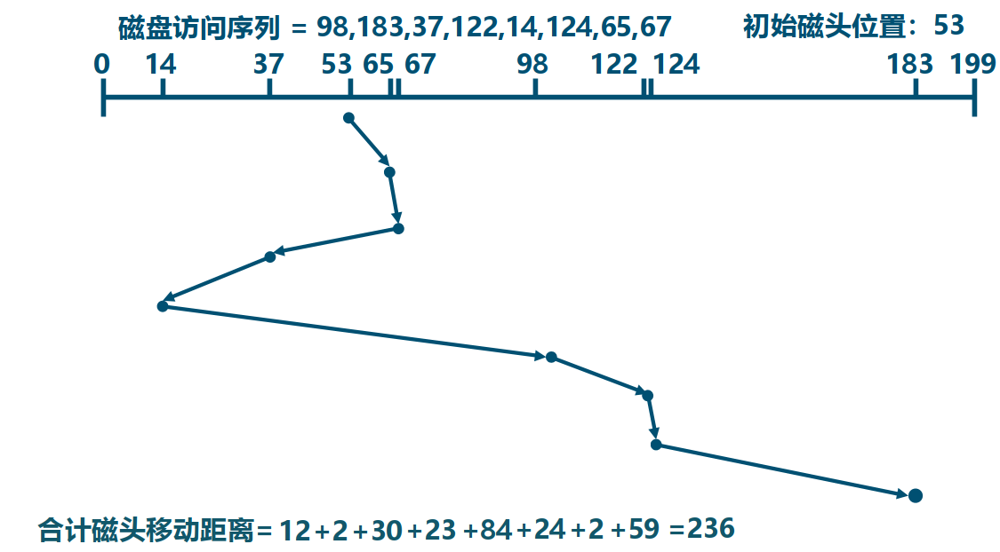
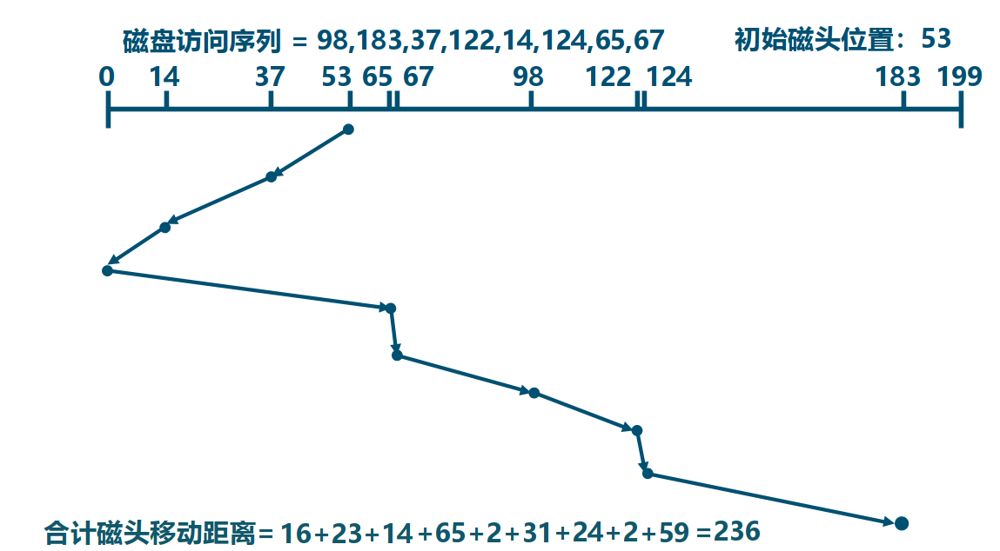

<!-- theme: gaia -->
<!-- _class: lead -->

# 第十三講 設備管理
## 第二節 磁盤子系統

---
### 磁盤 -- 概述
磁盤工作機制和性能參數

---
### 磁盤 -- 概述
磁盤 I/O 傳輸時間

---
### 磁盤 -- 概述
磁盤 I/O 傳輸時間

---
### 磁盤 -- 概述
磁盤 I/O 傳輸時間

---
### 磁盤 -- 概述
磁盤 I/O 傳輸時間

---
### 磁盤 --磁盤調度算法
通過優化磁盤訪問請求順序來提高磁盤訪問性能
- 尋道時間是磁盤訪問最耗時的部分
- 同時會有多個在同一磁盤上的 I/O 請求
- 隨機處理磁盤訪問請求的性能表現很差

---
### 磁盤 --磁盤調度算法  -- FIFO

---
### 磁盤 --磁盤調度算法  -- FIFO
- 先進先出 (FIFO) 算法 
- 按順序處理請求
- 公平對待所有進程
- 在有很多進程的情況下，接近隨機調度的性能

---
### 磁盤 --磁盤調度算法  -- 最短服務時間優先 (SSTF)
- 選擇從磁臂當前位置需要移動最少的 I/O 請求
- 總是選擇最短尋道時間
 

 
---
### 磁盤 --磁盤調度算法  -- 掃描算法 (SCAN)
 

---
### 磁盤 --磁盤調度算法  -- 掃描算法 (SCAN)
- 磁臂在一個方向上移動，訪問所有未完成的請求
- 直到磁臂到達該方向上最後的磁道，調換方向
- 也稱為電梯算法 (elevator algorithm)

---
### 磁盤 --磁盤調度算法  -- 循環掃描算法 (C-SCAN)
- 限制了僅在一個方向上掃描
- 當最後一個磁道也被訪問過了後，磁臂返回到磁盤的另外一端再次進行C-LOOK 算法
- 磁臂先到達該方向上最後一個請求處，然後立即反轉，而不是先到最後點路徑上的所有請求

----
### 磁盤 --磁盤調度算法  -- 循環掃描算法 (N-step-SCAN)
- 磁頭粘著 (Arm Stickiness) 現象
   - SSTF、SCAN 及 CSCAN 等算法中，可能出現磁頭停留在某處不動的情況
- N 步掃描算法
   - 將磁盤請求隊列分成長度為 N 的子隊列
   - 按 FIFO 算法依次處理所有子隊列
   - 掃描算法處理每個隊列

----
### 磁盤 --磁盤調度算法  -- 雙隊列掃描算法 (FSCAN)

FSCAN 算法
- 把磁盤 I/O 請求分成兩個隊列
- 交替使用掃描算法處理一個隊列
- 新生成的磁盤 I/O 請求放入另一隊列中
- 所有的新請求都將被推遲到下一次掃描時處理

FSCAN 算法是 N 步掃描算法的簡化
FSCAN 只將磁盤請求隊列分成兩個子隊列