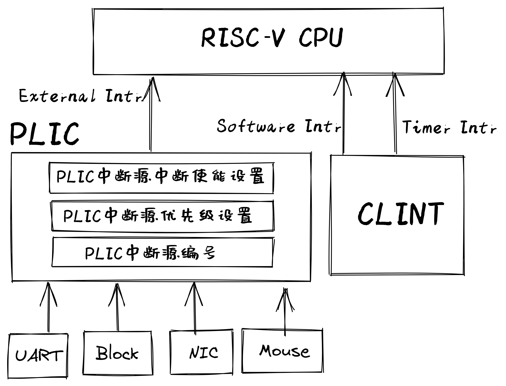
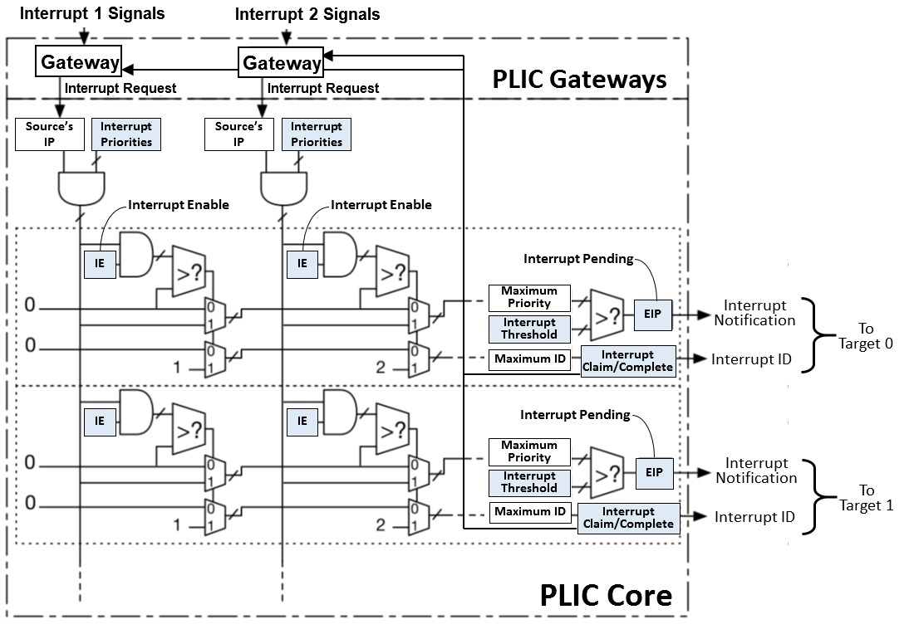

<!-- theme: gaia -->
<!-- _class: lead -->

# 第十三講 設備管理
## 第三節 支持device的OS（DOS）

---
### 內容
- **進化目標**
- 歷史背景
- 相關硬件
- 總體思路
- 實踐步驟
- 軟件架構
- 程序設計


---
### 進化目標 vs 以往目標
- SMOS：在多線程中支持對共享資源的同步互斥訪
- TCOS：支持線程和協程 
- IPC OS：進程間交互
- Filesystem OS：支持數據持久保存
- Process OS: 增強進程管理和資源管理
- Address Space OS: 隔離APP訪問的內存地址空間
- multiprog & time-sharing OS: 讓APP共享CPU資源
- BatchOS： 讓APP與OS隔離，加強系統安全，提高執行效率
- LibOS: 讓APP與HW隔離，簡化應用訪問硬件的難度和複雜性

---
### 進化目標 vs 以往目標
DOS需要支持對多種外設的高效訪問
- 在內核中響應外設中斷
- 在內核中保證對全局變量的互斥訪問
- 基於中斷機制的串口驅動
- 基於中斷機制的Virtio-Block驅動
- 其它外設驅動


---
### 實踐：DOS 
### 同學的進化目標
- 瞭解設備與CPU的交互關係
- 理解如何在內核中響應中斷
- 理解驅動的基本管理過程
- 理解驅動的基本設計思路
- 理解驅動與內核其它部分的交互
- 會寫支持多種外設的OS

<!-- 侏羅獵龍的屬名（Juravenator）來自拉丁語中的“Jura”（意為“侏羅紀”）及“Venator”（意為“獵人”），意思是“侏羅紀的獵人”。 -->

---
### 實踐：DOS
- 進化目標
- **歷史背景**
- 相關硬件
- 總體思路
- 實踐步驟
- 軟件架構
- 程序設計


---
### 歷史背景
UNIX誕生是從磁盤驅動程序開始的

貝爾實驗室的Ken Tompson先在一臺閒置的PDP-7計算機的磁盤驅動器寫了一個包含磁盤調度算法的磁盤驅動程序，希望提高磁盤I/O讀寫速度。為了測試磁盤訪問性能，他花了三週時間寫了一個操作系統，這就是Unix的誕生。

<!-- 這從某種角度說明了磁盤驅動程序促使了UNIX的誕生。 -->


---
### 歷史背景
寫磁盤驅動程序包括如下一些操作：

1. 數據結構：包括設備信息、狀態、操作標識等
2. 初始化：即配置設備，分配I/O所需內存，完成設備初始化
3. 中斷響應：如果設備產生中斷，響應中斷並完成I/O操作後續工作
4. 設備操作：根據內核模塊（如文件系統）的要求（如讀/寫磁盤數據），給I/O設備發出命令
5. 內部交互：與操作系統上層模塊或應用進行交互，完成上層模塊或應用的要求（如接受文件系統下達的I/O請求，上傳讀出的磁盤數據）

---
### 實踐：DOS
- 進化目標
- 歷史背景
- **相關硬件**
- 總體思路
- 實踐步驟
- 軟件架構
- 程序設計

---
### 相關硬件
- PLIC(Platform-Level Interrupt Controller)
   - 處理各種外設中斷 
- CLINT(Core Local Interruptor)
   - Software Intr
   - Timer Intr



---
### 相關硬件 -- 系統中的外設
```
$ qemu-system-riscv64 -machine virt -machine dumpdtb=riscv64-virt.dtb -bios default
   qemu-system-riscv64: info: dtb dumped to riscv64-virt.dtb. Exiting.
$ dtc -I dtb -O dts -o riscv64-virt.dts riscv64-virt.dtb
$ less riscv64-virt.dts
```
PLIC設備
```
                plic@c000000 {
                        phandle = <0x03>;
                        riscv,ndev = <0x35>;
                        reg = <0x00 0xc000000 0x00 0x600000>;
                        interrupts-extended = <0x02 0x0b 0x02 0x09>;
                        interrupt-controller;
                        ...
                };
```
---
### 相關硬件 -- 系統中的外設
virtio-blk磁盤塊設備
```
                virtio_mmio@10008000 {
                        interrupts = <0x08>;
                        interrupt-parent = <0x03>;
                        reg = <0x00 0x10008000 0x00 0x1000>;
                        compatible = "virtio,mmio";
                };
```

---
### 相關硬件 -- 系統中的外設
UART串口設備
```
                uart@10000000 {
                        interrupts = <0x0a>;
                        interrupt-parent = <0x03>;
                        clock-frequency = <0x384000>;
                        reg = <0x00 0x10000000 0x00 0x100>;
                        compatible = "ns16550a";
                };
```

---
### 相關硬件 -- 系統中的外設
virtio-input 鍵盤設備
```
                virtio_mmio@10005000 {
                        interrupts = <0x05>;
                        interrupt-parent = <0x03>;
                        reg = <0x00 0x10005000 0x00 0x1000>;
                        compatible = "virtio,mmio";
                };
```


---
### 相關硬件 -- 系統中的外設
virtio-input 鼠標設備
```
                virtio_mmio@10006000 {
                        interrupts = <0x06>;
                        interrupt-parent = <0x03>;
                        reg = <0x00 0x10006000 0x00 0x1000>;
                        compatible = "virtio,mmio";
                };
```
---
### 相關硬件 -- 系統中的外設
virtio-gpu 顯示設備
```
                virtio_mmio@10007000 {
                        interrupts = <0x07>;
                        interrupt-parent = <0x03>;
                        reg = <0x00 0x10007000 0x00 0x1000>;
                        compatible = "virtio,mmio";
                };
```                
---
### 相關硬件 -- PLIC
<!-- https://blog.csdn.net/weixin_40604731/article/details/109279426 2020.10.25 RISC-V --PLIC平臺級中斷控制器 -->
<!-- https://blog.csdn.net/qq_42866646/article/details/120845750 PLIC簡介&&cva6之PLIC模塊閱讀筆記 -->
**PLIC中斷源**
PLIC支持多箇中斷源，每個中斷源可以是不同觸發類型，電平觸發或者邊沿觸發、PLIC為每個中斷源分配



<!-- https://github.com/riscv/riscv-plic-spec/blob/master/images/PLICArch.jpg -->

---
### 相關硬件 -- PLIC
PLIC中斷處理流程


<!-- https://github.com/riscv/riscv-plic-spec/blob/master/images/PLICInterruptFlow.jpg -->

---
### 相關硬件 -- PLIC
- 閘口（Gateway）和IP寄存器（中斷源的等待標誌寄存器）
- 編號（ID）
- 優先級（priority）
- 使能（Enable）


<!-- https://github.com/riscv/riscv-plic-spec/blob/master/images/PLICArch.jpg -->
---
### 相關硬件 -- PLIC
<!-- https://blog.csdn.net/weixin_40604731/article/details/109279426 2020.10.25 RISC-V --PLIC平臺級中斷控制器 -->
**PLIC中斷源**
- 閘口（Gateway）將不同類型的外部中斷傳換成統一的內部中斷請求
- 閘口保證只發送一箇中斷請求，中斷請求經過閘口發送後，硬件自動將對應的IP寄存器置高
- 閘口發送一箇中斷請求後則啟動屏蔽，如果此中斷沒有被處理完成，則後續的中斷將會被閘口屏蔽

---
### 相關硬件 -- PLIC
<!-- https://blog.csdn.net/weixin_40604731/article/details/109279426 2020.10.25 RISC-V --PLIC平臺級中斷控制器 -->
**PLIC中斷源**
- PLIC為每個中斷源分配編號（ID）。ID編號0被預留，作為表示“不存在的中斷”，因此有效的中斷ID從1開始
- 每個中斷源的優先級寄存器應該是存儲器地址映射的可讀可寫寄存器，從而使得軟件可以對其編程配置不同的優先級
- PLIC支持多個優先級，優先級的數字越大，表示優先級越高
- 優先級0意味著“不可能中斷”，相當於中斷源屏蔽

---
### 相關硬件 -- PLIC
<!-- https://blog.csdn.net/weixin_40604731/article/details/109279426 2020.10.25 RISC-V --PLIC平臺級中斷控制器 -->
**PLIC中斷源**
每個中斷目標的中斷源均分配了一箇中斷使能（IE）寄存器，IE寄存器是可讀寫寄存器，從而使得軟件對其編程
- 如果IE寄存器被配置為0，則意味著此中斷源對應中斷目標被屏蔽
- 如果IE寄存器被配置為1，則意味著此中斷源對應中斷目標被打開
---
### 實踐：DOS
- 進化目標
- 歷史背景
- 相關硬件
- **總體思路**
    - **外設中斷**
- 實踐步驟
- 軟件架構
- 程序設計

---
### 實踐：DOS  -- **總體思路**
  
- 為何支持外設中斷
   -  提高系統的整體執行效率
- 為何在內核態響應外設中斷
   - 提高OS對外設IO請求的響應速度 
- 潛在的問題
  - 內核態能響應中斷後，不能保證對全局變量的互斥訪問
  - 原因：中斷會打斷當前執行，並切換到另一控制流訪問全局變量
- 解決方案
  - 在訪問全局變量起始前屏蔽中斷，結束後使能中斷 

---
### 實踐：DOS
- 進化目標
- 歷史背景
- 相關硬件
- **實踐步驟**
- 軟件架構
- 程序設計


---
### 實踐：DOS  -- **實踐步驟**
```
git clone https://github.com/rcore-os/rCore-Tutorial-v3.git
cd rCore-Tutorial-v3
git checkout ch9
```
應用程序沒有改變，但在串口輸入輸出、塊設備讀寫的IO操作上是基於中斷方式實現的。

---
### 實踐：DOS
- 進化目標
- 歷史背景
- 相關硬件
- 實踐步驟
- **軟件架構**
- 程序設計

---
### 實踐：DOS  -- **軟件架構**
內核的主要修改 （ ``os/src`` ）
```
├── boards
│   └── qemu.rs  // UART、VIRTIO、PLIC的MMIO地址
├── console.rs  //基於UART的STDIO
├── drivers
│   ├── block
│   │   └── virtio_blk.rs //基於中斷/DMA方式的VIRTIO-BLK驅動
│   ├── chardev
│   │   └── ns16550a.rs //基於中斷方式的串口驅動
│   └── plic.rs //PLIC驅動
├── main.rs  //外設中斷相關初始化
└── trap
    ├── mod.rs //支持處理外設中斷
    └── trap.S //支持內核態響應外設中斷
```

---
### 實踐：DOS
- 進化目標
- 歷史背景
- 相關硬件
- 實踐步驟
- 軟件架構
- **程序設計**


---
###  程序設計
設備直接相關（提供）

1. 外設初始化操作
2. 外設中斷處理操作
3. 外設I/O讀寫（或配置）操作

OS交互相關（需求）

1. 內存分配/映射服務
2. 中斷/調度/同步互斥/文件系統等服務

---
### 系統設備管理
- 瞭解各個設備的基本信息
  - 控制寄存器地址範圍
  - 設備中斷號
- 對PLIC進行配置
  - 使能中斷
  - 設置中斷優先級


---
### 系統設備管理
- 瞭解各個設備的基本信息(控制寄存器基址，中斷號)
```
const VIRT_PLIC: usize = 0xC00_0000;   // PLIC 
const VIRT_UART: usize = 0x1000_0000;  // UART
const VIRTIO0: usize = 0x10008000;     // VIRTIO_BLOCK
const VIRTIO5: usize = 0x10005000;     // VIRTIO_KEYBOARD
const VIRTIO6: usize = 0x10006000;     // VIRTIO_MOUSE
const VIRTIO7: usize = 0x10007000;     // VIRTIO_GPU
// 在總中斷處理例程中對不同外設的中斷進行響應
match intr_src_id {
   5 => KEYBOARD_DEVICE.handle_irq(),
   6 => MOUSE_DEVICE.handle_irq(),
   8 => BLOCK_DEVICE.handle_irq(),
   10 => UART.handle_irq(),
```

---
### 系統設備管理
系統設備管理初始化
- 配置PLIC:
   - 設置接收中斷優先級的下限
   - 使能S-Mode下的響應外設中斷號：5/6/8/10
   - 設置外設中斷號的優先級
- 配置CPU
   - 設置 ``sie`` CSR寄存器，使能響應外部中斷

``os/src/drivers/plic.rs`` 和 ``os/src/boards/qemu.rs::devices_init()``

---
### UART設備驅動
UART設備驅動的核心數據結構
```
pub struct NS16550a<const BASE_ADDR: usize> {
    inner: UPIntrFreeCell<NS16550aInner>,
    condvar: Condvar, //用於掛起/喚醒讀字符的經常
}
struct NS16550aInner {
    ns16550a: NS16550aRaw,
    read_buffer: VecDeque<u8>, //用於緩存讀取的字符
}
pub struct NS16550aRaw {
    base_addr: usize, //控制寄存器基址
}
```
---
### UART設備驅動
1. UART初始化操作
2. UART中斷處理操作
3. UART I/O讀寫（或配置）操作

字符類設備需要實現的接口
```
pub trait CharDevice {
    fn init(&self);
    fn read(&self) -> u8;
    fn write(&self, ch: u8);
    fn handle_irq(&self);
}
```

---
### UART設備驅動
1. UART初始化操作
```
impl<const BASE_ADDR: usize> CharDevice for NS16550a<BASE_ADDR> {
    fn init(&self) {
        let mut inner = self.inner.exclusive_access(); //獨佔訪問
        inner.ns16550a.init(); //調用ns16550a的UART初始化函數
        drop(inner);
    }
```

---
### UART設備驅動
2. UART中斷處理操作
```
fn handle_irq(&self) {
   let mut count = 0;
   self.inner.exclusive_session(|inner| {
      //調用ns16550a中讀字符函數
      while let Some(ch) = inner.ns16550a.read() { 
            count += 1;
            inner.read_buffer.push_back(ch);
   ...
   if count > 0 {
      // 喚醒等待讀取字符的進程
      self.condvar.signal();
   ...
```

---
### UART設備驅動
3. UART I/O讀寫（或配置）操作
```
fn read(&self) -> u8 {
   loop {
      let mut inner = self.inner.exclusive_access();
      if let Some(ch) = inner.read_buffer.pop_front() {
            return ch;
      } else {
            let task_cx_ptr = self.condvar.wait_no_sched();
            drop(inner);
            schedule(task_cx_ptr);
    ...
```

---
### UART設備驅動
3. UART I/O讀寫（或配置）操作
```
    fn write(&self, ch: u8) {
        let mut inner = self.inner.exclusive_access();
        inner.ns16550a.write(ch);
    }
```

---
### virtio_blk塊設備驅動
virtio_blk設備驅動的核心數據結構
```
pub struct VirtIOBlock {
    virtio_blk: UPIntrFreeCell<VirtIOBlk<'static, VirtioHal>>,
    condvars: BTreeMap<u16, Condvar>, //<虛擬隊列號，條件變量>映射
}
```

---
### virtio_blk塊設備驅動
1. virtio_blk初始化操作
2. virtio_blk中斷處理操作
3. virtio_blk I/O讀寫（或配置）操作

存儲類設備要實現的接口
```
pub trait BlockDevice: Send + Sync + Any {
    fn read_block(&self, block_id: usize, buf: &mut [u8]);
    fn write_block(&self, block_id: usize, buf: &[u8]);
    fn handle_irq(&self);
}
```

---
### virtio_blk塊設備驅動
1. virtio_blk初始化操作
```
pub fn new() -> Self {
   let virtio_blk = unsafe {
      UPIntrFreeCell::new(
            // 初始化vritio_drivers中的VirtIOBlk塊設備 
            VirtIOBlk::<VirtioHal>::new(&mut *(VIRTIO0 as *mut VirtIOHeader)).unwrap(),)
   let mut condvars = BTreeMap::new();
   let channels = virtio_blk.exclusive_access().virt_queue_size();
   // 建立虛擬隊列號與條件變量的映射
   for i in 0..channels {  
      let condvar = Condvar::new();
      condvars.insert(i, condvar);
   }
   ...
```

---
### virtio_blk塊設備驅動
2. virtio_blk中斷處理操作
```
fn handle_irq(&self) {
   self.virtio_blk.exclusive_session(|blk| {
      //獲得塊訪問完成的虛擬隊列號
      while let Ok(token) = blk.pop_used() {
            // 根據隊列號對應的信號量，喚醒等待塊訪問結束的掛起進程
            self.condvars.get(&token).unwrap().signal();
      }
   ...
```

---
### virtio_blk塊設備驅動
3. virtio_blk I/O讀寫（或配置）操作
```
fn read_block(&self, block_id: usize, buf: &mut [u8]) {
   ...
      let mut resp = BlkResp::default();// 生成一個塊訪問命令
      let task_cx_ptr = self.virtio_blk.exclusive_session(|blk| {
            // 調用virtio_drivers庫中VirtIOBlk的read_block_nb函數，發出讀塊命令
            let token = unsafe { blk.read_block_nb(block_id, buf, &mut resp).unwrap() };
            // 通過條件變量掛起當前進程，等待塊訪問結束
            self.condvars.get(&token).unwrap().wait_no_sched()
      });
      // 喚醒等待塊訪問結束的進程
      schedule(task_cx_ptr);
   ...
}
```

---
### virtio_blk塊設備驅動
3. virtio_blk I/O讀寫（或配置）操作
```
fn write_block(&self, block_id: usize, buf: &[u8]) {
   ...
      let mut resp = BlkResp::default(); // 生成一個塊訪問命令
      let task_cx_ptr = self.virtio_blk.exclusive_session(|blk| {
            // 調用virtio_drivers庫中VirtIOBlk的read_block_nb函數，發出寫塊命令
            let token = unsafe { blk.write_block_nb(block_id, buf, &mut resp).unwrap() };
            // 通過條件變量掛起當前進程，等待塊訪問結束
            self.condvars.get(&token).unwrap().wait_no_sched()
      });
      // 喚醒等待塊訪問結束的進程
      schedule(task_cx_ptr);
   ...
```