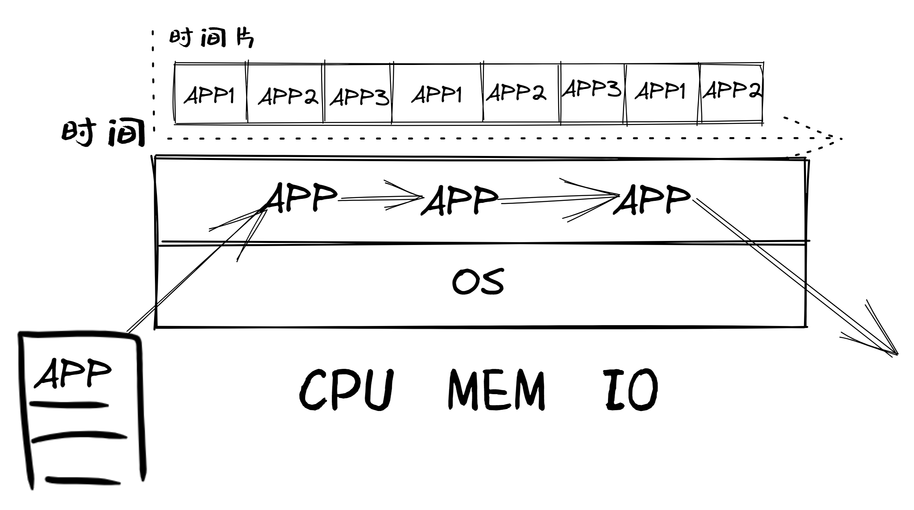
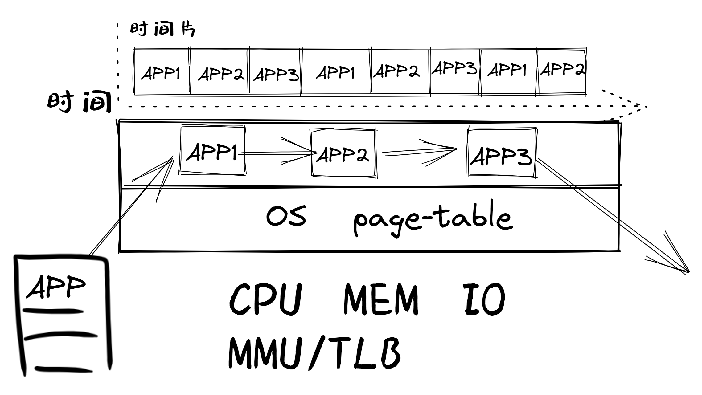
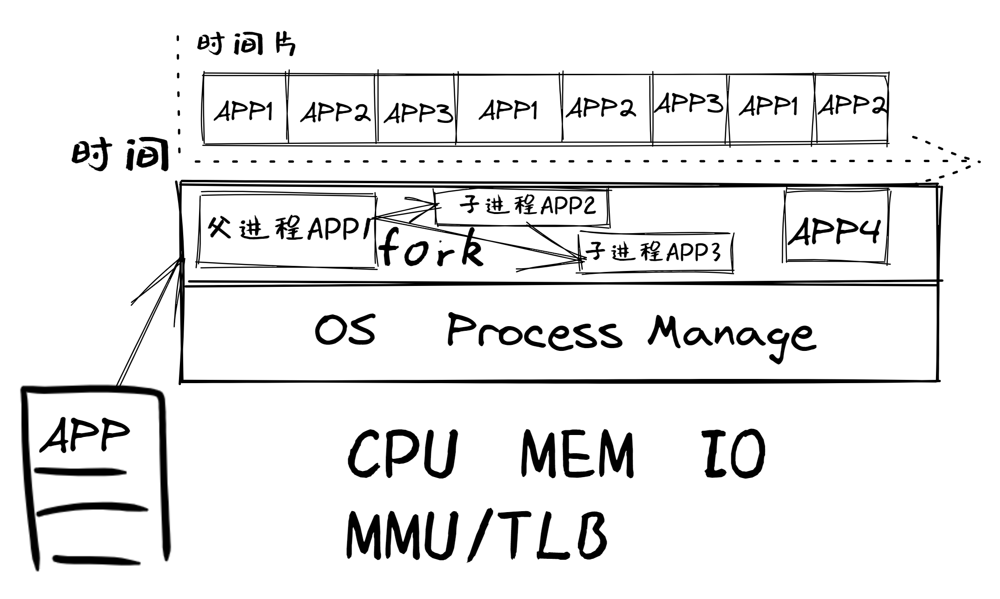
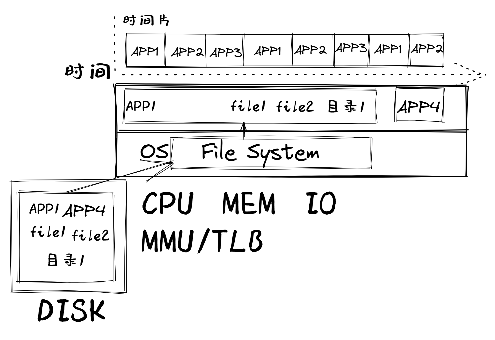
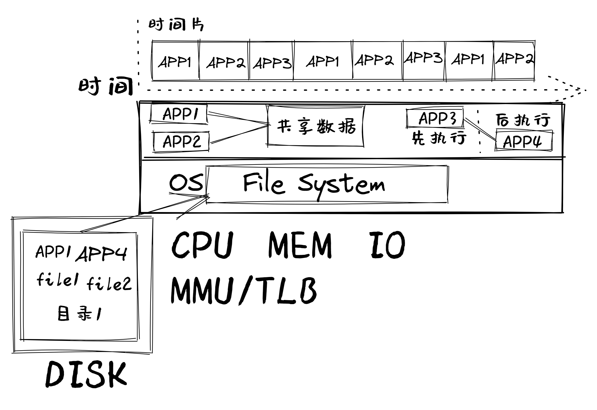
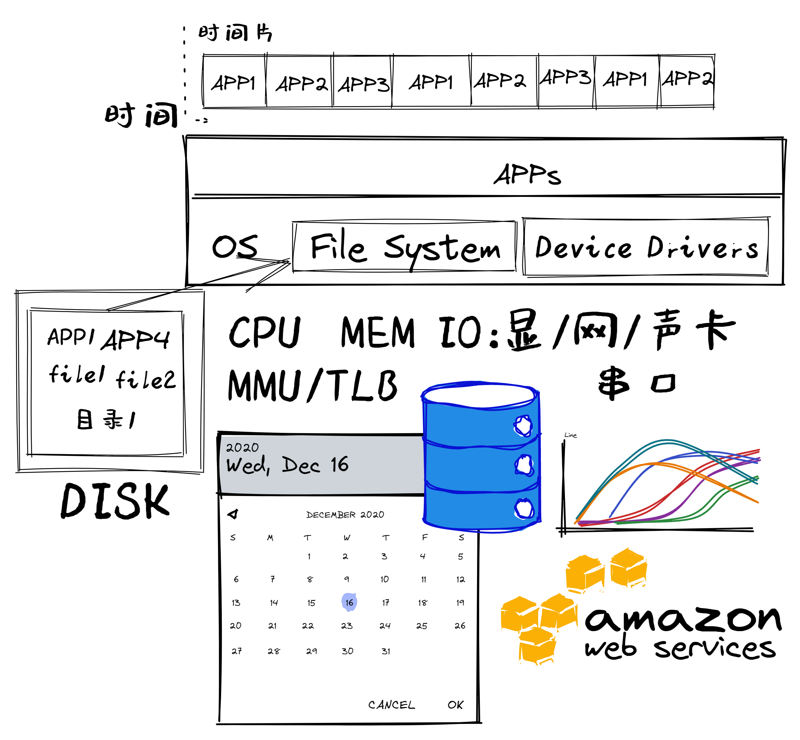

<!-- theme: gaia -->
<!-- _class: lead -->

# 第二講 實踐與實驗介紹
## 第一節 實踐與實驗簡要分析

 
 

向勇 陳渝 李國良 

 
 

2022年秋季

---
提綱

### 1. 原理、實踐與實驗介紹
2. 循續漸進的操作系統實驗
3. 實驗安排

---

##### 滿足應用逐漸增加的需求
* LibOS
* 批處理OS
* 多道程序與分時多任務OS

---

##### 逐步體現操作系統的概念抽象

* 地址空間抽象的OS
* 進程抽象的OS
* 文件抽象的OS
---

##### 逐步體現操作系統的關鍵能力

* 可進程間通信的OS
* 可併發的OS
* 管理I/O設備的OS
---
提綱

1. 原理、實踐與實驗介紹
### 2. 循續漸進的操作系統實驗
3. 實驗安排

---

#### LibOS

- 遠古操作系統雛形
- 現代簡單嵌入式操作系統

##### 相關知識點
- 函數調用: 編譯器與操作系統的配合
- 硬件啟動和軟件啟動
- 編寫/調試裸機程序

裸機程序(Bare Metal Program)：與操作系統無關的OS類型的程序

--- 

#### 批處理OS
- 支持系統調用

##### 相關知識點

- 特權級/特權操作
- RISC-V特權級/特權操作
- 系統調用/異常
- 加載&執行&切換應用程序
- 特權級切換

--- 

#### 多道程序OS
- 支持多個程序**同時駐留內存**
- 支持多個程序**依次執行**
##### 相關知識點
- 內存空間劃分與管理
- 協作式調度

--- 

#### 分時多任務OS
- 支持多個程序**輪流執行**

##### 相關知識點
- **中斷處理**
- 上下文切換
- 搶佔式調度

--- 
#### OS的地址空間抽象
- 支持程序間**內存空間隔離**

##### 相關知識點
- 地址空間抽象
- 靜態內存分配
- 動態內存分配
- 頁式存儲管理

--- 
#### OS的地址空間抽象
- **超越物理內存**的虛擬存儲
##### 相關知識點
- 局部性原理
- 缺頁異常
- 虛擬頁式存儲
- 置換算法

--- 

#### OS的進程抽象

- 支持**動態創建**程序執行

##### 相關知識點

- 進程抽象
- 進程管理
- 調度機制
  

--- 

#### OS的進程抽象

- 支持多處理器**並行**

##### 相關知識點
- 多處理器/多核架構
- 多處理器調度
- 實際OS調度
  

--- 
#### OS的文件抽象
- 處理數據的**便捷持久存儲**

##### 相關知識點
- 文件抽象
- 文件組織結構
- 文件系統設計與實現

--- 
#### 可進程間通信的OS
- 進程間可顯式/隱式**交互**信息
##### 相關知識點
- 信號、管道
- 消息隊列、共享內存
- I/O重定向

--- 
#### 可併發的OS
- 提升CPU的**利用率**
##### 相關知識點
- 線程：用戶/內核線程
- 協程
- 進程、線程和協程的關係

--- 
#### 可併發的OS
- 合理**共享資源**
- 同步與互斥
##### 相關知識點
- 同步互斥的機制
- 同步互斥解決併發問題
- 死鎖等問題

--- 
#### 管理I/O設備的OS
- 支持各種外設
##### 相關知識點
- 設備抽象
- 設備執行模型
- 同步/異步 I/O
- I/O設備管理

---
提綱

1. 原理、實踐與實驗介紹
2. 循續漸進的操作系統實驗
### 3. 實驗安排

---

#### 實驗一：操作系統的基本支持
##### 覆蓋內容
* LibOS、 批處理OS、 多道程序與分時多任務OS
##### 知識點：特權級和切換
- 計算機/OS啟動
- 特權級切換、系統調用、特權級相關異常、任務切換
- 應用程序/庫/內核的關係

---

#### 實驗二：地址空間
##### 覆蓋內容
* 地址空間抽象的OS
##### 知識點：頁表
- 地址空間
- 應用與內核之間在不同地址空間的數據交互/控制交互
- 內存/地址相關異常（如缺頁異常）

---

#### 實驗三：進程管理與調度
##### 覆蓋內容
* 進程抽象的OS
##### 知識點：進程控制塊PCB
- 進程管理
- 調度算法

---

#### 實驗四：文件系統與進程間通信
##### 覆蓋內容
* 文件抽象的OS、可進程間通信的OS
##### 知識點：文件
- 文件系統實現
- 進程間通信機制

---
#### 實驗五：同步互斥
##### 覆蓋內容
* 可併發的OS
##### 知識點
- 線程
- 同步互斥的機制、解決同步互斥問題、死鎖問題
- 優先級反轉問題

---

#### 教學實驗的參考實現

* 參考實現
    * [uCore](https://github.com/uCore-RV-64/uCore-RV-64-answer)
    * [rCore](https://github.com/zflcs/rCore)
    * [Modular rCore](https://github.com/YdrMaster/rCore-Tutorial-in-single-workspace/)
* 實驗報告內容建議
    * 實驗開始時間、完成時間和代碼提交次數
    * 你在實驗中遇到的主要問題和解決方法
    * 你的回答與參考實現有什麼不同？

---

#### 擴展實驗（即大實驗，課程設計）

4周內完成基礎實驗1~5後，與老師協商：選擇完成擴展實驗來代替考試

**早完成基礎實驗，可早開展擴展實驗**

實現新feature（多核、新外設、新處理器、新功能）的支持

如支持遊戲、樹莓派/SiFive、網絡、USB、AI等

參加全國大學生OS比賽