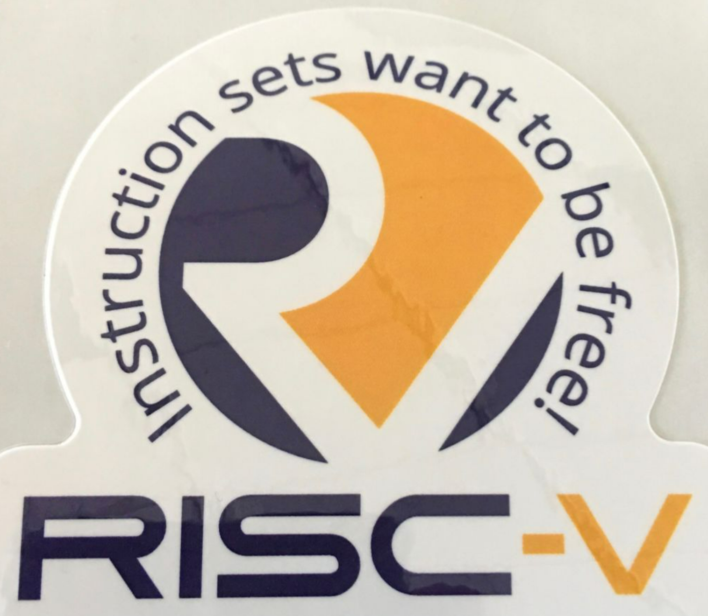

<!-- theme: gaia -->
<!-- _class: lead -->

# 第二講 實踐與實驗介紹
## 第二節 Compiler與OS

<br>
<br>

向勇 陳渝 李國良 

<br>
<br>

2022年秋季

---
提綱

### 1. 硬件環境
2. 應用程序執行環境
3. 操作系統執行環境

---

#### 開發的硬件環境


---

#### 目標硬件環境


---
提綱

1. 硬件環境
### 2. 應用程序執行環境
3. 操作系統執行環境

---

#### 編譯器工作
- 源碼-->彙編碼

---

#### Assembler工作
- 彙編碼 --> 機器碼

---
#### linker（鏈接器）工作
- 多個機器碼目標文件 --> 單個機器碼執行文件


---

#### OS工作
- 加載/執行/管理機器碼執行文件


---
提綱

1. 硬件環境
2. 應用程序執行環境
### 3. 操作系統執行環境

---

#### 編譯器/彙編器/鏈接器工作
- 源碼 ---> 彙編碼 ---> 機器碼 --->執行程序
- Bootloader加載OS執行


---

#### 可執行文件格式
三元組
* CPU 架構/廠商/操作系統
```
rustc --print target-list | grep riscv
riscv32gc-unknown-linux-gnu
...
riscv64gc-unknown-linux-gnu
riscv64imac-unknown-none-elf
```
* ELF: Executable and Linkable Format


---

#### 鏈接和執行


---
#### 函數庫
- 標準庫：依賴操作系統
  - Rust: std 標準庫
  - C：glibc, musl libc 
- 核心庫：與操作系統無關
  - Rust: core 庫
  - C: Linux/BSD kernel libc


---
#### 裸機程序
與操作系統無關的OS類型的程序（Bare Metal program, 裸機程序）
```
// os/src/main.rs
#![no_std]
#![no_main]

mod lang_items;

// os/src/lang_items.rs
use core::panic::PanicInfo;

#[panic_handler]
fn panic(_info: &PanicInfo) -> ! {
    loop {}
}
```

---
#### ELF文件格式

文件格式
```
file target/riscv64gc-unknown-none-elf/debug/os
target/riscv64gc-unknown-none-elf/debug/os: ELF 64-bit LSB executable, UCB RISC-V, ......
```
[ELF文件格式](https://wiki.osdev.org/ELF) Executable and Linkable Format

---
#### ELF文件格式


---
#### 文件頭信息

文件頭信息
```
rust-readobj -h target/riscv64gc-unknown-none-elf/debug/os
   File: target/riscv64gc-unknown-none-elf/debug/os
   Format: elf64-littleriscv
   Arch: riscv64
   AddressSize: 64bit
   ......
   Type: Executable (0x2)
   Machine: EM_RISCV (0xF3)
   Version: 1
   Entry: 0x0
   ......
   }
```

---
#### 導出彙編程序


反彙編導出彙編程序
```
rust-objdump -S target/riscv64gc-unknown-none-elf/debug/os
   target/riscv64gc-unknown-none-elf/debug/os:       file format elf64-littleriscv
```
代碼中移除了 main 函數並將項目設置為 #![no_main] 
 - 沒有一個傳統意義上的入口點（即程序首條被執行的指令所在的位置）
 - Rust 編譯器會生成一個空程序
 - 這是一個**面向操作系統開發**的程序

---
#### App/OS內存佈局
- .text: 數據段
- .rodata：已初始化數據段，只讀的全局數據（常數或者是常量字符串）
- .data：可修改的全局數據
- .bss：未初始化數據段
- 堆 （heap）向高地址增長
- 棧 （stack）向低地址增長

