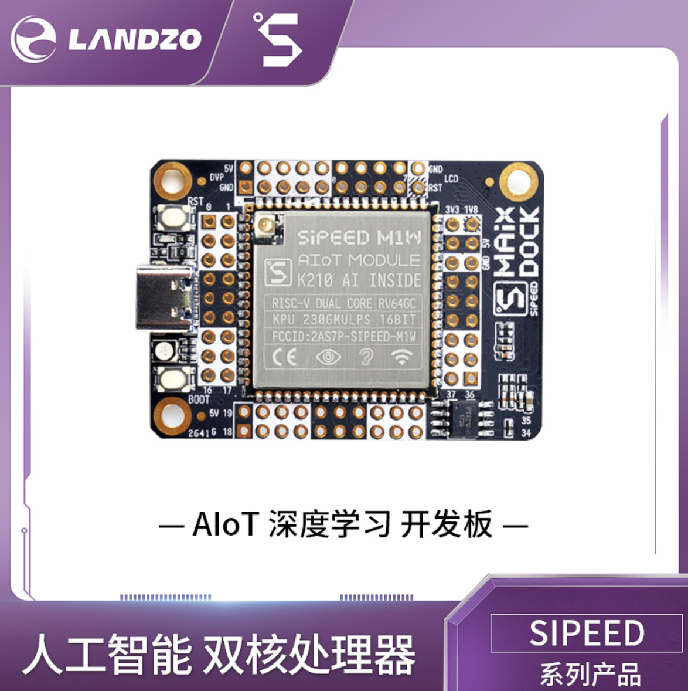
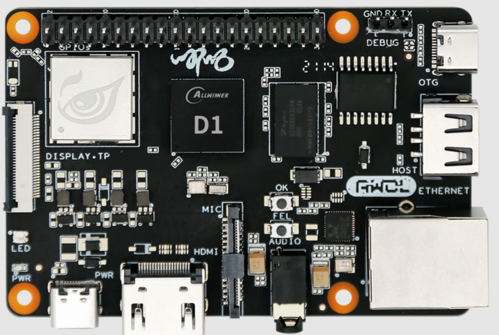

<!-- theme: gaia -->
<!-- _class: lead -->

# 第二講 實踐與實驗介紹
## 第三節 硬件啟動與軟件啟動

<br>
<br>

向勇 陳渝 李國良 

<br>
<br>

2022年秋季

---
提綱

### 1. RISC-V開發板
2. QEMU啟動參數和流程
3. x86啟動流程

---
#### K210開發板
- 基於RISC-V 64 多核處理器


---
#### 哪吒D1開發板
- 基於RISC-V 64 單核處理器


---
#### HiFive Unmatched 開發板（U740）
- 基於RISC-V 64 多核處理器


---
提綱

1. RISC-V開發板
### 2. QEMU啟動參數和流程
3. x86啟動流程

---

#### QEMU模擬器

使用軟件 qemu-system-riscv64 來模擬一臺 64 位 RISC-V 架構的計算機，它包含:
- 一個 CPU（可調整為多核）
- 一塊物理內存
- 若干 I/O 外設

---
#### QEMU啟動參數
```
qemu-system-riscv64 \
    -machine virt \
    -nographic \
    -bios ../bootloader/rustsbi-qemu.bin \
    -device loader,file=target/riscv64gc-unknown-none-elf/release/os.bin,addr=0x80200000
``` 
- machine virt 表示將模擬的 64 位 RISC-V 計算機設置為名為 virt 的虛擬計算機
- 物理內存的默認大小為 128MiB 

---
#### QEMU啟動參數
```
qemu-system-riscv64 \
    -machine virt \
    -nographic \
    -bios ../bootloader/rustsbi-qemu.bin \
    -device loader,file=target/riscv64gc-unknown-none-elf/release/os.bin,addr=0x80200000
``` 
- nographic 表示模擬器不需要提供圖形界面，而只需要對外輸出字符流


---
#### QEMU啟動參數
```
qemu-system-riscv64 \
    -machine virt \
    -nographic \
    -bios ../bootloader/rustsbi-qemu.bin \
    -device loader,file=target/riscv64gc-unknown-none-elf/release/os.bin,addr=0x80200000
``` 
- bios 可以設置 QEMU 模擬器開機時用來初始化的引導加載程序（bootloader）
- 這裡使用預編譯好的 rustsbi-qemu.bin

---
#### QEMU啟動參數
```
qemu-system-riscv64 \
    -machine virt \
    -nographic \
    -bios ../bootloader/rustsbi-qemu.bin \
    -device loader,file=target/riscv64gc-unknown-none-elf/release/os.bin,addr=0x80200000
``` 
- device的loader 參數可以在 QEMU 模擬器開機之前將一個宿主機上的文件載入到 QEMU 的物理內存的指定位置中
- file 和 addr 參數分別可以設置待載入文件的路徑以及將文件載入到的 QEMU 物理內存上的物理地址

---
#### QEMU啟動流程

```
qemu-system-riscv64 \
    -machine virt \
    -nographic \
    -bios ../bootloader/rustsbi-qemu.bin \
    -device loader,file=target/riscv64gc-unknown-none-elf/release/os.bin,addr=0x80200000
``` 
一般來說，計算機加電之後的啟動流程可以分成若干個階段，每個階段均由一層軟件負責，每一層軟件的功能是進行它應當承擔的初始化工作，並在此之後跳轉到下一層軟件的入口地址，也就是將計算機的控制權移交給了下一層軟件。

---
#### QEMU啟動流程

```
qemu-system-riscv64 \
    -machine virt \
    -nographic \
    -bios ../bootloader/rustsbi-qemu.bin \
    -device loader,file=target/riscv64gc-unknown-none-elf/release/os.bin,addr=0x80200000
``` 
QEMU 模擬的啟動流程則可以分為三個階段：
1. 由固化在 [QEMU模擬的計算機內存](https://github.com/LearningOS/qemu/blob/386b2a5767f7642521cd07930c681ec8a6057e60/hw/riscv/virt.c#L59)中的[一小段彙編程序](https://github.com/LearningOS/qemu/blob/386b2a5767f7642521cd07930c681ec8a6057e60/hw/riscv/virt.c#L536)初始化並跳轉執行bootloader；
2. 由 bootloader 負責，初始化並加載OS，跳轉OS執行；
3. 由內核執行初始化工作。

---
提綱

1. RISC-V開發板
2. QEMU啟動參數和流程
### 3. x86啟動流程

---
#### 真實計算機(x86)的啟動流程
實際上基於x86的PC的啟動固件的引導流程從IBM PC機誕生第一天起，本質上就沒有改變過。

1. Rom Stage：在這個階段直接在ROM上運行BIOS代碼；
2. Ram Stage：在這個階段在RAM上運行代碼，檢測並初始化芯片組、主板等；
3. Bootloader Stage：在存儲設備上找到Bootloader，加載執行Bootloader；
4. OS Stage：Bootloader初始化外設，在存儲設備上找到OS，加載執行OS。