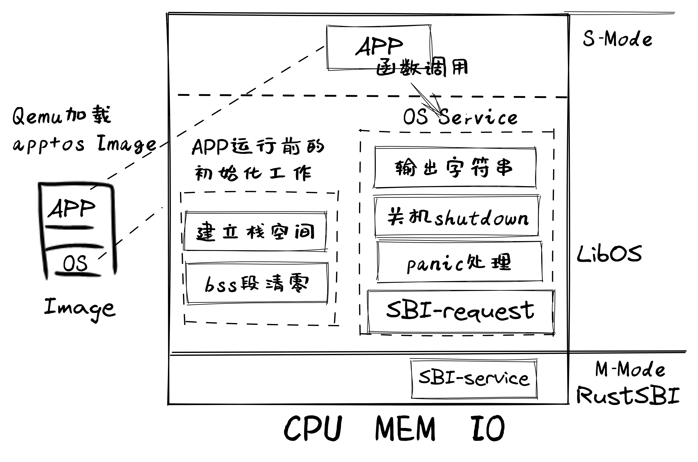
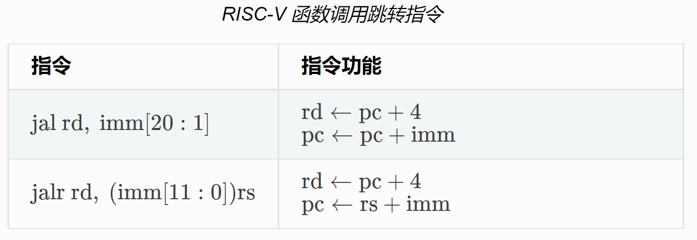

<!-- theme: gaia -->
<!-- _class: lead -->

# 第二講 實踐與實驗介紹
## 第四節 實踐：裸機程序 -- LibOS

<br>
<br>

向勇 陳渝 李國良 

<br>
<br>

2022年秋季

---
提綱

### 1. 實驗目標和思路
2. 實驗要求
3. 實踐步驟
4. 代碼結構
5. 內存佈局
6. 基於 GDB 驗證啟動流程
7. 函數調用
8. LibOS初始化
9. SBI調用

---

#### LibOS的實驗目標

裸機程序（Bare Metal Program ）：與操作系統無關的OS類型的程序

- 建立應用程序的執行環境
  - 讓應用與硬件隔離
  - 簡化應用訪問硬件的難度和複雜性
- **執行環境(Execution Environment)**：負責給在其上執行的軟件提供相應的功能與資源的多層次**軟硬件系統** 
 


---
#### LibOS歷史背景
1949-1951 年，英國 J. Lyons and Co. 公司（連鎖餐廳和食品製造集團公司）開創性地引入並使用劍橋大學的 EDSAC 計算機，聯合設計實現了 LEO I ‘Lyons Electronic Office’ 軟硬件系統


---
#### LibOS歷史背景 -- 子程序

- 參與 EDSAC 項目的 David Wheeler 發明了**子程序**的概念 – Wheeler Jump 
- 在有了便捷有效的子程序概念和子程序調用機制後，軟件開發人員在EDSAC和後續的LEO計算機上開發了大量的系統**子程序庫**，形成了最早的操作系統原型。


---

#### LibOS總體思路
- 編譯：通過設置編譯器支持編譯裸機程序
- 構造：建立裸機程序的棧和SBI服務請求接口
- 運行：OS的起始地址和執行環境初始化


---
提綱

1. 實驗目標和思路
### 2. 實驗要求
3. 實踐步驟
4. 代碼結構
5. 內存佈局
6. 基於 GDB 驗證啟動流程
7. 函數調用
8. LibOS初始化
9. SBI調用

---
#### 理解LibOS的執行過程
- 會編寫/編譯/運行裸機程序
- 懂基於裸機程序的函數調用
- 能看懂彙編代碼偽代碼
- 能看懂內嵌彙編代碼
- 初步理解SBI調用

---
#### 掌握基本概念
- **會寫三葉蟲操作系統了！**
  - ABI是啥？
  - SBI是啥？ 
  - Supervisor Binary Interface？ 


注：三葉蟲Trilobita是寒武紀最有代表性的遠古動物

---
#### 分析執行細節

- **在機器級層面理解函數**
  - 寄存器（registers）
  - 函數調用/返回(call/return)
  - 函數進入/離開(enter/exit)
  - 函數序言/收尾(prologue/epilogue)


---

#### OS不總是軟件的最底層
  - 天外有天
  - Why？


---
提綱

1. 實驗目標和思路
2. 實驗要求
### 3. 實踐步驟
4. 代碼結構
5. 內存佈局
6. 基於 GDB 驗證啟動流程
7. 函數調用
8. LibOS初始化
9. SBI調用

---

#### 實踐步驟
- 建好開發與實驗環境
- 移出標準庫依賴
- 支持函數調用
- 基於SBI服務完成輸出與關機

**理解運行程序的內存空間和棧**


---

#### 操作步驟
```
git clone https://github.com/rcore-os/rCore-Tutorial-v3.git
cd rCore-Tutorial-v3
git checkout ch1

cd os
make run
```

---

#### 執行結果
```
[RustSBI output]
Hello, world!
.text [0x80200000, 0x80202000)
.rodata [0x80202000, 0x80203000)
.data [0x80203000, 0x80203000)
boot_stack [0x80203000, 0x80213000)
.bss [0x80213000, 0x80213000)
Panicked at src/main.rs:46 Shutdown machine!
```

除了顯示 Hello, world! 之外還有一些額外的信息，最後關機。

---
提綱

1. 實驗目標和思路
2. 實驗要求
3. 實踐步驟
### 4. 代碼結構
5. 內存佈局
6. 基於 GDB 驗證啟動流程
7. 函數調用
8. LibOS初始化
9. SBI調用



---
#### LibOS代碼結構
```
./os/src
Rust        4 Files   119 Lines
Assembly    1 Files    11 Lines

├── bootloader(內核依賴的運行在 M 特權級的 SBI 實現，本項目中我們使用 RustSBI)
│   ├── rustsbi-k210.bin(可運行在 k210 真實硬件平臺上的預編譯二進制版本)
│   └── rustsbi-qemu.bin(可運行在 qemu 虛擬機上的預編譯二進制版本)
```

---
#### LibOS代碼結構
```
├── os(我們的內核實現放在 os 目錄下)
│   ├── Cargo.toml(內核實現的一些配置文件)
│   ├── Makefile
│   └── src(所有內核的源代碼放在 os/src 目錄下)
│       ├── console.rs(將打印字符的 SBI 接口進一步封裝實現更加強大的格式化輸出)
│       ├── entry.asm(設置內核執行環境的的一段彙編代碼)
│       ├── lang_items.rs(需要我們提供給 Rust 編譯器的一些語義項，目前包含內核 panic 時的處理邏輯)
│       ├── linker-qemu.ld(控制內核內存佈局的鏈接腳本以使內核運行在 qemu 虛擬機上)
│       ├── main.rs(內核主函數)
│       └── sbi.rs(調用底層 SBI 實現提供的 SBI 接口)
```


<!-- https://blog.51cto.com/onebig/2551726
(深入理解計算機系統) bss段，data段、text段、堆(heap)和棧(stack) -->


---
提綱

1. 實驗目標和思路
2. 實驗要求
3. 實踐步驟
4. 代碼結構
### 5. 內存佈局
6. 基於 GDB 驗證啟動流程
7. 函數調用
8. LibOS初始化
9. SBI調用

---
#### App/OS內存佈局


---
#### bss段

- bss段（bss segment）通常是指用來存放程序中**未初始化的全局變量**的一塊內存區域
- bss是英文Block Started by Symbol的簡稱
- bss段屬於**靜態內存分配**


---
#### data段

- 數據段（data segment）通常是指用來存放程序中**已初始化的全局變量**的一塊內存區域
- 數據段屬於**靜態內存分配**


---
#### text段

- 代碼段（code segment/text segment）是指存放**執行代碼**的內存區域
- 這部分區域的大小確定，通常屬於**只讀**
- 在代碼段中，也有可能包含一些**只讀的常數變量**


---
#### 堆（heap）

- 堆是用於**動態分配**的內存段，可動態擴張或縮減
- 程序調用**malloc**等函數新分配的內存被動態添加到堆上
- 調用**free**等函數釋放的內存從堆中被剔除


---
#### 棧(stack)

- 棧又稱堆棧，是用戶存放程序臨時創建的**局部變量**
- 函數被調用時，其**參數**和函數的**返回值**也會放到棧中
- 由於棧的**先進後出**特點，所以棧特別方便用來保存/恢復當前執行狀態


---
#### 棧(stack)

可以把堆棧看成一個**寄存和交換臨時數據**的內存區

OS編程與應用編程的一個顯著區別是，OS編程需要理解**棧上的物理內存結構**和**機器級內容**。


---

#### 鏈接時的內存佈局定製
```
# os/src/linker-qemu.ld
OUTPUT_ARCH(riscv)
ENTRY(_start)
BASE_ADDRESS = 0x80200000;

SECTIONS
{
    . = BASE_ADDRESS;
    skernel = .;

    stext = .;
    .text : {
      *(.text.entry)
```


---
#### 鏈接時的內存佈局定製
```
    .bss : {
        *(.bss.stack)
        sbss = .;
        *(.bss .bss.*)
        *(.sbss .sbss.*)
```

BSS：Block Started by Symbol
SBSS：small bss，近數據


---

#### 生成內核二進制鏡像


---

#### 生成內核二進制鏡像

```
rust-objcopy --strip-all \
target/riscv64gc-unknown-none-elf/release/os \
-O binary target/riscv64gc-unknown-none-elf/release/os.bin
```

---
提綱

1. 實驗目標和思路
2. 實驗要求
3. 實踐步驟
4. 代碼結構
5. 內存佈局
### 6. 基於 GDB 驗證啟動流程
7. 函數調用
8. LibOS初始化
9. SBI調用

---

#### 基於 GDB 驗證啟動流程
```
qemu-system-riscv64 \
    -machine virt \
    -nographic \
    -bios ../bootloader/rustsbi-qemu.bin \
    -device loader,file=target/riscv64gc-unknown-none-elf/release/os.bin,addr=0x80200000 \
    -s -S
```

```
riscv64-unknown-elf-gdb \
    -ex 'file target/riscv64gc-unknown-none-elf/release/os' \
    -ex 'set arch riscv:rv64' \
    -ex 'target remote localhost:1234'
[GDB output]
0x0000000000001000 in ?? ()
```


---
提綱

1. 實驗目標和思路
2. 實驗要求
3. 實踐步驟
4. 代碼結構
5. 內存佈局
6. 基於 GDB 驗證啟動流程
### 7. 函數調用
8. LibOS初始化
9. SBI調用

---
#### 編譯原理對函數調用的支持

* 編譯原理課 -- [實現函數調用編譯支持](https://decaf-lang.github.io/minidecaf-tutorial/docs/step9/example.html)
* [快速入門RISC-V彙編的文檔](https://github.com/riscv-non-isa/riscv-asm-manual/blob/master/riscv-asm.md)


---
#### call/return偽指令

偽指令            | 基本指令    | 含義   | 
:----------------|:-----------|:----------|
ret      | jalr x0, x1, 0       | 函數返回
call offset   | auipc x6, offset[31:12]; jalr x1, x6, offset[11:0]     | 函數調用

auipc(add upper immediate to pc)被用來構建 PC 相對的地址，使用的是 U 型立即數。 auipc 以低 12 位補 0，高 20 位是 U 型立即數的方式形成 32 位偏移量，然後和 PC 相加，最後把結果保存在寄存器 x1。

---

#### 函數調用跳轉指令


偽指令 ret 翻譯為 jalr x0, 0(x1)，含義為跳轉到寄存器 ra(即x1)保存的地址。
*[快速入門RISC-V彙編的文檔](https://github.com/riscv-non-isa/riscv-asm-manual/blob/master/riscv-asm.md)*


---
#### call/return偽指令
偽指令            | 基本指令    | 含義   | 
:----------------|:-----------|:----------|
ret      | jalr x0, x1, 0       | 函數返回
call offset   | auipc x6, offset[31:12]; jalr x1, x6, offset[11:0]     | 函數調用

函數調用核心機制
- 在函數調用時，通過 call 偽指令保存返回地址並實現跳轉；
- 在函數返回時，通過 ret 偽指令回到跳轉之前的下一條指令繼續執行


---
#### 函數調用約定

函數調用約定 (Calling Convention) 約定在某個指令集架構上，某種編程語言的函數調用如何實現。它包括了以下內容：

- 函數的輸入參數和返回值如何傳遞；
- 函數調用上下文中調用者/被調用者保存寄存器的劃分；
- 其他的在函數調用流程中對於寄存器的使用方法。

---

#### RISC-V函數調用約定：調用參數和返回值傳遞

- RISC-V32:如果返回值64bit，則用a0~a1來放置
- RISC-V64:如果返回值64bit，則用a0來放置


---

#### RISC-V函數調用約定：棧幀


---
#### RISC-V函數調用約定：棧幀

**棧幀（Stack Frames）**
```
return address *
previous fp
saved registers
local variables
…
return address fp register
previous fp (pointed to *)
saved registers
local variables
… sp register
```


---

#### RISC-V函數調用約定：棧幀
- 堆棧幀可能有不同的大小和內容,但總體結構是類似的
- 每個堆棧幀始於這個函數的**返回值**和**前一個函數的fp值**
- sp 寄存器總是指向當前堆棧框架的**底部**
- fp 寄存器總是指向當前堆棧框架的**頂部** 


---

#### RISC-V函數調用約定：ret指令
- 當 ret 指令執行,下面的偽代碼實現調整堆棧指針和PC:
```
pc = return address
sp = fp + ENTRY_SIZE
fp = previous fp
```


---

#### RISC-V函數調用約定：函數結構
函數結構組成：``prologue``,``body part`` 和``epilogue``
```
.global sum_then_double
sum_then_double:
	addi sp, sp, -16		# prologue
	sd ra, 0(sp)			
	
	call sum_to                     # body part 
	li t0, 2
	mul a0, a0, t0
	
	ld ra, 0(sp)			# epilogue
	addi sp, sp, 16
	ret
```

---
#### RISC-V函數調用約定：函數結構

函數結構組成：``prologue``,``body part`` 和``epilogue``
```
.global sum_then_double
sum_then_double:		
	
	call sum_to                     # body part 
	li t0, 2
	mul a0, a0, t0
	
	ret
```
Q:上述代碼的執行與前一頁的代碼執行相比有何不同？

<!-- https://blog.csdn.net/zoomdy/article/details/79354502 RISC-V Assembly Programmer's Manual 
https://shakti.org.in/docs/risc-v-asm-manual.pdf 
https://github.com/riscv-non-isa/riscv-asm-manual/blob/master/riscv-asm.md
-->


---
提綱

1. 實驗目標和思路
2. 實驗要求
3. 實踐步驟
4. 代碼結構
5. 內存佈局
6. 基於 GDB 驗證啟動流程
7. 函數調用
### 8. LibOS初始化
9. SBI調用

---

#### 分配並使用啟動棧

分配並使用啟動棧  *[快速入門RISC-V彙編的文檔](https://github.com/riscv-non-isa/riscv-asm-manual/blob/master/riscv-asm.md)*
```
# os/src/entry.asm
    .section .text.entry
    .globl _start
_start:
    la sp, boot_stack_top
    call rust_main

    .section .bss.stack
    .globl boot_stack
boot_stack:
    .space 4096 * 16
    .globl boot_stack_top
boot_stack_top:
```

---
#### 分配並使用啟動棧
```
# os/src/linker-qemu.ld
.bss : {
    *(.bss.stack)
    sbss = .;
    *(.bss .bss.*)
    *(.sbss .sbss.*)
}
ebss = .;
```
在鏈接腳本 linker.ld 中 .bss.stack 段最終會被彙集到 .bss 段中
.bss 段一般放置需要被初始化為零的數據


---
#### 控制權轉交：ASM --> Rust/C

將控制權轉交給 Rust 代碼，該入口點在 main.rs 中的``rust_main``函數
```rust
// os/src/main.rs  
pub fn rust_main() -> ! {
    loop {}
}
```
- ``fn`` 關鍵字：函數； ``pub`` 關鍵字：對外可見，公共的
- ``loop`` 關鍵字：循環  


---
#### 清空bss段

清空bss段(未初始化數據段)
```Rust
pub fn rust_main() -> ! {
    clear_bss(); //調用清空bss的函數clear_bss()
}
fn clear_bss() {
    extern "C" {
        fn sbss(); //bss段的起始地址
        fn ebss(); //bss段的結束地址
    }
    //對[sbss..ebss]這段內存空間清零
    (sbss as usize..ebss as usize).for_each(|a| {
        unsafe { (a as *mut u8).write_volatile(0) }
    });
}
```


---
提綱

1. 實驗目標和思路
2. 實驗要求
3. 實踐步驟
4. 代碼結構
5. 內存佈局
6. 基於 GDB 驗證啟動流程
7. 函數調用
8. LibOS初始化
### 9. SBI調用

---

#### SBI服務接口
在屏幕上打印 Hello world! 
* SBI服務接口
    - Supervisor Binary Interface
    - 更底層的軟件給操作系統提供的服務
* RustSBI
    - 實現基本的SBI服務
    - 遵循SBI調用約定

---

#### SBI服務編號
```rust
// os/src/sbi.rs
const SBI_SET_TIMER: usize = 0;
const SBI_CONSOLE_PUTCHAR: usize = 1;
const SBI_CONSOLE_GETCHAR: usize = 2;
const SBI_CLEAR_IPI: usize = 3;
const SBI_SEND_IPI: usize = 4;
const SBI_REMOTE_FENCE_I: usize = 5;
const SBI_REMOTE_SFENCE_VMA: usize = 6;
const SBI_REMOTE_SFENCE_VMA_ASID: usize = 7;
const SBI_SHUTDOWN: usize = 8;
```
- ``usize`` 機器字大小的無符號整型
---
#### 彙編級SBI調用

```rust
// os/src/sbi.rs
#[inline(always)] //總是把函數展開
fn sbi_call(which: usize, arg0: usize, arg1: usize, arg2: usize) -> usize {
    let mut ret; //可修改的變量ret
    unsafe {
        asm!(//內嵌彙編
            "ecall", //切換到更高特權級的機器指令
            inlateout("x10") arg0 => ret, //SBI參數0&返回值
            in("x11") arg1,  //SBI參數1
            in("x12") arg2,  //SBI參數2
            in("x17") which, //SBI編號
        );
    }
    ret //返回ret值
}
```
---
#### SBI調用：輸出字符

在屏幕上輸出一個字符
```rust
// os/src/sbi.rs
pub fn console_putchar(c: usize) {
    sbi_call(SBI_CONSOLE_PUTCHAR, c, 0, 0);
}
```
實現格式化輸出
- 編寫基於 console_putchar 的 println! 宏

---
#### SBI調用：關機
```rust
// os/src/sbi.rs
pub fn shutdown() -> ! {
    sbi_call(SBI_SHUTDOWN, 0, 0, 0);
    panic!("It should shutdown!");
}
```
- ``panic!``和``println!``是一個宏（類似C的宏），``!``是宏的標誌
---
#### 優雅地處理錯誤panic
```rust
#[panic_handler]
fn panic(info: &PanicInfo) -> ! { //PnaicInfo是結構類型
    if let Some(location) = info.location() { //出錯位置存在否？
        println!(
            "Panicked at {}:{} {}",
            location.file(), //出錯的文件名
            location.line(), //出錯的文件中的行數
            info.message().unwrap() //出錯信息
        );
    } else {
        println!("Panicked: {}", info.message().unwrap());
    }
    shutdown() //關機
}
```

---
#### LibOS完整功能
優雅地處理錯誤panic
```rust
pub fn rust_main() -> ! {
    clear_bss();
    println!("Hello, world!");
    panic!("Shutdown machine!");
}
```
運行結果
```
[RustSBI output]
Hello, world!
Panicked at src/main.rs:26 Shutdown machine!
```

---
### 小結
- 構造各種OS的實踐中需要掌握的知識點（原理&實現）
- 理解Compiler/OS/Machine的相互關聯關係
- 知道從機器啟動到應用程序打印出字符串的過程
- 能寫Trilobita OS