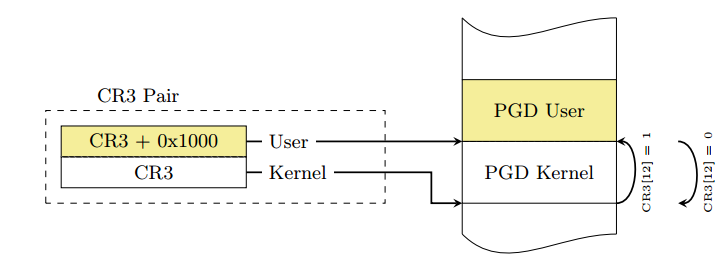

<!-- theme: gaia -->
<!-- _class: lead -->

# 第三講 基於特權級的隔離與批處理
## 第一節 從OS角度看計算機系統

 
 

向勇 陳渝 李國良 

 
 

2022年秋季

---
**提綱**

### 1. OS與硬件的關係
2. OS與應用程序的關係
3. 隔離機制

---

#### 計算機系統

計算機系統（computer architecture）是一種**抽象層次**的**設計**，用於實現可有效使用**現有製造技術**的**信息處理**應用。
-- cs-152 berkeley 
 
---
#### 計算機系統抽象層次

**硬件** 支持 **OS** 支持 **應用**

* 操作系統位於硬件（HW）和應用（APP）之間
* 只有理解OS與HW/APP的關係，才能更好掌握OS

---
#### 指令集：軟硬件接口
**硬件** 與 **OS** 的 **邊界** ：指令集+寄存器

---
#### OS是對硬件的虛擬與抽象

---
#### RISC-V處理器架構
 

---
u/rCore的框架結構

---
**提綱**

1. OS與硬件的關係
### 2. OS與應用程序的關係
3. 隔離機制

---
#### OS對應用程序執行的支持
- 提供服務
- 系統調用
- 地址空間佈局
---
#### OS為應用程序提供服務
* 通過**系統調用**來提供服務 
* **系統調用**：OS/APP的接口（邊界之一）

---
#### 系統調用如何實現？
- 調用`ssize_t read(int fd, void *buf, size_t count);`會發生什麼？
- 可以在應用程序中直接調用內核的函數嗎？
- 可以在內核中使用應用程序普通的函數調用嗎？

---
#### 引入系統調用的目的是增強安全性和可靠性

- 函數調用的特徵
  - 好處：執行很快；
  - 好處：靈活-易於傳遞和返回複雜數據類型；
  - 好處：程序員熟悉的機制,...
  - 壞處：應用程序不可靠，可能有惡意，有崩潰的風險

<!--
---
 ## OS與應用程序的關係 -- syscall

---
## OS與應用程序的關係 -- syscall

 -->

---
#### 進程的地址空間
進程的地址空間（memory layout）是界定了OS/APP的**邊界**。
 

---
#### OS內核與應用進程的地址空間劃分

進程的地址空間（memory layout）是界定了OS/APP的**邊界**。

#### 內核頁表隔離(KPTI, kernel page-table isolation)

---
**提綱**

1. OS與硬件的關係
2. OS與應用程序的關係
### 3. 隔離機制
* 為什麼隔離
* 隔離要解決的問題
* 隔離的方法 

---
#### 隔離要解決的問題
- 防止程序 X 破壞或監視程序 Y
  - 讀/寫內存，使用 100％的 CPU，更改文件描述符
- 防止進程干擾操作系統
- 防止惡意程序、病毒、木馬和 bug
  - 錯誤的過程可能會試圖欺騙硬件或內核

---
#### 什麼是隔離？
- 隔離的**定義**
  - 操作系統中的應用程序不會**影響**（或破壞）其他應用或操作系統的正常**執行**或信息**洩露**
- 隔離的**本質**
  - 在需要交換信息或共享資源的情況下才出現
- 隔離並不意味著不要共享

---
#### 隔離邊界
隔離需要建立邊界（boundary）
- 邊界決定了各自的勢力範圍
  - 跨界即有**風險**的共享資源
- 強制隔離
  - 避免有問題的單元對整個系統的安全影響
- 隔離的單位
  - 通常是運行的程序

<!-- https://blog.csdn.net/ceshi986745/article/details/51787424
猿學~程序員必知的六種隔離技術 -->

---
#### 隔離方法

- 隔離的方法分類
  - 基於**軟件**的隔離
  - 基於**硬件**的隔離
  - 基於**網絡**的隔離  
---

#### OS隔離APP的分類
* 對**控制**的隔離：特權級機制
  * 用戶態 vs 內核態 
* 對**數據**的隔離：地址空間
  * 用戶地址空間 vs 內核地址空間
* 對**時間**的隔離：中斷處理
  * 隨時打斷正在執行的用戶態App 
* 對破壞隔離的處理：**異常處理**
  * OS在內核態及時處理用戶態App的異常行為

---

#### 數據隔離：虛擬內存

- 虛擬內存
  - 讀寫內存的安全性問題
  - 進程間的安全問題
  - 內存空間利用率的問題
  - 內存讀寫的效率問題
- 地址空間 address spaces
  - 一個程序僅尋址其自己的內存
  - 若無許可，則**每個程序無法訪問不屬於自己的內存**

---
#### 虛擬內存的工作原理
 

<!-- ---
---
## 隔離機制 -- 主要的隔離方法 -- 虛擬內存
 

## 隔離機制 -- 主要的隔離方法 -- 虛擬內存
 

---
## 隔離機制 -- 主要的隔離方法 -- 虛擬內存
 

---
##  隔離機制 -- 主要的隔離方法 -- 虛擬內存
  -->

---
#### 控制隔離：特權模式
- CPU 硬件中的特權模式
  - 防止應用程序訪問設備和敏感的 CPU 寄存器
    - 地址空間配置寄存器
    - 關機相關的指令或寄存器
    - ......

---
#### 特權模式

- CPU 硬件支持不同的特權模式
  - Kernel Mode（內核態） vs User Mode（用戶態）
  - 內核態可以執行用戶態無法執行的特權操作
    - 訪問**外設**
    - **配置**地址空間（虛擬內存）
    - 讀/寫特殊**系統級寄存器**
- OS內核運行在內核態
- 應用程序運行在用戶態
- 每個微處理器都有類似的用戶/內核模式標誌

---
#### 時間隔離：中斷/異常機制
- CPU **硬件支持**中斷/異常的處理
- 及時響應和處理應用的**異常行為**
- 打斷一直佔用 CPU 的應用程序
- 中斷是**異步**發生，是來自處理器外部的 I/O 設備的信號的結果。
  - 異步是指，硬件中斷不是由任何一條專門的 CPU 指令造成。

---
#### 中斷處理例程

- 中斷處理例程（interrupt handle）：硬件中斷/異常的處理程序
  1. I/O 設備通過向處理器芯片的一個引腳發信號，並將異常號放到系統總線上，以觸發中斷；
  2. 在當前指令執行完後，處理器從系統總線讀取異常號，保存現場，切換到**內核態**；
  3. 調用中斷處理例程，當中斷處理程序完成後，它將控制返回給下一條本來要執行的指令。

---
#### 時鐘中斷
- Timer 可以穩定定時地產生中斷
  - 防止應用程序死佔著 CPU 不放
  - 讓OS內核能週期性地進行資源管理

---
### 小結

- 瞭解計算機硬件與操作系統的關係：接口/邊界
- 瞭解操作系統與應用程序的關係：接口/邊界
- 瞭解操作系統如何隔離與限制應用程序