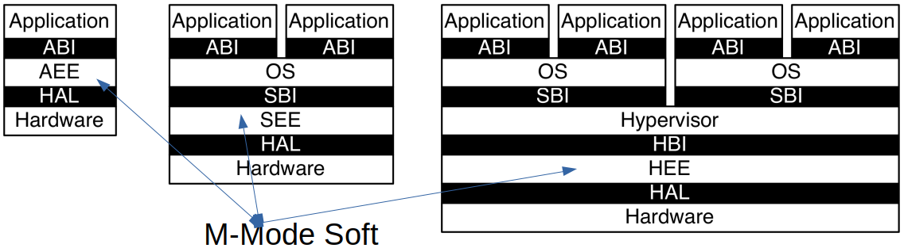
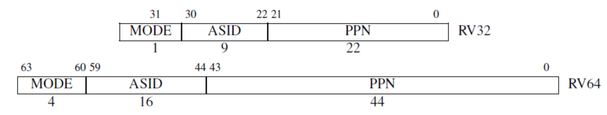
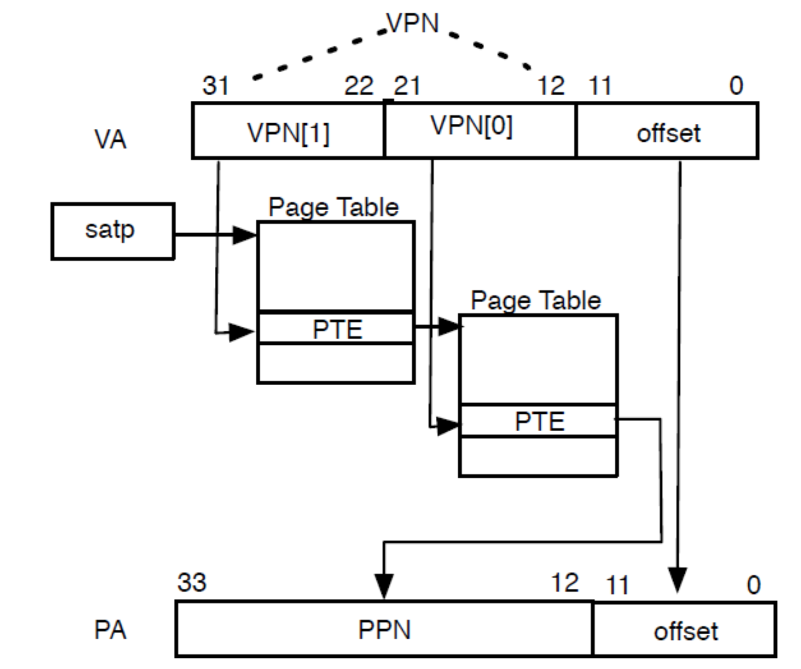

<!-- theme: gaia -->
<!-- _class: lead -->

# 第三講 基於特權級的隔離與批處理
## 第二節 從OS角度看RISC-V

<br>
<br>

向勇 陳渝 李國良 

<br>
<br>

2022年秋季

---
**提綱**

### 1. 主流CPU比較
2. RISC-V系統模式
3. RISC-V系統編程：用戶態編程
4. RISC-V系統編程：M-Mode編程
5. RISC-V系統編程：內核編程

---
#### 本節主要目標

- 瞭解 RISC-V 特權級和硬件隔離方式
- 瞭解 RISC-V 的 M-Mode 和 S-Mode 的基本特徵
- 瞭解OS在 M-Mode 和 S-Mode 下如何**訪問和控制**計算機系統
- 瞭解不同軟件如何在 M-Mode<–>S-Mode<–>U-Mode 之間進行**切換**
---
#### 主流CPU比較
<!-- 主要說明x86, arm由於兼容性，歷史原因，導致設計實現複雜，riscv簡潔/靈活/可擴展，便於學習掌握並用於寫OS -->


---
#### 主流CPU比較
* 由於兼容性和歷史原因，導致x86和ARM的設計實現複雜
*  RISC-V簡潔/靈活/可擴展


---
**提綱**

1. 主流CPU比較
### 2. RISC-V系統模式
  - 概述
  - 特權級
  - CSR寄存器
3. RISC-V系統編程：用戶態編程
4. RISC-V系統編程：M-Mode編程
5. RISC-V系統編程：內核編程

---

#### RISC-V相關術語
- 應用執行環境（Application Execution Environment, AEE)
- 應用程序二進制接口（Application Binary Interface,ABI)
- 管理員二進制接口（Supervisor Binary Interface, SBI)
- 管理員執行環境（Supervisor Execution Environment, SEE)
- Hypervisor：虛擬機監視器
- Hypervisor二進制接口（Hypervisor Binary interface，HBI）
- Hypervisor執行環境（Hypervisor Execution Environment, HEE)


---
#### RISC-V 系統模式

- ABI/SBI/HBI:Application/Supervisor/Hypervisor Bianry Interface
- AEE/SEE/HEE:Application/Superv/Hyperv Execution Environment
- HAL：Hardware Abstraction Layer
- Hypervisor，虛擬機監視器（virtual machine monitor，VMM）
- RISC-V 系統模式 即 與系統編程相關的RISC-V模式 


---
#### RISC-V 系統模式：單應用場景

- 不同軟件層有清晰的特權級硬件隔離支持
- 左側的**單個應用程序**被編碼在ABI上運行
- ABI是用戶級ISA(Instruction Set Architecture)和AEE交互的接口
- ABI對應用程序隱藏了AEE的細節，使得AEE具有更大的靈活性

---
#### RISC-V 系統模式：操作系統場景

- 中間加了一個**傳統的操作系統**，可支持多個應用程序的多道運行
- 每個應用程序通過**ABI**和OS進行通信
- RISC-V操作系統通過**SBI**和SEE進行通信
- SBI是OS內核與SEE交互的接口，支持OS的ISA

---
#### RISC-V 系統模式：虛擬機場景

- 右側是虛擬機場景，可支持**多個操作系統**


---
#### RISC-V 系統模式：應用場景

- M Mode：小型設備（藍牙耳機等）
- U+M Mode:嵌入式設備（電視遙控器、刷卡機等）
- U+S+M Mode：手機
- U+S+H+M Mode：數據中心服務器

---
#### RISC-V 系統模式：硬件線程

- 特權級是為不同的軟件棧部件提供的一種保護機制
- **硬件線程**（hart，即CPU core）是運行在某個特權級上（CSR配置）
- 當處理器執行當前特權模式不允許的操作時將產生一個**異常**，這些異常通常會產生自陷（trap）導致**下層執行環境接管控制權**

---
**提綱**

1. 主流CPU比較
2. RISC-V系統模式
  - 概述
### 特權級
  - CSR寄存器
3. RISC-V系統編程：用戶態編程
4. RISC-V系統編程：M-Mode編程
5. RISC-V系統編程：內核編程

---

#### RISC-V 系統模式：多個特權級

- 現代處理器一般具有多個特權級的模式（Mode）
- **U**：User | **S**: Supervisor | **H**: Hypervisor | **M**: Machine

為何有這**4種模式**? 它們的**區別和聯繫**是啥？


---
#### RISC-V 系統模式：執行環境
| 執行環境  |  編碼 | 含義  |  跨越特權級 |
| --- | --- | --------------------- | --- |
|  APP |  00 | User/Application  | ``ecall`` |
| OS | 01 | Supervisor | ``ecall`` ``sret`` | 
| VMM | 10 | Hypervisor | --- |
| BIOS | 11 | Machine | ``ecall`` ``mret`` |

- M, S, U 組合在一起的硬件系統適合運行類似UNIX的操作系統


---
#### RISC-V 系統模式：特權級的靈活組合

- 隨著應用的**需求變化**，需要**靈活**和**可組合**的硬件構造
- 所以就出現了上述4種模式，且模式間可以組合的靈活硬件設計

---
#### RISC-V 系統模式：用戶態

- U-Mode （User Mode，用戶模式、用戶態）
  - **非特權**級模式（Unprivileged Mode）：基本計算 
  - 是**應用程序運行**的用戶態CPU執行模式
  - 不能執行特權指令，不能直接影響其他應用程序執行


---
#### RISC-V 系統模式：內核態

- S-Mode（Supervisor Mode, Kernel Mode，內核態，內核模式）
  - 在內核態的操作系統具有足夠強大的**硬件控制能力**
  - 特權級模式（Privileged Mode）：**限制APP**的執行與內存訪問 
  - 是**操作系統運行**的內核態CPU執行模式
  - 能執行內核態特權指令，能直接**影響應用程序執行**

---
#### RISC-V 系統模式：H-Mode

- H-Mode(Hypervisor Mode, Virtual Machine Mode，虛擬機監控器)
  - 特權級模式：**限制OS**訪問的內存空間 
  - 是**虛擬機監控器運行**的Hypervisor Mode CPU執行模式，能執行H-Mode特權指令，能直接**影響OS執行**


---
#### RISC-V 系統模式：M-Mode

- M-Mode（Machine Mode, Physical Machine Mode）
  - 特權級模式：**控制物理內存**，直接關機 
  - 是**Bootloader/BIOS運行**的Machine Mode CPU執行模式
  - 能執行M-Mode特權指令，能直接影響上述其他軟件的執行

---
**提綱**

1. 主流CPU比較
2. RISC-V系統模式
  - 概述
  - 特權級
### CSR寄存器
3. RISC-V系統編程：用戶態編程
4. RISC-V系統編程：M-Mode編程
5. RISC-V系統編程：內核編程

---

#### RISC-V CSR寄存器分類

- **通用寄存器** x0-x31
  - 一般指令訪問
  - 非特權指令可以使用的速度最快的存儲單元
- **控制狀態寄存器**(CSR：Control and Status Registers)
  - 通過**控制狀態寄存器指令**訪問，可以有4096個CSR 
  - 運行在**用戶態的應用程序**不能訪問大部分的CSR寄存器
  - 運行在**內核態的操作系統**通過訪問CSR寄存器控制計算機

<!---
## RISC-V 系統模式：控制狀態寄存器CSR
強制隔離以避免對整個系統的可用性/可靠性/安全影響-->
---
#### 通過CSR寄存器實現的隔離
OS通過硬件隔離手段（三防）來保障計算機的安全可靠
- 設置 CSR(控制狀態寄存器) 實現隔離
  - 權力：防止應用訪問系統管控相關寄存器
    - **地址空間配置**寄存器：mstatus/sstatus CSR
  - 時間：防止應用長期使用 100％的 CPU
    - **中斷配置**寄存器：sstatus/stvec CSR
  - 數據：防止應用破壞竊取數據
    - **地址空間相關**寄存器：sstatus/satp/stvec CSR 

<!---
## RISC-V 系統模式：控制狀態寄存器CSR

- mtvec(MachineTrapVector)保存發生異常時需要跳轉到的地址。
- mepc(Machine Exception PC)指向發生異常的指令。
- mcause(Machine Exception Cause)指示發生異常的種類。
- mie(Machine Interrupt Enable)指出處理器目前能處理的中斷。
- mip(Machine Interrupt Pending)列出目前正準備處理的中斷。
- mtval(Machine Trap Value)保存陷入(trap)附加信息:地址例外中出錯的地址、發生非法指令例外的指令本身；對於其他異常，值為0。
- mscratch(Machine Scratch)它暫時存放一個字大小的數據。
- mstatus(Machine Status)保存全局中斷以及其他的狀態
-->

<!-- 
---
## RISC-V 系統模式：控制狀態寄存器CSR

- mcause(Machine Exception Cause)它指示發生異常的種類。
  - SIE控制S-Mode下全局中斷，MIE控制M-Mode下全局中斷。
  - SPIE、MPIE記錄發生中斷之前MIE和SIE的值。
---
## RISC-V 系統模式：控制狀態寄存器CSR

- sstatus(supervisor status)保存發生異常時需要跳轉到的地址。
- stvec(supervisor trap vector)保存s模式的trap向量基址。stvec總是4字節對齊
- satp(supervisor Address Translation and Protection) S-Mode控制狀態寄存器控制了分頁系統。
- sscratch (supervisor Scratch Register) 保存指向hart-local supervisor上下文的指針. 在trap處理程序的開頭，sscratch與用戶寄存器交換，以提供初始工作寄存器。
- sepc(supervisor Exception PC)它指向發生異常的指令。
-->


---
**提綱**

1. 主流CPU比較
2. RISC-V系統模式
### 3. RISC-V系統編程：用戶態編程
  - 簡述
  - U-Mode編程：系統調用
  - 特權操作
4. RISC-V系統編程：M-Mode編程
5. RISC-V系統編程：內核編程

---

#### 系統編程簡述
- 系統編程需要了解處理器的**特權級架構**，熟悉各個特權級能夠訪問的寄存器資源、內存資源和外設資源
- **編寫內核級代碼**，構造操作系統，支持應用程序執行
  - 內存管理 進程調度
  - 異常處理 中斷處理
  - 系統調用 外設控制
- 系統編程通常**沒有**廣泛用戶**編程庫**和方便的動態**調試手段**的支持
- 本課程的系統編程主要集中在 RISC-V 的 S-Mode 和 U-Mode，涉及部分對M-Mode的理解

---
#### RISC-V U-Mode編程：使用系統調用
- U-Mode 下的應用程序不能夠直接使用計算機的物理資源
- 環境調用異常：在執行 ``ecall`` 的時候發生，相當於系統調用
- 操作系統可以直接訪問物理資源
- 如果應用程序需要使用硬件資源怎麼辦？
  - 在屏幕上打印”hello world”
  - 從文件中讀入數據
- 通過系統調用從操作系統中獲得服務

---
#### U-Mode編程：第一個例子”hello world”
[在用戶態打印”hello world”的小例子](https://github.com/chyyuu/os_kernel_lab/tree/v4-kernel-sret-app-ecall-kernel/os/src) 大致執行流


---
#### 第一個例子的啟動執行
[在用戶態打印”hello world”的小例子](https://github.com/chyyuu/os_kernel_lab/blob/v4-kernel-sret-app-ecall-kernel/os/src/main.rs#L302) 啟動執行流


---
#### 第二個例子：在用戶態執行特權指令
[在用戶態執行特權指令的小例子](https://github.com/chyyuu/os_kernel_lab/blob/v4-illegal-priv-code-csr-in-u-mode-app-v2/os/src/main.rs#L306) 啟動與執行流程


<!-- Zifencei擴展 https://www.cnblogs.com/mikewolf2002/p/11191254.html -->
---
#### 特權操作
- 特權操作：特權指令和CSR讀寫操作
- 指令非常少：
  - ``mret`` 機器模式返回 
  - ``sret`` 監管者模式返回
  - ``wfi`` 等待中斷 (wait for interupt)
  - ``sfence.vma`` 虛擬地址屏障(barrier)指令
  
- 很多其他的系統管理功能通過讀寫控制狀態寄存器來實現

注:``fence.i``是i-cache屏障(barrier)指令，非特權指令，屬於 “Zifencei”擴展規範

<!-- 在執行 fence.i 指令之前，對於同一個硬件線程(hart)， RISC-V 不保證用存儲指令寫到內存指令區的數據可以被取指令取到。使用fence.i指令後，對同一hart，可以確保指令讀取是最近寫到內存指令區域的數據。但是，fence.i將不保證別的riscv hart的指令讀取也能夠滿足讀寫一致性。如果要使寫指令內存空間對所有的hart都滿足一致性要求，需要執行fence指令。 -->


---
**提綱**

1. 主流CPU比較
2. RISC-V系統模式
3. RISC-V系統編程：用戶態編程
### 4. RISC-V系統編程：M-Mode編程
  - 中斷機制和異常機制
  - 中斷/異常的硬件響應
  - 中斷/異常處理的控制權移交
5. RISC-V系統編程：內核編程

---

#### M-Mode編程
- M-Mode是 RISC-V 中 hart（hardware thread）的**最高權限模式**
- M-Mode下，hart 對計算機系統的底層功能有**完全的使用權**
- M-Mode最重要的特性是**攔截和處理中斷/異常**
  - **同步的異常**：執行期間產生，訪問無效的寄存器地址，或執行無效操作碼的指令
  - **異步的中斷**：指令流異步的外部事件，中斷，如時鐘中斷
- RISC-V 要求實現**精確異常**：保證異常之前的所有指令都完整執行，後續指令都沒有開始執行

---
#### M-Mode的中斷控制和狀態寄存器

- mtvec(MachineTrapVector)保存發生中斷/異常時要跳轉到的**中斷處理例程入口地址**
- mepc(Machine Exception PC)指向**發生中斷/異常時的指令**
- mcause(Machine Exception Cause)指示發生**中斷/異常的種類**
- mie(Machine Interrupt Enable)中斷**使能**寄存器
- mip(Machine Interrupt Pending)中斷**請求**寄存器
- mtval(Machine Trap Value)保存陷入(trap)**附加信息**
- mscratch(Machine Scratch)它暫時存放一個字大小的**數據**
- mstatus(Machine Status)保存全局中斷以及其他的**狀態**

<!-- mtval(Machine Trap Value)保存陷入(trap)附加信息:地址例外中出錯的地址、發生非法指令例外的指令本身；對於其他異常，值為0。 -->
---
#### mstatus CSR寄存器

- mstatus(Machine Status)保存全局中斷以及其他的**狀態**
  - SIE控制S-Mode下全局中斷，MIE控制M-Mode下全局中斷。
  - SPIE、MPIE記錄發生中斷之前MIE和SIE的值。
  - SPP表示變化之前的特權級別是S-Mode還是U-Mode
  - MPP表示變化之前是S-Mode還是U-Mode還是M-Mode
  PP：Previous Privilege


---
#### mcause CSR寄存器

當發生異常時，mcause CSR中被寫入一個指示**導致異常的事件**的代碼，如果事件由中斷引起，則置上``Interrupt``位，``Exception Code``字段包含指示最後一個異常的編碼。


---
#### M-Mode時鐘中斷Timer
- 中斷是異步發生的
  - 來自處理器外部的 I/O 設備的信號
- Timer 可以穩定定時地產生中斷
  - 防止應用程序死佔著 CPU 不放, 讓 OS Kernel 能得到執行權...
  - 由**高特權模式下的軟件**獲得 CPU 控制權
  - 高特權模式下的軟件可**授權**低特權模式軟件處理中斷

---
#### RISC-V處理器FU540模塊圖


---
**提綱**

1. 主流CPU比較
2. RISC-V系統模式
3. RISC-V系統編程：用戶態編程
4. RISC-V系統編程：M-Mode編程
  - 中斷機制和異常機制
### 中斷/異常的硬件響應
  - 中斷/異常處理的控制權移交
5. RISC-V系統編程：內核編程

---

#### M-Mode中斷的硬件響應過程
- **異常指令的PC**被保存在mepc中，PC設置為mtvec。
  - 對於同步異常，mepc指向導致異常的指令；
  - 對於中斷，指向中斷處理後應該恢復執行的位置。
- 根據**異常來源**設置 mcause，並將 mtval 設置為出錯的地址或者其它適用於**特定異常的信息字**
- 把mstatus[MIE位]置零以**禁用中斷**，並**保留先前MIE值**到MPIE中
    - SIE控制S模式下全局中斷，MIE控制M模式下全局中斷；
    - SPIE記錄的是SIE中斷之前的值，MPIE記錄的是MIE中斷之前的值
- **保留髮生異常之前的權限模式**到mstatus 的 MPP 域中，再**更改權限模式**為M。（MPP表示變化之前的特權級別是S、M or U模式）

---
#### M-Mode中斷處理例程 
```
    let scause = scause::read();
    let stval = stval::read();

    match scause.cause() {
        Trap::Exception(Exception::UserEnvCall) => {
            cx.sepc += 4;
            cx.x[10] = do_syscall(cx.x[17], [cx.x[10], cx.x[11], cx.x[12]]) as usize;
        }
        _ => {
            panic!(
                "Unsupported trap {:?}, stval = {:#x}!",
                scause.cause(),
                stval
            );
        }
    }

```
---
#### M-Mode中斷分類
通過 mcause 寄存器的不同位（mie）來獲取中斷的類型。
- **軟件**中斷：通過向內存映射寄存器寫入數據來觸發，一個 hart 中斷另外一個hart（處理器間中斷）
- **時鐘**中斷：hart 的時間計數器寄存器 mtime 大於時間比較寄存器 mtimecmp
- **外部**中斷：由中斷控制器觸發，大部分情況下的外設都會連到這個中斷控制器

---
#### RISC-V 的中斷/異常
通過 mcause 寄存器的不同位來獲取中斷源的信息。
第一列1代表中斷，第2列代表中斷ID，第3列中斷含義


---
#### M-Mode RISC-V異常機制
通過 mcause 寄存器的不同位來來獲取導致異常的信息。
第一列0代表異常，第2列代表異常ID，第3列異常含義


---
#### M-Mode中斷/異常的硬件響應
- **中斷/異常的指令的 PC** 被保存在 mepc 中， PC 被設置為 mtvec。
   - 對於異常，mepc指向導致異常的指令
   - 對於中斷，mepc指向中斷處理後應該恢復執行的位置
- 根據**中斷/異常來源**設置 mcause，並將 mtval 設置為出錯的地址或者其它適用於特定異常的信息字。

---
#### M-Mode中斷/異常的硬件響應

- 把控制狀態寄存器 mstatus[MIE位]置零以**禁用中斷**，並**保留先前的 MIE 值**到 MPIE 中。
  - SIE控制S-Mode下全局中斷，MIE控制M-Mode下全局中斷；
  - SPIE記錄的是SIE中斷之前的值，MPIE記錄的是MIE中斷之前的值）
- **發生異常之前的權限模式**保留在 mstatus 的 MPP 域中，再把權限模式更改為M
  - MPP表示變化之前的特權級別是S、M or U-Mode
- **跳轉**到mtvec CSR設置的地址繼續執行

---
**提綱**

1. 主流CPU比較
2. RISC-V系統模式
3. RISC-V系統編程：用戶態編程
4. RISC-V系統編程：M-Mode編程
  - 中斷機制和異常機制
  - 中斷/異常的硬件響應
### 中斷/異常處理的控制權移交
5. RISC-V系統編程：內核編程

---
#### M-Mode中斷/異常處理的控制權移交
- 默認情況下，所有的中斷/異常都使得控制權移交到 M-Mode的中斷/異常處理例程
- M-Mode的**中斷/異常處理例程**可以將中斷/異常重新**導向 S-Mode**，但是這些額外的操作會減慢中斷/異常的處理速度
- RISC-V 提供一種**中斷/異常委託機制**，通過該機制可以選擇性地將中斷/異常交給 S-Mode處理，而**完全繞過 M-Mode**

---
#### M-Mode中斷/異常處理的控制權移交
- **mideleg/medeleg** (Machine Interrupt/Exception Delegation）CSR 控制將哪些中斷/異常委託給 S-Mode處理
- mideleg/medeleg 中的每個為對應一箇中斷/異常
  - 如 mideleg[5] 對應於 S-Mode的時鐘中斷，如果把它置位，S-Mode的時鐘中斷將會移交 S-Mode的中斷/異常處理程序，而不是 M-Mode的中斷/異常處理程序
  - 委託給 S-Mode的任何中斷都可以被 S-Mode的軟件屏蔽。sie(Supervisor Interrupt Enable) 和 sip（Supervisor Interrupt Pending）CSR 是 S-Mode的控制狀態寄存器

---

#### 中斷委託寄存器mideleg
- mideleg (Machine Interrupt Delegation）控制將哪些中斷委託給 S 模式處理
- mideleg 中的每個為對應一箇中斷/異常
  - mideleg[1]用於控制是否將**核間中斷**交給s模式處理
  - mideleg[5]用於控制是否將**定時中斷**交給s模式處理
  - mideleg[9]用於控制是否將**外部中斷**交給s模式處理


---

#### 異常委託寄存器medeleg
- medeleg (Machine Exception Delegation）控制將哪些異常委託給 S 模式處理
- medeleg 中的每個為對應一箇中斷/異常
  - medeleg[1]用於控制是否將**指令獲取錯誤異常**交給s模式處理
  - medeleg[12]用於控制是否將**指令頁異常**交給s模式處理
  - medeleg[9]用於控制是否將**數據頁異常**交給s模式處理

<!-- ，是 mie 和 mip 的子集。這兩個寄存器和 M-Mode下有相同的佈局。sie 和 sip 中只有與由 mideleg 委託的中斷對應的位才能讀寫，沒有委派的中斷對應位總是 0 -->

---
#### 中斷/異常處理的控制權移交


- 發生中斷/異常時,處理器控制權**通常**不會移交給權限更低的模式
  - 例如 medeleg[15] 會把 store page fault 委託給 S-Mode
  - M-Mode下發生的異常總是在 M-Mode下處理
  - S-Mode下發生的異常總是在 M-Mode，或者在 S-Mode下處理
  - 上述兩種模式發生的異常不會由 U-Mode處理 

**Why？**


---
#### 思考題

- 如何通過斷點異常來實現調試器的斷點調試功能？
- 如何實現單步跟蹤？ 
---
**提綱**

1. 主流CPU比較
2. RISC-V系統模式
3. RISC-V系統編程：用戶態編程
4. RISC-V系統編程：M-Mode編程
### 5. RISC-V系統編程：內核編程
  - 中斷/異常機制
  - 中斷/異常的處理
  - 虛存機制
---

#### S-Mode的中斷控制和狀態寄存器

- stvec(SupervisorTrapVector)保存發生中斷/異常時**要跳轉到的地址**
- sepc(Supervisor Exception PC)指向**發生中斷/異常時的指令**
- scause(Supervisor Exception Cause)指示發生中斷/異常的**種類**
- sie(Supervisor Interrupt Enable)中斷**使能**寄存器
- sip(Supervisor Interrupt Pending)中斷**請求**寄存器
- stval(Supervisor Trap Value)保存陷入(trap)**附加信息**
- sscratch(Supervisor Scratch)不同mode交換**數據中轉站**
- sstatus(Supervisor Status)保存全局中斷以及其他的**狀態**

---
#### sstatus寄存器
- sstatus的SIE 和 SPIE 位分別保存了當前的和中斷/異常發生之前的中斷使能**狀態**


---
#### S-Mode中斷/異常機制

**sie & sip 寄存器**是用於保存**待處理中斷**和**中斷使能**情況的CSR

- sie （supervisor interrupt-enabled register）
- sip（supervisor interrupt pending）


---
#### scause寄存器
當發生異常時，CSR中被寫入一個指示**導致中斷/異常的事件**編號，記錄在``Exception Code``字段中；如果事件由中斷引起，則置``Interrupt``位。
scause 寄存器


---
#### mtvec & stvec 寄存器
中斷/異常向量（trap-vector）基地址寄存器stvec CSR用於配置**trap_handler地址**
 - 包括向量基址（BASE）和向量模式（MODE）：BASE 域中的值按 4 字節對齊
    - MODE = 0 表示一個trap_handler處理所有的中斷/異常
    - MODE = 1 表示每個中斷/異常有一個對應的trap_handler

mtvec & stvec 寄存器


---
**提綱**

1. 主流CPU比較
2. RISC-V系統模式
3. RISC-V系統編程：用戶態編程
4. RISC-V系統編程：M-Mode編程
5. RISC-V系統編程：內核編程
  - 中斷/異常機制
### 中斷/異常的處理
  - 虛存機制
---

#### S-Mode中斷/異常的硬件響應

**硬件執行內容**

hart 接受了中斷/異常，並需要委派給 S-Mode，那麼硬件會原子性的經歷下面的狀態轉換

1. **發生中斷/異常的指令PC**被存入 sepc, 且 PC 被設置為 stvec
2. scause 設置中斷/異常**類型**，stval被設置為出錯的地址/異常**相關信息**
3. 把 sstatus中的 SIE 位置零，**屏蔽中斷**， **SIE位之前的值**被保存在 SPIE 位中


---
#### S-Mode中斷/異常的硬件響應

4. **發生例外前的特權模式**被保存在 sstatus 的 SPP（previous privilege） 域，然後設置當前特權模式為S-Mode
5. **跳轉**到stvec CSR設置的地址繼續執行


---
#### S-Mode中斷/異常的軟件處理


- **初始化**
  - 編寫中斷/異常的處理例程（如trap_handler）
  - 設置trap_handler地址給stvec
- 軟件執行 
  1. 處理器跳轉到**trap_handler**
  2. trap_handler**處理**中斷/異常/系統調用等
  3. **返回**到之前的指令和之前的特權級繼續執行


---
**提綱**

1. 主流CPU比較
2. RISC-V系統模式
3. RISC-V系統編程：用戶態編程
4. RISC-V系統編程：M-Mode編程
5. RISC-V系統編程：內核編程
  - 中斷/異常機制
  - 中斷/異常的處理
### 虛存機制
---

#### S-Mode虛擬內存系統

- 虛擬地址將內存劃分為**固定大小的頁**來進行**地址轉換**和**內容保護**。
- satp（Supervisor Address Translation and Protection，監管者地址轉換和保護）S模式控制狀態寄存器**控制分頁**。satp 有三個域：
  - MODE 域可以**開啟分頁**並選擇頁表級數
  - ASID（Address Space Identifier，地址空間標識符）域是可選的，它可以用來降低上下文切換的開銷
  - PPN 字段保存了**根頁表的物理頁號**


---
#### S-Mode虛存機制

- 通過stap CSR建立**頁表基址**
- 建立OS和APP的**頁表**
- 處理內存訪問**異常**


---
#### S-Mode虛存的地址轉換
S、U-Mode中虛擬地址會以從根部遍歷頁表的方式轉換為物理地址：

- satp.PPN 給出了**一級頁表基址**， VA [31:22] 給出了一級頁號，CPU會讀取位於地址(satp. PPN × 4096 + VA[31: 22] × 4)頁表項。
- PTE 包含**二級頁表基址**，VA[21:12]給出了二級頁號，CPU讀取位於地址(PTE. PPN × 4096 + VA[21: 12] × 4)葉節點頁表項。
- **葉節點頁表項的PPN字段**和頁內偏移（原始虛址的最低 12 個有效位）組成了最終結果：物理地址(LeafPTE.PPN×4096+VA[11: 0])


---
#### S-Mode虛存的地址轉換




<!-- ---
## RISC-V 系統編程：S-Mode下的隔離
- S-Mode比 U-Mode權限更高，但是比 M-Mode權限低
- S-Mode下運行的軟件不能使用 M-Mode的 CSR 和指令，並受到 PMP 的限制
- 支持基於頁面的虛擬內存 -->


---
### 小結

- 瞭解 RISC-V 特權級和硬件隔離方式
- 瞭解 RISC-V 的 M-Mode 和 S-Mode 的基本特徵
- 瞭解OS在 M-Mode 和 S-Mode 下如何訪問控制計算機系統
- 瞭解不同軟件如何在 M-Mode<–>S-Mode<–>U-Mode 之間進行切換

