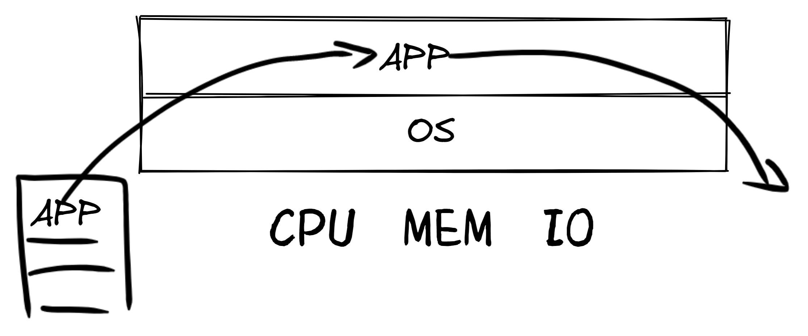
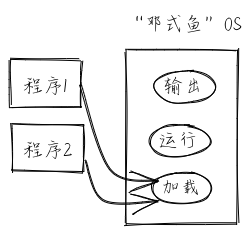

<!-- theme: gaia -->
<!-- _class: lead -->

# 第三講 基於特權級的隔離與批處理
## 第三節 實踐：批處理操作系統

<br>
<br>

向勇 陳渝 李國良 

<br>
<br>

2022年秋季

---
**提綱**

### 1. 實驗目標
2. 實踐步驟
3. 軟件架構
4. 相關硬件
5. 應用程序設計
6. 內核程序設計

---

#### 批處理操作系統的結構


  <!-- - 構造&加載 OS&APP
  - 基於RV特權級機制保護OS
  - 系統調用支持
  - 特權級切換  -->


---
#### 批處理OS目標
- 讓APP與OS隔離
- 自動加載並運行多個程序
  - **批處理（batch）**

LibOS目標
- 讓應用與硬件隔離
- 簡化應用訪問硬件的難度和複雜性
  


---
#### 實驗要求
- 理解運行其他軟件的軟件
- 理解特權級和特權級切換
- 理解系統調用
- 會寫``鄧式魚``批處理操作系統

鄧式魚：Dunkleosteus 在泥盆紀有堅固盾甲的海洋霸主  


---
#### 總體思路
- 編譯：應用程序和內核**獨立編譯**，合併為一個鏡像
- 構造：系統調用服務請求接口，應用的**管理與初始化**
- 運行：OS一個一個地**執行應用**
- 運行：應用發出**系統調用**請求，OS完成系統調用
- 運行：應用與OS基於硬件特權級機制進行**特權級切換**


---
#### 歷史背景
- GM-NAA I/O System(1956)
  - 啟發：汽車生產線 
- MULTICS OS(1969,MIT/GE/AT&T)
  - GE 645 具有 8 級硬件支持的保護環
 GM-NAA: General Motors and North American Aviation;
 GE： General Electric



---
**提綱**

1. 實驗目標
### 2. 實踐步驟
3. 軟件架構
4. 相關硬件
5. 應用程序設計
6. 內核程序設計

---

#### 步驟
- 構造包含OS和多個APP的**單一執行鏡像**
- 通過批處理支持多個**APP的自動加載和運行**
- 利用硬件特權級機制實現對操作系統自身的**保護**
- 支持跨特權級的**系統調用** 
- 實現特權級的**穿越**


---
#### 編譯步驟
```
git clone https://github.com/rcore-os/rCore-Tutorial-v3.git
cd rCore-Tutorial-v3
git checkout ch2

cd os
make run
```

---
#### 參考運行結果
```
...
[kernel] num_app = 5
[kernel] app_0 [0x8020a038, 0x8020af90)
...
[kernel] Loading app_0
Hello, world!
[kernel] Application exited with code 0
[kernel] Loading app_1
...
[kernel] Panicked at src/batch.rs:58 All applications completed!
```


---
**提綱**

1. 實驗目標
2. 實踐步驟
### 3. 軟件架構
4. 相關硬件
5. 應用程序設計
6. 內核程序設計

---

#### 構建應用
把多個應用合在一起與OS形成一個二進制鏡像
```
├── os
│   ├── build.rs(新增：生成 link_app.S 將應用作為一個數據段鏈接到內核)
│   ├── Cargo.toml
│   ├── Makefile(修改：構建內核之前先構建應用)
│   └── src
│       ├── link_app.S(構建產物，由 os/build.rs 輸出)
```


---
#### 改進OS
加載和執行程序、特權級上下文切換
```
├── os
│   └── src
│       ├── batch.rs(新增：實現了一個簡單的批處理系統)
│       ├── main.rs(修改：主函數中需要初始化 Trap 處理並加載和執行應用)

│       └── trap(新增：Trap 相關子模塊 trap)
│           ├── context.rs(包含 Trap 上下文 TrapContext)
│           ├── mod.rs(包含 Trap 處理入口 trap_handler)
│           └── trap.S(包含 Trap 上下文保存與恢復的彙編代碼)
```

---
#### 系統調用

```
├── os
│   └── src
│       ├── syscall(新增：系統調用子模塊 syscall)
│       │   ├── fs.rs(包含文件 I/O 相關的 syscall)
│       │   ├── mod.rs(提供 syscall 方法根據 syscall ID 進行分發處理)
│       │   └── process.rs(包含任務處理相關的 syscall)
```

---
#### 添加應用
批處理OS會按照文件名開頭的數字順序依次加載並運行它們
```
└── user(新增：應用測例保存在 user 目錄下)
   └── src
      ├── bin(基於用戶庫 user_lib 開發的應用，每個應用放在一個源文件中)
      │   ├── 00hello_world.rs # 顯示字符串的應用
      │   ├── 01store_fault.rs # 非法寫操作的應用
      │   ├── 02power.rs       # 計算/IO頻繁交替的應用 
      │   ├── 03priv_inst.rs   # 執行特權指令的應用
      │   └── 04priv_csr.rs    # 執行CSR操作指令的應用
```            
---
#### 應用庫和編譯應用支持
應用庫和編譯應用支持
```
└── user(新增：應用測例保存在 user 目錄下)
   └── src
      ├── console.rs              # 支持println!的相關函數與宏
      ├── lang_items.rs           # 實現panic_handler函數
      ├── lib.rs(用戶庫 user_lib)  # 應用調用函數的底層支撐庫 
      ├── linker.ld               # 應用的鏈接腳本
      └── syscall.rs(包含 syscall 方法生成實際用於系統調用的彙編指令，
                     各個具體的 syscall 都是通過 syscall 來實現的)
```


---
**提綱**

1. 實驗目標
2. 實踐步驟
3. 軟件架構
### 4. 相關硬件
5. 應用程序設計
6. 內核程序設計

---

#### RISC-V陷入(trap)類指令

- ecall： 隨著 CPU 當前特權級而觸發不同的陷入異常
- ebreak：觸發斷點陷入異常

**RISC-V特權指令**

- sret： 隨著 CPU 當前特權級而觸發不同的陷入異常
  


---

#### RISC-V異常向量

| Interrupt | Exception Code | Description                    |
| --------- | -------------- | ------------------------------ |
| 0         | 0              | Instruction address misaligned |
| 0         | 1              | Instruction access fault       |
| 0         | 2              | Illegal instruction            |
| 0         | 3              | **Breakpoint**                     |
| 0         | 4              | Load address misaligned        |
| 0         | 5              | Load access fault              |


            
---
#### RISC-V異常向量

| Interrupt | Exception Code | Description                    |
| --------- | -------------- | ------------------------------ |
| 0         | 6              | Store/AMO address misaligned   |
| 0         | 7              | Store/AMO access fault         |
| 0         | 8              | **Environment call from U-mode**   |
| 0         | 9              | Environment call from S-mode   |
| 0         | 11             | Environment call from M-mode   |

            
---
#### RISC-V異常向量

| Interrupt | Exception Code | Description                    |
| --------- | -------------- | ------------------------------ |
| 0         | 12             | Instruction page fault         |
| 0         | 13             | Load page fault                |
| 0         | 15             | Store/AMO page fault           |


- AMO: atomic memory operation 

---
**提綱**

1. 實驗目標
2. 實踐步驟
... ...
### 5. 應用程序設計
- 項目結構
- 內存佈局
- 系統調用  
6. 內核程序設計

---

#### 應用與底層支撐庫分離

```
└── user(應用程序和底層支撐庫)
   └── src
      ├── bin(該目錄放置基於用戶庫 user_lib 開發的應用)   
      ├── lib.rs(用戶庫 user_lib)  # 庫函數的底層支撐庫 
      ├── ......                  # 支撐庫相關文件
      └── linker.ld               # 應用的鏈接腳本
```

---
#### 引入外部庫
``` rust
  #[macro_use]
  extern crate user_lib;
```

---
#### 設計支撐庫

在 lib.rs 中我們定義了用戶庫的入口點 _start ：
``` rust
#[no_mangle]
#[link_section = ".text.entry"]
pub extern "C" fn _start() -> ! {
    clear_bss();
    exit(main());
    panic!("unreachable after sys_exit!");
}
```


---
**提綱**

1. 實驗目標

... ...

5. 應用程序設計
- 項目結構
### 內存佈局
- 系統調用  
6. 內核程序設計

---

#### 應用程序的內存佈局


---

#### 設計支撐庫
`user/src/linker.ld`

- 將程序的起始物理地址調整為 0x80400000 ，應用程序都會被加載到這個物理地址上運行；
- 將 _start 所在的 .text.entry 放在整個程序的開頭，也就是說批處理系統只要在加載之後跳轉到 0x80400000 就已經進入了 用戶庫的入口點，並會在初始化之後跳轉到應用程序主邏輯；
- 提供了最終生成可執行文件的 .bss 段的起始和終止地址，方便 clear_bss 函數使用。

其餘的部分與之前相同


---
**提綱**

1. 實驗目標

... ...

5. 應用程序設計
- 項目結構
- 內存佈局
### 系統調用  
6. 內核程序設計

---

#### 應用程序的系統調用執行流


---

#### 應用程序的系統調用執行流

- 在子模塊 syscall 中，應用程序通過 ecall 調用批處理系統提供的接口
- ``ecall`` 指令會觸發 名為 Environment call from U-mode 的異常
- Trap 進入 S 模式執行批處理系統針對這個異常特別提供的服務代碼
- a0~a6 保存系統調用的參數， a0 保存返回值, a7 用來傳遞 syscall ID
---
#### 系統調用支撐庫
``` rust --
/// 功能：將內存中緩衝區中的數據寫入文件。
/// 參數：`fd` 表示待寫入文件的文件描述符；
///      `buf` 表示內存中緩衝區的起始地址；
///      `len` 表示內存中緩衝區的長度。
/// 返回值：返回成功寫入的長度。
/// syscall ID：64
fn sys_write(fd: usize, buf: *const u8, len: usize) -> isize;

/// 功能：退出應用程序並將返回值告知批處理系統。
/// 參數：`xstate` 表示應用程序的返回值。
/// 返回值：該系統調用不應該返回。
/// syscall ID：93
fn sys_exit(xstate: usize) -> !;
```


---
#### 系統調用參數傳遞

``` rust
fn syscall(id: usize, args: [usize; 3]) -> isize {
    let mut ret: isize;
    unsafe {
        asm!(
            "ecall",
            inlateout("x10") args[0] => ret, //第一個參數&返回值
            in("x11") args[1],               //第二個參數
            in("x12") args[2],               //第三個參數
            in("x17") id                     //syscall編號
        );
    }
    ret //返回值
}
```


---
#### 系統調用封裝
```rust
const SYSCALL_WRITE: usize = 64; 
const SYSCALL_EXIT: usize = 93;
//對系統調用的封裝
pub fn sys_write(fd: usize, buffer: &[u8]) -> isize {
    syscall(SYSCALL_WRITE, [fd, buffer.as_ptr() as usize, buffer.len()])
}
pub fn sys_exit(xstate: i32) -> isize {
    syscall(SYSCALL_EXIT, [xstate as usize, 0, 0])
}
```

---
#### 系統調用封裝
``` rust
pub fn write(fd: usize, buf: &[u8]) -> isize { sys_write(fd, buf) }

const STDOUT: usize = 1;

impl Write for Stdout {
    fn write_str(&mut self, s: &str) -> fmt::Result {
        write(STDOUT, s.as_bytes());
        Ok(())
    }
}
```


---
**提綱**

... ...

5. 應用程序設計
### 6. 內核程序設計
- 應用管理和加載
- 特權級切換
- Trap上下文
- Trap處理流程
- 執行應用程序

---

#### 將應用程序映像鏈接到內核
```
# os/src/link_app.S 由腳本 os/build.rs 生成
    .section .data
    .global _num_app
_num_app:
    .quad 5
    .quad app_0_start
    ...
    .quad app_4_end
    .section .data
    .global app_0_start
    .global app_0_end
app_0_start:
    .incbin "../user/target/riscv64gc-unknown-none-elf/release/00hello_world.bin"
app_0_end:
```


---
#### 應用程序管理數據結構

```rust
// os/src/batch.rs

struct AppManager {
    num_app: usize,
    current_app: usize,
    app_start: [usize; MAX_APP_NUM + 1],
}
```


---
#### 找到應用程序二進制碼
- 找到 link_app.S 中提供的符號 _num_app
``` rust
lazy_static! {
    static ref APP_MANAGER: UPSafeCell<AppManager> = unsafe { UPSafeCell::new({
        extern "C" { fn _num_app(); }
        let num_app_ptr = _num_app as usize as *const usize;
        ...
        app_start[..=num_app].copy_from_slice(app_start_raw);
        AppManager {
            num_app,
            current_app: 0,
            app_start,
        }        
```

---

#### 加載應用程序二進制碼
```rust
unsafe fn load_app(&self, app_id: usize) {
    // clear icache
    asm!("fence.i");
    // clear app area
    ...
    let app_src = core::slice::from_raw_parts(
        self.app_start[app_id] as *const u8,
        self.app_start[app_id + 1] - self.app_start[app_id] );
    let app_dst = core::slice::from_raw_parts_mut(
        APP_BASE_ADDRESS as *mut u8,
        app_src.len() );
    app_dst.copy_from_slice(app_src);
}
```


---
#### 加載應用程序二進制碼

- fence.i ：用來清理 i-cache

注:``fence.i``是i-cache屏障(barrier)指令，非特權指令，屬於 “Zifencei”擴展規範

**WHY？**

---
#### 加載應用程序二進制碼

- fence.i ：用來清理 i-cache

- CPU 對物理內存所做的緩存又分成d-cache和i-cache
- OS將修改會被 CPU 取指的內存區域，這會使得 i-cache 中含有與內存中不一致的內容
- OS在這裡必須使用 fence.i 指令手動清空 i-cache ，讓裡面所有的內容全部失效，才能夠保證CPU訪問內存數據和代碼的正確性。


---
**提綱**

... ...

5. 應用程序設計
6. 內核程序設計
- 應用管理和加載
### 特權級切換
- Trap上下文
- Trap處理流程
- 執行應用程序

---

#### 特權級切換相關CSR
| CSR 名  | 該 CSR 與 Trap 相關的功能                                    |
| ------- | ------------------------------------------------------------ |
| sstatus | `SPP` 等字段給出 Trap 發生之前 CPU 的特權級（S/U）等 |
| sepc    | 記錄 Trap 發生之前執行的最後一條指令的地址 |
| scause  | 描述 Trap 的原因      |
| stval   | 給出 Trap 附加信息      |
| stvec   | 控制 Trap 處理代碼的入口地址     |

---
#### 特權級切換後的硬件邏輯

1. sstatus 的 SPP 字段會被修改為 CPU 當前的特權級（U/S）；
2. sepc 會被修改為 Trap 處理完成後默認會執行的下一條指令的地址；
3. scause/stval 分別會被修改成這次 Trap 的原因以及相關的附加信息；
4. CPU 將當前特權級設為 S，跳到 stvec 所設置的 Trap 處理入口地址。


---
#### 特權級切換與用戶棧和內核棧
Why 使用兩個不同的棧？

安全 安全 安全

``` rust
const USER_STACK_SIZE: usize = 4096 * 2;
const KERNEL_STACK_SIZE: usize = 4096 * 2;

static KERNEL_STACK: KernelStack = KernelStack { data: [0; KERNEL_STACK_SIZE] };
static USER_STACK: UserStack = UserStack { data: [0; USER_STACK_SIZE] };
```

---
#### 特權級切換中的換棧
``` rust
impl UserStack {
    fn get_sp(&self) -> usize {
        self.data.as_ptr() as usize + USER_STACK_SIZE
    }
}
RegSP = USER_STACK.get_sp();
RegSP = KERNEL_STACK.get_sp();
```


---
**提綱**

... ...

5. 應用程序設計
6. 內核程序設計
- 應用管理和加載
- 特權級切換
### Trap上下文
- Trap處理流程
- 執行應用程序

---

#### Trap上下文數據結構
``` rust
#[repr(C)]
pub struct TrapContext {
    pub x: [usize; 32],
    pub sstatus: Sstatus,
    pub sepc: usize,
}
```
- 對於通用寄存器而言，應用程序/內核控制流運行在不同的特權級
- 進入 Trap 的時候，硬件會立即覆蓋掉 scause/stval/sstatus/sepc


---
#### 特權級切換後的Trap入口點
```rust
pub fn init() {
    extern "C" { fn __alltraps(); }
    unsafe {
        stvec::write(__alltraps as usize, TrapMode::Direct);
    }
}
```


---
#### 系統調用過程中的Trap上下文處理
1. 應用程序通過 ecall 進入到內核狀態時，操作系統保存被打斷的應用程序的 Trap 上下文；


---
#### 系統調用過程中的Trap上下文處理

2. 操作系統根據Trap相關的CSR寄存器內容，完成系統調用服務的分發與處理；


---
#### 系統調用過程中的Trap上下文處理

3. 操作系統完成系統調用服務後，需要恢復被打斷的應用程序的Trap 上下文，並通 ``sret``指令讓應用程序繼續執行。

---

#### 用戶棧到內核棧的切換
**sscratch CSR** 重要的中轉寄存器

在特權級切換的時候，我們需要將 Trap 上下文保存在內核棧上，因此需要一個寄存器暫存內核棧地址，並以它作為基地址指針來依次保存 Trap 上下文的內容。

但是所有的通用寄存器都不能夠用作基地址指針，因為它們都需要被保存，如果覆蓋掉它們，就會影響後續應用控制流的執行。

---
#### 用戶棧到內核棧的切換

**sscratch CSR** 重要的中轉寄存器

- 暫時保存內核棧的地址
- 作為一箇中轉站讓 sp （目前指向的用戶棧的地址）的值可以暫時保存在 sscratch
- 僅需一條 `csrrw  sp, sscratch, sp // 交換對 sp 和 sscratch 兩個寄存器內容`
- 完成用戶棧-->內核棧的切換

---

#### 保存Trap上下文中的通用寄存器

保存通用寄存器的宏
```
# os/src/trap/trap.S
.macro SAVE_GP n
    sd x\n, \n*8(sp)
.endm
```

---
**提綱**

... ...

5. 應用程序設計
6. 內核程序設計
- 應用管理和加載
- 特權級切換
- Trap上下文
### Trap處理流程
- 執行應用程序

---

#### Trap處理流程


Trap 處理的總體流程如下：
1. 首先通過 __alltraps 將 Trap 上下文保存在內核棧上;
2. 然後跳轉到 trap_handler 函數完成 Trap 分發及處理。
```
__alltraps:
    csrrw sp, sscratch, sp
    # now sp->kernel stack, sscratch->user stack

    # allocate a TrapContext on kernel stack
    addi sp, sp, -34*8    
```


---
#### 保存Trap上下文
保存通用寄存器
```
    # save general-purpose registers
    sd x1, 1*8(sp)
    # skip sp(x2), we will save it later
    sd x3, 3*8(sp)
    # skip tp(x4), application does not use it
    # save x5~x31
    .set n, 5
    .rept 27
        SAVE_GP %n
        .set n, n+1
    .endr
```


---
#### 保存Trap上下文
保存 sstatus 和 sepc 
```
    # we can use t0/t1/t2 freely, because they were saved on kernel stack
    csrr t0, sstatus
    csrr t1, sepc
    sd t0, 32*8(sp)
    sd t1, 33*8(sp)
```

---
#### 保存Trap上下文
保存 user SP
```
    # read user stack from sscratch and save it on the kernel stack
    csrr t2, sscratch
    sd t2, 2*8(sp)
```
``` rust
pub struct TrapContext {
    pub x: [usize; 32],
    pub sstatus: Sstatus,
    pub sepc: usize,
}
```
---
#### 調用trap_handler
```
    # set input argument of trap_handler(cx: &mut TrapContext)
    mv a0, sp
    call trap_handler
```
讓寄存器 a0 指向內核棧的棧指針也就是我們剛剛保存的 Trap 上下文的地址，這是由於我們接下來要調用 trap_handler 進行 Trap 處理，它的第一個參數 cx 由調用規範要從 a0 中獲取。


---
#### 恢復Trap上下文
1. 大部分是保存寄存器的反向操作；
2. 最後一步是 ``sret``指令 //從內核態返回到用戶態

注：後面講解“執行程序”時會比較詳細的講解"恢復Trap上下文"


---
#### trap_handler處理syscall

```rust
#[no_mangle]
pub fn trap_handler(cx: &mut TrapContext) -> &mut TrapContext {
    let scause = scause::read();
    let stval = stval::read();
    match scause.cause() {
        Trap::Exception(Exception::UserEnvCall) => {
            cx.sepc += 4;
            cx.x[10] = syscall(cx.x[17], [cx.x[10], cx.x[11], cx.x[12]]) as usize;
        }
    ...
    }
    cx
}
```


---
#### trap_handler處理syscall

``` rust
pub fn sys_exit(xstate: i32) -> ! {
    println!("[kernel] Application exited with code {}", xstate);
    run_next_app()
}
```


---
**提綱**

... ...

5. 應用程序設計
6. 內核程序設計
- 應用管理和加載
- 特權級切換
- Trap上下文
- Trap處理流程
### 執行應用程序

---

#### 應用程序的執行時機
- 當批處理操作系統初始化完成
- 某個應用程序運行結束或出錯

---

#### 讓應用程序執行
從內核態切換到用戶態
- 準備好應用的上下文``Trap上下文``
- 恢復應用的相關寄存器
- 特別是應用用戶棧指針和執行地址
- **返回用戶態讓應用執行** 


---

#### 返回用戶態讓應用執行

- 從內核態切換到用戶態
  -  ``sret``指令的**硬件邏輯**：
     - 恢復響應中斷/異常
     - CPU Mode從S-Mode 回到U-Mode
     - ``pc`` <-- ``spec`` CSR
     - 繼續運行
---
#### 切換到下一個應用程序

調用 run_next_app 函數切換到下一個應用程序：
- 構造應用程序開始執行所需的 Trap 上下文；
- 通過 `__restore` 函數，從剛構造的 Trap 上下文中，恢復應用程序執行的部分寄存器；
- 設置 `sepc` CSR的內容為應用程序入口點 `0x80400000`；
- 切換 `scratch` 和 `sp` 寄存器，設置 `sp` 指向應用程序用戶棧；
- 執行 `sret` 從 S 特權級切換到 U 特權級。


---
#### 構造Trap上下文
``` rust
impl TrapContext {
    pub fn set_sp(&mut self, sp: usize) { self.x[2] = sp; }
    pub fn app_init_context(entry: usize, sp: usize) -> Self {
        let mut sstatus = sstatus::read();
        sstatus.set_spp(SPP::User);
        let mut cx = Self {
            x: [0; 32],
            sstatus,
            sepc: entry,
        };
        cx.set_sp(sp);
        cx
```


---
#### 運行下一程序
``` rust
ub fn run_next_app() -> ! {
    ...
    unsafe {
        app_manager.load_app(current_app);
    }
    ...
    unsafe {
        __restore(KERNEL_STACK.push_context(
            TrapContext::app_init_context(APP_BASE_ADDRESS, USER_STACK.get_sp())
        ) as *const _ as usize);
    }
    panic!("Unreachable in batch::run_current_app!");
}
```

---
#### 運行下一程序
```
__restore:
    # case1: start running app by __restore
    # case2: back to U after handling trap
    mv sp, a0
    # now sp->kernel stack(after allocated), sscratch->user stack
    # restore sstatus/sepc
    ld t0, 32*8(sp)
    ld t1, 33*8(sp)
    ld t2, 2*8(sp)
    csrw sstatus, t0
    csrw sepc, t1
    csrw sscratch, t2
```


---
#### 運行下一程序

```
# restore general-purpuse registers except sp/tp
    ld x1, 1*8(sp)
    ld x3, 3*8(sp)
    .set n, 5
    .rept 27
        LOAD_GP %n
        .set n, n+1
    .endr
    # release TrapContext on kernel stack
    addi sp, sp, 34*8
    # now sp->kernel stack, sscratch->user stack
    csrrw sp, sscratch, sp
    sret
```

---
#### 提問

 sscratch 是何時被設置為內核棧頂的？

---
### 小結
- OS與硬件的關係
- OS與應用程序的關係
- 隔離（isolation）機制
- 批處理創建並執行程序
- 特權級切換
- 系統調用
- 能寫鄧氏魚OS

