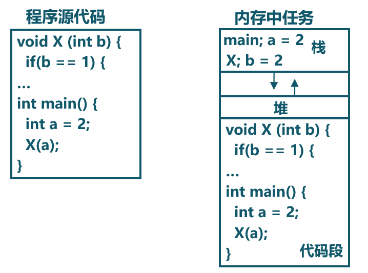
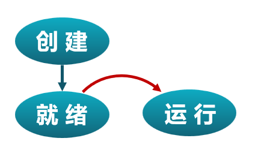
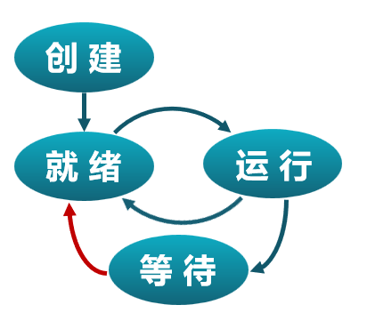

<!-- theme: gaia -->
<!-- _class: lead -->

# 第四講 多道程序與分時多任務
## 第一節 進程和進程模型
 
 

向勇 陳渝 李國良 

 
 

2022年秋季

---
**提綱**

### 1. 多道程序與協作式調度
2. 分時多任務與搶佔式調度
3. 進程的概念
4. 進程模型

---

#### 歷史

操作系統的被廣泛使用是從大型機向小型機（minicomputer）過渡的時期開始的。

- OS/360是大型機（System/360）時代的多道批處理操作系統
- 數字設備公司（DEC）的PDP系列小型計算機
- 一個工作單位內的一群人可能擁有自己的計算機
- 多道程序（multiprogramming）變得很普遍

---

#### 多道程序（Multiprogramming）

- 在內存中存在多個可執行程序
- 各個可執行程序共享處理器

作業(Job)
- 應用的一次**執行過程**

歷史上出現過的術語：Job、Multiprogramming 
- Job和Multiprogramming是IBM用於多道程序設計的概念。

---

#### 協作式調度（Cooperative scheduling）

- 可執行程序主動放棄處理器使用 
- 操作系統不會打斷正在執行的程序
- 操作系統選擇下一個執行程序使用處理器

---
**提綱**

1. 多道程序與協作式調度
### 2. 分時多任務與搶佔式調度
3. 進程的概念
4. 進程模型

---
#### 歷史

小型機（minicomputer）的普及和廣泛使用推動了分時多任務的需求，形成了支持多用戶的分時操作系統。

- DEC公司的PDP、VAX小型機逐漸侵蝕大型機市場
- DEC公司的VMX操作系統
- MIT的CTSS操作系統
- AT&T的UNIX操作系統

---
#### 從用戶的視角看分時多任務

分時多任務（Time sharing multitask）：從用戶的視角看

- 在內存中存在多個可執行程序
- 各個可執行程序分時共享處理器
- 操作系統按時間片來給各個可執行程序分配CPU使用時間
- **進程(Process)** ：應用的一次執行過程

---
#### 從OS的視角看分時多任務（Time sharing multitask）

- **進程(Process)** ：一個具有一定**獨立功能**的程序在一個**數據集合**上的一次動態**執行過程**。也稱為**任務(Task)**。
- 從一個應用程序對應的進程切換到另外一個應用程序對應的進程，稱為**進程切換**。

---
#### 作業（Job）、任務（Task）和進程（Process）

歷史上出現過的術語：Job、Task、Process
- Task、Process是Multics和UNIX等用於分時多任務提出的概念
- 進程是一個應用程序的一次執行過程。在操作系統語境下，任務和進程是同義詞
- 作業（目標）是圍繞一個共同目標由一組相互關聯的程序執行過程（進程、任務）形成的一個整體

參考：[Difference between Job, Task and Process](https://www.geeksforgeeks.org/difference-between-job-task-and-process/)

---
#### 搶佔式調度（Preemptive scheduling）

- 進程被動地放棄處理器使用
- 進程按時間片輪流使用處理器，是一種“暫停-繼續”組合的執行過程
- 基於時鐘硬件中斷機制，操作系統可隨時打斷正在執行的程序
- 操作系統選擇下一個執行程序使用處理器

---
**提綱**

1. 多道程序與協作式調度
2. 分時多任務與搶佔式調度
### 3. 進程的概念
4. 進程模型

---

#### 進程切換

---
#### 進程的特點
- 動態性
  - 開始執行-->暫停-->繼續-->結束執行的過程
- 併發性
  - 一段時間內多個進程在執行
- 有限度的獨立性
  - 進程之間不用感知對方的存在

目前還沒具備更強大的特點
- 隔離更徹底、任務間協同工作、任務創建任務...... 

---
#### 進程與程序的組成

---
#### 進程與程序的組成

---
#### 進程與程序的對應關係

- 任務是操作系統處於執行狀態程序的抽象
  - 程序 = 文件 (靜態的可執行文件)
  - 任務 = 執行中的程序 = 程序 + 執行狀態
 
- 同一個程序的多次執行過程對應為不同任務
  - 如命令“ls”的多次執行對應多個任務
 
- 任務執行需要的資源
  - 內存：保存代碼和數據
  - CPU：執行指令

---
#### 任務與程序的區別

- 任務是動態的，程序是靜態的
  - 程序是有序代碼的集合
  - 任務是程序的執行
- 任務是暫時的，程序是永久的
  - 任務是一個狀態變化的過程
  - 任務可長久保存
- 任務與程序的組成不同
  - 任務的組成包括程序、數據和進程控制塊

---
#### 進程狀態
進程包含了運行程序的所有狀態信息
- 任務執行的**控制流**
  - 代碼內容與代碼的執行位置（代碼段）
- 任務訪問的**數據**
  - 被任務讀寫的內存（堆、棧、數據段）
  - 被任務讀寫的寄存器
    - 通用寄存器

---
#### 進程狀態
進程包含了運行程序的所有狀態信息
- 操作系統管理任務的相關數據（任務的**上下文**）
    - 任務切換所需的通用寄存器
    - 任務切換所需的狀態寄存器(PC等)
    - 其他信息：任務的棧地址等
    - 其他資源：...... 

---
#### 任務控制塊（TCB, Task Control Block）
操作系統管理任務的核心數據結構，也稱為進程控制塊（PCB, Process Control Block）
- 操作系統**管理控制進程運行**所用的信息集合
- 操作系統用TCB來描述進程的基本情況以及運行變化的過程
- TCB是進程存在的唯一標誌
- 每個任務都在操作系統中有一個對應的TCB

---
#### 操作系統管理的進程控制塊

---
**提綱**

1. 多道程序與協作式調度
2. 分時多任務與搶佔式調度
3. 進程的概念
### 4. 進程模型

---
#### 進程狀態：創建和就緒
- 創建 --> 就緒 
  - 何時創建？
  - 如何創建？

---
#### 進程狀態：運行
- 創建-->就緒-->執行
  - 內核選擇一個就緒的任務
  - 如何執行？

---
#### 進程狀態：等待
- 創建-->就緒-->執行-->等待
  - 任務進入等待的原因?
    - 自身
    - 外界  

---
#### 進程狀態變遷：喚醒
- 創建-->就緒-->執行--> 等待 -->喚醒
  - 喚醒任務的原因？
    - 自身：自然醒？
    - 外界：被叫醒？
       

---
#### 進程狀態變遷：搶佔
- 創建-->就緒-->執行--> 搶佔
  - 任務被搶佔的原因？
  

---
#### 進程狀態：退出
- 創建--> 就緒 --> 執行 --> ...... -->結束
  - 任務退出的原因？
    - 自願？
    - 被迫？

---
#### 三狀態進程模型

---
#### 進程狀態變遷與系統調用

- 創建--> 就緒 --> 執行 --> ...... -->結束
- 搶佔 等待  喚醒

涉及哪些系統調用？
- exit
- sleep
- ......

---
#### 進程狀態變遷與進程切換

- 創建--> 就緒 --> 執行 --> ...... -->結束
- 搶佔 等待  喚醒

在任務的生命週期中，何時會進行任務切換？

---
#### 進程切換

