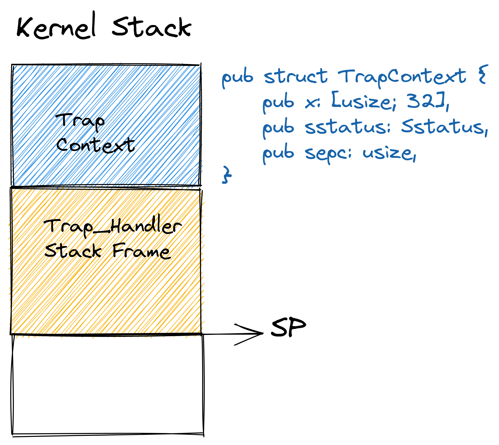

<!-- theme: gaia -->
<!-- _class: lead -->

# 第四講 多道程序與分時多任務
## 第二節 實踐：多道程序與分時多任務操作系統
<br>
<br>

向勇 陳渝 李國良 

<br>
<br>

2022年秋季

---
**提綱**

### 1. 實驗目標和步驟
- 實驗目標
- 實踐步驟
2. 多道批處理操作系統設計
3. 應用程序設計
4. 鋸齒螈OS：支持應用程序加載
5. 始初龍OS：支持多道程序協作調度
6. 腔骨龍OS：分時多任務OS

---

#### 實驗目標


- MultiprogOS目標
    - 進一步提高系統中多個應用的總體性能和效率
- BatchOS目標
    - 讓APP與OS隔離，提高系統的安全性和效率
- LibOS目標
    - 讓應用與硬件隔離，簡化應用訪問硬件的難度和複雜性

---
#### 實驗要求
- 理解
    - 協作式調度和搶佔式調度
    - 任務和任務切換
- 會寫
    - 多道程序操作系統
    - 分時多任務操作系統

<!-- 鋸齒螈  始初龍  腔骨龍 -->


---
#### 多道程序系統的結構


---
#### 總體思路
- 編譯：應用程序和內核獨立編譯，合併為一個鏡像
- 編譯：應用程序需要各自的起始地址
- 構造：系統調用服務請求接口，進程的管理與初始化
- 構造：進程控制塊，進程上下文/狀態管理
- 運行：特權級切換，進程與OS相互切換
- 運行：進程通過系統調用/中斷實現主動/被動切換

---
#### 歷史背景

- 1961年英國 Leo III 計算機
- 支持在計算機內存中**加載**多個不同的程序，並從第一個開始**依次運行**
<!-- - J. Lyons & Co.用於商業事務處理

J. Lyons & Co.是一家成立於1884年的英國連鎖餐廳，食品製造業和酒店集團。 -->

<!-- https://baike.baidu.com/item/EDSAC/7639053
電子延遲存儲自動計算器（英文：Electronic Delay Storage Automatic Calculator、EDSAC）是英國的早期計算機。1946年,英國劍橋大學數學實驗室的莫里斯·威爾克斯教授和他的團隊受馮·諾伊曼的First Draft of a Report on the EDVAC的啟發，以EDVAC為藍本，設計和建造EDSAC，1949年5月6日正式運行，是世界上第一臺實際運行的存儲程序式電子計算機。
是EDSAC在工程實施中同樣遇到了困難：不是技術，而是資金缺乏。在關鍵時刻，威爾克斯成功地說服了倫敦一家麵包公司J．Lyons&Co。．的老闆投資該項目，終於使計劃絕處逢生。1949年5月6日，EDSAC首次試運行成功，它從帶上讀人一個生成平方表的程序並執行，正確地打印出結果。作為對投資的回報，LyOHS公司取得了批量生產EDSAC的權利，這就是於1951年正式投入市場的LEO計算機(Lyons Electronic Office)，這通常被認為是世界上第一個商品化的計算機型號，因此這也成了計算機發展史上的一件趣事：第一家生產出商品化計算機的廠商原先竟是麵包房。Lyons公司後來成為英國著名的“國際計算機有限公司”即ICL的一部分。
-->


---
**提綱**

1. 實驗目標和步驟
- 實驗目標
### 實踐步驟
2. 多道批處理操作系統設計
3. 應用程序設計
4. 鋸齒螈OS：支持應用程序加載
5. 始初龍OS：支持多道程序協作調度
6. 腔骨龍OS：分時多任務OS

---

#### 實踐步驟（基於BatchOS）
- 修改APP的鏈接腳本(定製起始地址)
- 加載&執行應用
- 切換任務


---

#### 三個應用程序交替執行
```
git clone https://github.com/rcore-os/rCore-Tutorial-v3.git
cd rCore-Tutorial-v3
git checkout ch3-coop
```
包含三個應用程序，大家謙讓著**交替執行**
```
user/src/bin/
├── 00write_a.rs # 5次顯示 AAAAAAAAAA 字符串
├── 01write_b.rs # 2次顯示 BBBBBBBBBB 字符串
└── 02write_c.rs # 3次顯示 CCCCCCCCCC 字符串
```

---

#### 運行結果
```
[RustSBI output]
[kernel] Hello, world!
AAAAAAAAAA [1/5]
BBBBBBBBBB [1/2]
....
CCCCCCCCCC [2/3]
AAAAAAAAAA [3/5]
Test write_b OK!
[kernel] Application exited with code 0
CCCCCCCCCC [3/3]
...
[kernel] Application exited with code 0
[kernel] Panicked at src/task/mod.rs:106 All applications completed!
```


---
**提綱**

1. 實驗目標和步驟
### 2. 多道批處理操作系統設計
3. 應用程序設計
4. 鋸齒螈OS：支持應用程序加載
5. 始初龍OS：支持多道程序協作調度
6. 腔骨龍OS：分時多任務OS

---

#### 軟件架構


---

#### 代碼結構：應用程序
構建應用
```
└── user
    ├── build.py(新增：使用 build.py 構建應用使得它們佔用的物理地址區間不相交)
    ├── Makefile(修改：使用 build.py 構建應用)
    └── src (各種應用程序)    
```


---

#### 代碼結構：完善任務管理功能

改進OS：``Loader``模塊加載和執行程序
```
├── os
│   └── src
│       ├── batch.rs(移除：功能分別拆分到 loader 和 task 兩個子模塊)
│       ├── config.rs(新增：保存內核的一些配置)
│       ├── loader.rs(新增：將應用加載到內存並進行管理)
│       ├── main.rs(修改：主函數進行了修改)
│       ├── syscall(修改：新增若干 syscall)
```

---

#### 代碼結構：進程切換

改進OS：`TaskManager`模塊管理/切換程序的執行
```
├── os
│   └── src
│       ├── task(新增：task 子模塊，主要負責任務管理)
│       │   ├── context.rs(引入 Task 上下文 TaskContext)
│       │   ├── mod.rs(全局任務管理器和提供給其他模塊的接口)
│       │   ├── switch.rs(將任務切換的彙編代碼解釋為 Rust 接口 __switch)
│       │   ├── switch.S(任務切換的彙編代碼)
│       │   └── task.rs(任務控制塊 TaskControlBlock 和任務狀態 TaskStatus 的定義)
```

---

**提綱**

1. 實驗目標和步驟
2. 多道批處理操作系統設計
### 3. 應用程序設計
4. 鋸齒螈OS：支持應用程序加載
5. 始初龍OS：支持多道程序協作調度
6. 腔骨龍OS：分時多任務OS

---

#### 應用程序項目結構

沒有更新 應用名稱有數字編號

```
user/src/bin/
├── 00write_a.rs # 5次顯示 AAAAAAAAAA 字符串
├── 01write_b.rs # 2次顯示 BBBBBBBBBB 字符串
└── 02write_c.rs # 3次顯示 CCCCCCCCCC 字符串
```
---

#### 應用程序的內存佈局

- 由於每個應用被加載到的位置都不同，也就導致它們的鏈接腳本 linker.ld 中的 **``BASE_ADDRESS``** 都是不同的。
- 寫一個腳本定製工具 `build.py` ，為每個應用定製了各自的鏈接腳本
   - **``應用起始地址 = 基址 + 數字編號 * 0x20000``**  

---

#### yield系統調用

```rust
//00write_a.rs
fn main() -> i32 {
    for i in 0..HEIGHT {
        for _ in 0..WIDTH {
            print!("A");
        }
        println!(" [{}/{}]", i + 1, HEIGHT);
        yield_(); //放棄處理器 
    }
    println!("Test write_a OK!");
    0
}
```

---

#### yield系統調用  

- 應用之間是**相互不知道**的
- 應用需要**主動讓出**處理器
- 需要通過**新的系統調用**實現  
  - **``const SYSCALL_YIELD: usize = 124;``**


---

#### yield系統調用  

``` Rust
const SYSCALL_YIELD: usize = 124;
pub fn sys_yield() -> isize {
    syscall(SYSCALL_YIELD, [0, 0, 0])
}
pub fn yield_() -> isize {
    sys_yield()
}
```


---
**提綱**

1. 實驗目標和步驟
2. 多道批處理操作系統設計
3. 應用程序設計
### 4. 鋸齒螈OS：支持應用程序加載
5. 始初龍OS：支持多道程序協作調度
6. 腔骨龍OS：分時多任務OS

---
#### 鋸齒螈OS：支持應用程序加載

二疊紀“鋸齒螈”操作系統支持在內存中駐留多個應用，形成多道程序操作系統 – Multiprog OS；
  


---

#### 多道程序加載
- 應用的加載方式有不同
- 所有的應用在內核初始化的時候就一併被加載到內存中
- 為了避免覆蓋，它們自然需要被**加載到不同的物理地址**


---

#### 多道程序加載

```Rust
fn get_base_i(app_id: usize) -> usize {
    APP_BASE_ADDRESS + app_id * APP_SIZE_LIMIT
}

let base_i = get_base_i(i);
// load app from data section to memory
let src = (app_start[i]..app_start[i + 1]);
let dst = (base_i.. base_i+src.len());
dst.copy_from_slice(src);
```


---

#### 執行程序

- 執行時機
  - 當多道程序的初始化放置工作完成
  - 某個應用程序運行結束或出錯的時

- 執行方式
  - 調用 run_next_app 函數**切換**到第一個/下一個應用程序
  

---

#### 切換下一個程序

  - 內核態到用戶態
  - 用戶態到內核態


---

#### 切換下一個程序

  - 跳轉到編號i的應用程序編號i的入口點 `entry(i)`
  - 將使用的棧切換到用戶棧stack(i) 




---

#### 執行程序

現在完成了支持**把應用都放到內存中**的鋸齒螈OS


---
**提綱**

... ...

4. 鋸齒螈OS：支持應用程序加載
### 5. 始初龍OS：支持多道程序協作調度
* 任務切換
* Trap控制流切換
* 協作式調度
6. 腔骨龍OS：分時多任務OS

---

#### 支持多道程序協作式調度

協作式多道程序：應用程序**主動放棄** CPU 並**切換**到另一個應用繼續執行，從而提高系統整體執行效率；


---

#### 任務切換


---

#### 進程

- **進程(Process)** ：一個具有一定**獨立功能**的程序在一個**數據集合**上的一次**動態執行**過程。也稱為**任務(Task)**。


---

#### 時間片（slice）

- 應用執行過程中的一個時間片段上的執行片段或空閒片段，稱為 “ 計算任務片 ” 或“ 空閒任務片 ”，統稱**任務片**（task slice）


---
#### 任務運行狀態
  - 在一個時間片內的應用執行情況
    - running
    - ready

```rust
pub enum TaskStatus {
    UnInit,
    Ready,
    Running,
    Exited,
}
```


---

#### 任務切換
  - 從一個應用的執行過程切換到另外一個應用的執行過程
    - 暫停一個應用的執行過程（當前任務）
    - 繼續另一應用的執行過程（下一任務）


---

####  任務上下文（Task Context）
- 應用運行在某一時刻的**執行狀態（上下文）**
  - 應用要暫停時，執行狀態（上下文）可以被**保存**
  - 應用要繼續時，執行狀態（上下文）可以被**恢復** 
```rust
1// os/src/task/context.rs
2 pub struct TaskContext {
3    ra: usize,      //函數返回地址
4    sp: usize,      //用戶棧指針
5    s: [usize; 12], //屬於Callee函數保存的寄存器集s0~s11
6}
```


---

#### 任務上下文數據結構

```rust
1// os/src/task/context.rs
2 pub struct TaskContext {
3    ra: usize,
4    sp: usize,
5    s: [usize; 12],
6}
```
``` rust
// os/src/trap/context.rs
pub struct TrapContext {
    pub x: [usize; 32],
    pub sstatus: Sstatus,
    pub sepc: usize,
}
```


---

#### 不同類型上下文
  - 函數調用上下文 
  - Trap上下文 
  - 任務（Task）上下文 


---

#### 任務（Task）上下文 vs 系統調用（Trap）上下文

任務切換是來自兩個不同應用在內核中的 Trap 控制流之間的切換
- 任務切換不涉及**特權級**切換；Trap切換涉及特權級切換；
- 任務切換隻保存編譯器約定的callee 函數應該保存的**部分寄存器**；而Trap切換需要保存所有通用寄存器；
- 任務切換和Trap切換都是**對應用是透明**的

---
#### 控制流
- 程序的控制流 (Flow of Control or Control Flow) --編譯原理
    - 以一個程序的指令、語句或基本塊為單位的**執行序列**。
- 處理器的控制流 --計算機組成原理
    - 處理器中程序計數器的**控制轉移序列**。
---
#### 普通控制流：從應用程序員的角度來看控制流

- 控制流是應用程序員編寫的應用程序的**執行序列**，這些序列是程序員預設好的。
- 稱為 **普通控制流** (CCF，Common Control Flow)  

---
#### 異常控制流：從操作系統程序員的角度來看控制流

- 應用程序在執行過程中，如果發出系統調用請求，或出現外設中斷、CPU 異常等情況，會出現前一條指令還在應用程序的代碼段中，後一條指令就跑到操作系統的代碼段中去了。
- 這是一種控制流的“**突變**”，即控制流脫離了其所在的執行環境，併產生**執行環境的切換**。 
- 這種“突變”的控制流稱為 **異常控制流** (ECF, Exceptional Control Flow) 。


---

#### 控制流上下文（執行環境的狀態）

從硬件的角度來看普通控制流或異常控制流的執行過程
* 從控制流起始的某條指令執行開始，指令可訪問的所有物理資源的內容，包括自帶的所有通用寄存器、特權級相關特殊寄存器、以及指令訪問的內存等，會隨著指令的執行而逐漸發生變化。

- 把控制流在執行完某指令時的物理資源內容，即確保下一時刻能繼續正確執行控制流指令的物理/虛擬資源內容稱為***控制流上下文 (Context)*** ，也可稱為控制流所在執行環境的狀態。

對於當前實踐的OS，沒有虛擬資源，而物理資源內容就是***通用寄存器/CSR寄存器***

---

#### 控制流上下文（執行環境的狀態）

- 函數調用上下文
    - 函數調用（執行函數切換）過程中的控制流上下文
- 中斷/異常/陷入上下文
    - 操作系統中處理中斷/異常/陷入的切換代碼時的控制流的上下文
- 任務（進程）上下文
    - 操作系統中任務（進程）執行相關切換代碼時的控制流的上下文

---
**提綱**

... ...

4. 鋸齒螈OS：支持應用程序加載
5. 始初龍OS：支持多道程序協作調度
* 任務切換
### Trap控制流切換
* 協作式調度
6. 腔骨龍OS：分時多任務OS

---

#### OS面臨的挑戰：任務切換
在分屬不同任務的兩個Trap控制流之間進行hacker級操作，即進行**Trap上下文切換**，從而實現任務切換。

- Trap上下文在哪？
- 任務上下文在哪？
- 如何切換任務？
- 任務切換應該發生在哪？
- 任務切換後還能切換回嗎？


---
####  Trap控制流切換：暫停運行
- 一個特殊的函數`__switch()`
- 調用 `__switch()` 之後直到它返回前的這段時間，原 Trap 控制流 A 會先被暫停並被切換出去， CPU 轉而運行另一個應用在內核中的 Trap 控制流 B 。


---
####  Trap控制流切換：恢復運行
- 一個特殊的函數` __switch()`
- 然後在某個合適的時機，原 Trap 控制流 A 才會從某一條 Trap 控制流 C （很有可能不是它之前切換到的 B ）切換回來繼續執行並最終返回。

從實現的角度講， `__switch()` 函數和一個普通的函數之間的核心差別僅僅是它會**換棧** 。


---
#### Trap控制流切換函數`__switch()`


---
#### Trap控制流切換過程：切換前的狀態
階段[1]：在 Trap 控制流 A 調用`__switch()`之前，A 的**內核棧**上只有 Trap 上下文和 Trap 處理函數的調用棧信息，而 B 是之前被切換出去的；


---
#### Trap控制流切換過程：保存A任務上下文
階段 [2]：A 在 A 任務上下文空間在裡面保存 **CPU 當前的寄存器快照**；


---
#### Trap控制流切換過程：恢復B任務上下文

階段 [3]：讀取 next_task_cx_ptr 指向的 B 任務上下文，恢復 ra 寄存器、s0~s11 寄存器以及 sp 寄存器。
* 這一步做完後， `__switch()` 才能做到一個函數跨兩條控制流執行，即 通過**換棧**也就實現了控制流的切換 。


---
#### Trap控制流切換過程：執行B任務代碼
階段 [4]：當 CPU 執行 ret 彙編偽指令完成 `__switch()` 函數返回後，任務 B 可以從調用 `__switch()` 的位置繼續向下執行。
* `__switch()`通過恢復 sp 寄存器換到了任務 B 的內核棧上，實現了控制流的切換，從而做到一個函數跨兩條控制流執行。


---
#### `__switch()`的接口
```
 1 // os/src/task/switch.rs
 2 
 3 global_asm!(include_str!("switch.S"));
 4 
 5 use super::TaskContext;
 6 
 7 extern "C" {
 8     pub fn __switch(
 9         current_task_cx_ptr: *mut TaskContext,
10         next_task_cx_ptr: *const TaskContext
11     );
12 }
```


---
#### `__switch()`的實現

```
12 __switch:
13    # 階段 [1]
14    # __switch(
15    #     current_task_cx_ptr: *mut TaskContext,
16    #     next_task_cx_ptr: *const TaskContext
17    # )
18    # 階段 [2]
19    # save kernel stack of current task
20    sd sp, 8(a0)
21    # save ra & s0~s11 of current execution
22    sd ra, 0(a0)
23    .set n, 0
24    .rept 12
25        SAVE_SN %n
26        .set n, n + 1
27    .endr

```


---
#### `__switch()`的實現

```
28    # 階段 [3]
29    # restore ra & s0~s11 of next execution
30    ld ra, 0(a1)
31    .set n, 0
32    .rept 12
33        LOAD_SN %n
34        .set n, n + 1
35    .endr
36    # restore kernel stack of next task
37    ld sp, 8(a1)
38    # 階段 [4]
39    ret
```


---
**提綱**

... ...

4. 鋸齒螈OS：支持應用程序加載
5. 始初龍OS：支持多道程序協作調度
* 任務切換
* Trap控制流切換
### 協作式調度
6. 腔骨龍OS：分時多任務OS

---

#### 任務控制塊
操作系統管理控制進程運行所用的信息集合
```Rust
pub struct TaskControlBlock {
    pub task_status: TaskStatus,
    pub task_cx: TaskContext,
}
```
- 任務管理模塊
```Rust
struct TaskManagerInner {
    tasks: [TaskControlBlock; MAX_APP_NUM],
    current_task: usize,
}
```


---
#### 協作式調度
- `sys_yield`和`sys_exit`系統調用
```rust
pub fn sys_yield() -> isize {
    suspend_current_and_run_next();
    0
}
pub fn sys_exit(exit_code: i32) -> ! {
    println!("[kernel] Application exited with code {}", exit_code);
    exit_current_and_run_next();
    panic!("Unreachable in sys_exit!");
}
```

---
#### 協作式調度

- `sys_yield`和`sys_exit`系統調用

```rust
// os/src/task/mod.rs

pub fn suspend_current_and_run_next() {
    mark_current_suspended();
    run_next_task();
}

pub fn exit_current_and_run_next() {
    mark_current_exited();
    run_next_task();
}
```


---
#### 協作式調度

- `sys_yield`和`sys_exit`系統調用
```Rust
 fn run_next_task(&self) {
    ......
    unsafe {
        __switch(
            current_task_cx_ptr, //當前任務上下文
            next_task_cx_ptr,    //下個任務上下文
        );
    }
```

---
#### 第一次進入用戶態
**Q:如何實現？**

如果能搞定，我們就實現了支持多道程序協作調度的始初龍操作系統

---
**提綱**

1. 實驗目標和步驟
2. 多道批處理操作系統設計
3. 應用程序設計
4. 鋸齒螈OS：支持應用程序加載
5. 始初龍OS：支持多道程序協作調度
### 6. 腔骨龍OS：分時多任務OS

---

#### 腔骨龍OS：分時多任務OS

三疊紀“腔骨龍”操作系統 – Timesharing OS 則可以**搶佔**應用的執行，從而可以公平和高效地分時執行多個應用，提高系統的整體效率。


---

#### 分時多任務操作系統的基本思路
- 設置時鐘中斷
- 在收到時鐘中斷後統計任務的使用時間片
- 在時間片用完後，切換任務

---
#### 時鐘中斷與計時器
- 設置時鐘中斷
```rust
// os/src/sbi.rs
pub fn set_timer(timer: usize) {
     sbi_call(SBI_SET_TIMER, timer, 0, 0);
 }
// os/src/timer.rs
pub fn set_next_trigger() {
    set_timer(get_time() + CLOCK_FREQ / TICKS_PER_SEC);
}
pub fn rust_main() -> ! {
    trap::enable_timer_interrupt();
    timer::set_next_trigger();
}    
```


---
#### 搶佔式調度

```rust
// os/src/trap/mod.rs trap_handler函數
......
match scause.cause() {
    Trap::Interrupt(Interrupt::SupervisorTimer) => {
        set_next_trigger();
        suspend_current_and_run_next();
    }
}
```

這樣我們就實現了分時多任務的腔骨龍操作系統

---
### 小結
- 多道程序&分時共享多任務
- 協作式調度&搶佔式調度
- 任務與任務切換
- 中斷機制

---

### 課程實驗一

* 創建實驗提交倉庫
    * 清華git訪問入口：[UniLab Platform](https://lab.cs.tsinghua.edu.cn/unilab/home)
    * 學堂在線同學的[訪問入口](https://www.yuque.com/xyong-9fuoz/qczol5/opl4y4#DiUQ0)(待補充)
        * rCore、uCore-RV、uCore-x86
* 實驗任務
    * 第三章：多道程序與分時多任務 -> chapter3練習 -> 獲取任務信息 -> 增加一個系統調用`sys_task_info()`
* 實驗提交要求
    * 任務佈置後的第11天（2022年10月16日）；