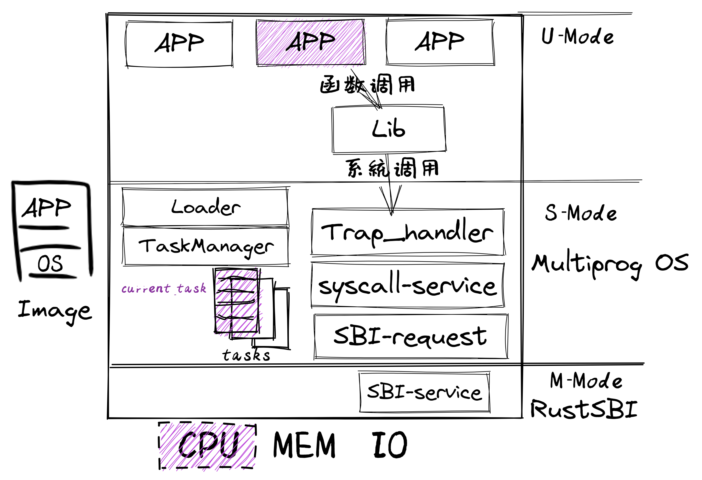

<!-- theme: gaia -->
<!-- _class: lead -->

## 第五講 地址空間-物理內存管理

### 第0節 回顧
- 給應用提供"好"的服務
   - 提高性能、簡化開發、加強安全
   - 應用的執行環境持續進化
   - 操作系統功能持續增強
---
### 回顧
- lec1: 試試UNIX/Linux 

  - "系統調用"
  - 例子，用C語言，來自UNIX（例如Linux、macOS、FreeBSD）。

            fd = open("out", 1);
            write(fd, "hello\n", 6);
            pid = fork()

---
### 回顧
- lec2: 寫裸機程序：LibOS             
  - 軟硬件啟動，函數調用，SBI調用

---
### 回顧
- lec3: 寫 Batch OS  
  - 特權級: U-Mode, S-Mode
  - 特權級切換，陷入上下文
  - 編譯多應用+OS的鏡像
  - 加載並執行應用

---
### 回顧
- lec4-1: 寫 MultiProg OS  
   - 任務的概念與設計實現
   - 理解協作/搶佔式調度
   -  陷入上下文+任務上下文 
 