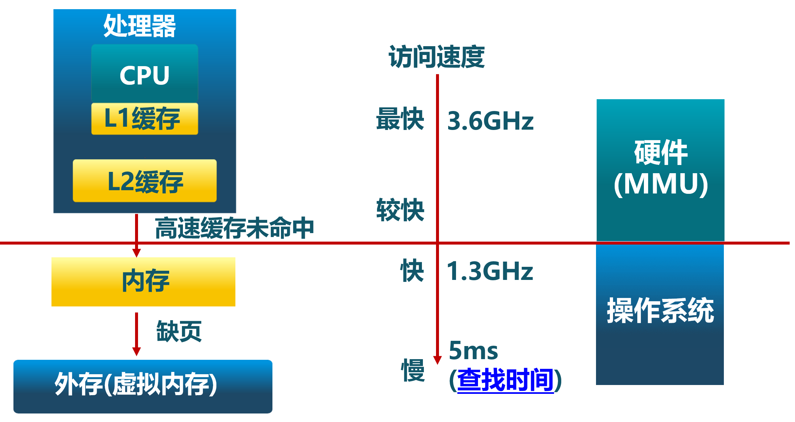

<!-- theme: gaia -->
<!-- _class: lead -->

# 第五講 物理內存管理
## 第一節 地址空間
 
 

向勇 陳渝 李國良 

 
 

2022年秋季

---
**提綱**

### 1. 計算機的存儲層次
2. 地址和地址空間
3. 虛擬存儲的作用

---

#### 物理地址和邏輯地址

- 物理地址(PA, Physical Address) ：用於內存芯片級的單元尋址，與處理器和CPU連接的**地址總線**相對應。 
- 邏輯地址(LA, Logical Address) ：**CPU執行機器指令**時，用來指定一個操作數或者是一條指令的地址。也是用戶編程時使用的地址。
- 線性地址(linear address)或也叫虛擬地址(virtual address) ：跟邏輯地址類似，它也是一個不真實的地址。
  - 邏輯地址指CPU在段式內存管理轉換前的地址；
  - 線性地址指CPU在頁式內存管理轉換前的地址。

---
#### 邏輯地址與物理地址的關係

- 邏輯地址到物理地址的轉換
  - 邏輯地址 -> 線性地址(虛擬地址) -> 物理地址

- 在沒有段式內存管理的情況下，邏輯地址與虛擬地址相同
- 在沒有頁式內存管理的情況下，邏輯地址、虛擬地址和物理地址都相同

---
#### 計算機的存儲層次結構

---

#### 計算機的存儲多層結構

---
#### 操作系統對內存資源的抽象

---

#### 內存管理

- 操作系統中的**內存管理方式**
  - 重定位(relocation)
  - 分段(segmentation)
  - 分頁(paging)
  - 虛擬存儲(virtual memory/storage)
- **操作系統的內存管理高度依賴硬件**
  - 與計算機存儲架構緊耦合
  - MMU (內存管理單元): 處理CPU存儲訪問請求的硬件

---
**提綱**

1. 計算機的存儲層次
### 2. 地址和地址空間
3. 虛擬存儲的作用

---

#### 地址空間的定義

- 物理地址空間：物理內存的地址空間
  - 起始地址$0$，直到 $MAX_{phy}$
- 虛擬地址空間：虛擬內存的地址空間
  - 起始地址$0$，直到 $MAX_{virt}$
- 邏輯地址空間：程序執行的地址空間
  - 起始地址$0$， 直到 $MAX_{prog}$

三種地址空間的**視角不同**

---

#### 邏輯地址生成

---

#### 地址生成時機

- 編譯時
  - 假設起始地址**已知**
  - 如果起始地址改變，必須重新編譯
- 加載時
  - 如編譯時起始地址**未知**，編譯器需生成可重定位的代碼 (relocatable code) 
  - 加載時，位置可不固定，生成絕對（虛擬）地址
- 執行時
  - 執行時代碼不可修改
  - 需**地址轉換(映射)硬件**支持

---

#### 地址生成過程
- CPU
  - ALU：需要**邏輯地址**的內存內容
  - MMU：進行邏輯地址和物理地址的**轉換**
  - CPU控制邏輯：給總線發送**物理地址**請求
- 內存
  - 發送**物理地址**的內容給CPU
  - 接收CPU數據到物理地址
- 操作系統
  - 建立邏輯地址LA和物理地址PA的映射

---

#### 地址檢查

---
**提綱**

1. 計算機的存儲層次
2. 地址和地址空間
### 3. 虛擬存儲的作用

---

#### 外存的緩存

虛擬內存可作為外存的緩存

- **常用數據**放在物理內存中
- **不常用數據**放在外存 
- 運行的程序**直接用虛存地址**，不用關注具體放在物理內存還是外存

---

#### 簡化應用編譯和加載運行

每個運行程序具有**獨立的地址空間**，而不管代碼和數據在物理內存的實際存放，從而簡化：
- 編譯的執行程序鏈接過程
- 操作系統的執行程序加載過程
- 共享：動態鏈接庫、共享內存 
- 內存分配：物理不連續，虛擬連續

---

#### 保護數據

虛擬內存可保護數據
- **獨立的地址空間**使得區分不同進程各自內存變得容易
- 地址轉換機制可以進行可讀/可寫/可執行的檢查
- 地址轉換機制可以進行特權級檢查
